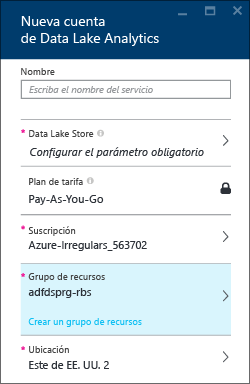
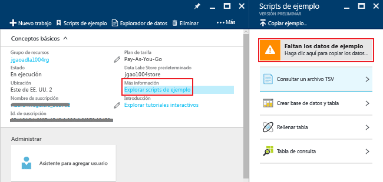
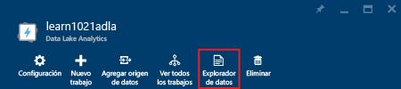
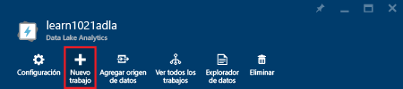
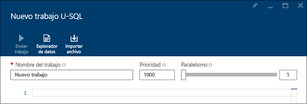
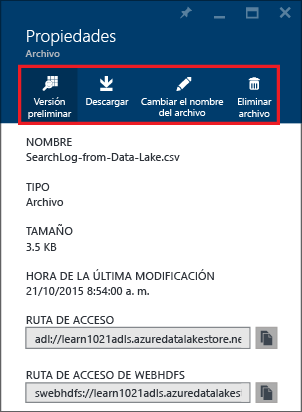

# Tutorial: Introducción a Azure Data Lake Analytics mediante Azure Portal
[!INCLUDE [get-started-selector](../../includes/data-lake-analytics-selector-get-started.md)]

Aprenda a usar Azure Portal para crear cuentas de Azure Data Lake Analytics, definir trabajos en [U-SQL](data-lake-analytics-u-sql-get-started.md) y enviar trabajos al servicio Data Lake Analytics. Para obtener más información acerca de Análisis de Data Lake, consulte [Información general sobre Análisis de Azure Data Lake](data-lake-analytics-overview.md).

En este tutorial, desarrollará un trabajo que lee un archivo de valores separados por tabulaciones (TSV) y lo convierte en un otro de valores separados por comas (CSV). Para realizar el mismo tutorial con otras herramientas compatibles, haga clic en las pestañas de la parte superior de esta sección. Una vez que el primer trabajo se lleve a cabo correctamente, puede empezar a escribir transformaciones de datos más complejas con U-SQL.

## Requisitos previos
Antes de empezar este tutorial, debe contar con lo siguiente:

* **Una suscripción de Azure**. Consulte [Obtención de una versión de evaluación gratuita](https://azure.microsoft.com/pricing/free-trial/).

## Creación de una cuenta de Análisis de Data Lake
Debe tener una cuenta de Análisis de Data Lake para poder ejecutar trabajos.

Cada cuenta de Data Lake Analytics depende de una cuenta de Azure Data Lake Store.  Esta cuenta se conoce como la cuenta predeterminada de Almacén de Data Lake.  Puede crear la cuenta de Almacén de Data Lake previamente o cuando cree la cuenta de Análisis de Data Lake. En este tutorial, creará la cuenta de Almacén de Data Lake con la cuenta de Análisis de Data Lake.

**Creación de una cuenta de Data Lake Analytics**

1. Inicie sesión en el [Portal de Azure](https://portal.azure.com).
2. Haga clic en **Nuevo** >  **Inteligencia y análisis** > **Data Lake Analytics**.
3. Seleccione los valores siguientes:

    

   * **Nombre**: nombre de la cuenta de Data Lake Analytics (solo se permiten letras minúsculas y números).
   * **Suscripción**: seleccione la suscripción de Azure usada para la cuenta de Analytics.
   * **Grupo de recursos**. seleccione un grupo de recursos de Azure existente o cree uno nuevo.
   * **Ubicación**. seleccione un centro de datos de Azure para la cuenta de Análisis de Data Lake.
   * **Data Lake Store**: siga las instrucciones para crear una nueva cuenta de Data Lake Store o seleccione una existente. 
4. Selección del plan de tarifa  
5. Haga clic en **Crear**. Vuelve a la pantalla principal del portal donde aparece un nuevo icono que muestra "Implementación Azure Data Lake Analytics". El proceso de implementación tardará varios minutos en crear una cuenta de Data Lake Analytics. Cuando la cuenta está creada, se abre la cuenta en una hoja nueva.

Una vez creada la cuenta de Análisis de Data Lake, puede agregar más cuentas de Almacén de Data Lake y cuentas de Almacenamiento de Azure. Para obtener instrucciones, consulte [Administración de orígenes de datos de la cuenta de Análisis de Data Lake](data-lake-analytics-manage-use-portal.md).

## Preparación de los datos de origen
En este tutorial, va a procesar registros de búsqueda.  El registro de búsqueda se puede almacenar en el Almacén de Data Lake o en el almacenamiento de blobs de Azure.

Azure Portal proporciona una interfaz de usuario para copiar archivos de datos de ejemplo a la cuenta predeterminada de Data Lake Store, entre los que se incluye un archivo de registro de búsqueda.

**Copia de archivos de datos de ejemplo**

1. En [Azure Portal](https://portal.azure.com), abra su cuenta de Data Lake Analytics.  Consulte el artículo sobre la [administración de cuentas de Data Lake Analytics](data-lake-analytics-get-started-portal.md) para crear una cuenta y abrirla en el portal.
2. Expanda el panel **Essentials** y haga clic en **Explorar scripts de muestra**. Se abre otra hoja llamada **Scripts de ejemplo**.

    
3. Haga clic en **Faltan los datos de ejemplo** para copiar los archivos de datos de ejemplo. Cuando haya terminado, en el portal aparece **Se han actualizado correctamente los datos de ejemplo**.
4. En la hoja de la cuenta de Análisis de Data Lake, haga clic en **Explorador de datos** en la parte superior.

    

    Se abren dos hojas. Una es **Explorador de datos**y la otra, la cuenta predeterminada de Almacén de Data Lake.
5. En la hoja de la cuenta predeterminada de Data Lake Store, haga clic en **Ejemplos** para expandir la carpeta y después en **Datos** para expandirla también. Verá los siguientes archivos y carpetas:

   * AmbulanceData/
   * AdsLog.tsv
   * SearchLog.tsv
   * version.txt
   * WebLog.log

     En este tutorial, usará SearchLog.tsv.

En la práctica, programará sus aplicaciones para que escriban datos en una cuenta de almacenamiento vinculada o para cargar datos. Para cargar archivos, consulte [Carga de datos en Data Lake Store](data-lake-analytics-manage-use-portal.md) o [Carga de datos en Blob storage](data-lake-analytics-manage-use-portal.md).

## Creación y envío de trabajos de Análisis de Data Lake
Después de preparar el origen de datos, puede comenzar a desarrollar un script U-SQL.  

**Para enviar un trabajo**

1. En la hoja de la cuenta de Análisis de Data Lake en el portal, haga clic en **Nuevo trabajo**.

    

    Si no ve la hoja, consulte [Apertura de una cuenta de Análisis de Data Lake desde el portal](data-lake-analytics-manage-use-portal.md).
2. Escriba el **Nombre del trabajo**y el siguiente script U-SQL:

        @searchlog =
            EXTRACT UserId          int,
                    Start           DateTime,
                    Region          string,
                    Query           string,
                    Duration        int?,
                    Urls            string,
                    ClickedUrls     string
            FROM "/Samples/Data/SearchLog.tsv"
            USING Extractors.Tsv();

        OUTPUT @searchlog   
            TO "/Output/SearchLog-from-Data-Lake.csv"
        USING Outputters.Csv();

    

    Este script de U-SQL lee el archivo de datos de origen mediante **Extractors.Tsv()** y crea un archivo csv con **Outputters.Csv()**.

    No modifique ninguna de las dos rutas a menos que copie el archivo de origen en una ubicación diferente.  Data Lake Analytics creará la carpeta de salida si no existe.  En este caso, usamos rutas de acceso relativas sencillas.  

    Es más fácil usar rutas de acceso relativas para los archivos almacenados en cuentas predeterminadas de Data Lake. También puede usar rutas de acceso absolutas.  Por ejemplo:

        adl://<Data LakeStorageAccountName>.azuredatalakestore.net:443/Samples/Data/SearchLog.tsv

    Para más información acerca de U-SQL, consulte [Tutorial: Introducción al lenguaje U-SQL de Azure Data Lake Analytics](data-lake-analytics-u-sql-get-started.md) y la [página de referencia sobre el lenguaje U-SQL](http://go.microsoft.com/fwlink/?LinkId=691348).

1. Haga clic en **Enviar trabajo** en la parte superior.   
2. Espere a que el estado del trabajo cambie a **Correcto**. Puede ver que el trabajo tardó aproximadamente un minuto en completarse.
3. Si se produce un error en el trabajo, consulte la página sobre la [supervisión y la solución de problemas con trabajos de Data Lake Analytics](data-lake-analytics-monitor-and-troubleshoot-jobs-tutorial.md).
4. En la parte inferior de la hoja, haga clic en la pestaña **Salida** y haga clic en `SearchLog-from-Data-Lake.csv`. Puede obtener una vista previa, descargar, cambiar el nombre y eliminar el archivo de salida.

    

## Consulte también

* Para empezar a desarrollar aplicaciones con U-SQL, consulte [Desarrollo de scripts U-SQL mediante Data Lake Tools for Visual Studio](data-lake-analytics-data-lake-tools-get-started.md).
* Para obtener más información sobre U-SQL, consulte [Introducción al lenguaje U-SQL de Análisis de Azure Data Lake](data-lake-analytics-u-sql-get-started.md).
* Para conocer las tareas de administración, consulte [Administración de Azure Data Lake Analytics mediante el Azure Portal](data-lake-analytics-manage-use-portal.md).

