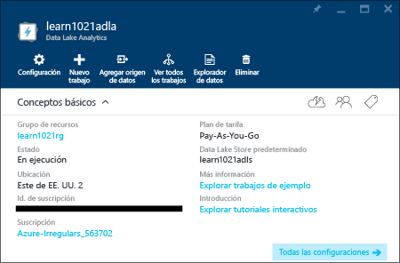
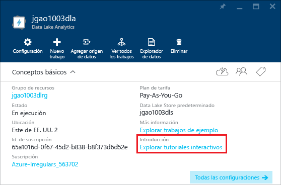

# Uso de tutoriales interactivos de Análisis de Azure Data Lake
Azure Portal proporciona un tutorial interactivo para que pueda empezar a trabajar con Data Lake Analytics. En este artículo se muestra cómo realizar el tutorial para analizar los registros de sitios web.

Para otros tutoriales, consulte:

* [Introducción a Data Lake Analytics mediante el portal de Azure](data-lake-analytics-get-started-portal.md)
* [Introducción a Data Lake Analytics mediante Azure PowerShell](data-lake-analytics-get-started-powershell.md)
* [Introducción a Análisis de Data Lake mediante .NET SDK](data-lake-analytics-get-started-net-sdk.md)
* [Desarrollo de scripts de U-SQL mediante Data Lake Tools for Visual Studio](data-lake-analytics-data-lake-tools-get-started.md) 

**Requisitos previos**

Antes de empezar este tutorial, debe contar con lo siguiente:

* **Una cuenta de Análisis de Data Lake**.  [Introducción a Azure Data Lake Analytics mediante Azure Portal](data-lake-analytics-get-started-portal.md).

## Creación de una cuenta de Análisis de Data Lake
Debe tener una cuenta de Análisis de Data Lake para poder ejecutar trabajos.

Cada cuenta de Data Lake Analytics depende de la cuenta predeterminada de [Azure Data Lake Store](../data-lake-store/data-lake-store-overview.md).  En este tutorial, creará la cuenta de Data Lake Store con la cuenta de Analytics, pero también puede crearla antes.

**Para crear una cuenta de Análisis de Data Lake**

1. Inicie sesión en el [Portal de Azure](https://portal.azure.com/signin/index/?Microsoft_Azure_Kona=true&Microsoft_Azure_DataLake=true&hubsExtension_ItemHideKey=AzureDataLake_BigStorage%2cAzureKona_BigCompute).
2. Haga clic en **Microsoft Azure** en la esquina superior izquierda para abrir el Panel de inicio.
3. Haga clic en el icono **Marketplace** .  
4. Escriba **Azure Data Lake Analytics** en el cuadro de búsqueda en la hoja **Todo** y presione **ENTRAR**. Verá **Análisis de Azure Data Lake** en la lista.
5. Haga clic en **Análisis de Azure Data Lake** en la lista.
6. Haga clic en **Crear** en la parte inferior de la hoja.
7. Escriba o seleccione:
   
    
   
   * **Nombre**: el nombre de la cuenta de Análisis.
   * **Almacén de Data Lake**: cada cuenta de Análisis de Data Lake depende de una cuenta del Almacén de Data Lake. La cuenta de Análisis de Data Lake y la cuenta de Almacén de Data Lake dependiente deben ubicarse en el mismo centro de datos de Azure. Siga las instrucciones para crear una nueva cuenta de Data Lake Store o seleccione una existente.
   * **Suscripción**: seleccione la suscripción de Azure usada para la cuenta de Analytics.
   * **Grupo de recursos**. seleccione un grupo de recursos de Azure existente o cree uno nuevo. Las aplicaciones normalmente se componen de muchos elementos, por ejemplo, una aplicación web, una base de datos, un servidor de base de datos, un almacenamiento y servicios de terceros. El Administrador de recursos de Azure (ARM) permite trabajar con los recursos de la aplicación como un grupo al que se hace referencia como Grupo de recursos de Azures Puede implementar, actualizar, supervisar o eliminar los recursos de su aplicación en una sola operación coordinada. Para realizar la implementación se usa una plantilla que puede funcionar en distintos entornos, como producción, pruebas y ensayo. Puede aclarar la facturación de la organización consultando los costes acumulados de todo el grupo. Para obtener más información, consulte [Información general del Administrador de recursos de Azure](../azure-resource-manager/resource-group-overview.md). 
   * **Ubicación**. seleccione un centro de datos de Azure para la cuenta de Análisis de Data Lake. 
8. Seleccione **Anclar a Panel de inicio**. Esto es necesario para seguir este tutorial.
9. Haga clic en **Crear**. Se abre el Panel de inicio del portal. Se agrega un nuevo icono a la página de inicio con la etiqueta "Implementación de Azure Data Lake Analytics". Se tarda unos momentos en crear una cuenta de Análisis de Data Lake. Cuando la cuenta está creada, se abre la cuenta en una hoja nueva.
   
    

## Ejecución del tutorial interactivo de Análisis del registro del sitio web
**Para abrir el tutorial interactivo de Análisis del registro del sitio web**

1. En el Portal, haga clic en **Microsoft Azure** en el menú de la izquierda para abrir el Panel de inicio.
2. Haga clic en el icono que está vinculado en la cuenta de Análisis de Data Lake.
3. Haga clic en **Explorar tutoriales interactivos** de la barra **Essentials**.
   
    
4. Si aparece una advertencia naranja diciendo "Ejemplos no configurados, haga clic en...", haga clic en **Copiar datos de ejemplo** para copiar los datos de ejemplo en la cuenta del Almacén de Data Lake predeterminada. El tutorial interactivo necesita datos para ejecutarse.
5. En la hoja **Tutoriales interactivos**, haga clic en **Análisis del registro del sitio web**. El portal abre el tutorial en una nueva hoja del Portal.
6. Haga clic en **Introducción** y siga las instrucciones.

## Otras referencias
* [Información general de Análisis de Microsoft Azure Data Lake](data-lake-analytics-overview.md)
* [Introducción a Data Lake Analytics mediante el portal de Azure](data-lake-analytics-get-started-portal.md)
* [Introducción a Análisis de Data Lake mediante Azure PowerShell](data-lake-analytics-get-started-powershell.md)
* [Desarrollo de scripts de U-SQL mediante Data Lake Tools for Visual Studio](data-lake-analytics-data-lake-tools-get-started.md)
* [Análisis de registros de sitios web mediante Análisis de Azure Data Lake](data-lake-analytics-analyze-weblogs.md)

