# Control de acceso en Azure Data Lake Store
Data Lake Store implementa un modelo de control de acceso que se deriva de HDFS que, a su vez, se deriva del modelo de control de acceso POSIX. Este artículo resume los datos básicos del modelo de control de acceso de Data Lake Store. Para más información sobre el modelo de control de acceso HDFS, consulte [HDFS Permissions Guide](https://hadoop.apache.org/docs/current/hadoop-project-dist/hadoop-hdfs/HdfsPermissionsGuide.html)(Guía de permisos de HDFS).

## Listas de control de acceso en archivos y carpetas
Hay dos tipos de listas de control de acceso (ACL): **ACL de acceso** y **ACL predeterminadas**.

* **ACL de acceso** : controlan el acceso a un objeto. Tanto los archivos como las carpetas tienen ACL de acceso.
* **ACL predeterminadas** : una "plantilla" de las ACL asociadas a una carpeta que determinan las ACL de acceso de todos los elementos secundarios de dicha carpeta. Los archivos no tienen ACL predeterminadas.

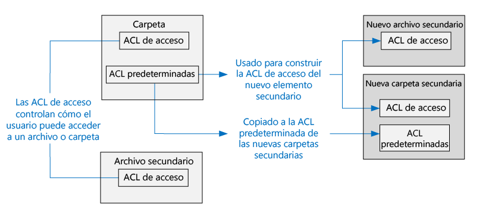

Tanto las ACL de acceso como las ACL predeterminadas tienen la misma estructura.

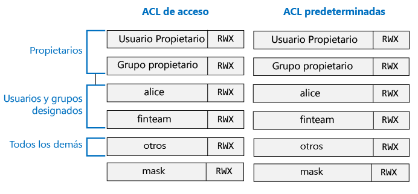

> [!NOTE]
> El cambio de la ACL predeterminada en un elemento primario no afecta a la ACL de acceso o a la ACL predeterminada de los elementos secundarios que ya existen.
> 
> 

## Usuarios e identidades
Todos los archivos y carpetas tienen permisos distintos para estas identidades:

* El usuario propietario del archivo
* El grupo propietario
* Usuarios designados
* Grupos designados
* Los restantes usuarios

Las identidades de los usuarios y grupos son identidades de Azure Active Directory (AAD), por lo que, salvo se indique lo contrario, en el contexto de Data Lake Store, un "usuario" puede significar un usuario de AAD o un grupo de seguridad de AAD.

## Permisos
Los permisos de un objeto de sistema de archivos son de **lectura**, **escritura** y **ejecución**, y se pueden usar en archivos y carpetas, como se muestra en la tabla siguiente.

|  | Archivo | Carpeta |
| --- | --- | --- |
| **Lectura (R)** |Puede leer el contenido de un archivo |Requiere permisos de **lectura** y **ejecución** para enumerar el contenido de la carpeta. |
| **Escritura (W)** |Puede escribir o anexar a un archivo |Requiere permisos de **escritura y ejecución** para crear elementos secundarios en una carpeta. |
| **Ejecución (X)** |No significa nada en el contexto de Data Lake Store |Se requiere para atravesar los elementos secundarios de una carpeta. |

### Formas abreviadas de los permisos
**RWX** se usa para indicar **Lectura + Escritura + Ejecución**. Existe un formato numérico más condensado en el que **Lectura = 4**, **Escritura = 2** y **Ejecución = 1** y su suma representa los permisos. A continuación se muestran algunos ejemplos.

| Formato numérico | Formato abreviado | Qué significa |
| --- | --- | --- |
| 7 |RWX |Lectura + Escritura + Ejecución |
| 5 |R-X |Lectura + ejecución |
| 4 |R-- |Lectura |
| 0 |--- |Sin permisos |

### Los permisos no se heredan
En el modelo de estilo de POSIX que usa Data Lake Store, los permisos de un elemento se almacenan en el propio elemento. En otras palabras, los permisos de un elemento no se pueden heredar de los elementos primarios.

## Escenarios comunes relacionados con los permisos
Estos son algunos escenarios comunes para entender qué permisos se necesitan para realizar ciertas operaciones en una cuenta de Data Lake Store.

### Permisos necesitados para leer un archivo
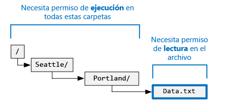

* Para el archivo que se va a leer: el autor de la llamada necesita permisos de **lectura**
* Para todas las carpetas de la estructura de carpetas que contienen el archivo: el autor de la llamada necesita permisos de **ejecución**

### Permisos necesarios para anexar a un archivo
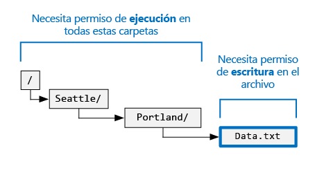

* Para el archivo al que se va a anexar: el autor de la llamada necesita permisos de **escritura**
* Para todas las carpetas que contienen el archivo: el autor de la llamada necesita permisos de **Ejecución**

### Permisos necesitados para eliminar un archivo
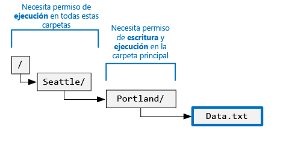

* Para la carpeta primaria: el autor de la llamada necesita permisos de **escritura + ejecución**
* Para las restantes carpetas de la ruta de acceso del archivo: el autor de la llamada necesita permisos de **ejecución**

> [!NOTE]
> Para eliminar un archivo no es preciso tener permisos de Escritura en el archivo, siempre y cuando se cumplan las dos condiciones anteriores.
> 
> 

### Permisos necesarios para enumerar una carpeta
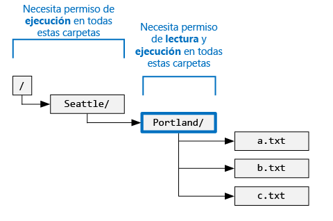

* Para la carpeta que se enumera: el autor de la llamada necesita permisos de **lectura + ejecución**
* Para todas las carpetas ascendientes: el autor de la llamada necesita permisos de **ejecución**

## Visualización de permisos en el portal de Azure
En la hoja **Explorador de datos** de la cuenta de Data Lake Store, haga clic en **Acceso** para ver las ACL de un archivo o una carpeta. En la siguiente captura de pantalla, haga clic en Acceso para ver las ACL de la carpeta **catalog** de la cuenta **mydatastore**.

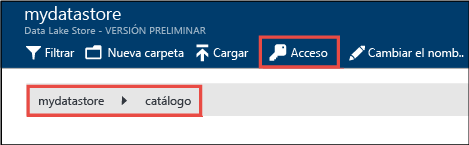

Después, en la hoja **Acceso**, haga clic en **Vista simple ** para usar la vista más simple.

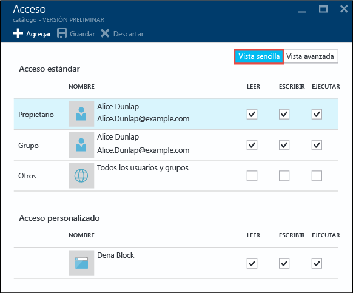

Haga clic en **Vista avanzada** para usar la vista más avanzada.

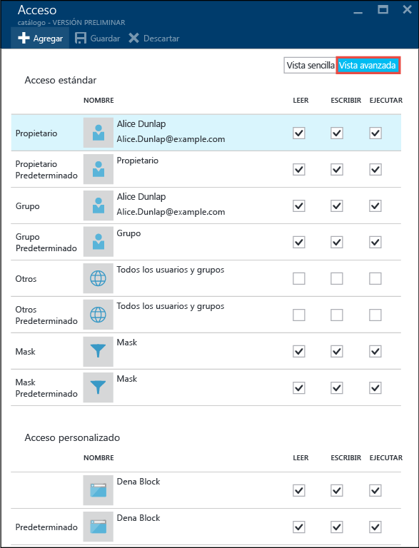

## El superusuario
Un superusuario es el usuario con más derechos en Data Lake Store. Un superusuario:

* tiene permisos de lectura + escritura + ejecución (RWX) en **todos** los archivos y carpetas.
* puede cambiar los permisos de cualquier archivo o carpeta.
* puede cambiar el usuario propietario o grupo propietario de cualquier archivo o carpeta.

En Azure, una cuenta de Data Lake Store tiene varios roles de Azure:

* Propietarios
* Colaboradores
* Lectores
* Etc.

Todos los miembros del rol **Propietarios** de una cuenta de Data Lake Store son automáticamente superusuarios de dicha cuenta. Para más información sobre el control de acceso basado en roles de Azure, consulte [Uso de asignaciones de roles para administrar el acceso a los recursos de la suscripción de Azure](../active-directory/role-based-access-control-configure.md).

## El usuario propietario
El usuario que creó el elemento es automáticamente el usuario propietario del elemento. Un usuario propietario puede:

* Cambiar los permisos de un archivo que le pertenece
* Cambiar el grupo propietario de un archivo que le pertenece, siempre que el usuario propietario también sea miembro del grupo de destino.

> [!NOTE]
> El usuario propietario **no puede** cambiar el usuario propietario de otro archivo que le pertenece. Solo los superusuarios pueden cambiar el usuario propietario de un archivo o carpeta.
> 
> 

## El grupo propietario
En las ACL de POSIX, todos los usuarios están asociados a un "grupo principal". Por ejemplo, el usuario "alice" puede pertenecer al grupo "finance". Alice puede pertenecer a varios grupos, pero uno de ellos siempre se designa como su grupo principal. En POSIX, cuando Alice crea un archivo, el grupo propietario de dicho archivo se establece en su grupo principal, que en este caso es "finance".

Cuando se crea un nuevo elemento del sistema de archivos, Data Lake Store asigna un valor al grupo propietario. 

* **Caso 1** : la carpeta raíz "/". Esta carpeta se crea cuando se crea una cuenta de Data Lake Store. En este caso, el grupo propietario se establece en el usuario que creó la cuenta.
* **Caso 2** (cada dos casos): cuando se crea un nuevo elemento, se copia el grupo propietario de la carpeta primaria.

El grupo propietario se puede cambiar por:

* Cualquier superusuario
* El usuario propietario, si el usuario propietario también es miembro del grupo de destino.

## Algoritmo de comprobación de acceso
La siguiente ilustración representa el algoritmo de comprobación de acceso de las cuentas de Data Lake Store.

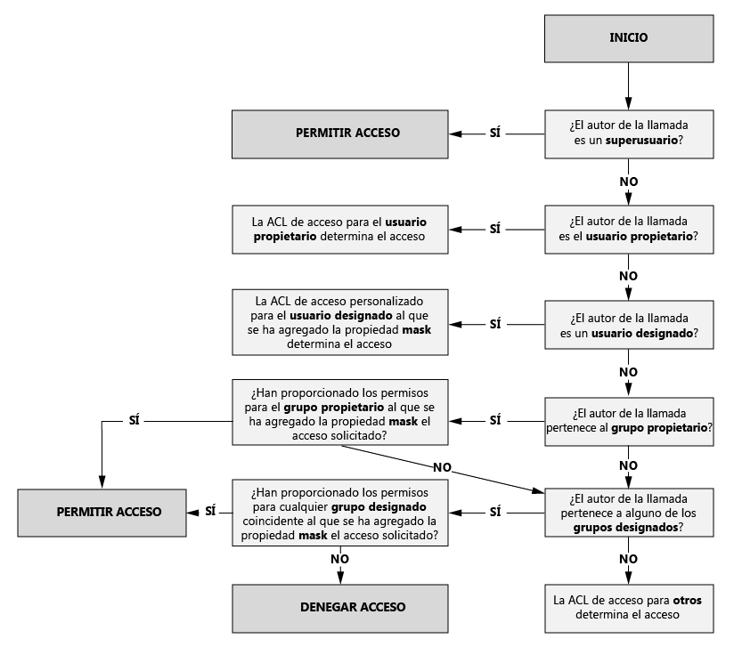

## La propiedad mask y los "permisos efectivos"
**mask** es un valor de RWX que se usa para limitar el acceso a los **usuarios designados**, al **grupo propietario** y a los **grupos designados** al aplicar el algoritmo de comprobación de acceso. Estos son los conceptos clave de la máscara. 

* La propiedad mask crea "permisos efectivos", es decir, modifica los permisos en el momento de la comprobación de acceso.
* La propiedad mask la puede editar directamente el propietario del archivo y todos los superusuarios.
* La propiedad mask tiene la capacidad de quitar permisos para crear el permiso efectivo. La propiedad mask **no puede** agregar permisos al permiso efectivo. 

Veamos algunos ejemplos. A continuación, la propiedad mask se establece en **RWX**, lo que significa que mask no quita permisos. Observe que los permisos efectivos para el usuario designado, el grupo propietario y el grupo designado no se modifican durante la comprobación de acceso.

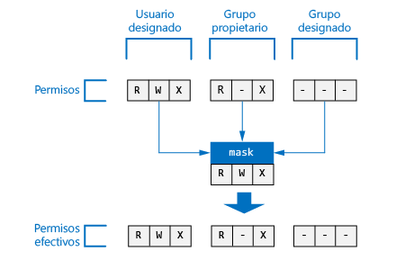

En el ejemplo siguiente, mask se establece en **R-X**. Por lo tanto, **desactiva el permiso de Escritura** para el **usuario designado**, el **grupo propietario** y el **grupo designado** en el momento de la comprobación de acceso.

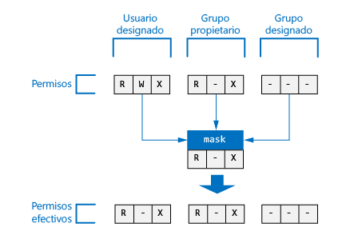

Como referencia, aquí es donde la propiedad mask de un archivo o carpeta aparece en Azure Portal.

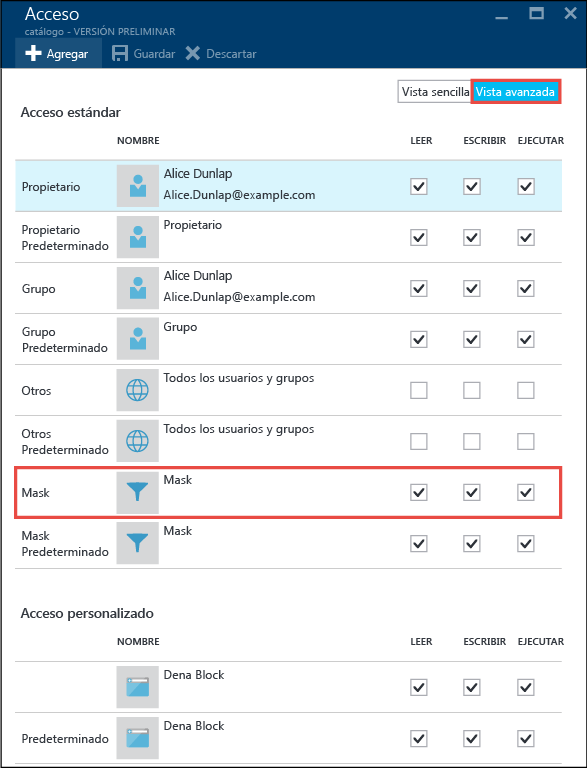

> [!NOTE]
> En una nueva cuenta de Data Lake Store, el valor predeterminado de la propiedad mask de la ACL de acceso y de la ACL predeterminada de la carpeta raíz ("/") es RWX.
> 
> 

## Permisos en los archivos y carpetas nuevos
Cuando se crea un nuevo archivo o carpeta en una carpeta existente, la ACL predeterminada de la carpeta primaria determina:

* La ACL predeterminada y la ACL de acceso de una carpeta secundaria.
* La ACL de acceso de un archivo secundario (los archivos no tienen una ACL predeterminada).

### La ACL de acceso de un archivo o carpeta secundarios.
Cuando se crea un archivo o una carpeta secundarios, la ACL predeterminada de la carpeta primaria se copia como ACL de acceso del archivo o la carpeta secundarios. Además, si **otro** usuario tiene permisos de RWX en la ACL predeterminada del elemento primario, se elimina completamente de la ACL de acceso del elemento secundario.

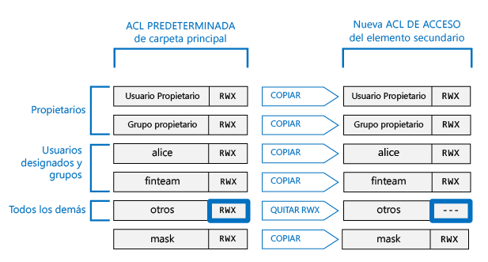

En la mayoría de los escenarios, la información anterior es todo lo que hay que saber acerca de cómo se determina la ACL de acceso de un elemento secundario. Sin embargo, si conoce los sistemas POSIX y desea conocer en profundidad cómo se logra esta transformación, consulte la sección [Rol de Umask en la creación de la ACL de acceso para archivos y carpetas nuevos](#umasks-role-in-creating-the-access-acl-for-new-files-and-folders) de este mismo artículo.

### ACL predeterminada de una carpeta secundaria.
Cuando se crea una carpeta secundaria en una carpeta primaria, la ACL predeterminada de la carpeta primaria se copia tal cual en la ACL predeterminada de la carpeta secundaria.

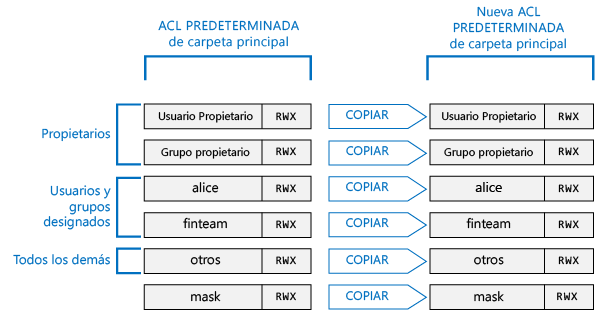

## Temas avanzados para entender las ACL en Data Lake Store
A continuación encontrará un par de temas avanzados que le ayudarán a conocer cómo se determinan las ACL para los archivos o carpetas de Data Lake Store.

### Rol de Umask en la creación de la ACL de acceso para archivos y carpetas nuevos
En un sistema compatible con POSIX, el concepto general es que umask es un valor de 9 bits en la carpeta primaria que se utiliza para transformar el permiso del **usuario propietario**, el **grupo propietario** y **otros** en la ACL de acceso de un archivo o carpeta secundarios nuevos. Los bits de umask identifican qué bits se desactivan en la ACL de acceso del elemento secundario. Por consiguiente, se usa para evitar selectivamente la propagación de permisos para el usuario propietario, el grupo propietario y otros.

En un sistema HDFS, umask suele ser una opción de configuración de todo el sitio que controlan los administradores. Data Lake Store usa una **umask para toda la cuenta** que no se puede cambiar. La siguiente tabla muestra umask de Data Lake Store.

| Grupo de usuarios | Configuración | Efecto en la ACL de acceso de un nuevo elemento secundario |
| --- | --- | --- |
| usuario propietario |--- |Sin efecto |
| grupo propietario |--- |Sin efecto |
| otro |RWX |Se elimina lectura + escritura + ejecución |

En la siguiente ilustración se muestra esta umask, o máscara de usuario, en acción. El efecto neto es quitar **lectura + escritura + ejecución** para el usuario **otros**. Dado que la umask, o mascara de usuario, no especificó los bits del **usuario propietario** y del **grupo propietario**, dichos permisos no se transforman.

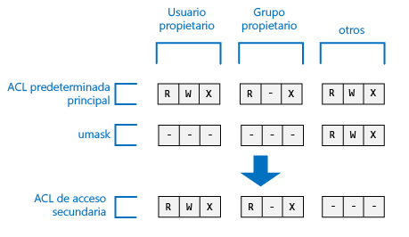 

### El bit persistente
El bit persistente es una característica más avanzada de un sistema de archivos POSIX. En el contexto de Data Lake Store, es improbable que se necesite el bit persistente.

La siguiente tabla muestra cómo funciona el bit persistente en Data Lake Store.

| Grupo de usuarios | Archivo | Carpeta |
| --- | --- | --- |
| Sticky Bits **DESACTIVADO** |Sin efecto |Sin efecto |
| Sticky Bits **ACTIVADO** |Sin efecto |Impide que alguien elimine o cambie el nombre de un elemento secundario, excepto los **superusuarios** y el **usuario propietario** del mismo. |

El bit persistente no se muestra en Azure Portal.

## Preguntas frecuentes sobre las ACL en Data Lake Store
Estas son algunas preguntas que surgen a menudo con respecto a las ACL en Data Lake Store.

### ¿Es preciso habilitar la compatibilidad con las ACL?
No. El control de acceso mediante las ACL siempre está activado en las cuentas de Data Lake Store.

### ¿Qué permisos se requieren para eliminar de forma recursiva una carpeta y su contenido?
* La carpeta primaria debe tener permisos de **Escritura + Ejecución**.
* Tanto la carpeta que se va a eliminar como todas las carpetas dentro de ella, requieren permisos de **lectura + escritura + ejecución**.
  >[AZURE.NOTE] La eliminación de los archivos de las carpetas no requiere que se tenga permiso de Escritura en dichos archivos. Además, la carpeta raíz "/" **nunca** se puede eliminar.

### ¿Quién se establece como propietario de un archivo o carpeta?
El creador de un archivo o carpeta se convierte en el propietario.

### ¿Quién se establece como grupo propietario de un archivo o carpeta en su creación?
Se copia del grupo propietario de la carpeta primaria en la que se crea el nuevo archivo o carpeta.

### Soy el usuario propietario de un archivo, pero no tengo los permisos de RWX que necesito. ¿Qué puedo hacer?
El usuario propietario puede cambiar los permisos del archivo y concederse los permisos de RWX que necesite.

### ¿Admite Data Lake Store la herencia de ACL?
No.

### ¿Cuál es la diferencia entre mask y umask?
| mask | umask |
| --- | --- |
| La propiedad **mask** está disponible en todos los archivos y carpetas. |**umask** es una propiedad de la cuenta de Data Lake Store. Por lo tanto, en Data Lake Store solo hay una propiedad umask. |
| La propiedad mask de un archivo o carpeta puede modificarla el usuario propietario o grupo propietario de un archivo, o bien un superusuario. |La propiedad umask no puede modificarla ningún usuario, ni siquiera un superusuario. Es un valor constante y que no puede cambiarse. |
| La propiedad mask se usa durante el algoritmo de comprobación de acceso en tiempo de ejecución para determinar si un usuario tiene el derecho necesario para realizar una operación en un archivo o carpeta. El rol de la propiedad mask es crear "permisos efectivos" en el momento de la comprobación de acceso. |umask no se utiliza durante la comprobación de acceso. umask se utiliza para determinar la ACL de acceso de los nuevos elementos secundarios de una carpeta. |
| mask es un valor RWX de 3 bits que se aplica al usuario designado, grupo designado y usuario propietario en el momento de la comprobación de acceso. |umask es un valor de 9 bits que se aplica al usuario propietario, grupo propietario y otros de un nuevo elemento secundario. |

### ¿Dónde puedo obtener más información sobre el modelo de control de acceso POSIX?
* [http://www.vanemery.com/Linux/ACL/POSIX_ACL_on_Linux.html](http://www.vanemery.com/Linux/ACL/POSIX_ACL_on_Linux.html)
* [HDFS Permission Guide (Guía de permisos de HDFS)](http://hadoop.apache.org/docs/current/hadoop-project-dist/hadoop-hdfs/HdfsPermissionsGuide.html) 
* [POSIX FAQ (PREGUNTAS MÁS FRECUENTES SOBRE POSIX)](http://www.opengroup.org/austin/papers/posix_faq.html)
* [POSIX 1003.1 2008](http://standards.ieee.org/findstds/standard/1003.1-2008.html)
* [POSIX 1003.1e 1997](http://users.suse.com/~agruen/acl/posix/Posix_1003.1e-990310.pdf)
* [ACL de POSIX en Linux](http://users.suse.com/~agruen/acl/linux-acls/online/)
* [ACL: Using Access Control Lists on Linux (ACL: uso de listas de control de acceso en Linux)](http://bencane.com/2012/05/27/acl-using-access-control-lists-on-linux/)

## Otras referencias
* [Información general del Almacén de Azure Data Lake](data-lake-store-overview.md)
* [Tutorial: Introducción a Análisis de Azure Data Lake mediante el Portal de vista previa de Azure](../data-lake-analytics/data-lake-analytics-get-started-portal.md)

<!---HONumber=Nov16_HO2-->

