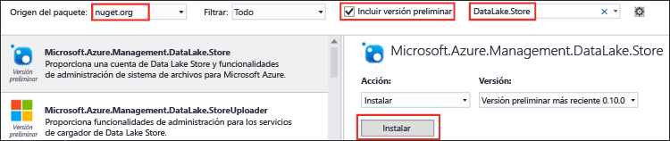
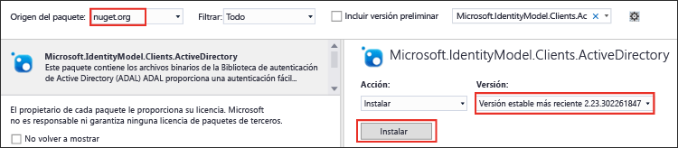

<properties
   pageTitle="Uso de SDK de .NET del Almacén de Data Lake para desarrollar aplicaciones | Azure"
   description="Uso de SDK de .NET del Almacén de Azure Data Lake para desarrollar aplicaciones"
   services="data-lake-store"
   documentationCenter=""
   authors="nitinme"
   manager="jhubbard"
   editor="cgronlun"/>

<tags
   ms.service="data-lake-store"
   ms.devlang="na"
   ms.topic="get-started-article"
   ms.tgt_pltfrm="na"
   ms.workload="big-data"
   ms.date="09/13/2016"
   ms.author="nitinme"/>

# Introducción al Almacén de Azure Data Lake mediante SDK de .NET

> [AZURE.SELECTOR]
- [Portal](data-lake-store-get-started-portal.md)
- [PowerShell](data-lake-store-get-started-powershell.md)
- [.NET SDK](data-lake-store-get-started-net-sdk.md)
- [SDK de Java](data-lake-store-get-started-java-sdk.md)
- [API DE REST](data-lake-store-get-started-rest-api.md)
- [CLI de Azure](data-lake-store-get-started-cli.md)
- [Node.js](data-lake-store-manage-use-nodejs.md)

Aprenda a utilizar el [SDK de .NET de Azure Data Lake Store](https://msdn.microsoft.com/library/mt581387.aspx) para crear una cuenta de Azure Data Lake y realizar operaciones básicas como crear carpetas, cargar y descargar archivos de datos, eliminar una cuenta, etc. Para obtener más información sobre Data Lake, consulte [Almacén de Azure Data Lake](data-lake-store-overview.md).

## Requisitos previos

* Visual Studio 2013 o 2015 Las instrucciones siguientes usan Visual Studio 2015.
* **Una suscripción de Azure**. Vea [Obtener evaluación gratuita de Azure](https://azure.microsoft.com/pricing/free-trial/).
* **Cree una aplicación de Azure Active Directory**. Existen dos formas de autenticación con Azure Active Directory: **interactiva** y **no interactiva**, cada una con diferentes requisitos previos.
	* **Para la autenticación interactiva** (la que se usa en este artículo): en Azure Active Directory, debe crear una **aplicación cliente nativa**. Cuando haya creado la aplicación, recupere los siguientes valores relacionados con esta.
		- Obtenga el **id. de cliente** y el **URI de redirección** de la aplicación.
		- Establecimiento de permisos delegados

	* **Para la autenticación no interactiva**: en Azure Active Directory, debe crear una **aplicación web**. Cuando haya creado la aplicación, recupere los siguientes valores relacionados con esta.
		- Obtenga el **id. de cliente**, el **secreto de cliente** y el **URI de redirección** de la aplicación.
		- Establecimiento de permisos delegados
		- Asigne la aplicación de Azure Active Directory a un rol. El rol puede encontrarse al nivel del ámbito en el que quiere conceder el permiso a la aplicación de Azure Active Directory. Por ejemplo, puede asignar la aplicación en el nivel de suscripción o en el nivel de un grupo de recursos.

	Consulte [Creación de aplicación de Active Directory y entidad de servicio mediante el portal](../resource-group-create-service-principal-portal.md) para obtener instrucciones acerca de cómo recuperar estos valores, establecer los permisos y asignar roles.

## Creación de una aplicación .NET

1. Abra Visual Studio y cree una aplicación de consola.

2. En el menú **Archivo**, haga clic en **Nuevo** y, a continuación, en **Proyecto**.

3. En **Nuevo proyecto**, escriba o seleccione los siguientes valores:

	| Propiedad | Valor |
	|----------|-----------------------------|
	| Categoría | Plantillas/Visual C#/Windows |
	| Plantilla | Aplicación de consola |
	| Nombre | CreateADLApplication |

4. Haga clic en **Aceptar** para crear el proyecto.

5. Agregue los paquetes de Nuget al proyecto.

	1. Haga clic con el botón derecho en el Explorador de soluciones y haga clic en **Administrar paquetes de NuGet**.
	2. En la pestaña **Administrador de paquetes NuGet**, asegúrese de que la opción **Origen del paquete** esté establecida en **nuget.org** y que esté activada la casilla **Incluir versión previa**.
	3. Busque e instale los siguientes paquetes del Almacén de Data Lake:

		* `Microsoft.Azure.Management.DataLake.Store`
		* `Microsoft.Azure.Management.DataLake.StoreUploader`

		

	4. Instale también el paquete `Microsoft.IdentityModel.Clients.ActiveDirectory` para la autenticación de Azure Active Directory. Asegúrese de que *desactiva* la casilla **Incluir versión previa**, con el fin de instalar una versión estable de este paquete.

		

	5. Cierre el **Administrador de paquetes Nuget**.

7. Abra **Program.cs**, elimine el código existente e incluya las siguientes instrucciones para agregar referencias a espacios de nombres.

		using System;
        using System.IO;
        using System.Security;
        using System.Text;
        using System.Collections.Generic;
        using System.Linq;

        using Microsoft.Azure.Management.DataLake.Store;
        using Microsoft.Azure.Management.DataLake.Store.Models;
        using Microsoft.Azure.Management.DataLake.StoreUploader;
        using Microsoft.IdentityModel.Clients.ActiveDirectory;
        using Microsoft.Rest;

8. Declare las variables como se muestra a continuación y proporcione los valores del nombre del Almacén de Data Lake y del nombre del grupo de recursos. La aplicación creará el nombre del Almacén de Data Lake que proporcione. El grupo de recursos que proporcione aquí ya debe existir. Además, asegúrese de que la ruta de acceso local y el nombre de archivo que proporcione aquí deben existir en el equipo. Agregue el siguiente fragmento de código después de las declaraciones de espacios de nombres.

		namespace SdkSample
        {
            class Program
            {
                private static DataLakeStoreAccountManagementClient _adlsClient;
                private static DataLakeStoreFileSystemManagementClient _adlsFileSystemClient;

                private static string _adlsAccountName;
                private static string _resourceGroupName;
                private static string _location;

                private static void Main(string[] args)
                {
                    _adlsAccountName = "<DATA-LAKE-STORE-NAME>"; // TODO: Replace this value with the name for a NEW Store account.
                    _resourceGroupName = "<RESOURCE-GROUP-NAME>"; // TODO: Replace this value. This resource group should already exist.
                    _location = "East US 2";

                    string localFolderPath = @"C:\local_path"; // TODO: Make sure this exists and can be overwritten.
                    string localFilePath = localFolderPath + "file.txt"; // TODO: Make sure this exists and can be overwritten.
                    string remoteFolderPath = "/data_lake_path/";
                    string remoteFilePath = remoteFolderPath + "file.txt";
				}
			}
		}

En las restantes secciones de este artículo, se puede ver cómo se utilizan los métodos .NET disponibles para realizar operaciones como autenticar usuarios, crear una cuenta del Almacén de Data Lake, cargar archivos, etc. Si busca un ejemplo completo de cómo trabajar con Data Lake Store, consulte el [Apéndice](#appendix-sample-code) al final de este artículo.

## Autenticación del usuario

Hay dos formas de realizar la autenticación con Azure Active Directory.

* **Interactiva**, en la que un usuario inicia sesión mediante la aplicación. Se implementa en el método `AuthenticateUser` del fragmento de código siguiente.

* **No interactiva**, en la que la aplicación proporciona sus propias credenciales. Se implementa en el método `AuthenticateAppliaction` del fragmento de código siguiente.

### Autenticación interactiva

El siguiente fragmento muestra un método `AuthenticateUser` que se puede usar para un inicio de sesión interactivo.

 	// Authenticate the user with AAD through an interactive popup.
    // You need to have an application registered with AAD in order to authenticate.
    //   For more information and instructions on how to register your application with AAD, see:
    //   https://azure.microsoft.com/es-ES/documentation/articles/resource-group-create-service-principal-portal/
	public static TokenCredentials AuthenticateUser(string tenantId, string resource, string appClientId, Uri appRedirectUri, string userId = "")
	{
	    var authContext = new AuthenticationContext("https://login.microsoftonline.com/" + tenantId);
	
	    var tokenAuthResult = authContext.AcquireToken(resource, appClientId, appRedirectUri,
	        PromptBehavior.Auto, UserIdentifier.AnyUser);
	
	    return new TokenCredentials(tokenAuthResult.AccessToken);
	}

### Autenticación no interactiva

El siguiente fragmento muestra un método `AuthenticateApplication` que se puede usar para un inicio de sesión no interactivo.

	// Authenticate the application with AAD through the application's secret key.
	// You need to have an application registered with AAD in order to authenticate.
	//   For more information and instructions on how to register your application with AAD, see:
	//   https://azure.microsoft.com/es-ES/documentation/articles/resource-group-create-service-principal-portal/
	public static TokenCredentials AuthenticateApplication(string tenantId, string resource, string appClientId, Uri appRedirectUri, SecureString clientSecret)
	{
	    var authContext = new AuthenticationContext("https://login.microsoftonline.com/" + tenantId);
	    var credential = new ClientCredential(appClientId, clientSecret);
	
	    var tokenAuthResult = authContext.AcquireToken(resource, credential);
	
	    return new TokenCredentials(tokenAuthResult.AccessToken);
	}
	
## Crear una cuenta de Almacén de Data Lake

El siguiente fragmento muestra un método `CreateAccount` que puede utilizar para crear una cuenta de Data Lake Store.

	// Create Data Lake Store account
    public static void CreateAccount()
    {
        var adlsParameters = new DataLakeStoreAccount(location: _location);
        _adlsClient.Account.Create(_resourceGroupName, _adlsAccountName, adlsParameters);
    } 

## Enumeración de todas las cuentas de Data Lake Store de una suscripción

El siguiente fragmento muestra un método `ListAdlStoreAccounts` que se puede utilizar para enumerar todas las cuentas de Data Lake Store de una suscripción de Azure dada.

	// List all ADLS accounts within the subscription
	public static List<DataLakeStoreAccount> ListAdlStoreAccounts()
	{
	    var response = _adlsClient.Account.List(_adlsAccountName);
	    var accounts = new List<DataLakeStoreAccount>(response);
	
	    while (response.NextPageLink != null)
	    {
	        response = _adlsClient.Account.ListNext(response.NextPageLink);
	        accounts.AddRange(response);
	    }
	
	    return accounts;
	}

## Creación de directorios

El siguiente fragmento muestra un método `CreateDirectory` que puede utilizar para crear un directorio en una cuenta de Data Lake Store.

	// Create a directory
    public static void CreateDirectory(string path)
    {
        _adlsFileSystemClient.FileSystem.Mkdirs(_adlsAccountName, path);
    }

## Carga de archivos en Data Lake Store

El siguiente fragmento muestra un método `UploadFile` que puede utilizar para cargar archivos en una cuenta de Data Lake Store.

	// Upload a file
    public static void UploadFile(string srcFilePath, string destFilePath, bool force = true)
    {
        var parameters = new UploadParameters(srcFilePath, destFilePath, _adlsAccountName, isOverwrite: force);
        var frontend = new DataLakeStoreFrontEndAdapter(_adlsAccountName, _adlsFileSystemClient);
        var uploader = new DataLakeStoreUploader(parameters, frontend);
        uploader.Execute();
    }

DataLakeStoreUploader admite la carga y descarga recursiva entre la ruta de un archivo (o carpeta) local y Data Lake Store.

## Obtención de información de un archivo o directorio

El siguiente fragmento muestra un método `GetItemInfo` que puede utilizar para recuperar la información sobre un archivo o directorio disponible en Data Lake Store.

	// Get file or directory info
    public static FileStatusProperties GetItemInfo(string path)
    {
        return _adlsFileSystemClient.FileSystem.GetFileStatus(_adlsAccountName, path).FileStatus;
    }

## Enumeración de archivos o directorios

El siguiente fragmento muestra un método `ListItem` que puede utilizar para enumerar el archivo y los directorios de una cuenta de Data Lake Store.
	
	// List files and directories
    public static List<FileStatusProperties> ListItems(string directoryPath)
    {
        return _adlsFileSystemClient.FileSystem.ListFileStatus(_adlsAccountName, directoryPath).FileStatuses.FileStatus.ToList();
    }

## Concatenación de archivos

El siguiente fragmento muestra un método `ConcatenateFiles` que se utiliza para concatenar archivos.

	// Concatenate files
    public static void ConcatenateFiles(string[] srcFilePaths, string destFilePath)
    {
        _adlsFileSystemClient.FileSystem.Concat(_adlsAccountName, destFilePath, srcFilePaths);
    }

## Anexión a un archivo

El siguiente fragmento muestra un método `AppendToFile` que se utiliza para anexar datos a un archivo que ya está almacenado en una cuenta de Data Lake Store.

	// Append to file
    public static void AppendToFile(string path, string content)
    {
        var stream = new MemoryStream(Encoding.UTF8.GetBytes(content));

        _adlsFileSystemClient.FileSystem.Append(_adlsAccountName, path, stream);
    }

## Descarga de un archivo

El siguiente fragmento muestra un método `DownloadFile` que se utiliza para descargar un archivo de una cuenta de Data Lake Store.

	// Download file
    public static void DownloadFile(string srcPath, string destPath)
    {
        var stream = _adlsFileSystemClient.FileSystem.Open(_adlsAccountName, srcPath);
        var fileStream = new FileStream(destPath, FileMode.Create);

        stream.CopyTo(fileStream);
        fileStream.Close();
        stream.Close();
    }

## Eliminar una cuenta del Almacén de Data Lake

El siguiente fragmento muestra un método `DeleteAccount` que puede utilizar para eliminar una cuenta de Data Lake Store.

	// Delete account
    public static void DeleteAccount()
    {
        _adlsClient.Account.Delete(_resourceGroupName, _adlsAccountName);
    }

## Apéndice: código de ejemplo

El fragmento siguiente es un ejemplo de código completo que se puede copiar y pegar en una aplicación para ver una operación de un extremo a otro en el Almacén de Data Lake. Antes de ejecutar el fragmento de código, asegúrese de que proporciona los valores necesarios, como el nombre del Almacén de Data Lake, el nombre del grupo de recursos, etc. También debe proporcionar los valores necesarios para la autenticación de Azure Active Directory, como **<APPLICATION-CLIENT-ID>**, **<APPLICATION-REPLY-URI>** y **<SUBSCRIPTION-ID>**.

Aunque el fragmento de código siguiente proporciona métodos para ambos enfoques, interactivo y no interactivo, el bloque de código no interactivo tiene comentarios. El método interactivo requiere que proporcione el identificador de cliente de la aplicación de AAD y el identificador URI de redireccionamiento. El vínculo en el requisito previo proporciona instrucciones sobre cómo obtenerlos.

>[AZURE.NOTE] Si desea modificar el fragmento de código y usar el método no interactivo (`AuthenticateApplication`), también debe proporcionar la clave de autenticación del cliente, además del identificador de cliente y del identificador URI de respuesta del cliente, como entradas para el método. El artículo [Uso del portal para crear una aplicación de Active Directory y una entidad de servicio con acceso a los recursos](../resource-group-create-service-principal-portal.md) también proporciona información sobre cómo generar y recuperar la clave de autenticación de cliente.
	
Por último, asegúrese de que la ruta de acceso local y el nombre de archivo que proporcione existen en el equipo. Si busca datos de ejemplo para cargar, puede obtener la carpeta **Ambulance Data** en el [repositorio Git de Azure Data Lake](https://github.com/MicrosoftBigData/usql/tree/master/Examples/Samples/Data/AmbulanceData).

    using System;
    using System.IO;
    using System.Security;
    using System.Text;
    using System.Collections.Generic;
    using System.Linq;

    using Microsoft.Azure.Management.DataLake.Store;
    using Microsoft.Azure.Management.DataLake.Store.Models;
    using Microsoft.Azure.Management.DataLake.StoreUploader;
    using Microsoft.IdentityModel.Clients.ActiveDirectory;
    using Microsoft.Rest;

    namespace SdkSample
    {
        class Program
        {
            private static DataLakeStoreAccountManagementClient _adlsClient;
            private static DataLakeStoreFileSystemManagementClient _adlsFileSystemClient;

            private static string _adlsAccountName;
            private static string _resourceGroupName;
            private static string _location;

            private static void Main(string[] args)
            {
                _adlsAccountName = "<DATA-LAKE-STORE-NAME>"; // TODO: Replace this value with the name for a NEW Store account.
                _resourceGroupName = "<RESOURCE-GROUP-NAME>"; // TODO: Replace this value. This resource group should already exist.
                _location = "East US 2";

                string localFolderPath = @"C:\local_path"; // TODO: Make sure this exists and can be overwritten.
                string localFilePath = localFolderPath + "file.txt"; // TODO: Make sure this exists and can be overwritten.
                string remoteFolderPath = "/data_lake_path/";
                string remoteFilePath = remoteFolderPath + "file.txt";

                // Authenticate the user
                var tokenCreds = AuthenticateUser("common", "https://management.core.windows.net/",
                    "<APPLICATION-CLIENT-ID>", new Uri("<APPLICATION-REPLY-URI>")); // TODO: Replace bracketed values.

                SetupClients(tokenCreds, "<SUBSCRIPTION-ID>"); // TODO: Replace bracketed value.

                // Run sample scenarios
                WaitForNewline("Authenticated.", "Creating NEW account.");
                CreateAccount();
                WaitForNewline("Account created.", "Creating a directory.");

                // Create a directory in the Data Lake Store
                CreateDirectory(remoteFolderPath);
                WaitForNewline("Directory created.", "Showing directory info.");

                // Get info about the directory in the Data Lake Store
                var itemInfo = GetItemInfo(remoteFolderPath);
                Console.WriteLine("Type: " + itemInfo.Type);
                Console.WriteLine("Last modified (UTC): " +
                                  new DateTime(1970, 1, 1, 0, 0, 0, 0, DateTimeKind.Utc).AddMilliseconds(
                                      itemInfo.ModificationTime.Value));
                WaitForNewline("Directory info shown.", "Uploading a file.");

                // Upload a file to the Data Lake Store
                UploadFile(localFilePath, remoteFilePath);
                WaitForNewline("File uploaded.", "Listing files and directories.");

                // List the files in the Data Lake Store
                var itemList = ListItems(remoteFolderPath);
                var fileMenuItems = itemList.Select(a => String.Format("{0,15} {1}", a.Type, a.PathSuffix));
                Console.WriteLine(String.Join("\r\n", fileMenuItems));
                WaitForNewline("Files and directories listed.", "Appending content to a file.");

                // Append to a file in the Data Lake Store
                AppendToFile(remoteFilePath, "123");
                WaitForNewline("Content appended.", "Downloading a file.");

                // Download a file from the Data Lake Store
                DownloadFile(remoteFilePath, localFilePath);
                WaitForNewline("File downloaded.", "Deleting account.");

                // Delete account
                DeleteAccount();
                WaitForNewline("Account deleted. You can now exit.");
            }

            // Helper function to show status and wait for user input
            public static void WaitForNewline(string reason, string nextAction = "")
            {
                if (!String.IsNullOrWhiteSpace(nextAction))
                {
                    Console.WriteLine(reason + "\r\nPress ENTER to continue...");
                    Console.ReadLine();
                    Console.WriteLine(nextAction);
                }
                else
                {
                    Console.WriteLine(reason + "\r\nPress ENTER to continue...");
                    Console.ReadLine();
                }
            }

            // Authenticate the user with AAD through an interactive popup.
            // You need to have an application registered with AAD in order to authenticate.
            //   For more information and instructions on how to register your application with AAD, see:
            //   https://azure.microsoft.com/es-ES/documentation/articles/resource-group-create-service-principal-portal/
            public static TokenCredentials AuthenticateUser(string tenantId, string resource, string appClientId, Uri appRedirectUri, string userId = "")
            {
                var authContext = new AuthenticationContext("https://login.microsoftonline.com/" + tenantId);

                var tokenAuthResult = authContext.AcquireToken(resource, appClientId, appRedirectUri,
                    PromptBehavior.Auto, UserIdentifier.AnyUser);

                return new TokenCredentials(tokenAuthResult.AccessToken);
            }
			
			/*
            // Authenticate the application with AAD through the application's secret key.
            // You need to have an application registered with AAD in order to authenticate.
            //   For more information and instructions on how to register your application with AAD, see:
            //   https://azure.microsoft.com/es-ES/documentation/articles/resource-group-create-service-principal-portal/
            public static TokenCredentials AuthenticateApplication(string tenantId, string resource, string appClientId, Uri appRedirectUri, SecureString clientSecret)
            {
                var authContext = new AuthenticationContext("https://login.microsoftonline.com/" + tenantId);
                var credential = new ClientCredential(appClientId, clientSecret);

                var tokenAuthResult = authContext.AcquireToken(resource, credential);

                return new TokenCredentials(tokenAuthResult.AccessToken);
            }
			*/

            //Set up clients
            public static void SetupClients(TokenCredentials tokenCreds, string subscriptionId)
            {
                _adlsClient = new DataLakeStoreAccountManagementClient(tokenCreds);
                _adlsClient.SubscriptionId = subscriptionId;

                _adlsFileSystemClient = new DataLakeStoreFileSystemManagementClient(tokenCreds);
            }

            // Create account
            public static void CreateAccount()
            {
                // Create ADLS account
                var adlsParameters = new DataLakeStoreAccount(location: _location);
                _adlsClient.Account.Create(_resourceGroupName, _adlsAccountName, adlsParameters);
            }

            // Delete account
            public static void DeleteAccount()
            {
                _adlsClient.Account.Delete(_resourceGroupName, _adlsAccountName);
            }

            // List all ADLS accounts within the subscription
            public static List<DataLakeStoreAccount> ListAdlStoreAccounts()
            {
                var response = _adlsClient.Account.List(_adlsAccountName);
                var accounts = new List<DataLakeStoreAccount>(response);

                while (response.NextPageLink != null)
                {
                    response = _adlsClient.Account.ListNext(response.NextPageLink);
                    accounts.AddRange(response);
                }

                return accounts;
            }

            // Upload a file
            public static void UploadFile(string srcFilePath, string destFilePath, bool force = true)
            {
                var parameters = new UploadParameters(srcFilePath, destFilePath, _adlsAccountName, isOverwrite: force);
                var frontend = new DataLakeStoreFrontEndAdapter(_adlsAccountName, _adlsFileSystemClient);
                var uploader = new DataLakeStoreUploader(parameters, frontend);
                uploader.Execute();
            }

            // Concatenate files
            public static void ConcatenateFiles(string[] srcFilePaths, string destFilePath)
            {
                _adlsFileSystemClient.FileSystem.Concat(_adlsAccountName, destFilePath, srcFilePaths);
            }

            // Get file or directory info
            public static FileStatusProperties GetItemInfo(string path)
            {
                return _adlsFileSystemClient.FileSystem.GetFileStatus(_adlsAccountName, path).FileStatus;
            }

            // List files and directories
            public static List<FileStatusProperties> ListItems(string directoryPath)
            {
                return _adlsFileSystemClient.FileSystem.ListFileStatus(_adlsAccountName, directoryPath).FileStatuses.FileStatus.ToList();
            }

            // Download file
            public static void DownloadFile(string srcPath, string destPath)
            {
                var stream = _adlsFileSystemClient.FileSystem.Open(_adlsAccountName, srcPath);
                var fileStream = new FileStream(destPath, FileMode.Create);

                stream.CopyTo(fileStream);
                fileStream.Close();
                stream.Close();
            }

            // Append to file
            public static void AppendToFile(string path, string content)
            {
                var stream = new MemoryStream(Encoding.UTF8.GetBytes(content));

                _adlsFileSystemClient.FileSystem.Append(_adlsAccountName, path, stream);
            }

            // Create a directory
            public static void CreateDirectory(string path)
            {
                _adlsFileSystemClient.FileSystem.Mkdirs(_adlsAccountName, path);
            }
        }
    }

## Pasos siguientes

- [Protección de los datos en el Almacén de Data Lake](data-lake-store-secure-data.md)
- [Uso de Análisis de Azure Data Lake con el Almacén de Data Lake](../data-lake-analytics/data-lake-analytics-get-started-portal.md)
- [Uso de HDInsight de Azure con el Almacén de Data Lake](data-lake-store-hdinsight-hadoop-use-portal.md)
- [Referencia de SDK de .NET de Data Lake Store](https://msdn.microsoft.com/library/mt581387.aspx)
- [Referencia de REST de Data Lake Store](https://msdn.microsoft.com/library/mt693424.aspx)

<!---HONumber=AcomDC_0914_2016-->