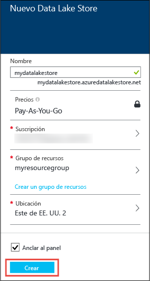
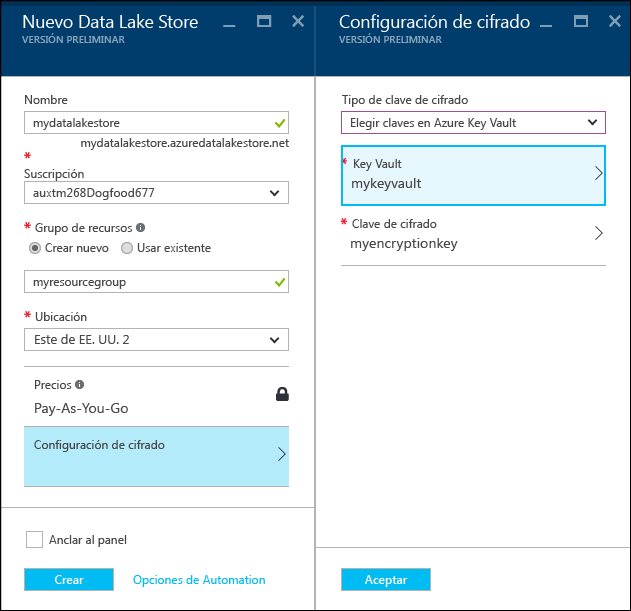
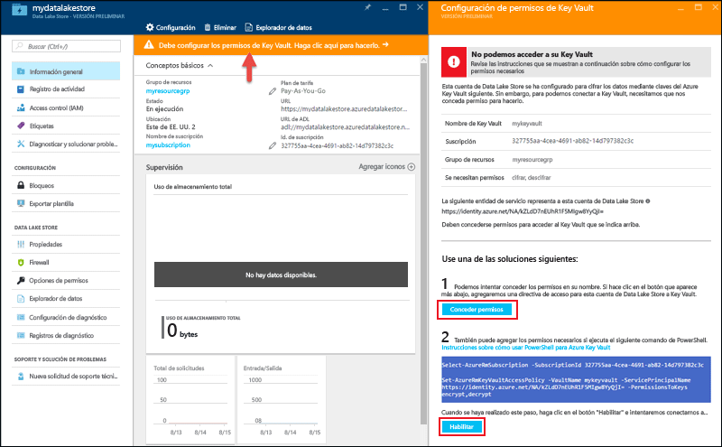
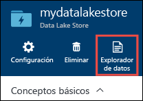
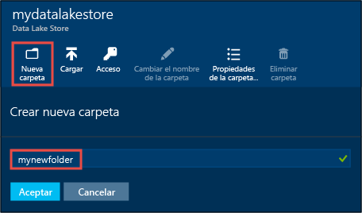
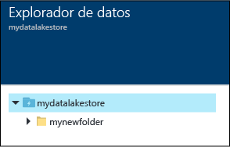
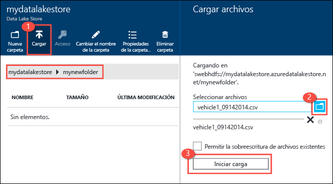
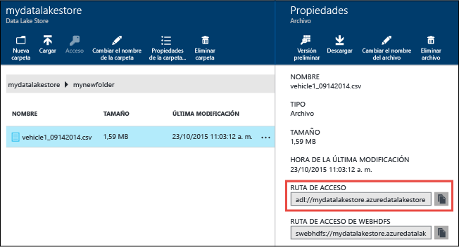
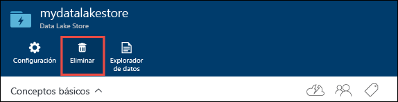

# Introducción al uso de Azure Portal por parte de Azure Data Lake Store
> [!div class="op_single_selector"]
> * [Portal](data-lake-store-get-started-portal.md)
> * [PowerShell](data-lake-store-get-started-powershell.md)
> * [CLI de Azure 2.0](data-lake-store-get-started-cli-2.0.md)
>
> 

Aprenda a usar Azure Portal para crear una cuenta de Azure Data Lake Store y realizar operaciones básicas como crear carpetas, cargar y descargar archivos de datos, eliminar la cuenta, etc. Para más información, consulte [Introducción a Azure Data Lake Store](data-lake-store-overview.md).

## Requisitos previos
Antes de empezar este tutorial, debe contar con lo siguiente:

* **Una suscripción de Azure**. Consulte [Obtención de una versión de evaluación gratuita](https://azure.microsoft.com/pricing/free-trial/).

## Creación de una cuenta de Almacén de Azure Data Lake

1. Inicie sesión en el nuevo [Azure Portal](https://portal.azure.com).
2. Haga clic en **NUEVO**, en **Datos y almacenamiento** y en **Azure Data Lake Store**. Lea la información de la hoja **Azure Data Lake Store** y haga clic en **Crear** en la esquina inferior izquierda de la hoja.
3. En la hoja **Nuevo Data Lake Store**, proporcione los valores como se muestra en la captura de pantalla siguiente:
   
    
   
   * **Nombre**. Escriba un nombre único para la cuenta de Data Lake Store.
   * **Suscripción**. Seleccione la suscripción con la que desea crear una cuenta de Data Lake Store.
   * **Grupo de recursos**. Seleccione un grupo de recursos existente, o bien seleccione la opción **Crear nuevo** para crearlo. Un grupo de recursos es un contenedor que incluye los recursos relacionados de una aplicación. Para más información, consulte [Grupos de recursos en Azure](../azure-resource-manager/resource-group-overview.md#resource-groups).
   * **Ubicación**: seleccione la ubicación donde desea crear la cuenta de Data Lake Store.
   * **Configuración de cifrado**. Hay tres opciones:
     
     * **No habilitar el cifrado**.
     * **Usar claves administradas por Azure Data Lake**.  Si desea que Azure Data Lake Store administre las claves de cifrado.
     * **Usar claves de su propia instancia de Key Vault**. Puede seleccionar una instancia de Azure Key Vault existente o crear una nueva. Si utiliza las claves de un almacén de claves, debe asignar permisos para que la cuenta de Azure Data Lake Store acceda a esa instancia de Azure Key Vault. Para obtener instrucciones, consulte [Asignación de permisos a Azure Key Vault](#assign-permissions-to-azure-key-vault).
       
        
       
        Haga clic en **Aceptar** en la hoja **Configuración de cifrado**.

        Para obtener más información, consulte [Cifrado de datos en Azure Data Lake Store](./data-lake-store-encryption.md).

4. Haga clic en **Create**(Crear). Si elige anclar la cuenta al panel, volverá a este, donde podrá ver el progreso del aprovisionamiento de la cuenta de Data Lake Store. Una vez aprovisionada la cuenta de Almacén de Data Lake, aparece la hoja de la cuenta.

### Asignación de permisos para Azure Key Vault
Si utiliza las claves de Azure Key Vault para configurar el cifrado de la cuenta de Data Lake Store, debe configurar el acceso entre la cuenta de Data Lake Store y la de Azure Key Vault. Para ello, siga los pasos que se indican a continuación.

1. Si ha usado claves de Azure Key Vault, la hoja de la cuenta de Data Lake Store muestra una advertencia en la parte superior. Haga clic en la advertencia para abrir **Cifrado**.
   
    
2. La hoja muestra dos opciones para configurar el acceso.

    
   
   * En la primera opción, haga clic en **Conceder permisos** para configurar el acceso. La primera opción solo está habilitada si el usuario que creó la cuenta de Data Lake Store es también administrador de Azure Key Vault.
   * La otra opción consiste en ejecutar el cmdlet de PowerShell que se muestra en la hoja. Es preciso ser propietario de Azure Key Vault o tener capacidad para conceder permisos en Azure Key Vault. Después de ejecutar el cmdlet, vuelva a la hoja y haga clic en **Habilitar** para configurar el acceso.

> [!NOTE]
> También puede crear una cuenta de Data Lake Store con plantillas de Azure Resource Manager. Estas plantillas son accesibles desde las [plantillas de inicio rápido de Azure](https://azure.microsoft.com/resources/templates/?term=data+lake+store):
    - Sin cifrado de datos: [Implementación de la cuenta de Azure Data Lake Store sin cifrado de datos](https://azure.microsoft.com/resources/templates/101-data-lake-store-no-encryption/).
    - Con cifrado de datos mediante Data Lake Store: [Implementación de la cuenta de Data Lake Store con cifrado (Data Lake)](https://azure.microsoft.com/resources/templates/101-data-lake-store-encryption-adls/).
    - Con cifrado de datos mediante Azure Key Vault: [Implementación de la cuenta de Data Lake Store con cifrado (Key Vault)](https://azure.microsoft.com/resources/templates/101-data-lake-store-encryption-key-vault/).
> 
> 

## Creación de carpetas en una cuenta de Almacén de Azure Data Lake
Puede crear carpetas en su cuenta de Almacén de Data Lake para administrar y almacenar datos.

1. Abra la cuenta de Data Lake Store que creó. En el panel izquierdo, haga clic en **Examinar** y en **Data Lake Store**; después, en la hoja Data Lake Store, haga clic en el nombre de la cuenta en la que desee crear carpetas. Si ancló la cuenta al Panel de inicio, haga clic en ese icono de cuenta.
2. En la hoja de su cuenta de Almacén de Data Lake, haga clic en **Explorador de datos**.
   
    
3. En la hoja de Explorador de datos, haga clic en **Nueva carpeta**, escriba un nombre para la nueva carpeta y haga clic en **Aceptar**.
   
    
   
    La carpeta recién creada se muestra en la hoja **Explorador de datos** . Puede crear carpetas anidadas hasta cualquier nivel.
   
    

## Carga de datos en la cuenta de Almacén de Azure Data Lake
Puede cargar los datos en una cuenta de Almacén de Azure Data Lake directamente en el nivel raíz o en una carpeta que creó en la cuenta. 

1. Desde la hoja **Explorador de datos**, haga clic en **Carga**. 
2. En la hoja **Cargar archivos**, vaya a los archivos que desee cargar y haga clic en **Agregar archivos seleccionados**. También puede seleccionar más de un archivo para cargar.

    

Si busca datos de ejemplo para cargar, puede obtener la carpeta **Ambulance Data** en el [repositorio Git de Azure Data Lake](https://github.com/MicrosoftBigData/usql/tree/master/Examples/Samples/Data/AmbulanceData).

## Acciones disponibles con los datos almacenados
Haga clic en el icono de puntos suspensivos en un archivo y, en el menú emergente, en la acción que desee realizar con los datos.

 

## Protección de los datos
Puede proteger los datos almacenados en su cuenta de Almacén de Azure Data Lake con Azure Active Directory y el control de acceso (ACL). Para obtener instrucciones sobre cómo hacerlo, consulte [Protección de los datos almacenados en el Almacén de Azure Data Lake](data-lake-store-secure-data.md).

## Eliminación de la cuenta de Almacén de Azure Data Lake
Para eliminar una cuenta de Almacén de Azure Data Lake, en la hoja de su Almacén de Data Lake, haga clic en **Eliminar**. Para confirmar la acción, se le pedirá que escriba el nombre de la cuenta que desea eliminar. Escriba el nombre de la cuenta y después haga clic en **Eliminar**.

## pasos siguientes
* [Uso de Azure Data Lake Store para requisitos de macrodatos](data-lake-store-data-scenarios.md) 
* [Protección de los datos en Data Lake Store](data-lake-store-secure-data.md)
* [Uso de Análisis de Azure Data Lake con el Almacén de Data Lake](../data-lake-analytics/data-lake-analytics-get-started-portal.md)
* [Uso de HDInsight de Azure con el Almacén de Data Lake](data-lake-store-hdinsight-hadoop-use-portal.md)

