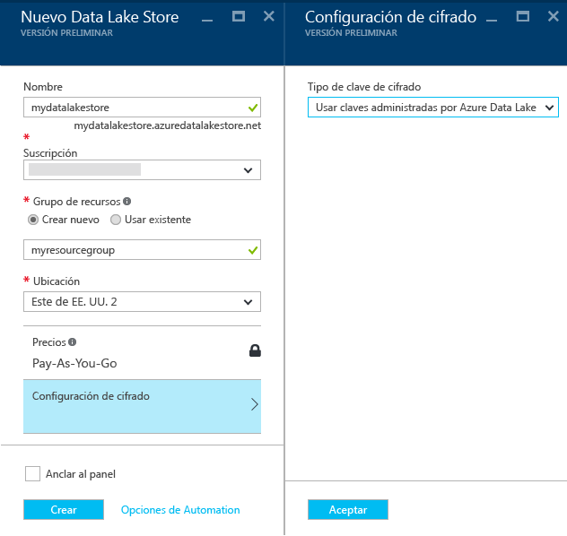
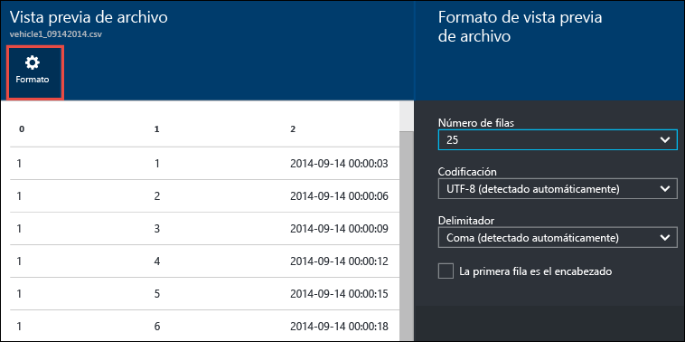

# Introducción al Almacén de Azure Data Lake mediante el Portal de Azure
> [!div class="op_single_selector"]
> * [Portal](data-lake-store-get-started-portal.md)
> * [PowerShell](data-lake-store-get-started-powershell.md)
> * [.NET SDK](data-lake-store-get-started-net-sdk.md)
> * [SDK de Java](data-lake-store-get-started-java-sdk.md)
> * [API de REST](data-lake-store-get-started-rest-api.md)
> * [CLI de Azure 2.0](data-lake-store-get-started-cli-2.0.md)
> * [Node.js](data-lake-store-manage-use-nodejs.md)
> * [Python](data-lake-store-get-started-python.md)
>
> 

Aprenda a usar el Portal de Azure para crear una cuenta de Almacén de Azure Data Lake y realizar operaciones básicas como crear carpetas, cargar y descargar archivos de datos, eliminar la cuenta, etc. Para más información acerca de Data Lake Store, consulte la página con [información general de Azure Data Lake Store](data-lake-store-overview.md).

## Requisitos previos
Antes de empezar este tutorial, debe contar con lo siguiente:

* **Una suscripción de Azure**. Vea [Obtener evaluación gratuita de Azure](https://azure.microsoft.com/pricing/free-trial/).

## ¿Aprende más rápido con vídeos?
Vea los vídeos siguientes para empezar a trabajar con el Almacén de Data Lake.

* [Crear una cuenta de Almacén de Data Lake](https://mix.office.com/watch/1k1cycy4l4gen)
* [Administrar datos en Almacén de Data Lake mediante el explorador de datos](https://mix.office.com/watch/icletrxrh6pc)

## Creación de una cuenta de Almacén de Azure Data Lake
1. Inicie sesión en el nuevo [Portal de Azure](https://portal.azure.com).
2. Haga clic en **NUEVO**, en **Datos y almacenamiento** y en **Azure Data Lake Store**. Lea la información de la hoja **Azure Data Lake Store** y haga clic en **Crear** en la esquina inferior izquierda de la hoja.
3. En la hoja **Nuevo almacén de Data Lake** , proporcione los valores como se muestra en la captura de pantalla siguiente:
   
    
   
   * **Nombre**. Escriba un nombre único para la cuenta de Data Lake Store.
   * **Suscripción**. Seleccione la suscripción con la que desea crear una cuenta de Data Lake Store.
   * **Grupo de recursos**. Seleccione un grupo de recursos existente, o bien seleccione la opción **Crear nuevo** para crearlo. Un grupo de recursos es un contenedor que incluye los recursos relacionados de una aplicación. Para más información, consulte [Grupos de recursos en Azure](../azure-resource-manager/resource-group-overview.md#resource-groups).
   * **Ubicación**: seleccione la ubicación donde desea crear la cuenta de Data Lake Store.
   * **Configuración de cifrado**. Puede elegir si desea cifrar la cuenta de Data Lake Store. Si elige cifrarla, también puede especificar cómo administrar la clave de cifrado maestra que desea usar para cifrar los datos de la cuenta.
     
     * (Opcional) Seleccione **No habilitar el cifrado** en la lista desplegable para que no haya cifrado.
     * (Valor predeterminado) Seleccione **Usar claves administradas por Azure Data Lake** si desea que Azure Data Lake Store administre las claves de cifrado.
       
         
     * (Opcional) Seleccione **Elegir claves en el Almacén de claves de Azure** si desea usar sus propias claves presentes en Azure Key Vault. Con esta opción, también se puede crear una cuenta y claves de Key Vault si no dispone de ellas.
       
         
       
       Haga clic en **Aceptar** en la hoja **Configuración de cifrado**.
       
       > [!NOTE]
       > Si utiliza las claves de Azure Key Vault para configurar el cifrado de la cuenta de Data Lake Store, debe asignar permisos para que la cuenta de Azure Data Lake Store acceda a Azure Key Vault. Para obtener instrucciones acerca de cómo hacerlo, consulte [Asignación de permisos para Azure Key Vault](#assign-permissions-to-the-azure-key-vault)
       > 
       > 
4. Haga clic en **Crear**. Si elige anclar la cuenta al panel, volverá a este, donde podrá ver el progreso del aprovisionamiento de la cuenta de Data Lake Store. Una vez aprovisionada la cuenta de Almacén de Data Lake, aparece la hoja de la cuenta.

## Asignación de permisos para Azure Key Vault
Si utiliza las claves de Azure Key Vault para configurar el cifrado de la cuenta de Data Lake Store, debe configurar el acceso entre la cuenta de Data Lake Store y la de Azure Key Vault. Para ello, siga los pasos que se indican a continuación.

1. Si ha usado claves de Azure Key Vault, la hoja de la cuenta de Data Lake Store muestra una advertencia en la parte superior. Haga clic en dicha advertencia para abrir la hoja **Configuración de permisos del Almacén de claves**.
   
    
2. La hoja muestra dos opciones para configurar el acceso.
   
   * En la primera opción, haga clic en **Conceder permiso** para configurar el acceso. La primera opción solo está habilitada si el usuario que creó la cuenta de Data Lake Store es también administrador de Azure Key Vault.
   * La otra opción consiste en ejecutar el cmdlet de PowerShell que se muestra en la hoja. Es preciso ser propietario de Azure Key Vault o tener capacidad para conceder permisos en Azure Key Vault. Después de ejecutar el cmdlet, vuelva a la hoja y haga clic en **Habilitar** para configurar el acceso.

## Creación de carpetas en una cuenta de Almacén de Azure Data Lake
Puede crear carpetas en su cuenta de Almacén de Data Lake para administrar y almacenar datos.

1. Abra la cuenta de Almacén de Data Lake que acaba de crear. En el panel izquierdo, haga clic en **Examinar** y en **Data Lake Store**; después, en la hoja Data Lake Store, haga clic en el nombre de la cuenta en la que desee crear carpetas. Si ancló la cuenta al Panel de inicio, haga clic en ese icono de cuenta.
2. En la hoja de su cuenta de Almacén de Data Lake, haga clic en **Explorador de datos**.
   
    
3. En la hoja de su cuenta de Data Lake Store, haga clic en **Nueva carpeta**, escriba un nombre para la nueva carpeta y después haga clic en **Aceptar**.
   
    
   
    La carpeta recién creada se mostrará en la hoja **Explorador de datos** . Puede crear carpetas anidadas hasta cualquier nivel.
   
    

## Carga de datos en la cuenta de Almacén de Azure Data Lake
Puede cargar los datos en una cuenta de Almacén de Azure Data Lake directamente en el nivel raíz o en una carpeta que creó en la cuenta. En la siguiente captura de pantalla, siga los pasos para cargar un archivo en una subcarpeta desde la hoja **Explorador de datos** . En esta captura de pantalla, el archivo se carga en una subcarpeta que se muestra en las rutas de navegación (marcada en un cuadro rojo).

Si busca datos de ejemplo para cargar, puede obtener la carpeta **Ambulance Data** en el [repositorio Git de Azure Data Lake](https://github.com/MicrosoftBigData/usql/tree/master/Examples/Samples/Data/AmbulanceData).

## Propiedades y acciones disponibles en los datos almacenados
Haga clic en el archivo recién agregado para abrir la hoja **Propiedades** . Las propiedades asociadas con el archivo y las acciones que puede realizar en él están disponibles en esta hoja. También puede copiar la ruta de acceso completa del archivo en su cuenta de Almacén de Azure Data Lake, resaltada en el cuadro rojo en la captura de pantalla siguiente.

* Haga clic en **Vista previa** para obtener una vista previa del archivo, directamente desde el explorador. Además, puede especificar el formato de la vista previa. Haga clic en **Vista previa**, haga clic en **Formato** en la hoja **Vista previa de archivo** y, en la hoja **File Preview Format** (Formato de vista previa de archivo), especifique las opciones, como el número de filas que se muestran, la codificación o el delimitador que se van a usar, etc.
  
  
* Haga clic en **Descargar** para descargar el archivo en el equipo.
* Haga clic en **Cambiar nombre de archivo** para cambiar el nombre del archivo.
* Haga clic en **Eliminar archivo** para eliminar el archivo.

## Protección de los datos
Puede proteger los datos almacenados en su cuenta de Almacén de Azure Data Lake con Azure Active Directory y el control de acceso (ACL). Para obtener instrucciones sobre cómo hacerlo, consulte [Protección de los datos almacenados en el Almacén de Azure Data Lake](data-lake-store-secure-data.md).

## Eliminación de la cuenta de Almacén de Azure Data Lake
Para eliminar una cuenta de Almacén de Azure Data Lake, en la hoja de su Almacén de Data Lake, haga clic en **Eliminar**. Para confirmar la acción, se le pedirá que escriba el nombre de la cuenta que desea eliminar. Escriba el nombre de la cuenta y después haga clic en **Eliminar**.

## Pasos siguientes
* [Protección de los datos en el Almacén de Data Lake](data-lake-store-secure-data.md)
* [Uso de Análisis de Azure Data Lake con el Almacén de Data Lake](../data-lake-analytics/data-lake-analytics-get-started-portal.md)
* [Uso de HDInsight de Azure con el Almacén de Data Lake](data-lake-store-hdinsight-hadoop-use-portal.md)
* [Acceso a los registros de diagnóstico de Azure Data Lake Store](data-lake-store-diagnostic-logs.md)

