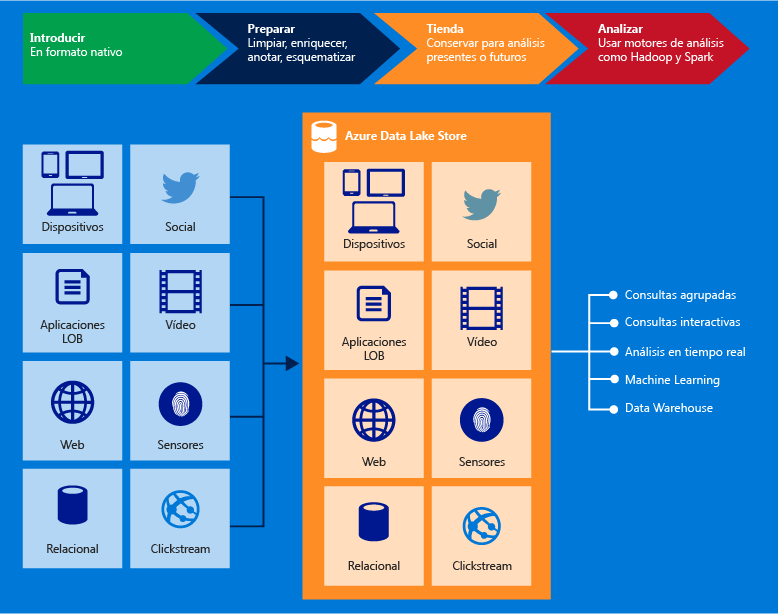

# Información general del Almacén de Azure Data Lake
El Almacén de Azure Data Lake es un repositorio de gran escala en toda la empresa para cargas de trabajo de análisis de macrodatos. Azure Data Lake permite capturar datos de cualquier tamaño, tipo y velocidad de ingesta en un único lugar para realizar análisis exploratorios y operativos.

> [!TIP]
> Use la [vía de aprendizaje del Almacén de Data Lake](https://azure.microsoft.com/documentation/learning-paths/data-lake-store-self-guided-training/) para empezar a explorar el servicio Almacén de Azure Data Lake.
> 
> 

Se puede acceder al Almacén de Azure Data Lake desde Hadoop (disponible con el clúster de HDInsight) mediante las API de REST compatibles con WebHDFS. Está diseñado específicamente para habilitar el análisis de los datos almacenados y está optimizado para el rendimiento en escenarios de análisis de datos. De forma inmediata, incluye todas las capacidades de nivel empresarial –seguridad, facilidad de administración, escalabilidad, confiabilidad y disponibilidad– esenciales para los casos de uso empresariales reales.

Entre las capacidades clave de Azure Data Lake, se incluyen las siguientes.

### Creado para Hadoop
El Almacén de Azure Data Lake es un sistema de archivos de Apache Hadoop compatible con el Sistema de archivos distribuido de Hadoop (HDFS) que funciona con el ecosistema de Hadoop.  Las aplicaciones o los servicios de HDInsight existentes que usen la API de WebHDFS se pueden integrar fácilmente con el Almacén de Data Lake. Además, el Almacén de Data Lake expone una interfaz de REST compatible con WebHDFS para aplicaciones.

Los datos almacenados en el Almacén de Data Lake se pueden analizar fácilmente mediante marcos analíticos de Hadoop como MapReduce o Hive. Los clústeres de Microsoft Azure HDInsight se pueden aprovisionar y configurar para que accedan directamente a datos almacenados en Data Lake Store.

### Almacenamiento ilimitado, archivos de petabytes de tamaño
El Almacén de Azure Data Lake proporciona almacenamiento ilimitado y es adecuado para almacenar diversos datos para análisis. No se impone ningún límite al tamaño de cuenta, el tamaño de archivo o la cantidad de datos que se pueden almacenar en un Data Lake. El tamaño de los archivos individuales puede oscilar entre kilobytes y petabytes, por lo que es una buena opción para almacenar cualquier tipo de datos. Los datos se almacenan de forma duradera mediante la realización de varias copias y no hay ningún límite al período de tiempo durante el que se pueden almacenar los datos en Data Lake.

### Rendimiento optimizado para el análisis de macrodatos
El Almacén de Azure Data Lake se creó para ejecutar sistemas de análisis a gran escala que requieren un procesamiento masivo con el fin de consultar y analizar grandes cantidades de datos. Data Lake distribuye partes de un archivo entre varios servidores de almacenamiento individuales. Esto mejora el rendimiento de lectura cuando se lee el archivo en paralelo para realizar análisis de datos.

### Listo para la empresa: Alta disponibilidad y seguridad
El Almacén de Azure Data Lake proporciona confiabilidad y disponibilidad estándar del sector. Los recursos de datos se almacenan de forma duradera realizando copias redundantes para protegerse ante los errores inesperados. Las empresas pueden usar Azure Data Lake en sus soluciones como parte importante de su plataforma de datos existente.

Además, el Almacén de Data Lake también proporciona seguridad de nivel empresarial para los datos almacenados. Para obtener más información, consulte [Protección de los datos almacenados en el Almacén de Azure Data Lake](#DataLakeStoreSecurity).

### Todos los datos
El Almacén de Azure Data Lake puede almacenar cualquier dato en su formato nativo, tal cual, sin necesidad de transformarlo antes. El Almacén de Data Lake no requiere la definición de un esquema antes de que se carguen los datos, sino que deja que cada marco analítico interprete los datos y defina un esquema en el momento del análisis. La capacidad de almacenar archivos de formatos y tamaños arbitrarios hace posible que el Almacén de Data Lake administre datos estructurados, semiestructurados y no estructurados.

Los contenedores de datos de Almacén de Azure Data Lake son básicamente carpetas y archivos. Se opera en los datos almacenados mediante los SDK, Azure Portal y Azure Powershell. Siempre que ponga los datos en el almacén mediante estas interfaces y los contenedores adecuados, puede almacenar cualquier tipo de datos. Almacén de Data Lake no realiza ningún control especial de datos según el tipo de datos que almacena.

## Protección de los datos en el Almacén de Azure Data Lake
El Almacén de Azure Data Lake usa Azure Active Directory para la autenticación y listas de control de acceso (ACL) para administrar el acceso a los datos.

| Característica | DESCRIPCIÓN |
| --- | --- |
| Autenticación |El Almacén de Azure Data Lake se integra con Azure Active Directory (AAD) para la administración de identidad y acceso para todos los datos almacenados en el Almacén de Azure Data Lake. Como resultado de la integración, Azure Data Lake se beneficia de todas las características de AAD, lo que incluye la autenticación multifactor, el acceso condicional, el control de acceso basado en roles, la supervisión del uso de aplicaciones, la supervisión y las alertas de seguridad, etc. El Almacén de Azure Data Lake es compatible con el protocolo OAuth 2.0 para la autenticación en la interfaz de REST. Consulte el artículo sobre la [autenticación en Data Lake Store](data-lakes-store-authentication-using-azure-active-directory.md)|
| Control de acceso |El Almacén de Azure Data Lake proporciona control de acceso gracias a la compatibilidad con los permisos de estilo POSIX expuestos por el protocolo WebHDFS. En la versión preliminar pública de Data Lake Store (la versión actual), las ACL se pueden habilitar en la carpeta raíz, en las subcarpetas y en los archivos individuales. Para más información sobre cómo funcionan las ACL en el contexto de Data Lake Store, consulte [Control de acceso en Data Lake Store](data-lake-store-access-control.md). |
| Cifrado |Data Lake Store también proporciona el cifrado de los datos que se almacenan en la cuenta. Puede especificar la configuración de cifrado mientras crea una cuenta de Data Lake Store. Puede elegir si cifrar o no los datos. Para más información, consulte el artículo de [cifrado Data Lake Store](data-lake-store-encryption.md). Para instrucciones sobre cómo proporcionar una configuración relacionada con el cifrado, consulte [Introducción al uso de Azure Portal por parte de Azure Data Lake Store](data-lake-store-get-started-portal.md). |

Si desea más información acerca cómo proteger los datos del Almacén de Data Lake, siga estos vínculos.

* Para obtener instrucciones sobre cómo proteger datos en el Almacén de Data Lake, consulte [Protección de los datos almacenados en el Almacén de Azure Data Lake](data-lake-store-secure-data.md).
* ¿Prefiere vídeos? [Vea este vídeo](https://mix.office.com/watch/1q2mgzh9nn5lx) sobre cómo proteger los datos almacenados en el Almacén de Data Lake.

## Aplicaciones compatibles con el Almacén de Azure Data Lake
El Almacén de Azure Data Lake es compatible con la mayor parte de los componentes de código abierto del ecosistema de Hadoop. También se integra perfectamente con otros servicios de Azure. Por ello, Almacén de Data Lake es una opción perfecta para sus necesidades de almacenamiento de datos. Para más información acerca de cómo se puede usar Almacén de Data Lake tanto con componentes de código abierto, así como otros servicios de Azure siga estos vínculos.

* Consulte [Abrir aplicaciones Big Data de origen que funcionan con el Almacén de Azure Data Lake](data-lake-store-compatible-oss-other-applications.md) para obtener una lista de aplicaciones de código abierto interoperables con el Almacén de Azure Data Lake.
* Consulte la página sobre la [integración con otros servicios de Azure](data-lake-store-integrate-with-other-services.md) para entender cómo el Almacén de Data Lake puede usarse con otros servicios de Azure para hacer posible una gama más amplia de escenarios.
* Consulte [Escenarios de datos que implican el Almacén de Azure Data Lake](data-lake-store-data-scenarios.md) para obtener información acerca de cómo usar Almacén de Data Lake en escenarios como la ingesta de datos, el procesamiento de datos, la descarga de datos y la visualización de datos.

## ¿Qué es el sistema de archivos de Azure Data Lake Store file system (adl://)?
En entornos de Hadoop (disponibles con el clúster de HDInsight), se puede acceder a Data Lake Store a través el nuevo sistema de archivos, AzureDataLakeFilesystem (adl://). Las aplicaciones y los servicios que usan adl:// pueden aprovechar aún más la optimización del rendimiento que no está actualmente disponible en WebHDFS. Como resultado, el Almacén de Data Lake ofrece la flexibilidad de elegir entre disponer del mejor rendimiento con la opción recomendada que usa adl:// o mantener el código existente usando la API de WebHDFS directamente. HDInsight de Azure aprovecha completamente AzureDataLakeFilesystem para proporcionar el mejor rendimiento en el Almacén de Data Lake.

Puede acceder a los datos en el Almacén de Data Lake mediante `adl://<data_lake_store_name>.azuredatalakestore.net`. Para obtener más información sobre cómo acceder a los datos del Almacén de Data Lake, consulte [Propiedades y acciones disponibles en los datos almacenados](data-lake-store-get-started-portal.md#properties)

## ¿Cómo comenzar a usar el Almacén de Azure Data Lake?
Consulte [Introducción a Azure Data Lake Store mediante Azure Portal](data-lake-store-get-started-portal.md)para saber cómo aprovisionar un almacén de Data Lake Store mediante Azure Portal. Una vez que aprovisione Azure Data Lake, puede aprender a usar productos de macrodatos tales como Análisis de Azure Data Lake o HDInsight de Azure con el Almacén de Data Lake. También puede crear una aplicación .NET para crear una cuenta de Almacén de Azure Data Lake y realizar operaciones como cargar datos, descargar datos, etc.

* [Tutorial: Introducción a Análisis de Azure Data Lake mediante el Portal de vista previa de Azure](../data-lake-analytics/data-lake-analytics-get-started-portal.md)
* [Uso de HDInsight de Azure con el Almacén de Data Lake](data-lake-store-hdinsight-hadoop-use-portal.md)
* [Introducción al Almacén de Azure Data Lake mediante SDK de .NET](data-lake-store-get-started-net-sdk.md)

## Vídeos de Almacén de Data Lake
Si prefiere ver vídeos para obtener información, Almacén de Data Lake proporciona vídeos sobre varias características.

* [Create an Azure Data Lake Store Account (Creación de una cuenta de Almacén de Azure Data Lake)](https://mix.office.com/watch/1k1cycy4l4gen)
* [Use the Data Explorer to Manage Data in Azure Data Lake Store (Uso del explorador de datos para administrar datos en Almacén de Azure Data Lake)](https://mix.office.com/watch/icletrxrh6pc)
* [Connect Azure Data Lake Analytics to Azure Data Lake Store (Conexión de Análisis de Azure Data Lake con Almacén de Data Lake)](https://mix.office.com/watch/qwji0dc9rx9k)
* [Access Azure Data Lake Store via Data Lake Analytics (Acceso a Almacén de Azure Data Lake a través de Análisis de Azure Data Lake)](https://mix.office.com/watch/1n0s45up381a8)
* [Connect Azure HDInsight to Azure Data Lake Store (Conexión de HDInsight de Azure con Almacén de Azure Data Lake)](https://mix.office.com/watch/l93xri2yhtp2)
* [Access Azure Data Lake Store via Hive and Pig (Acceso a Almacén de Azure Data Lake con Análisis a través de Hive and Pig)](https://mix.office.com/watch/1n9g5w0fiqv1q)
* [Use DistCp (Hadoop Distributed Copy) to copy data to and from Azure Data Lake Store (Uso de DistCp (Hadoop Distributed Copy) para copiar datos a Almacén de Azure Data Lake, y desde él)](https://mix.office.com/watch/1liuojvdx6sie)
* [Use Apache Sqoop to move data between relational sources and Azure Data Lake Store (Uso de Apache Sqoop para mover datos entre orígenes relacionales y el Almacén de Azure Data Lake)](https://mix.office.com/watch/1butcdjxmu114)
* [Data Orchestration using Azure Data Factory for Azure Data Lake Store (Orquestación de datos mediante Azure Data Factory para el Almacén de Azure Data Lake)](https://mix.office.com/watch/1oa7le7t2u4ka)
* [Securing Data in the Azure Data Lake Store (Protección de datos en el Almacén de Azure Data Lake)](https://mix.office.com/watch/1q2mgzh9nn5lx)

