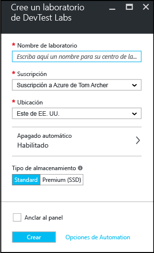

# Creación de un laboratorio con Laboratorios de desarrollo y pruebas de Azure
En Azure Dev/Test Labs, un laboratorio es la infraestructura que abarca un grupo de recursos, como máquinas virtuales (VM), que permite una mejor administración de dichos recursos mediante la especificación de límites y cuotas. Este artículo le guiará a través del proceso de creación de un laboratorio mediante Azure Portal.

## requisitos previos
Para crear un laboratorio necesitará:

* Una suscripción de Azure. Para información sobre las opciones de compra de Azure, consulte [Instrucciones para contratar Azure](https://azure.microsoft.com/pricing/purchase-options/) o [Evaluación gratuita de un mes](https://azure.microsoft.com/pricing/free-trial/). Debe ser el propietario de la suscripción para crear el laboratorio.

## Pasos para crear un laboratorio con Azure DevTest Labs
Los pasos siguientes muestran cómo usar Azure Portal para crear un laboratorio en Azure DevTest Labs. 

1. Inicie sesión en el [Azure Portal](http://go.microsoft.com/fwlink/p/?LinkID=525040).
1. En el menú principal de la izquierda, seleccione **Más servicios** (en la parte inferior de la lista).

    

1. En la lista de servicios disponibles, **DevTest Labs**.
1. En el área **DevTest Labs**, seleccione **Agregar**.
   
    

1. En **Crear un laboratorio de desarrollo y pruebas**:
   
    1. Escriba un **Nombre de laboratorio** para el nuevo laboratorio.
    2. Seleccione una **suscripción** para asociar al laboratorio.
    3. Seleccione una **Ubicación** en la que se va a almacenar el laboratorio.
    4. Seleccione **Apagado automático** para especificar si desea habilitar y definir los parámetros para el cierre automático de todas las máquinas virtuales del laboratorio. La característica de apagado automático es principalmente una característica de ahorro de costos por la que puede especificar cuándo desea que la máquina virtual se apague automáticamente. Para cambiar la configuración del apagado automático después de crear el laboratorio, siga los pasos que se describen en el artículo [Administración de todas las directivas para un laboratorio de Azure DevTest Labs](./devtest-lab-set-lab-policy.md#set-auto-shutdown).
    1. Escriba la información de **NOMBRE** y **VALOR** en las **Etiquetas**, si desea crear un etiquetado personalizado que se agregue a cada recurso que vaya a crear en el laboratorio. Las etiquetas son útiles para ayudarle a administrar y organizar los recursos del laboratorio por categoría. Para más información acerca de las etiquetas, incluido cómo agregar etiquetas después de crear el laboratorio, consulte [Incorporación de etiquetas a un laboratorio](devtest-lab-add-tag.md).
    5. Seleccione **Anclar al panel** si desea que un acceso directo al laboratorio aparezca en el panel del portal.
    6. Seleccione **Opciones de automatización** para obtener plantillas de Azure Resource Manager para la automatización de la configuración. 
    7. Seleccione **Crear**. Para supervisar el estado del proceso de creación de un laboratorio, inspeccione el área **Notificaciones**. Una vez completado, actualice la página para ver el laboratorio recién creado en la lista de laboratorios.  
    
    

[!INCLUDE [devtest-lab-try-it-out](../../includes/devtest-lab-try-it-out.md)]

## pasos siguientes
Una vez creado el laboratorio, le presentamos algunos pasos que se deben tener en cuenta:

* [Acceso seguro a un laboratorio](devtest-lab-add-devtest-user.md)
* [Definición de directivas de laboratorio](devtest-lab-set-lab-policy.md)
* [Creación de una plantilla de laboratorio](devtest-lab-create-template.md)
* [Creación de artefactos personalizados para máquinas virtuales](devtest-lab-artifact-author.md)
* [Adición de una máquina virtual a un laboratorio](devtest-lab-add-vm.md)

