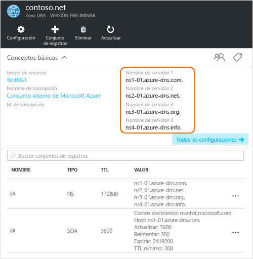

# <a name="delegate-a-domain-to-azure-dns"></a>Delegación de un dominio en DNS de Azure

DNS de Azure le permite hospedar una zona DNS y administrar los registros DNS de un dominio en Azure. Para que las consultas DNS de un dominio lleguen a DNS de Azure, es necesario haber delegado dicho dominio en DNS de Azure desde el dominio primario. Tenga en cuenta que DNS de Azure no es el registrador de dominios. En este artículo se explica cómo delegar el dominio a Azure DNS.

Si se trata de dominios adquiridos a un registrador, este último ofrecerá la opción de configurar tales registros NS. No tiene que poseer un nombre de dominio para crear una zona DNS con dicho nombre de dominio en Azure DNS. No obstante, sí necesita disponer de un dominio para configurar la delegación en DNS de Azure con un registrador.

Por ejemplo, supongamos que adquiere el dominio “contoso.net” y que crea una zona con el nombre “contoso.net” en Azure DNS. Como propietario del dominio, el registrador le ofrecerá la opción de configurar las direcciones del servidor de nombres (es decir, los registros NS) para el dominio. El registrador almacena estos registros NS en el dominio primario, en este caso, “.net”. A los clientes de todo el mundo se les remitirá entonces al dominio en cuestión en la zona DNS de Azure al tratar de resolver registros DNS en “contoso.net”.

## <a name="create-a-dns-zone"></a>Creación de una zona DNS

1. Inicie sesión en el Portal de Azure.
1. En el menú Concentrador, haga clic en **Nuevo > Redes >** y, luego, en **Zona DNS** para abrir la hoja Crear zona DNS.

    

1. En la hoja **Crear zona DNS**, escriba los valores siguientes y haga clic en **Crear**:

   | **Configuración** | **Valor** | **Detalles** |
   |---|---|---|
   |**Name**|contoso.net|El nombre de la zona DNS|
   |**Suscripción**|[Su suscripción]|Seleccione una suscripción donde se va a crear la puerta de enlace de la aplicación.|
   |**Grupos de recursos**|**Crear nuevo:** contosoRG|Cree un grupo de recursos. El nombre del grupo de recursos debe ser único dentro de la suscripción seleccionada. Para más información sobre los grupos de recursos, lea el artículo [Información general de Azure Resource Manager](../azure-resource-manager/resource-group-overview.md?toc=%2fazure%2fdns%2ftoc.json#resource-groups).|
   |**Ubicación**|Oeste de EE. UU.||

> [!NOTE]
> El grupo de recursos se refiere a la ubicación del grupo de recursos y no tiene efecto alguno sobre la zona DNS. La ubicación de la zona DNS siempre es "global" y no se muestra.

## <a name="retrieve-name-servers"></a>Recuperación de los servidores de nombres

Antes de poder delegar la zona DNS a DNS de Azure, primero debe conocer los nombres del servidor de nombres de la zona. El DNS de Azure asigna los servidores de nombres de un grupo cada vez que se crea una zona.

1. Con la zona DNS creada, en el panel **Favoritos** de Azure Portal, haga clic en **Todos los recursos**. Haga clic en la zona DNS **contoso.net** en la hoja **Todos los recursos**. Si la suscripción que seleccionó ya tiene varios recursos en ella, puede escribir **contoso.net** en el cuadro Filtrar por nombre… para acceder fácilmente a la puerta de enlace de la aplicación. 

1. Recupere los servidores de nombres en la hoja Zona DNS. En este ejemplo, a la zona “contoso.net” se le han asignado los servidores de nombres “ns1-01.azure-dns.com”, “ns2-01.azure-dns.net”, “ns3-01.azure-dns.org” y “ns4-01.azure-dns.info”’:

 

El DNS de Azure crea automáticamente los registros NS autoritativos en la zona que contiene los servidores de nombres asignados.  Para ver los nombres del servidor de nombres mediante Azure PowerShell o CLI de Azure, simplemente necesita recuperar estos registros.

Los siguientes ejemplos también proporcionan los pasos para recuperar los servidores de nombres para una zona de Azure DNS con PowerShell y la CLI de Azure.

### <a name="powershell"></a>PowerShell

```powershell
# The record name "@" is used to refer to records at the top of the zone.
$zone = Get-AzureRmDnsZone -Name contoso.net -ResourceGroupName contosoRG
Get-AzureRmDnsRecordSet -Name "@" -RecordType NS -Zone $zone
```

El ejemplo siguiente es la respuesta.

```
Name              : @
ZoneName          : contoso.net
ResourceGroupName : contosorg
Ttl               : 172800
Etag              : 03bff8f1-9c60-4a9b-ad9d-ac97366ee4d5
RecordType        : NS
Records           : {ns1-07.azure-dns.com., ns2-07.azure-dns.net., ns3-07.azure-dns.org.,
                    ns4-07.azure-dns.info.}
Metadata          :
```

### <a name="azure-cli"></a>CLI de Azure

```azurecli
az network dns record-set show --resource-group contosoRG --zone-name contoso.net --type NS --name @
```

El ejemplo siguiente es la respuesta.

```json
{
  "etag": "03bff8f1-9c60-4a9b-ad9d-ac97366ee4d5",
  "id": "/subscriptions/00000000-0000-0000-0000-000000000000/resourceGroups/contosoRG/providers/Microsoft.Network/dnszones/contoso.net/NS/@",
  "metadata": null,
  "name": "@",
  "nsRecords": [
    {
      "nsdname": "ns1-07.azure-dns.com."
    },
    {
      "nsdname": "ns2-07.azure-dns.net."
    },
    {
      "nsdname": "ns3-07.azure-dns.org."
    },
    {
      "nsdname": "ns4-07.azure-dns.info."
    }
  ],
  "resourceGroup": "contosoRG",
  "ttl": 172800,
  "type": "Microsoft.Network/dnszones/NS"
}
```

## <a name="delegate-the-domain"></a>Delegación del dominio

Ahora que se crea la zona DNS y que tiene los servidores de nombres, el dominio primario debe actualizarse con los servidores de nombres de Azure DNS. Cada registrador dispone de sus propias herramientas de administración de DNS para cambiar los registros de servidores de nombres de un dominio. En la página de administración de DNS del registrador, edite los registros NS y reemplácelos con los que DNS de Azure ha creado.

Al delegar un dominio a DNS de Azure, debe usar los nombres de servidor DNS proporcionados por DNS de Azure. Es recomendable usar siempre los cuatro nombres de servidor de nombres, independientemente del nombre de su dominio. La delegación de dominios no requiere que el nombre del servidor de nombres use el mismo dominio de primer nivel que su dominio.

No debe usar 'registros de adherencia' para apuntar a direcciones IP del servidor DNS de Azure, ya que estas direcciones IP pueden cambiar en el futuro. Las delegaciones que usan nombres de servidor en su propia zona (a veces denominados "servidores DNS personalizados") no se admiten de momento en DNS de Azure.

## <a name="verify-name-resolution-is-working"></a>Comprobación del funcionamiento de la resolución de nombres

Cuando finalice la delegación, puede verificar que la resolución de nombres funciona usando una herramienta como “nslookup” para consultar el registro SOA para su zona (que también se crea automáticamente cuando se crea la zona).

No es necesario especificar los servidores de nombres DNS de Azure, ya que el proceso de resolución DNS normal encontrará los servidores de nombres automáticamente si la delegación se ha configurado correctamente.

```
nslookup -type=SOA contoso.com
```

Lo siguiente es una respuesta de ejemplo del comando anterior:

```
Server: ns1-04.azure-dns.com
Address: 208.76.47.4

contoso.com
primary name server = ns1-04.azure-dns.com
responsible mail addr = msnhst.microsoft.com
serial = 1
refresh = 900 (15 mins)
retry = 300 (5 mins)
expire = 604800 (7 days)
default TTL = 300 (5 mins)
```

## <a name="delegate-sub-domains-in-azure-dns"></a>Delegación de subdominios en Azure DNS

Si desea configurar una zona secundaria independiente, puede delegar un subdominio en DNS de Azure. Por ejemplo, después de configurar y delegar "contoso.net" en Azure DNS, suponga que desea configurar una zona secundaria independiente, "partners.contoso.net".

1. Cree la zona secundaria "partners.contoso.net" en Azure DNS.
2. Busque los registros NS autoritativos en la zona secundaria para obtener los servidores de nombres que hospedan la zona secundaria en DNS de Azure.
3. Delegue la zona secundaria mediante la configuración de los registros NS de la zona principal que apuntan a la zona secundaria.

### <a name="create-a-dns-zone"></a>Creación de una zona DNS

1. Inicie sesión en el Portal de Azure.
1. En el menú Concentrador, haga clic en **Nuevo > Redes >** y, luego, en **Zona DNS** para abrir la hoja Crear zona DNS.

    

1. En la hoja **Crear zona DNS**, escriba los valores siguientes y haga clic en **Crear**:

   | **Configuración** | **Valor** | **Detalles** |
   |---|---|---|
   |**Name**|partners.contoso.net|El nombre de la zona DNS|
   |**Suscripción**|[Su suscripción]|Seleccione una suscripción donde se va a crear la puerta de enlace de la aplicación.|
   |**Grupos de recursos**|**Usar existente:** contosoRG|Cree un grupo de recursos. El nombre del grupo de recursos debe ser único dentro de la suscripción seleccionada. Para más información sobre los grupos de recursos, lea el artículo [Información general de Azure Resource Manager](../azure-resource-manager/resource-group-overview.md?toc=%2fazure%2fdns%2ftoc.json#resource-groups).|
   |**Ubicación**|Oeste de EE. UU.||

> [!NOTE]
> El grupo de recursos se refiere a la ubicación del grupo de recursos y no tiene efecto alguno sobre la zona DNS. La ubicación de la zona DNS siempre es "global" y no se muestra.

### <a name="retrieve-name-servers"></a>Recuperación de los servidores de nombres

1. Con la zona DNS creada, en el panel **Favoritos** de Azure Portal, haga clic en **Todos los recursos**. Haga clic en la zona DNS **partners.contoso.net** en la hoja **Todos los recursos**. Si la suscripción que seleccionó ya tiene varios recursos en ella, puede escribir **partners.contoso.net** en el cuadro Filtrar por nombre… para acceder fácilmente a la zona DNS.

1. Recupere los servidores de nombres en la hoja Zona DNS. En este ejemplo, a la zona “contoso.net” se le han asignado los servidores de nombres “ns1-01.azure-dns.com”, “ns2-01.azure-dns.net”, “ns3-01.azure-dns.org” y “ns4-01.azure-dns.info”’:

 

El DNS de Azure crea automáticamente los registros NS autoritativos en la zona que contiene los servidores de nombres asignados.  Para ver los nombres del servidor de nombres mediante Azure PowerShell o CLI de Azure, simplemente necesita recuperar estos registros.

### <a name="create-name-server-record-in-parent-zone"></a>Creación de un registro de servidor de nombres en la zona primaria

1. Navegue hasta la zona DNS **contoso.net** en Azure Portal.
1. Haga clic en **+ Conjunto de registros**.
1. En la hoja **Agregar conjunto de registros**, escriba los valores siguientes y haga clic en **Aceptar**:

   | **Configuración** | **Valor** | **Detalles** |
   |---|---|---|
   |**Name**|asociados|El nombre de la zona DNS secundaria|
   |**Tipo**|NS|Utilice NS para los registros del servidor de nombres.|
   |**TTL**|1|Período de vida.|
   |**Unidad de TTL**|Horas|establece la unidad de período de vida en horas|
   |**SERVIDOR DE NOMBRES**|{servidores de nombres de la zona partners.contoso.net}|Escriba los cuatro servidores de nombres en la zona partners.contoso.net. |

   


### <a name="delegating-sub-domains-in-azure-dns-with-other-tools"></a>Delegación de subdominios en Azure DNS con otras herramientas

En los ejemplos siguientes se proporcionan los pasos para delegar subdominios en Azure DNS con PowerShell y la CLI:

#### <a name="powershell"></a>PowerShell

En el siguiente ejemplo de PowerShell se muestra cómo funciona. Los mismos pasos se pueden ejecutar mediante Azure Portal o mediante la CLI de Azure multiplataforma.

```powershell
# Create the parent and child zones. These can be in same resource group or different resource groups as Azure DNS is a global service.
$parent = New-AzureRmDnsZone -Name contoso.net -ResourceGroupName contosoRG
$child = New-AzureRmDnsZone -Name partners.contoso.net -ResourceGroupName contosoRG

# Retrieve the authoritative NS records from the child zone as shown in the next example. This contains the name servers assigned to the child zone.
$child_ns_recordset = Get-AzureRmDnsRecordSet -Zone $child -Name "@" -RecordType NS

# Create the corresponding NS record set in the parent zone to complete the delegation. The record set name in the parent zone matches the child zone name, in this case "partners".
$parent_ns_recordset = New-AzureRmDnsRecordSet -Zone $parent -Name "partners" -RecordType NS -Ttl 3600
$parent_ns_recordset.Records = $child_ns_recordset.Records
Set-AzureRmDnsRecordSet -RecordSet $parent_ns_recordset
```

Utilice `nslookup` para comprobar que todo está configurado correctamente mirando el registro SOA de la zona secundaria.

```
nslookup -type=SOA partners.contoso.com
```

```
Server: ns1-08.azure-dns.com
Address: 208.76.47.8

partners.contoso.com
    primary name server = ns1-08.azure-dns.com
    responsible mail addr = msnhst.microsoft.com
    serial = 1
    refresh = 900 (15 mins)
    retry = 300 (5 mins)
    expire = 604800 (7 days)
    default TTL = 300 (5 mins)
```

#### <a name="azure-cli"></a>CLI de Azure

```azurecli
#!/bin/bash

# Create the parent and child zones. These can be in same resource group or different resource groups as Azure DNS is a global service.
az network dns zone create -g contosoRG -n contoso.net
az network dns zone create -g contosoRG -n partners.contoso.net
```

Recupere los servidores de nombres para la zona `partners.contoso.net` desde la salida.

```
{
  "etag": "00000003-0000-0000-418f-250de2b2d201",
  "id": "/subscriptions/00000000-0000-0000-0000-000000000000/resourceGroups/contosorg/providers/Microsoft.Network/dnszones/partners.contoso.net",
  "location": "global",
  "maxNumberOfRecordSets": 5000,
  "name": "partners.contoso.net",
  "nameServers": [
    "ns1-09.azure-dns.com.",
    "ns2-09.azure-dns.net.",
    "ns3-09.azure-dns.org.",
    "ns4-09.azure-dns.info."
  ],
  "numberOfRecordSets": 2,
  "resourceGroup": "contosorg",
  "tags": {},
  "type": "Microsoft.Network/dnszones"
}
```

Cree el conjunto de registros y los registros NS para cada servidor de nombres.

```azurecli
#!/bin/bash

# Create the record set
az network dns record-set ns create --resource-group contosorg --zone-name contoso.net --name partners

# Create a ns record for each name server.
az network dns record-set ns add-record --resource-group contosorg --zone-name contoso.net --record-set-name partners --nsdname ns1-09.azure-dns.com.
az network dns record-set ns add-record --resource-group contosorg --zone-name contoso.net --record-set-name partners --nsdname ns2-09.azure-dns.net.
az network dns record-set ns add-record --resource-group contosorg --zone-name contoso.net --record-set-name partners --nsdname ns3-09.azure-dns.org.
az network dns record-set ns add-record --resource-group contosorg --zone-name contoso.net --record-set-name partners --nsdname ns4-09.azure-dns.info.
```

## <a name="delete-all-resources"></a>Eliminación de todos los recursos

Para eliminar todos los recursos creados en este artículo, complete los pasos siguientes:

1. En el panel **Favoritos** de Azure Portal, haga clic en **Todos los recursos**. Haga clic en el grupo de recursos **contosorg** en la hoja Todos los recursos. Si la suscripción que seleccionó ya tiene varios recursos en ella, puede escribir **contosorg** en el cuadro **Filtrar por nombre** para acceder fácilmente al grupo de recursos.
1. En la hoja **contosorg**, haga clic en el botón **Eliminar**.
1. El portal requiere que escriba el nombre del grupo de recursos para confirmar que desea eliminarlo. Escriba *contosorg* como nombre de grupo de recursos y haga clic en **Eliminar**. Al eliminarse un grupo de recursos, se eliminan todos los recursos que contiene, por lo que siempre debe asegurarse de comprobar su contenido antes de eliminarlo. El portal elimina todos los recursos incluidos en el grupo de recursos y, después, el grupo de recursos en sí. Este proceso tarda varios minutos.

## <a name="next-steps"></a>Pasos siguientes

[Administración de zonas DNS](dns-operations-dnszones.md)

[Administración de registros DNS](dns-operations-recordsets.md)
