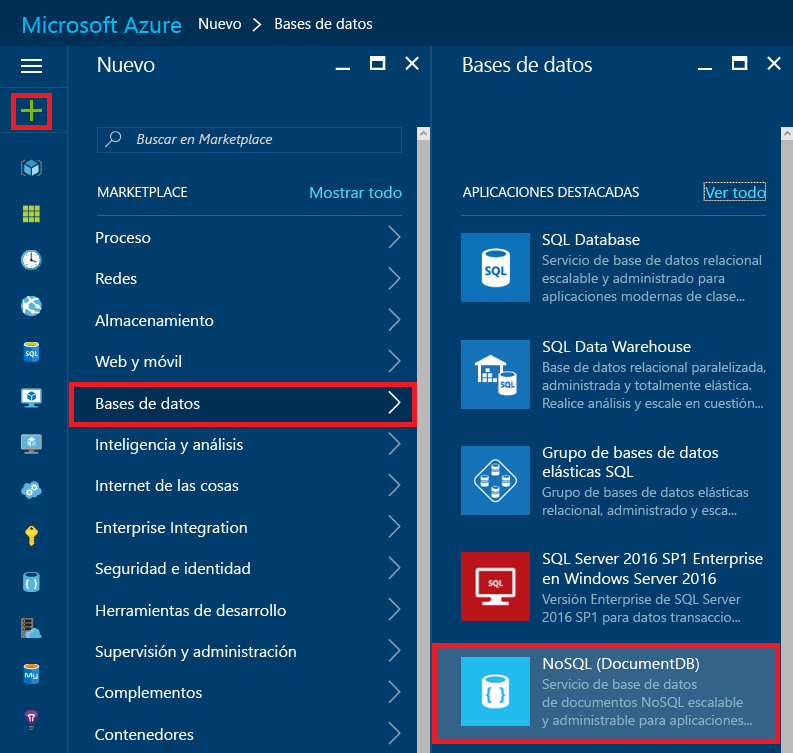
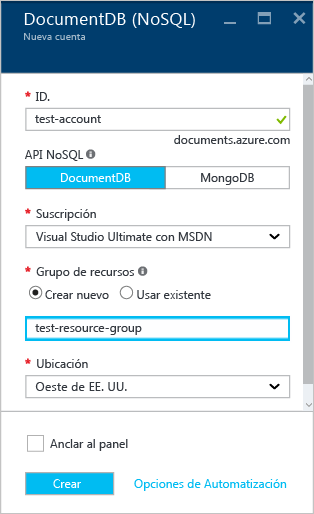
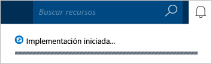
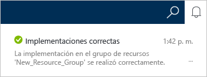
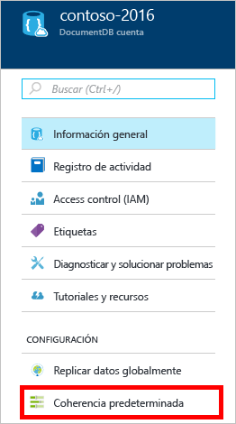
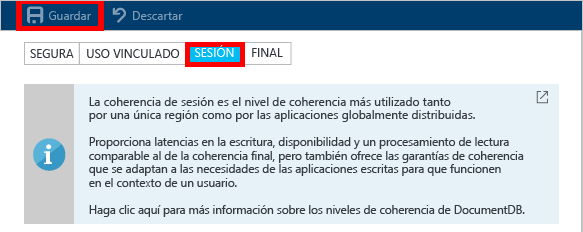

<properties
	pageTitle="Creación de una cuenta de DocumentDB | Microsoft Azure"
	description="Creación de una base de datos NoSQL con Azure DocumentDB. Siga estas instrucciones para crear una cuenta de DocumentDB y empezar a crear una base de datos NoSQL rápida y global." 
	keywords="generar una base de datos"
	services="documentdb"
	documentationCenter=""
	authors="mimig1"
	manager="jhubbard"
	editor="monicar"/>

<tags
	ms.service="documentdb"
	ms.workload="data-services"
	ms.tgt_pltfrm="na"
	ms.devlang="na"
	ms.topic="get-started-article"
	ms.date="09/12/2016"
	ms.author="mimig"/>

# Creación de una cuenta de DocumentDB NoSQL mediante Azure Portal

> [AZURE.SELECTOR]
- [Azure Portal](documentdb-create-account.md)
- [CLI de Azure y Azure Resource Manager ](documentdb-automation-resource-manager-cli.md)

Para generar una base de datos con Microsoft Azure DocumentDB, debe:

- Tener una cuenta de Azure. Si no tiene ninguna, puede obtener una [cuenta gratuita de Azure](https://azure.microsoft.com/free).
- Crear una cuenta de DocumentDB.

Puede crear una cuenta de DocumentDB con Azure Portal, las plantillas de Azure Resource Manager o la interfaz de la línea de comandos (CLI) de Azure. En este artículo se muestra cómo crear una cuenta de DocumentDB con Azure Portal. Para crear una cuenta con Azure Resource Manager o la CLI de Azure, consulte el artículo sobre la [automatización de la creación de cuentas de bases de datos de DocumentDB](documentdb-automation-resource-manager-cli.md).

¿Es la primera vez que usa DocumentDB? Vea [este](https://azure.microsoft.com/documentation/videos/create-documentdb-on-azure/) vídeo de cuatro minutos de Scott Hanselman para saber cómo realizar las tareas más comunes en el portal en línea.

1.	Inicie sesión en [Azure Portal](https://portal.azure.com/).
2.	En la barra de salto, haga clic en **Nuevo**, en **Datos y almacenamiento** y en **DocumentDB (NoSQL)**.

	

3. En la hoja **Nueva cuenta**, especifique la configuración que desee para la cuenta de DocumentDB.

	

	- En el cuadro **Id.**, escriba un nombre para identificar la cuenta de DocumentDB. Cuando se valida el **identificador**, aparece una marca de verificación verde en el cuadro **Id.** El valor de **Id.** se convierte en el nombre de host dentro del URI. El **identificador** puede solo contener minúsculas, números y el carácter "-"; debe tener entre 3 y 50 caracteres. Tenga en cuenta que *documents.azure.com* se anexa al nombre del punto de conexión que elija, y su resultado se convierte en el punto de conexión de la cuenta de DocumentDB.

    - En el cuadro **NoSQL API** (API NoSQL), seleccione el modelo de programación para se usará:
        - **DocumentDB**: la API de DocumentDB está disponible mediante los [SDK](documentdb-sdk-dotnet.md) de .NET, Java, Node.js, Python y JavaScript, así como [REST](https://msdn.microsoft.com/library/azure/dn781481.aspx) de HTTP, y ofrece acceso mediante programación a toda la funcionalidad de DocumentDB.
       
        - **MongoDB**: DocumentDB también ofrece [compatibilidad de nivel de protocolo](documentdb-protocol-mongodb.md) con las API de **MongoDB**. Cuando elige la opción MongoDB API (API de MongoDB), puede usar las [herramientas](documentdb-mongodb-mongochef.md) y los SDK de MongoDB existentes para la comunicación con DocumentDB. También puede [mover](documentdb-import-data.md) sus aplicaciones de MongoDB existentes para usar DocumentDB, [sin necesidad de ningún cambio en el código](documentdb-connect-mongodb-account.md), y aprovechar las ventajas de una base de datos totalmente administrada como un servicio, con escala ilimitada, replicación global y otras funcionalidades.

	- En **Suscripción**, seleccione la suscripción a Azure que desea usar para la cuenta de DocumentDB. Si la cuenta tiene una sola suscripción, se selecciona esa cuenta de manera predeterminada.

	- En **Grupo de recursos**, seleccione o cree un grupo de recursos para la cuenta de DocumentDB. De forma predeterminada, se crea un grupo de recursos. Para más información, consulte el artículo sobre el [uso de Azure Portal para administrar los recursos de Azure](../articles/azure-portal/resource-group-portal.md).

	- Use **Ubicación** para especificar la ubicación geográfica en la que se hospedará la cuenta de DocumentDB.

4.	Una vez configuradas las opciones de la nueva cuenta de DocumentDB, haga clic en **Crear**. Para comprobar el estado de la implementación, consulte el centro de notificaciones.

	

	

5.	Después de crear la cuenta de DocumentDB, está listo para usarla con la configuración predeterminada. La coherencia predeterminada de la cuenta de DocumentDB está establecida en **Sesión**. Para ajustar la coherencia predeterminada, haga clic en **Coherencia predeterminada** en el menú de recursos. Para aprender más acerca de los niveles de coherencia que ofrece DocumentDB, consulte [Niveles de coherencia en DocumentDB](documentdb-consistency-levels.md).

    

    

[How to: Create a DocumentDB account]: #Howto
[Next steps]: #NextSteps
[documentdb-manage]: ../articles/documentdb/documentdb-manage.md

## Pasos siguientes

Ahora que tiene una cuenta de DocumentDB, el siguiente paso es crear una base de datos de DocumentDB.

Puede crear una base de datos con uno de los siguientes métodos:

- Azure Portal, tal como se describe en [Creación de una base de datos para DocumentDB mediante Azure Portal](documentdb-create-database.md).
- Los tutoriales integrales, que incluyen datos de ejemplo: [.NET](documentdb-get-started.md), [.NET MVC](documentdb-dotnet-application.md), [Java](documentdb-java-application.md), [Node.js](documentdb-nodejs-application.md) o [Python](documentdb-python-application.md).
- Los ejemplos de código de [.NET](documentdb-dotnet-samples.md#database-examples), [Node.js](documentdb-nodejs-samples.md#database-examples) o [Python](documentdb-python-samples.md#database-examples), disponibles en GitHub.
- Los SDK de [.NET](documentdb-sdk-dotnet.md), [Node.js](documentdb-sdk-node.md), [Java](documentdb-sdk-java.md), [Python](documentdb-sdk-python.md) y [REST](https://msdn.microsoft.com/library/azure/mt489072.aspx).

Después de crear la base de datos, es necesario [agregar una o más colecciones](documentdb-create-collection.md) a la base de datos y, después, [agregar documentos](documentdb-view-json-document-explorer.md) a las colecciones.

Cuando tenga documentos en una colección, puede usar [SQL de DocumentDB](documentdb-sql-query.md) para [ejecutar consultas](documentdb-sql-query.md#executing-queries) en los documentos. Puede ejecutar consultas mediante el [Explorador de consultas](documentdb-query-collections-query-explorer.md) en el portal, la [API de REST](https://msdn.microsoft.com/library/azure/dn781481.aspx) o uno de los [SDK](documentdb-sdk-dotnet.md).

### Más información

Para más información acerca de DocumentDB, consulte estos recursos:

-	[Ruta de aprendizaje de DocumentDB](https://azure.microsoft.com/documentation/learning-paths/documentdb/)
-	[Modelo jerárquico de recursos y conceptos de DocumentDB](documentdb-resources.md)

<!---HONumber=AcomDC_1005_2016-->