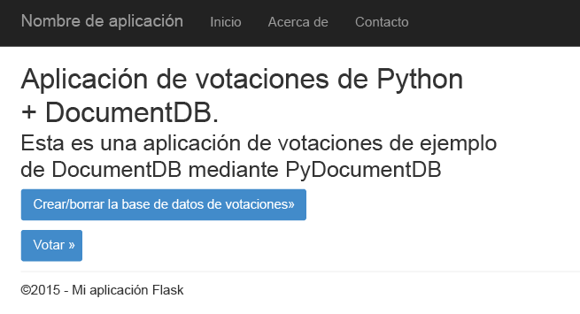
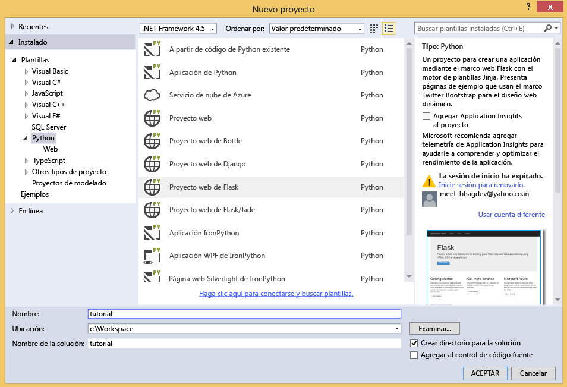
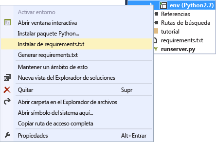
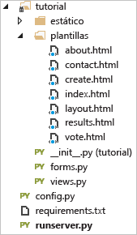
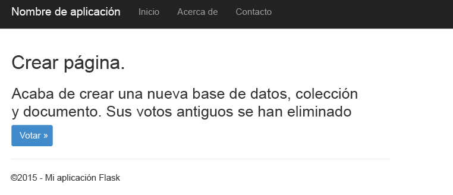
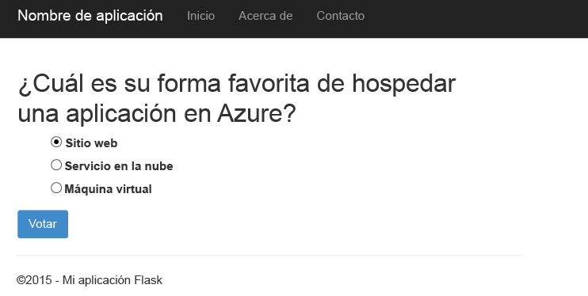
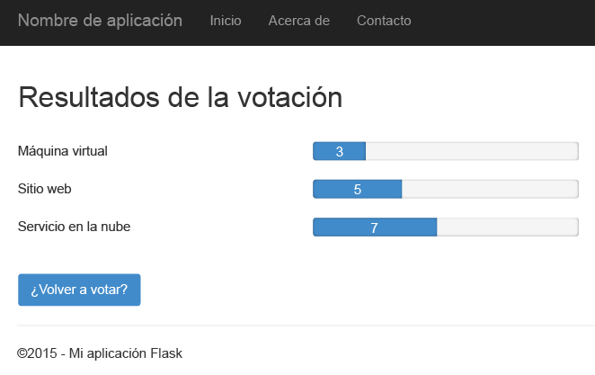
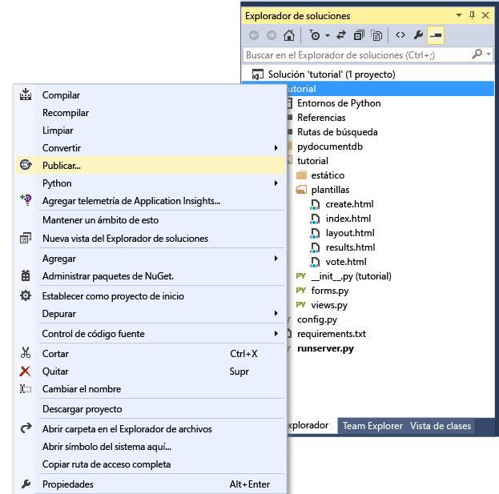
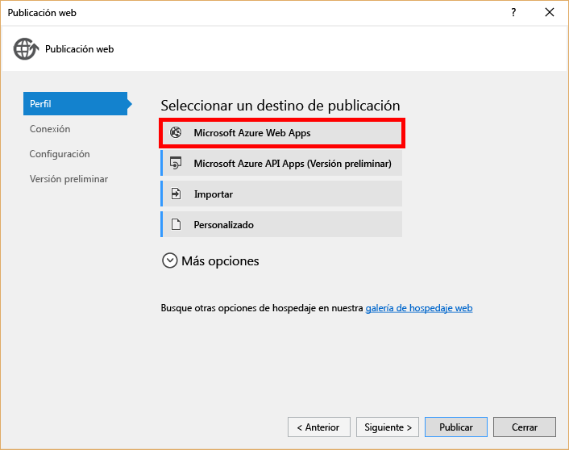

<properties
    pageTitle="Generación de una aplicación web con Python y Flask mediante DocumentDB | Microsoft Azure"
	description="Obtenga información acerca de cómo usar DocumentDB para almacenar y acceder a los datos de una aplicación web de Python y Flask (MVC) hospedada en Azure."
	services="documentdb"
	documentationCenter="python"
	authors="ryancrawcour"
	manager="jhubbard"
	editor="cgronlun"/>

<tags
    ms.service="documentdb"
	ms.workload="data-management"
	ms.tgt_pltfrm="na"
	ms.devlang="python"
	ms.topic="hero-article"
	ms.date="09/03/2015"
	ms.author="ryancraw"/>

# Generación de una aplicación web con Python y Flask (MVC) mediante la Base de datos de documentos

Para destacar la forma en que los clientes pueden aprovechar eficazmente Azure DocumentDB para almacenar y consultar documentos JSON, este documento proporciona un tutorial integral sobre la compilación de una aplicación web para votaciones mediante Azure DocumentDB.

En este tutorial aprenderá a usar el servicio DocumentDB que proporciona Azure para almacenar datos y obtener acceso a ellos desde cualquier aplicación web Phyton hospedada en Azure. En él se presupone que tiene experiencia previa en el uso de los sitios web de Phyton y Azure.

Esta tutorial abarca lo siguiente:

1. Crear y aprovisionar una cuenta de DocumentDB.
2. Crear una aplicación Phyton MVC.
3. Conectarse y utilizar DocumentDB desde su aplicación web.
4. Implementar la aplicación web en Sitios web Azure.

Siguiendo este tutorial, podrá compilar una aplicación de votación simple que le permita votar en un sondeo.

## Requisitos previos

Antes de seguir las instrucciones del presente artículo, debe asegurarse de tener instalados los siguientes elementos:

- [Visual Studio 2013](http://www.visualstudio.com/) o superior, o Visual Studio Express, que es la versión gratuita.
- Herramientas de Python para Visual Studio, que están disponibles [aquí][].
- Azure SDK para Visual Studio 2013, versión 2.4 o superior, disponible [aquí][1].
- Python 2.7, que se encuentra disponible [aquí][2].
- Compilador de Microsoft Visual C++ para Python 2.7, disponible [aquí][3].

## Paso 1: Creación de una cuenta de base de datos de DocumentDB

Comenzaremos por crear una cuenta de DocumentDB. Si ya tiene una cuenta, puede ir a [Paso 2: Creación de una nueva aplicación web de Python Flask](#Step-2:-Create-a-new-Python-Flask-Web-Application).

[AZURE.INCLUDE [documentdb-create-dbaccount](../../includes/documentdb-create-dbaccount.md)]

[AZURE.INCLUDE [documentdb-keys](../../includes/documentdb-keys.md)]

  Ahora veremos cómo crear una nueva aplicación web de Phyton Flask partiendo de cero.

## Paso 2: Creación de una nueva aplicación web de Phyton Flask

1. Abra Visual Studio, haga clic en **Archivo** -> **Nuevo proyecto** -> **Python** -> **Proyecto web de Flask** y cree un nuevo proyecto llamado **tutorial**.

	Para aquellos que desconozcan Flask: se trata de un marco web que nos ayuda a crear aplicaciones web en Python más rápido. [Haga clic aquí para obtener acceso a los tutoriales de Flask][].

	

2. Se le preguntará si desea instalar paquetes externos. Haga clic en **Instalar en un entorno virtual**. Use Python 2.7 como entorno de base, ya que PyDocumentDB no admite actualmente Python 3.x. Esto configurará el entorno virtual de Python requerido para el proyecto.

	

## Paso 3: Modificación de la aplicación web de Python Flask

### Adición de paquetes Flask a un proyecto

Después de que el proyecto esté configurado, es preciso agregar varios paquetes Flask que serán necesarios para el proyecto, entre los que se incluye pydocumentdb, el paquete de Python para DocumentDB.

1. Abra el archivo denominado **requirements.txt** y reemplace su contenido por lo siguiente:

    	flask==0.9
    	flask-mail==0.7.6
    	sqlalchemy==0.7.9
    	flask-sqlalchemy==0.16
    	sqlalchemy-migrate==0.7.2
    	flask-whooshalchemy==0.55a
    	flask-wtf==0.8.4
    	pytz==2013b
    	flask-babel==0.8
    	flup
    	pydocumentdb>=1.0.0

2. Haga clic con el botón derecho en **env** y haga clic en **Instalar desde requirements.txt**.

	

> [AZURE.NOTE]En casos excepcionales, es posible que aparezca un error en la ventana de salida. De ser así, compruebe si el error está relacionado con la limpieza. En ocasiones, se produce un error en la limpieza, pero la instalación se realiza correctamente (desplácese hacia arriba en la ventana de salida para comprobarlo).  Si esto, puede continuar.

### Comprobación del entorno virtual

Asegurémonos de que todo esté instalado correctamente.

- Inicie el sitio web, para lo que debe presionar **F5**. De este modo se ejecutará el servidor de desarrollo de Flask y el explorador web. Debe ver la página siguiente.

	

### Creación de definiciones de base de datos, colección y documento

Ahora vamos a crear la aplicación de voto.

- Agregue un archivo Python, para lo que debe hacer clic con el botón derecho en la carpeta denominada **tutorial** del Explorador de soluciones. Asigne al archivo el nombre **forms.py**.  

    	from flask.ext.wtf import Form
    	from wtforms import RadioField

    	class VoteForm(Form):
        	deploy_preference  = RadioField('Deployment Preference', choices=[
            	('Web Site', 'Web Site'),
            	('Cloud Service', 'Cloud Service'),
            	('Virtual Machine', 'Virtual Machine')], default='Web Site')

### Agregue las importaciones necesarias a views.py.

- Agregue las siguientes instrucciones import a la parte superior de **views.py**. Dichas instrucciones importarán los paquetes de PythonSDK y Flask de DocumentDB.

    	from forms import VoteForm
    	import config
    	import pydocumentdb.document_client as document_client

### Creación de base de datos, colección y documento

- Agregue el siguiente código a **views.py**. Esta acción se encarga de crear la base de datos que usa el formulario. No elimine el código existente en **views.py**. Solo tiene que incluir esto al final.

    	@app.route('/create')
    	def create():
        	"""Renders the contact page."""
        	client = document_client.DocumentClient(config.DOCUMENTDB_HOST, {'masterKey': config.DOCUMENTDB_KEY})

        	# Attempt to delete the database.  This allows this to be used to recreate as well as create
        	try:
            	db = next((data for data in client.ReadDatabases() if data['id'] == config.DOCUMENTDB_DATABASE))
            	client.DeleteDatabase(db['_self'])
        	except:
            	pass

       		# Create database
        	db = client.CreateDatabase({ 'id': config.DOCUMENTDB_DATABASE })
        	# Create collection
        	collection = client.CreateCollection(db['_self'],{ 'id': config.DOCUMENTDB_COLLECTION }, { 'offerType': 'S1' })
        	# Create document
        	document = client.CreateDocument(collection['_self'],
            	{ 'id': config.DOCUMENTDB_DOCUMENT,
            	'Web Site': 0,
            	'Cloud Service': 0,
            	'Virtual Machine': 0,
            	'name': config.DOCUMENTDB_DOCUMENT })

        	return render_template(
            	'create.html',
            	title='Create Page',
            	year=datetime.now().year,
            	message='You just created a new database, collection, and document.  Your old votes have been deleted')

> [AZURE.TIP]El método **CreateCollection** usa una clase **RequestOptions** opcional como tercer parámetro. Dicha clase puede usarse para especificar el tipo de oferta para la colección. Si no se proporciona ningún valor offerType, la colección se creará con el tipo de oferta predeterminada. Para obtener más información sobre los tipos de oferta de DocumentDB, consulte [Niveles de rendimiento en DocumentDB](documentdb-performance-levels.md).
>
### Lectura de la base de datos, la colección y el documento, y envío del formulario

- Agregue el siguiente código a **views.py**. Esta acción se encarga de configurar el formulario mediante la lectura de la base de datos, la colección y el documento. No elimine el código existente en **views.py**. Solo tiene que incluir esto al final.

    	@app.route('/vote', methods=['GET', 'POST'])
    	def vote():
        	form = VoteForm()
        	replaced_document ={}
        	if form.validate_on_submit(): # is user submitted vote  
            	client = document_client.DocumentClient(config.DOCUMENTDB_HOST, {'masterKey': config.DOCUMENTDB_KEY})

            	# Read databases and take the first since the id should not be duplicated.
            	db = next((data for data in client.ReadDatabases() if data['id'] == config.DOCUMENTDB_DATABASE))

            	# Read collections and take the first since the id should not be duplicated.
            	coll = next((coll for coll in client.ReadCollections(db['_self']) if coll['id'] == config.DOCUMENTDB_COLLECTION))

            	# Read documents and take the first since the id should not be duplicated.
            	doc = next((doc for doc in client.ReadDocuments(coll['_self']) if doc['id'] == config.DOCUMENTDB_DOCUMENT))

            	# Take the data from the deploy_preference and increment your database
            	doc[form.deploy_preference.data] = doc[form.deploy_preference.data] + 1
            	replaced_document = client.ReplaceDocument(doc['_self'], doc)

            	# Create a model to pass to results.html
            	class VoteObject:
                	choices = dict()
                	total_votes = 0

            	vote_object = VoteObject()
            	vote_object.choices = {
                	"Web Site" : doc['Web Site'],
                	"Cloud Service" : doc['Cloud Service'],
                	"Virtual Machine" : doc['Virtual Machine']
            	}
            	vote_object.total_votes = sum(vote_object.choices.values())

            	return render_template(
                	'results.html',
                	year=datetime.now().year,
                	vote_object = vote_object)

        	else :
            	return render_template(
                	'vote.html',
                	title = 'Vote',
                	year=datetime.now().year,
                	form = form)

### Creación de los archivos HTML

En la carpeta de plantillas, agregue los siguientes archivos html: create.html, results.html y vote.html.

1. Agregue el siguiente código a **create.html**. Esta acción se encarga de mostrar un mensaje que indica que hemos creado una nueva base de datos, colección y documento.

    	
    	
    	<h2>{{ title }}.</h2>
    	<h3>{{ message }}</h3>
    	
<a href="{{ url_for('vote') }}" class="btn btn-primary btn-large">Vote &raquo;</a>

    	

2. Agregue el siguiente código a **results.html**. Se encarga de mostrar los resultados del sondeo.

    	
    	
    	<h2>Results of the vote</h2>
   	 	 

    	
    	

        	
{{choice}}

        	

            	

                	

                    	{{vote_object.choices[choice]}}
                	

            	

        	

    	

    	

    	 
    	<a class="btn btn-primary" href="{{ url_for('vote') }}">Vote again?</a>
    	

3. Agregue el siguiente código a **vote.html**. Se encarga de mostrar los resultados y aceptar los votos. Al registrar los votos, el control se pasa a views.py, donde reconoceremos el voto emitido y se anexará al documento en consecuencia.

    	
    	
    	<h2>What is your favorite way to host an application on Azure?</h2>
    	<form action="" method="post" name="vote">
        	{{form.hidden_tag()}}
        	{{form.deploy_preference}}
        	<button class="btn btn-primary" type="submit">Vote</button>
    	</form>
    	

4. Reemplace el contenido de **index.html** por lo siguiente. Esto sirve como la página de aterrizaje de la aplicación.

    	
    	
    	<h2>Python + DocumentDB Voting Application.</h2>
    	<h3>This is a sample DocumentDB voting application using PyDocumentDB</h3>
    	
<a href="{{ url_for('create') }}" class="btn btn-primary btn-large">Create/Clear the Voting Database &raquo;</a>

    	
<a href="{{ url_for('vote') }}" class="btn btn-primary btn-large">Vote &raquo;</a>

    	

### Adición de un archivo de configuración y modificación de \_\_init\_\_.py

1. Haga clic con el botón derecho en el tutorial del nombre del proyecto y agregue el archivo **config.py**. Los formularios de Flask requieren este archivo de configuración. También se puede usar para proporcionar una clave secreta. Sin embargo, dicha clave no es necesaria para este tutorial.

2. Agregue el siguiente código a config.py. Modifique los valores de **DOCUMENTDB\_HOST** y **DOCUMENTDB\_KEY**.

    	CSRF_ENABLED = True
    	SECRET_KEY = 'you-will-never-guess'

    	DOCUMENTDB_HOST = 'https://YOUR_DOCUMENTDB_NAME.documents.azure.com:443/'
    	DOCUMENTDB_KEY = 'YOUR_SECRET_KEY_ENDING_IN_=='

    	DOCUMENTDB_DATABASE = 'voting database'
    	DOCUMENTDB_COLLECTION = 'voting collection'
    	DOCUMENTDB_DOCUMENT = 'voting document'

3. Del mismo modo, sustituya el contenido de **\_\_init\_\_.py** por lo siguiente.

    	from flask import Flask
    	app = Flask(__name__)
    	app.config.from_object('config')
    	import tutorial.views

4. Tras seguir los pasos mencionados anteriormente, este es el aspecto que debería tener el Explorador de soluciones.

	

## Paso 4: Ejecución de la aplicación de forma local

1. Presione F5 o haga clic en el botón **Ejecutar** de Visual Studio. Debería ver lo siguiente en la pantalla.

	

2. Haga clic en **Create/Clear the Voting Database** (Crear/borrar la base de datos de votos) para generar la base de datos.

	

3. A continuación, haga clic en **Vote** (Votar) y seleccione su opción.

	

4. Por cada voto que emita se incrementará el contador correspondiente.

	

## Paso 5: Implementación de la aplicación en Sitios web Azure

Ahora que toda la aplicación funciona correctamente con DocumentDB, vamos a implementarla en Sitios web de Azure.

1. Haga clic con el botón derecho en el proyecto en el Explorador de soluciones (asegúrese de que no se ejecuta localmente) y seleccione **Publicar**. A continuación, seleccione **Sitios web Microsoft Azure**.

 	

2. Configure el sitio web de Azure, para lo que debe especificar sus credenciales, y haga clic en **Publicar**.

	

3. En pocos segundos, Visual Studio terminará de publicar su aplicación web y ejecutará un explorador donde podrá ver su útil trabajo ejecutándose en Azure.

## Pasos siguientes

¡Enhorabuena! Acaba de compilar su primera aplicación Phyton mediante Azure DocumentDB y la ha publicado en Sitios web Azure.

Nos gustaría saber si le ha parecido útil este tutorial; use los botones de voto que se encuentran al principio o al final del tema para indicarnos qué le ha parecido. Este tema se está actualizando de manera activa, por lo que nos interesan sus comentarios para mejorarlo. Si desea que nos pongamos en contacto con usted, puede incluir su dirección de correo electrónico en el comentario para el seguimiento.

Para agregar funcionalidad adicional a la aplicación, revise las API disponibles en el [SDK de Python de DocumentDB](https://pypi.python.org/pypi/pydocumentdb).

  [Haga clic aquí para obtener acceso a los tutoriales de Flask]: http://blog.miguelgrinberg.com/post/the-flask-mega-tutorial-part-i-hello-world
  [Visual Studio Express]: http://www.visualstudio.com/products/visual-studio-express-vs.aspx
  [aquí]: http://aka.ms/ptvs
  [1]: http://go.microsoft.com/fwlink/?linkid=254281&clcid=0x409
  [2]: https://www.python.org/downloads/windows/
  [3]: http://aka.ms/vcpython27
  [Microsoft Web Platform Installer]: http://www.microsoft.com/web/downloads/platform.aspx
  [Azure portal]: http://portal.azure.com

<!---HONumber=September15_HO1-->