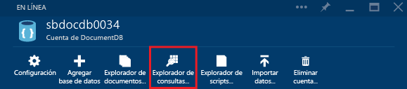
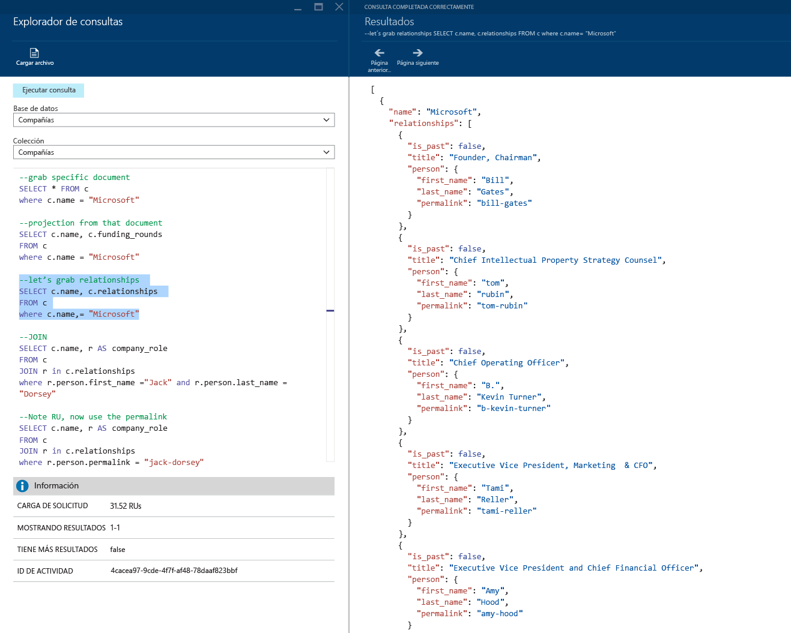
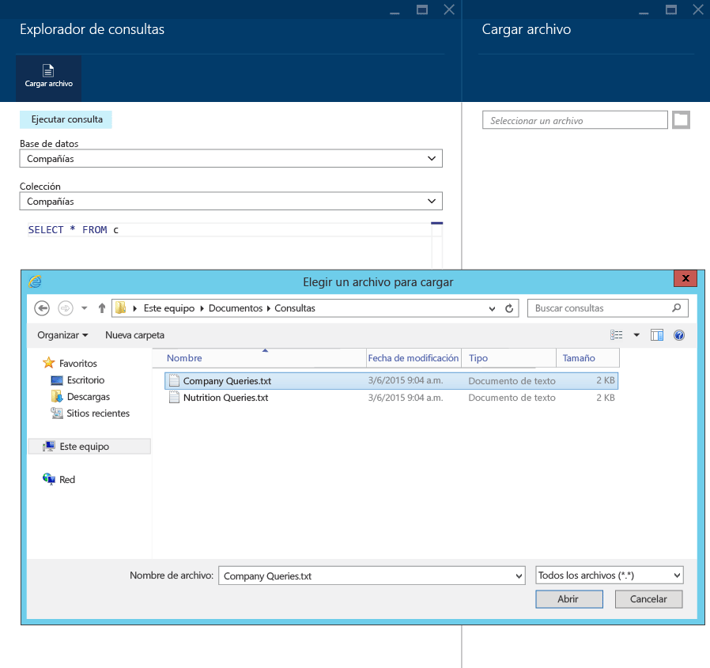

# Escritura, edición y ejecución de consultas SQL para DocumentDB mediante Explorador de consultas en Azure Portal
En este artículo se proporciona información general sobre el Explorador de consultas de [Microsoft Azure DocumentDB](https://azure.microsoft.com/services/documentdb/), que es una herramienta de Azure Portal que permite escribir, editar y ejecutar consultas SQL en una [colección de DocumentDB](documentdb-create-collection.md).

1. En [Azure Portal](https://portal.azure.com), en el panel de navegación izquierdo, haga clic en  **NoSQL (DocumentDB)**. 

    Si **NoSQL (DocumentDB)** no se muestra, haga clic en **Más servicios** en la parte inferior y después haga clic en el  **NoSQL (DocumentDB)**.
2. En el menú de recursos, haga clic en **Explorador de consultas**. 
   
    
3. En la hoja **Explorador de consultas**, seleccione las **bases de datos** y **colecciones** en que desee realizar consultas en las listas desplegables y escriba la consulta que desee ejecutar. 
   
    Las listas desplegables **Bases de datos** y **Colecciones** se rellenan previamente según el contexto en el que se inicie el Explorador de consultas. 
   
    Se proporciona la consulta predeterminada `SELECT TOP 100 * FROM c` .  Puede aceptar la consulta predeterminada o crear su propia consulta con el lenguaje de consulta SQL que se describe en la [hoja de referencia rápida de consulta SQL](documentdb-sql-query-cheat-sheet.md) o en el artículo sobre [consulta SQL y sintaxis SQL](documentdb-sql-query.md).
   
    Haga clic en **Ejecutar consulta** para ver los resultados.
   
    
4. La hoja **Resultados** hoja muestra el resultado de la consulta. 
   
    

## Trabajo con resultados
De forma predeterminada, el Explorador de consultas devuelve resultados en grupos de 100.  Si la consulta genera más de 100 resultados, utilice los comandos **Página siguiente** y **Página anterior** para desplazarse por el conjunto de resultados.

En las consultas correctas, el panel **Información** contiene métricas como el gasto de la solicitud, el número de recorridos de ida y vuelta que realizó la consulta, el conjunto de resultados que se muestra actualmente y si hay más resultados, a los que se puede acceder mediante el comando **Página siguiente**, tal como se indicó anteriormente.

## Uso de múltiples consultas
Si usa varias consultas y desea cambiar rápidamente de unas a otras, puede especificarlas todas en el cuadro de texto de consulta de la hoja **Explorador de consultas**, luego resaltar la que desee ejecutar y, finalmente, haga clic en **Ejecutar consulta** para ver los resultados.

## Adición de consultas desde un archivo en el Editor de consultas de SQL
Puede cargar el contenido de un archivo existente con el comando **Cargar archivo** .

## Solución de problemas
Si una consulta se completa con errores, el Explorador de consultas muestra una lista de errores que puede ser útil a la hora de solucionar los problemas.

## Ejecución de consultas SQL de DocumentDB fuera del portal
El Explorador de consultas del Portal de Azure es simplemente una forma de ejecutar consultas SQL en DocumentDB. Las consultas SQL también se pueden ejecutar mediante la [API de REST](https://msdn.microsoft.com/library/azure/dn781481.aspx) o los [SDK de cliente](documentdb-sdk-dotnet.md). Para obtener más información sobre el uso de estos otros métodos, consulte [Executing SQL queries](documentdb-sql-query.md#ExecutingSqlQueries)

## Pasos siguientes
Para más información sobre la gramática de SQL de DocumentDB compatible con el Explorador de consultas, vea el artículo sobre [consulta SQL y sintaxis SQL](documentdb-sql-query.md) o imprima la [hoja de referencia rápida de consultas SQL](documentdb-sql-query-cheat-sheet.md).
También puede disfrutar de la experimentación con [Query Playground](https://www.documentdb.com/sql/demo) , donde puede probar las consultas en línea con un conjunto de datos de ejemplo.

