<properties 
	pageTitle="Visualización, edición, creación y carga de documentos JSON con el Explorador de documentos de DocumentDB | Azure" 
	description="Obtenga información sobre el Explorador de documentos de DocumentDB, una herramienta del Portal de vista previa de Azure para ver, editar, crear y cargar documentos JSON con DocumentDB." 
	services="documentdb" 
	authors="stephbaron" 
	manager="johnmac" 
	editor="monicar" 
	documentationCenter=""/>

<tags 
	ms.service="documentdb" 
	ms.workload="data-services" 
	ms.tgt_pltfrm="na" 
	ms.devlang="na" 
	ms.topic="article" 
	ms.date="2/13/2015" 
	ms.author="stbaro"/>

# Ver, editar, crear y cargar documentos JSON con el Explorador de documentos de DocumentDB #

Este artículo proporciona información general sobre el Explorador de documentos de [Base de datos de Microsoft Azure](http://azure.microsoft.com/services/documentdb/), una herramienta del Portal de vista previa de Azure que permite ver, editar, crear y cargar documentos JSON con DocumentDB. 

Después de completar este tutorial, podrá responder a las preguntas siguientes:  

-	¿Cómo puedo crear, ver, editar y eliminar fácilmente documentos individuales de DocumentDB mediante un explorador web?
-	¿Cómo puedo ver fácilmente las propiedades del sistema de un documento de DocumentDB mediante un explorador web?
-	¿Cómo puedo realizar fácilmente una ingesta en bloque de documentos de DocumentDB mediante un explorador web?

##Inicio del Explorador de documentos y navegación por este##

El Explorador de documentos se puede iniciar desde cualquier cuenta, base de datos y hoja de colecciones de DocumentDB.  

1. Cerca de la parte inferior de cada hoja aparece el modo **Herramientas de desarrollo** que contiene la parte del **Explorador de documentos**.

	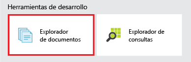 

2. Para iniciar el Explorador de documentos solo tiene que hacer clic en el icono.

	
Los cuadros de lista desplegables **Base de datos** y **Colección** se rellenan previamente en función del contexto en el que se inicie el Explorador de documentos.  Por ejemplo, si efectúa el inicio desde una hoja de base de datos, la base de datos actual se rellena previamente.  Si el inicio se realiza desde una hoja de colección, la colección actual será la que se rellene previamente.

	

3. El Explorador de documentos carga los 100 primeros documentos, como máximo, en la colección seleccionada.  Puede cargar documentos adicionales (en lotes de 100) si selecciona la opción **Cargar más** situada en la parte inferior de la hoja Explorador de documentos.  

4. Los cuadros de lista desplegables **Base de datos** y **Colección** pueden utilizarse para cambiar fácilmente la colección desde la que se ven documentos en ese momento sin tener que cerrar y reiniciar el Explorador de documentos.  

5. Asimismo, el Explorador de documentos también admite el filtrado del conjunto de documentos cargado actualmente por la propiedad de identificador.  Solo tiene que escribir en el cuadro de filtro.

	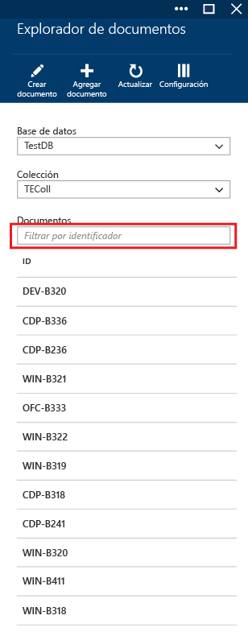 

	Los resultados de la lista del Explorador de documentos se filtran en función de los criterios proporcionados.

	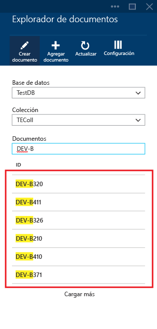

	> [AZURE.IMPORTANT] La funcionalidad de filtro del Explorador de documentos solo filtra desde el conjunto de documentos cargado ***actualmente*** y no realiza ninguna consulta en la colección seleccionada.

6. Para actualizar la lista de documentos cargados en el Explorador de documentos, simplemente haga clic en el comando **Actualizar** en la parte superior de la hoja.

	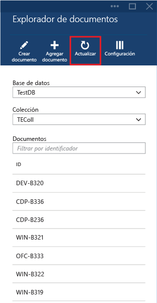

##Visualización, creación y edición de documentos con el Explorador de documentos##

El Explorador de documentos permite crear, editar y eliminar documentos con toda facilidad.  

- Para crear un documento, solo tiene que hacer clic en el comando **Crear documento** y se proporcionará un fragmento de código JSON mínimo.

	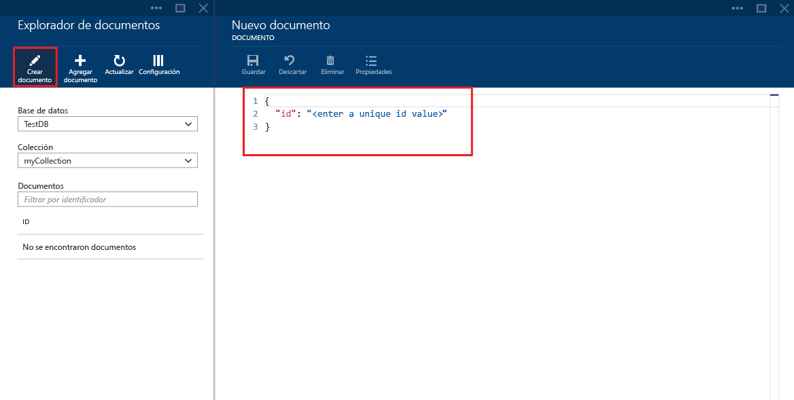 

- Simplemente escriba o pegue el contenido JSON del documento que desea crear y haga clic en el comando **Guardar** para confirmar el documento.

	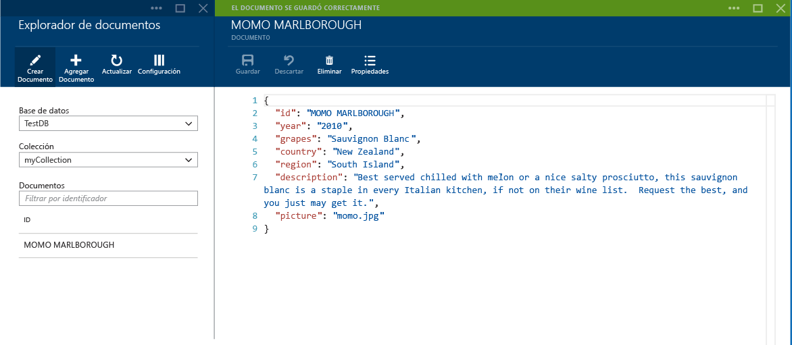

	> [AZURE.NOTE] Si no se proporciona una propiedad "id", el Explorador de documentos la agrega de forma automática y genera un GUID como valor de identificador. 

- Para editar un documento ya existente, selecciónelo en el Explorador de documentos, edite el documento según sea necesario y haga clic en el comando **Guardar**.

	

- Si va a editar un documento y decide descartar el conjunto de ediciones actual, haga clic en el comando para descartar, confirme dicha acción y se volverá a cargar el estado anterior del documento.

	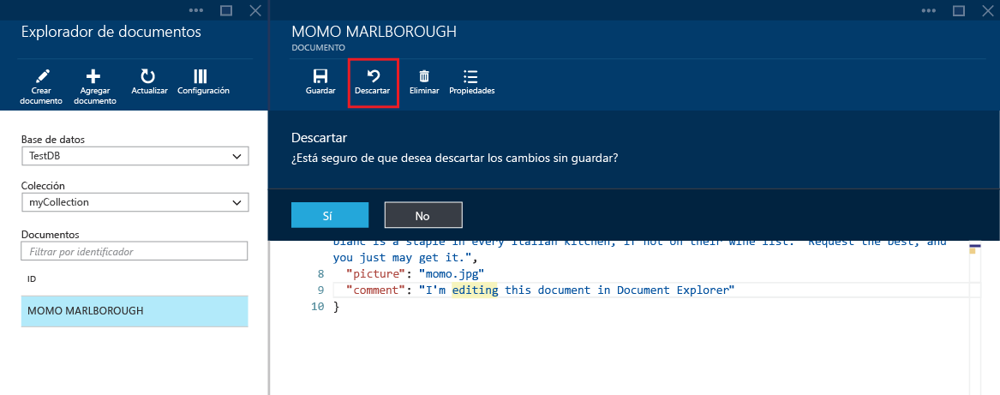

- Para eliminar un documento, selecciónelo, haga clic en el comando **Eliminar** y, después, confirme la eliminación. Después de confirmar, el documento se quita inmediatamente de la lista del Explorador de documentos:

	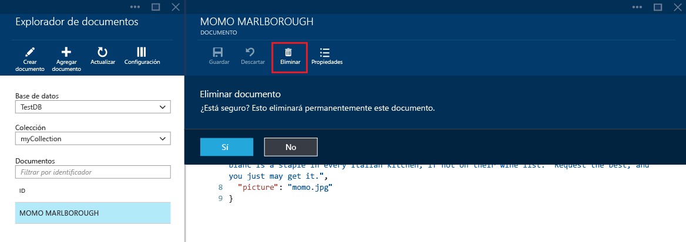

- Tenga en cuenta que el Explorador de documentos valida que los documentos nuevos o editados contengan JSON válido.  Puede mover el puntero sobre la sección incorrecta para obtener detalles acerca del error de validación.

	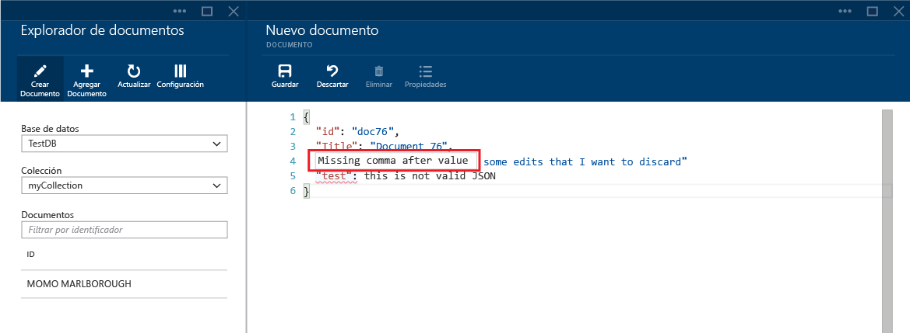

- Asimismo, el Explorador de documentos impide guardar un documento que tenga contenido JSON no válido.

	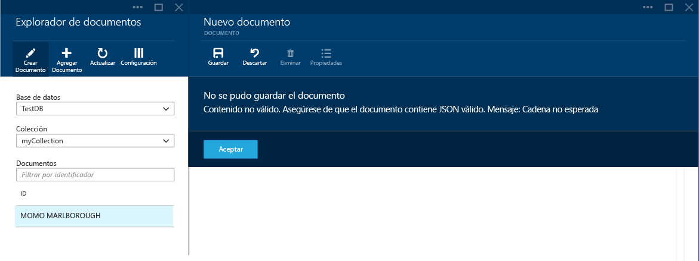

- Por último, el Explorador de documentos permite ver fácilmente las propiedades del sistema del documento cargado actualmente si se hace clic en el comando **Propiedades**.

	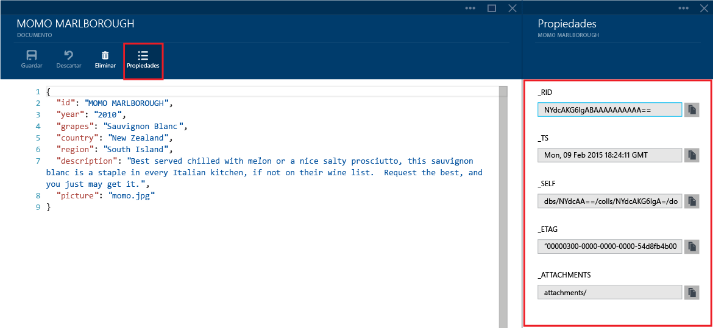

	> [AZURE.NOTE] La propiedad de marca de tiempo (_ts) se representa internamente como tiempo de época, pero el Explorador de documentos muestra el valor en formato GMT en lenguaje natural.

##Adición en masa de documentos con el Explorador de documentos##

El Explorador de documentos admite la ingesta en bloque de uno o más documentos JSON existentes.  

1. Para iniciar el proceso de carga, haga clic en el comando **Agregar documento**.
	
	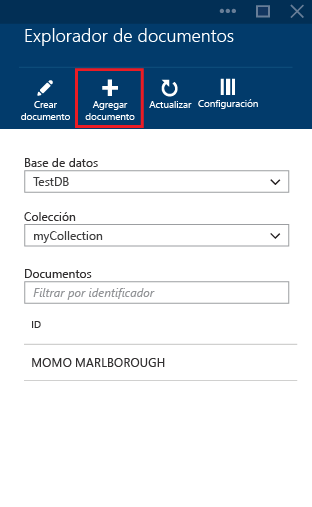

2. Se abre una nueva hoja.  Haga clic en el botón Examinar para abrir una ventana del explorador de archivos y seleccione uno o varios documentos JSON para cargar.

	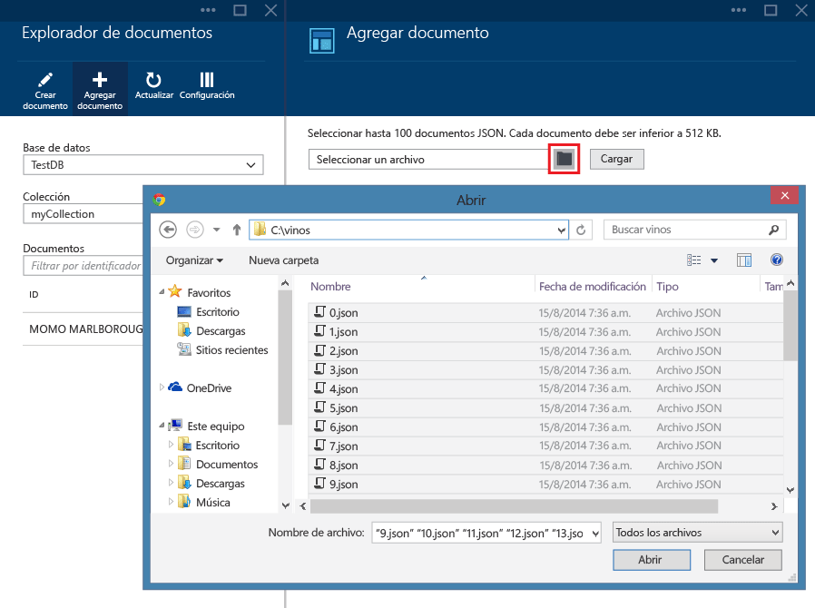

	> [AZURE.NOTE] El Explorador de documentos admite actualmente hasta 100 documentos JSON por operación de carga individual.

3. Cuando esté satisfecho con la selección, haga clic en el botón **Cargar**.  Los documentos se agregan automáticamente a la cuadrícula del Explorador de documentos y se muestran los resultados de la carga a medida que progresa la operación. Los errores de importación se notifican para cada archivo.

	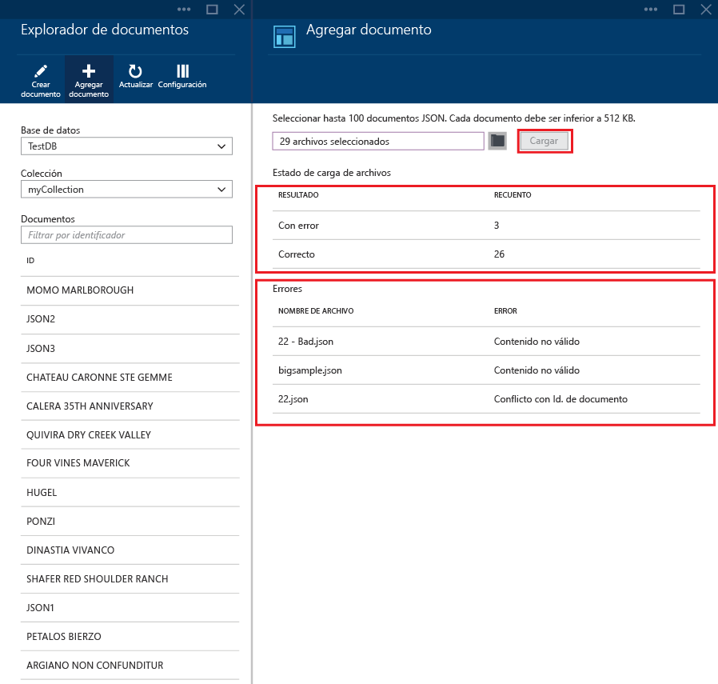

4. Una vez completada la operación, puede seleccionar hasta 100 documentos más para cargar.

##Pasos siguientes

Para obtener más información acerca de DocumentDB, haga clic [aquí](http://azure.com/docdb).

<!--HONumber=49--> 