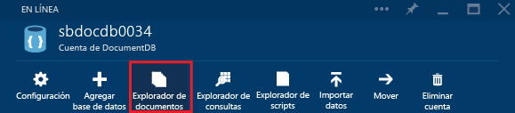

# Ver, editar, crear y cargar documentos JSON 

En este artículo se proporciona información general sobre las dos maneras de crear, editar y consultar documentos en el portal: el [Explorador de documentos](#launch-document-explorer) y el [Explorador de datos (versión preliminar)](#data-explorer).

> [!NOTE]
> El Explorador de documentos no está habilitado en las cuentas de DocumentDB que ofrecen compatibilidad de protocolos con MongoDB. Esta página se actualizará cuando se habilite esta característica.

## Inicio del Explorador de documentos en Azure Portal
1. En [Azure Portal](https://portal.azure.com), en el panel de navegación izquierdo, haga clic en  **NoSQL (DocumentDB)**. 

    Si **NoSQL (DocumentDB)** no se muestra, haga clic en **Más servicios** en la parte inferior y después haga clic en el  **NoSQL (DocumentDB)**.
2. Seleccione el nombre de la cuenta. 
3. En el menú de recursos, haga clic en **Explorador de documentos**. 
   
    
   
    En la hoja **Explorador de documentos**, las listas desplegables **Bases de datos** y **Colecciones** se rellenan previamente según el contexto en el que se inició el Explorador de documentos. 

## Creación de un documento JSON
1. [Inicie el Explorador de documentos](#launch-document-explorer).
2. En la hoja **Explorador de documentos**, haga clic en **Crear documento**. 
   
    En la hoja **Documento** se proporciona un fragmento de código JSON mínimo.
   
    
3. En la hoja **Documento**, escriba o pegue el contenido del documento JSON que se quiera crear y, luego, haga clic en **Guardar** para confirmar el documento en la base de datos y colección especificadas en la hoja **Explorador de documentos**.
   
    
   
   > [!NOTE]
   > Si no se proporciona una propiedad "id", el Explorador de documentos la agrega de forma automática y genera un GUID como valor de identificador.
   > 
   > 
   
    Si ya dispone de datos procedentes de archivos JSON, MongoDB, SQL Server, archivos CSV, almacenamiento de tablas de Azure, Amazon DynamoDB, HBase o de otras colecciones de DocumentDB, puede usar la [herramienta de migración de datos](documentdb-import-data.md) de DocumentDB para importar rápidamente los datos.

## Edición de un documento JSON
1. [Inicie el Explorador de documentos](#launch-document-explorer).
2. Para editar un documento que ya exista, selecciónelo en la hoja **Explorador de documentos**, edite el documento en la hoja **Documento** y haga clic en **Guardar**.
   
    
   
    Si al editar un documento, decide que desea descartar el conjunto actual de ediciones, haga clic en la opción **Descartar** de la hoja **Documento**, confirme dicha acción y se volverá a cargar el estado anterior del documento.
   
    

## Eliminación de un documento de DocumentDB
1. [Inicie el Explorador de documentos](#launch-document-explorer).
2. Seleccione el documento en **Explorador de documentos**, haga clic en **Eliminar** y confirme la eliminación. Después de realizar la confirmación, el documento se quita inmediatamente de la lista del Explorador de documentos.
   
    

## Trabajo con documentos JSON
El Explorador de documentos valida que todos los documentos nuevos o editados contienen JSON válido.  Incluso se pueden ver los errores de JSON; para ello, mueva el puntero sobre la sección incorrecta para obtener detalles acerca del error de validación.

Asimismo, el Explorador de documentos impide guardar un documento que tenga contenido JSON no válido.

Por último, el Explorador de documentos permite ver fácilmente las propiedades del sistema del documento cargado actualmente si se hace clic en el comando **Propiedades** .

> [!NOTE]
> La propiedad de marca de tiempo (_ts) se representa internamente como tiempo de época, pero el Explorador de documentos muestra el valor en formato GMT en lenguaje natural.
> 
> 

## Filtro de documentos
El Explorador de documentos es compatible con una serie de opciones de navegación y con la configuración avanzada.

De forma predeterminada, el Explorador de documentos carga a los 100 primeros documentos de la colección seleccionada, según su fecha de creación, de más antiguo a más reciente.  Puede cargar documentos adicionales (en lotes de 100) si selecciona la opción **Cargar más** situada en la parte inferior de la hoja Explorador de documentos. Puede elegir los documentos que se van a cargar a través del comando **Filtrar** .

1. [Inicie el Explorador de documentos](#launch-document-explorer).
2. En la parte superior de la hoja **Explorador de documentos**, haga clic en **Filtrar**.  
   
    
3. La configuración de filtro aparece debajo de la barra de comandos. En la configuración de filtro, especifique una cláusula WHERE o una cláusula ORDER BY y, después, haga clic en **Filtrar**.
   
   
   
   El Explorador de documentos actualiza automáticamente los resultados con los documentos que se ajustan a la consulta del filtro. Puede encontrar más información sobre la gramática de SQL de DocumentDB en el artículo sobre [consulta SQL y sintaxis SQL](documentdb-sql-query.md) o imprima una copia de la [hoja de referencia rápida de consultas SQL](documentdb-sql-query-cheat-sheet.md).
   
   Los cuadros de listas desplegables **Base de datos** y **Colección** pueden utilizarse para cambiar fácilmente la colección desde la que se ven documentos en ese momento sin tener que cerrar y reiniciar el Explorador de documentos.  
   
   Asimismo, el Explorador de documentos también admite el filtrado del conjunto de documentos cargado actualmente por la propiedad de identificador.  Escriba Filter by id en el cuadro Documentos.
   
   
   
   Los resultados de la lista del Explorador de documentos se filtran en función de los criterios proporcionados.
   
   
   
   > [!IMPORTANT]
   > La funcionalidad de filtro del Explorador de documentos solo filtra desde el conjunto de documentos cargado ***actualmente*** y no realiza ninguna consulta en la colección seleccionada.
   > 
   > 
4. Para actualizar la lista de documentos que carga el Explorador de documentos, haga clic en la opción **Actualizar** de la parte superior de la hoja.
   
    

## Adición en masa de documentos
El Explorador de documentos admite la ingesta en masa de uno o varios documentos JSON existentes, hasta 100 archivos JSON por operación de carga.  

1. [Inicie el Explorador de documentos](#launch-document-explorer).
2. Para iniciar el proceso de carga, haga clic en **Agregar documento**.
   
    
   
    Se abre la hoja **Cargar documento** . 
3. Haga clic en el botón Examinar para abrir una ventana del explorador de archivos, seleccione uno o varios documentos JSON para cargarlos y haga clic en **Abrir**.
   
    
   
   > [!NOTE]
   > El Explorador de documentos admite actualmente hasta 100 documentos JSON por operación de carga individual.
   > 
   > 
4. Cuando esté satisfecho con la selección, haga clic en el botón **Cargar** .  Los documentos se agregan automáticamente a la cuadrícula del Explorador de documentos y se muestran los resultados de la carga a medida que progresa la operación. Los errores de importación se notifican para cada archivo.
   
    
5. Una vez que la operación se completa, puede seleccionar hasta 100 documentos más para cargarlos.

## Crear un documento mediante el Explorador de datos (versión preliminar)

El otro método para crear, editar y consultar documentos en el portal es el Explorador de datos. Para abrir el Explorador de datos, haga clic en **Explorador de datos (versión preliminar)** en la barra de navegación del portal, luego expanda el nombre de la base de datos, expanda el nombre de la colección, haga clic en **Documentos** y luego en **Nuevo documento**, como se muestra en la siguiente captura de pantalla.

## Trabajo con documentos JSON fuera del portal
El Explorador de documentos de Azure Portal es simplemente una forma de trabajar con documentos en DocumentDB. También se pueden trabajar con documentos mediante la [API de REST](https://msdn.microsoft.com/library/azure/mt489082.aspx) o los [SDK de cliente](documentdb-sdk-dotnet.md). Para obtener un ejemplo de código, consulte los [ejemplos de documentos de SDK para .NET](documentdb-dotnet-samples.md#document-examples) y los [ejemplos de documentos de SDK de Node.js](documentdb-nodejs-samples.md#document-examples).

Si tiene que importar o migrar archivos desde otro origen (archivos JSON, MongoDB, SQL Server, archivos CSV, Almacenamiento de tablas de Azure, Amazon DynamoDB o HBase), puede usar la [herramienta de migración de datos](documentdb-import-data.md) de DocumentDB para importar rápidamente los datos en DocumentDB.

## Solución de problemas
**Síntoma**: el Explorador de documentos devuelve **No se han encontrado documentos**.

**Solución**: asegúrese de que ha seleccionado la suscripción, la base de datos y la colección correctas en la que se insertaron los documentos. Además, compruebe que está trabajando dentro de las cuotas de rendimiento. Si lo hace al nivel de rendimiento máximo y se produce una limitación, reduzca el uso de la aplicación para trabajar con la cuota de rendimiento máximo de la colección.

**Explicación**: el portal es una aplicación como cualquier otra, ya que realiza llamadas a la colección y la base de datos de DocumentDB. Si las solicitudes están limitadas actualmente a causa de llamadas que se realizan desde una aplicación independiente, el portal también quedará limitado, con lo que recursos no se mostrarán en el portal. Para resolver el problema, solucione la causa del elevado uso de rendimiento y, después, actualice la hoja del portal. Se puede encontrar información sobre cómo medir y reducir el uso de rendimiento en la sección de [rendimiento](documentdb-performance-tips.md#throughput) del artículo [Sugerencias de rendimiento](documentdb-performance-tips.md).

## Pasos siguientes
Para obtener más información sobre la gramática de SQL de DocumentDB compatible con el Explorador de documentos, consulte el artículo sobre [consulta SQL y sintaxis SQL](documentdb-sql-query.md) o imprima la [hoja de referencia rápida de consultas SQL](documentdb-sql-query-cheat-sheet.md).

