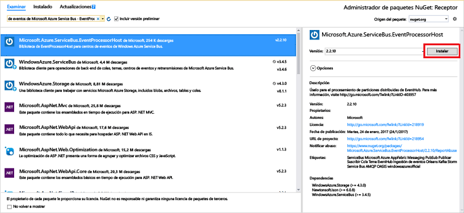

# <a name="receive-events-from-azure-event-hubs-using-the-net-framework"></a>Recepción de eventos de Azure Event Hubs mediante .NET Framework

## <a name="introduction"></a>Introducción

Event Hubs es un servicio que procesa grandes cantidades de datos de eventos (telemetría) desde aplicaciones y dispositivos conectados. Después de recopilar datos en Centros de eventos, puede almacenarlos mediante un clúster de almacenamiento o transformarlos por medio de un proveedor de análisis en tiempo real. Esta funcionalidad de recopilación y procesamiento de eventos a gran escala es un componente clave de las modernas arquitecturas de aplicaciones, entre las que se incluye Internet de las cosas (IoT).

En este tutorial se muestra cómo escribir una aplicación de consola de .NET Framework que recibe mensajes de un centro de eventos mediante el **[host de procesador de eventos][EventProcessorHost]**. Para enviar eventos mediante .NET Framework, consulte el artículo [Envío de eventos a Azure Event Hubs mediante .NET Framework](event-hubs-dotnet-framework-getstarted-send.md), o haga clic en el lenguaje de envío adecuado en la tabla de contenido del lado izquierdo.

El [host de procesador de eventos][EventProcessorHost] es una clase de .NET que simplifica la recepción de eventos desde Event Hubs mediante la administración de puntos de control persistentes y recepciones paralelas desde dichas instancias de Event Hubs. Con el [host de procesador de eventos][Event Processor Host], puede dividir eventos entre varios receptores, incluso si están hospedados en distintos nodos. En este ejemplo se muestra cómo usar el [host de procesador de eventos][EventProcessorHost] en un solo receptor. En el ejemplo de [escalado horizontal del procesamiento de eventos][Scale out Event Processing with Event Hubs] se muestra cómo usar el [host de procesador de eventos][EventProcessorHost] con varios receptores.

## <a name="prerequisites"></a>Requisitos previos

Para completar este tutorial, debe cumplir los siguientes requisitos previos:

* [Microsoft Visual Studio 2015 o una versión superior](http://visualstudio.com). En las capturas de pantalla de este tutorial se usa Visual Studio 2017.
* Una cuenta de Azure activa. En caso de no tener ninguna, puede crear una cuenta gratuita en tan solo unos minutos. Para obtener más información, consulte [Evaluación gratuita de Azure](https://azure.microsoft.com/free/).

## <a name="create-an-event-hubs-namespace-and-an-event-hub"></a>Creación de un espacio de nombres de Event Hubs y un centro de eventos

El primer paso consiste en usar [Azure Portal](https://portal.azure.com) para crear un espacio de nombres de tipo Event Hubs y obtener las credenciales de administración que la aplicación necesita para comunicarse con el centro de eventos. Para crear un espacio de nombres y un centro de eventos, siga el procedimiento de [este artículo](event-hubs-create.md) y después continúe con los siguientes pasos siguientes del tutorial.

## <a name="create-an-azure-storage-account"></a>Creación de una cuenta de almacenamiento de Azure

Para usar el [host de procesador de eventos][EventProcessorHost], debe tener una [cuenta de Azure Storage][Azure Storage account]:

1. Inicie sesión en [Azure Portal][Azure portal] y haga clic en **Nuevo** en la parte superior izquierda de la pantalla.
2. Haga clic en **Storage** y luego en **Cuenta de Storage**.
   
    
3. En la hoja **Crear cuenta de almacenamiento** , escriba un nombre para la cuenta de almacenamiento. Elija una suscripción de Azure, el grupo de recursos y la ubicación en la que se va a crear el recurso. A continuación, haga clic en **Crear**.
   
    
4. En la lista de cuentas de almacenamiento, haga clic en la cuenta recién creada.
5. En la hoja de la cuenta de almacenamiento, haga clic en **Claves de acceso**. Copie el valor de **key1** para usarla más adelante en este tutorial.
   
    

## <a name="create-a-receiver-console-application"></a>Creación de una aplicación de consola de destinatario

1. En Visual Studio, cree un nuevo proyecto de aplicación de escritorio de Visual C# con la plantilla de proyecto **Aplicación de consola**. Asigne al proyecto el nombre **Receptor**.
   
    
2. En el Explorador de soluciones, haga clic con el botón derecho en el proyecto **Receptor** y luego haga clic en **Administrar paquetes NuGet para la solución**.
3. Haga clic en la pestaña **Examinar** y luego busque `Microsoft Azure Service Bus Event Hub - EventProcessorHost`. Haga clic en **Instalar**y acepte las condiciones de uso.
   
    
   
    Visual Studio descarga, instala y agrega una referencia al [Centro de eventos del Bus de servicio de Azure - Paquete de NuGet de EventProcessorHost](https://www.nuget.org/packages/Microsoft.Azure.ServiceBus.EventProcessorHost), con todas sus dependencias.
4. Haga clic con el botón derecho en el proyecto **Receptor**, haga clic en **Agregar** y, después, haga clic en **Clase**. Asigne a la nueva clase el nombre **SimpleEventProcessor** y después haga clic en **Agregar** para crear la clase.
   
    
5. Agregue las siguientes instrucciones en la parte superior del archivo SimpleEventProcessor.cs:
    
  ```csharp
  using Microsoft.ServiceBus.Messaging;
  using System.Diagnostics;
  ```
    
  A continuación, sustituya el código siguiente por el cuerpo de la clase:
    
  ```csharp
  class SimpleEventProcessor : IEventProcessor
  {
    Stopwatch checkpointStopWatch;
    
    async Task IEventProcessor.CloseAsync(PartitionContext context, CloseReason reason)
    {
        Console.WriteLine("Processor Shutting Down. Partition '{0}', Reason: '{1}'.", context.Lease.PartitionId, reason);
        if (reason == CloseReason.Shutdown)
        {
            await context.CheckpointAsync();
        }
    }
    
    Task IEventProcessor.OpenAsync(PartitionContext context)
    {
        Console.WriteLine("SimpleEventProcessor initialized.  Partition: '{0}', Offset: '{1}'", context.Lease.PartitionId, context.Lease.Offset);
        this.checkpointStopWatch = new Stopwatch();
        this.checkpointStopWatch.Start();
        return Task.FromResult<object>(null);
    }
    
    async Task IEventProcessor.ProcessEventsAsync(PartitionContext context, IEnumerable<EventData> messages)
    {
        foreach (EventData eventData in messages)
        {
            string data = Encoding.UTF8.GetString(eventData.GetBytes());
    
            Console.WriteLine(string.Format("Message received.  Partition: '{0}', Data: '{1}'",
                context.Lease.PartitionId, data));
        }
    
        //Call checkpoint every 5 minutes, so that worker can resume processing from 5 minutes back if it restarts.
        if (this.checkpointStopWatch.Elapsed > TimeSpan.FromMinutes(5))
        {
            await context.CheckpointAsync();
            this.checkpointStopWatch.Restart();
        }
    }
  }
  ```
    
  **EventProcessorHost** llama a esta clase para procesar los eventos recibidos del centro de eventos. La clase `SimpleEventProcessor` usa un cronómetro para llamar periódicamente al método de punto de control en el contexto **EventProcessorHost**. Este procesamiento garantiza que, si se reinicia el destinatario, no se pierden más de cinco minutos de trabajo de procesamiento.
6. En la clase **Program.cs**, agregue la siguiente instrucción `using` al principio del archivo:
    
  ```csharp
  using Microsoft.ServiceBus.Messaging;
  ```
    
  Después, reemplace el método `Main` de la clase `Program` con el código siguiente, sustituyendo el nombre del centro de eventos y la cadena de conexión de nivel del espacio de nombres que ha guardado anteriormente, y la cuenta de almacenamiento y la clave que ha copiado en las secciones anteriores. 
    
  ```csharp
  static void Main(string[] args)
  {
    string eventHubConnectionString = "{Event Hubs namespace connection string}";
    string eventHubName = "{Event Hub name}";
    string storageAccountName = "{storage account name}";
    string storageAccountKey = "{storage account key}";
    string storageConnectionString = string.Format("DefaultEndpointsProtocol=https;AccountName={0};AccountKey={1}", storageAccountName, storageAccountKey);
    
    string eventProcessorHostName = Guid.NewGuid().ToString();
    EventProcessorHost eventProcessorHost = new EventProcessorHost(eventProcessorHostName, eventHubName, EventHubConsumerGroup.DefaultGroupName, eventHubConnectionString, storageConnectionString);
    Console.WriteLine("Registering EventProcessor...");
    var options = new EventProcessorOptions();
    options.ExceptionReceived += (sender, e) => { Console.WriteLine(e.Exception); };
    eventProcessorHost.RegisterEventProcessorAsync<SimpleEventProcessor>(options).Wait();
    
    Console.WriteLine("Receiving. Press enter key to stop worker.");
    Console.ReadLine();
    eventProcessorHost.UnregisterEventProcessorAsync().Wait();
  }
  ```

7. Ejecute el programa y asegúrese de que no hay ningún error.
  
¡Enhorabuena! Ahora ha recibido mensajes de un centro de eventos por medio del host de procesador de eventos.


> [!NOTE]
> Este tutorial usa una sola instancia de [EventProcessorHost][EventProcessorHost]. Para aumentar el rendimiento, se recomienda ejecutar varias instancias de [EventProcessorHost][EventProcessorHost], como se muestra en el ejemplo de [Escalado horizontal del procesamiento de eventos][Escalado horizontal del procesamiento de eventos]. En esos casos, las diferentes instancias se coordinan automáticamente entre sí con el fin de equilibrar la carga de los eventos recibidos. Si desea que varios destinatarios procesen *todos* los eventos, debe usar el concepto **ConsumerGroup** . Cuando se reciben eventos de distintos equipos, puede ser útil especificar nombres para las instancias de [EventProcessorHost][EventProcessorHost] según los equipos (o roles) en que se implementan. Para más información acerca de estos temas, consulte [Información general de Event Hubs][Event Hubs overview] y [Guía de programación de Event Hubs][Event Hubs Programming Guide].
> 
> 

## <a name="next-steps"></a>Pasos siguientes

Ahora que ha creado una aplicación de trabajo que crea un centro de eventos y envía y recibe datos, puede obtener más información visitando los siguientes vínculos:

* [Event​Processor​Host Class][Event Processor Host] (Clase EventProcessor​Host)
* [Información general de Event Hubs][Event Hubs overview]
* [Preguntas más frecuentes sobre Event Hubs](event-hubs-faq.md)

<!-- Images. -->
[19]: ./media/event-hubs-csharp-ephcs-getstarted/create-eh-proj1.png
[20]: ./media/event-hubs-csharp-ephcs-getstarted/create-eh-proj2.png
[21]: ./media/event-hubs-csharp-ephcs-getstarted/run-csharp-ephcs1.png
[22]: ./media/event-hubs-csharp-ephcs-getstarted/run-csharp-ephcs2.png

<!-- Links -->
[EventProcessorHost]: https://www.nuget.org/packages/Microsoft.Azure.ServiceBus.EventProcessorHost
[Event Hubs overview]: event-hubs-what-is-event-hubs.md
[Scale out Event Processing with Event Hubs]: https://code.msdn.microsoft.com/Service-Bus-Event-Hub-45f43fc3
[Event Hubs Programming Guide]: event-hubs-programming-guide.md
[Azure Storage account]:../storage/common/storage-create-storage-account.md
[Event Processor Host]: /dotnet/api/microsoft.servicebus.messaging.eventprocessorhost
[Azure portal]: https://portal.azure.com
