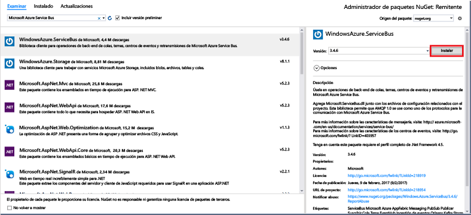

# <a name="send-events-to-azure-event-hubs-using-the-net-framework"></a>Envío de eventos a Azure Event Hubs mediante .NET Framework

## <a name="introduction"></a>Introducción

Event Hubs es un servicio que procesa grandes cantidades de datos de eventos (telemetría) desde aplicaciones y dispositivos conectados. Después de recopilar datos en Centros de eventos, puede almacenarlos mediante un clúster de almacenamiento o transformarlos por medio de un proveedor de análisis en tiempo real. Esta funcionalidad de recopilación y procesamiento de eventos a gran escala es un componente clave de las modernas arquitecturas de aplicaciones, entre las que se incluye Internet de las cosas (IoT).

En este tutorial se muestra cómo usar [Azure Portal](https://portal.azure.com) para crear un centro de eventos. También muestra cómo enviar eventos a un centro de eventos mediante una aplicación de consola escrita en C# con .NET Framework. Para recibir eventos mediante .NET Framework, consulte el artículo [Get started with Event Hubs using the .NET Framework](event-hubs-dotnet-framework-getstarted-receive-eph.md) (Introducción al uso de .NET Framework por parte de Event Hubs) o haga clic en el idioma de recepción correspondiente en la tabla de contenido de la izquierda.

Para completar este tutorial, debe cumplir los siguientes requisitos previos:

* [Microsoft Visual Studio 2015 o una versión superior](http://visualstudio.com). En las capturas de pantalla de este tutorial se usa Visual Studio 2017.
* Una cuenta de Azure activa. En caso de no tener ninguna, puede crear una cuenta gratuita en tan solo unos minutos. Para obtener más información, consulte [Evaluación gratuita de Azure](https://azure.microsoft.com/free/).

## <a name="create-an-event-hubs-namespace-and-an-event-hub"></a>Creación de un espacio de nombres de Event Hubs y un centro de eventos

El primer paso consiste en usar [Azure Portal](https://portal.azure.com) para crear un espacio de nombres de tipo Event Hubs y obtener las credenciales de administración que la aplicación necesita para comunicarse con el centro de eventos. Para crear un espacio de nombres y un centro de eventos, siga el procedimiento de [este artículo](event-hubs-create.md) y después continúe con los siguientes pasos siguientes del tutorial.

## <a name="create-a-sender-console-application"></a>Creación de una aplicación de consola de remitente

En esta sección se escribirá una aplicación de consola Windows que envía eventos al centro de eventos.

1. En Visual Studio, cree un nuevo proyecto de aplicación de escritorio de Visual C# con la plantilla de proyecto **Aplicación de consola** . Asigne al proyecto el nombre **Remitente**.
   
    
2. En el Explorador de soluciones, haga clic con el botón derecho en el proyecto **Remitente** y luego haga clic en **Administrar paquetes NuGet para la solución**. 
3. Haga clic en la pestaña **Examinar** y luego busque `WindowsAzure.ServiceBus`. Haga clic en **Instalar**y acepte las condiciones de uso. 
   
    
   
    Visual Studio descarga, instala y agrega una referencia al [paquete NuGet de la biblioteca del Bus de servicio de Azure](https://www.nuget.org/packages/WindowsAzure.ServiceBus).
4. Agregue las siguientes instrucciones `using` al principio del archivo **Program.cs** :
   
  ```csharp
  using System.Threading;
  using Microsoft.ServiceBus.Messaging;
  ```
5. Agregue los siguientes campos a la clase **Program**; para ello, sustituya los valores del marcador de posición por el nombre del centro de eventos creado en la sección anterior y la cadena de conexión de nivel del espacio de nombres que ha guardado anteriormente.
   
  ```csharp
  static string eventHubName = "{Event Hub name}";
  static string connectionString = "{send connection string}";
  ```
6. Agregue el método siguiente a la clase **Program** :
   
  ```csharp
  static void SendingRandomMessages()
  {
      var eventHubClient = EventHubClient.CreateFromConnectionString(connectionString, eventHubName);
      while (true)
      {
          try
          {
              var message = Guid.NewGuid().ToString();
              Console.WriteLine("{0} > Sending message: {1}", DateTime.Now, message);
              eventHubClient.Send(new EventData(Encoding.UTF8.GetBytes(message)));
          }
          catch (Exception exception)
          {
              Console.ForegroundColor = ConsoleColor.Red;
              Console.WriteLine("{0} > Exception: {1}", DateTime.Now, exception.Message);
              Console.ResetColor();
          }
   
          Thread.Sleep(200);
      }
  }
  ```
   
  Este método envía continuamente los eventos al centro de eventos con un retraso de 200 ms.
7. Por último, agregue las líneas siguientes al método **Main** :
   
  ```csharp
  Console.WriteLine("Press Ctrl-C to stop the sender process");
  Console.WriteLine("Press Enter to start now");
  Console.ReadLine();
  SendingRandomMessages();
  ```
8. Ejecute el programa y asegúrese de que no hay ningún error.
  
¡Enhorabuena! Ha enviado mensajes a un centro de eventos.

## <a name="next-steps"></a>Pasos siguientes
Ahora que ha creado una aplicación de trabajo que crea un centro de eventos y envía datos, puede pasar a los siguientes escenarios:

* [Recepción de eventos mediante el Host de procesador de eventos](event-hubs-dotnet-framework-getstarted-receive-eph.md)
* [Referencia del Host del procesador de eventos](/dotnet/api/microsoft.servicebus.messaging.eventprocessorhost)
* [Información general de Event Hubs](event-hubs-what-is-event-hubs.md)

<!-- Images. -->
[19]: ./media/event-hubs-csharp-ephcs-getstarted/create-eh-proj1.png
[20]: ./media/event-hubs-csharp-ephcs-getstarted/create-eh-proj2.png
[21]: ./media/event-hubs-csharp-ephcs-getstarted/run-csharp-ephcs1.png
[22]: ./media/event-hubs-csharp-ephcs-getstarted/run-csharp-ephcs2.png

