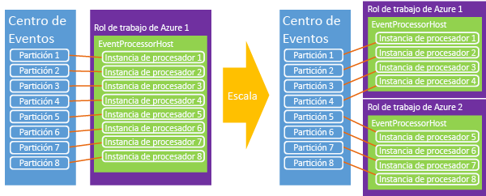

# <a name="event-hubs-programming-guide"></a>Guía de programación de Centros de eventos

En este artículo se describen algunos escenarios comunes para escribir código mediante Azure Event Hubs y el SDK de .NET de Azure. En él se presupone un conocimiento previo de los centros de eventos. Para obtener una visión general conceptual de los Centros de eventos, consulte la [Información general de los Centros de eventos de Azure](event-hubs-what-is-event-hubs.md).

## <a name="event-publishers"></a>Publicadores de eventos

Los eventos se envían a un centro de eventos mediante HTTP POST o una conexión AMQP 1.0. La elección de cuál usar y cuándo depende del escenario específico abordado. Las conexiones AMQP 1.0 se miden como conexiones asincrónicas en el Bus de servicio y son más apropiadas en los escenarios con volúmenes mayores de mensajes frecuentes y requisitos de latencia menores, ya que proporcionan un canal de mensajería persistente.

Puede crear y administrar Centros de eventos mediante la clase [NamespaceManager][] . Si se usan las API administradas de .NET, las construcciones principales para publicar datos en Event Hubs son las clases [EventHubClient](/dotnet/api/microsoft.servicebus.messaging.eventhubclient) y [EventData][]. [EventHubClient][] proporciona el canal de comunicación AMQP a través del que se envían eventos al centro de eventos. La clase [EventData][] representa un evento y se usa para publicar mensajes en un centro de eventos. Esta clase incluye el cuerpo, algunos metadatos e información de encabezado sobre el evento. Otras propiedades se agregan al objeto [EventData][] cuando este atraviesa un centro de eventos.

## <a name="get-started"></a>Introducción

Las clases .NET que admiten los Centros de eventos se incluyen en el ensamblado Microsoft.ServiceBus.dll. La forma más sencilla de hacer referencia a la API del Bus de servicio y configurar su aplicación con todas las dependencias del Bus de servicio es descargar el [paquete de NuGet del Bus de servicio](https://www.nuget.org/packages/WindowsAzure.ServiceBus). Como alternativa, puede utilizar el [Consola del Administrador de paquetes](http://docs.nuget.org/docs/start-here/using-the-package-manager-console) en Visual Studio. Para ello, emita el siguiente comando en la ventana [Consola del administrador de paquetes](http://docs.nuget.org/docs/start-here/using-the-package-manager-console) :

```
Install-Package WindowsAzure.ServiceBus
```

## <a name="create-an-event-hub"></a>Creación de un centro de eventos
Puede usar la clase [NamespaceManager][] para crear centros de eventos. Por ejemplo:

```csharp
var manager = new Microsoft.ServiceBus.NamespaceManager("mynamespace.servicebus.windows.net");
var description = manager.CreateEventHub("MyEventHub");
```

En la mayoría de los casos, se recomienda usar los métodos [CreateEventHubIfNotExists][] para evitar que se generen excepciones si se reinicia el servicio. Por ejemplo:

```csharp
var description = manager.CreateEventHubIfNotExists("MyEventHub");
```

Todas las operaciones de creación de Centros de eventos, incluidas [CreateEventHubIfNotExists][], requieren permisos de **administración** en el espacio de nombres en cuestión. Si desea limitar los permisos de las aplicaciones de consumidor o de publicador, puede evitar estas llamadas de creación de operación en el código de producción cuando use credenciales con permisos limitados.

La clase [EventHubDescription](/dotnet/api/microsoft.servicebus.messaging.eventhubdescription) contiene detalles acerca de un centro de eventos, incluidas las reglas de autorización, el intervalo de retención de mensajes, los identificadores de partición, el estado y la ruta de acceso. Puede usar esta clase para actualizar los metadatos en un centro de eventos.

## <a name="create-an-event-hubs-client"></a>Creación de un cliente de Centro de eventos
La clase principal para interactuar con Event Hubs es [Microsoft.ServiceBus.Messaging.EventHubClient][EventHubClient]. Esta clase proporciona capacidades de remitente y receptor. Puede crear una instancia de esta clase usando el método [Crear](/dotnet/api/microsoft.servicebus.messaging.eventhubclient.create) , tal como se muestra en el ejemplo siguiente.

```csharp
var client = EventHubClient.Create(description.Path);
```

Este método usa la información de conexión del Bus de servicio del archivo App.config, en la sección `appSettings` . Para obtener un ejemplo del `appSettings` XML usado para almacenar la información de conexión del Bus de servicio, consulte la documentación del método [Microsoft.ServiceBus.Messaging.EventHubClient.Create(System.String)](/dotnet/api/microsoft.servicebus.messaging.eventhubclient#Microsoft_ServiceBus_Messaging_EventHubClient_Create_System_String_) .

Otra opción consiste en crear al cliente desde una cadena de conexión. Esta opción funciona bien cuando se usan roles de trabajador de Azure, ya que permite almacenar la cadena en las propiedades de configuración para el trabajador. Por ejemplo:

```csharp
EventHubClient.CreateFromConnectionString("your_connection_string");
```

La cadena de conexión tendrá el mismo formato que el que aparece en el archivo App.config para los métodos anteriores:

```
Endpoint=sb://[namespace].servicebus.windows.net/;SharedAccessKeyName=RootManageSharedAccessKey;SharedAccessKey=[key]
```

Por último, también es posible crear un objeto [EventHubClient][] desde una instancia [MessagingFactory](/dotnet/api/microsoft.servicebus.messaging.messagingfactory), como se muestra en el ejemplo siguiente.

```csharp
var factory = MessagingFactory.CreateFromConnectionString("your_connection_string");
var client = factory.CreateEventHubClient("MyEventHub");
```

Es importante tener en cuenta que los objetos [EventHubClient][] adicionales creados a partir de una instancia del generador de mensajería volverá a usar la misma conexión TCP subyacente. Por lo tanto, estos objetos tienen un límite de cliente en el rendimiento. El método [Create](/dotnet/api/microsoft.servicebus.messaging.eventhubclient#Microsoft_ServiceBus_Messaging_EventHubClient_Create_System_String_) reutiliza un único generador de mensajería. Si necesita un rendimiento muy alto desde un único remitente, puede crear varios generadores de mensajería y un objeto [EventHubClient][] desde cada uno de ellos.

## <a name="send-events-to-an-event-hub"></a>Envío eventos a un centro de eventos
Para enviar eventos a un centro de eventos es preciso crear una instancia de [EventData][] y enviarla a través del método [Send](/dotnet/api/microsoft.servicebus.messaging.eventhubclient#Microsoft_ServiceBus_Messaging_EventHubClient_Send_Microsoft_ServiceBus_Messaging_EventData_). Este método toma un único parámetro de instancia [EventData][] y lo envía de forma sincrónica a un centro de eventos.

## <a name="event-serialization"></a>Serialización de eventos
La clase [EventData][] tiene [cuatro constructores sobrecargados](/dotnet/api/microsoft.servicebus.messaging.eventdata#constructors_) que toman varios parámetros, como un objeto y un serializador, una matriz de bytes o una transmisión. También es posible crear instancias de la clase [EventData][] y establecer la transmisión del cuerpo posteriormente. Cuando se usa JSON con [EventData][], puede usar **Encoding.UTF8.GetBytes()** para recuperar la matriz de bytes de una cadena codificada con JSON.

## <a name="partition-key"></a>Clave de partición
La clase [EventData][] tiene una propiedad [PartitionKey][] que permite al remitente especificar un valor al que se aplica un algoritmo hash para generar una asignación de la partición. Usar una clave de partición garantiza que todos los eventos con la misma clave se envíen a la misma partición del centro de eventos. Las claves de partición comunes incluyen identificadores de sesión e identificadores de remitente únicos. La propiedad [PartitionKey][] es opcional y se puede proporcionar cuando se usan los métodos [Microsoft.ServiceBus.Messaging.EventHubClient.Send(Microsoft.ServiceBus.Messaging.EventData)](/dotnet/api/microsoft.servicebus.messaging.eventhubclient#Microsoft_ServiceBus_Messaging_EventHubClient_Send_Microsoft_ServiceBus_Messaging_EventData_) o [Microsoft.ServiceBus.Messaging.EventHubClient.SendAsync(Microsoft.ServiceBus.Messaging.EventData)](/dotnet/api/microsoft.servicebus.messaging.eventhubclient#Microsoft_ServiceBus_Messaging_EventHubClient_SendAsync_Microsoft_ServiceBus_Messaging_EventData_). Si no proporciona un valor para [PartitionKey][], los eventos enviados se distribuyen a las particiones mediante un modelo round-robin.

### <a name="availability-considerations"></a>Consideraciones sobre disponibilidad

El uso de una clave de partición es opcional y debe considerar detenidamente si desea o no utilizar uno. En muchos casos, el uso de una clave de partición es una buena elección si el orden de los eventos es importante. Cuando se usa una clave de partición, estas particiones requieren la disponibilidad en un solo nodo y las interrupciones pueden producirse a lo largo del tiempo; por ejemplo, cuando los nodos de ejecución se reinician y revisan. Por lo tanto, si establece un identificador de partición y esa partición deja de estar disponible por alguna razón, un intento de acceder a los datos de esa partición provocará un error. Si la alta disponibilidad es más importante, no especifique una clave de partición; en ese caso, los eventos se enviarán a las particiones que usan el modelo round robin descrito anteriormente. En este escenario, se realiza una selección explícita entre disponibilidad (ningún identificador de partición) y coherencia (anclar eventos a un identificador de partición).

Otra consideración es el control de retrasos en el procesamiento de eventos. En algunos casos podría ser mejor quitar datos y reintentarlo que intentar seguir con el procesamiento, lo que puede provocar más retrasos de procesamiento descendente. Por ejemplo, con un tablero de cotizaciones es preferible esperar a tener todos los datos actualizados, pero en un escenario de chat en directo o VOIP sería preferible disponer de los datos rápidamente, aunque no estén completos.

Dadas estas consideraciones de disponibilidad, en estos casos puede elegir una de las siguientes estrategias de control de errores:

- Detener (dejar de leer Event Hubs hasta que se solucionen cosas)
- Quitar (los mensajes no son importantes, quítelos)
- Reintentar (reintentar los mensajes cuando lo vea apropiado)
- [Mensaje fallido](../service-bus-messaging/service-bus-dead-letter-queues.md) (utilizar una cola u otro centro de eventos para considerar como mensajes fallidos solo los mensajes que no pudo procesar)

Para obtener más información y una explicación sobre las ventajas y desventajas entre la disponibilidad y la coherencia, consulte [Disponibilidad y coherencia en Event Hubs](event-hubs-availability-and-consistency.md). 

## <a name="batch-event-send-operations"></a>Operaciones de envío de eventos por lotes
El envío de eventos por lotes puede aumentar drásticamente el rendimiento. El método [SendBatch](/dotnet/api/microsoft.servicebus.messaging.eventhubclient#Microsoft_ServiceBus_Messaging_EventHubClient_SendBatch_System_Collections_Generic_IEnumerable_Microsoft_ServiceBus_Messaging_EventData__) toma un parámetro **IEnumerable** del tipo [EventData][] y envía todo el lote como una operación atómica al centro de eventos.

```csharp
public void SendBatch(IEnumerable<EventData> eventDataList);
```

Tenga en cuenta que un único lote no debe superar el límite de 256 KB de un evento. Además, cada mensaje del lote usa la misma identidad del publicador. Es responsabilidad del remitente asegurarse de que el lote no supera el tamaño máximo del evento. Si es así, se generará un error de **envío** de cliente.

## <a name="send-asynchronously-and-send-at-scale"></a>Enviar de forma asincrónica y enviar a escala
También puede enviar eventos a un centro de eventos de forma asincrónica. Enviar de forma asincrónica puede aumentar la velocidad a la que un cliente es capaz de enviar eventos. Los métodos [Send](/dotnet/api/microsoft.servicebus.messaging.eventhubclient#Microsoft_ServiceBus_Messaging_EventHubClient_Send_Microsoft_ServiceBus_Messaging_EventData_) y [SendBatch](/dotnet/api/microsoft.servicebus.messaging.eventhubclient#Microsoft_ServiceBus_Messaging_EventHubClient_SendBatch_System_Collections_Generic_IEnumerable_Microsoft_ServiceBus_Messaging_EventData__) están disponibles en las versiones asincrónicas que devuelven un objeto [Task](https://msdn.microsoft.com/library/system.threading.tasks.task.aspx). Aunque esta técnica puede aumentar el rendimiento, también puede hacer que el cliente continúe enviando eventos incluso mientras el servicio de centros de eventos le está aplicando un límite y puede dar lugar a que el cliente experimente errores o a la pérdida de mensajes si no se implementa correctamente. Además, puede usar la propiedad [RetryPolicy](/dotnet/api/microsoft.servicebus.messaging.cliententity#Microsoft_ServiceBus_Messaging_ClientEntity_RetryPolicy) en el cliente para controlar opciones de reintento del cliente.

## <a name="create-a-partition-sender"></a>Crear un remitente de partición
Aunque es más común enviar eventos a un centro de eventos sin una clave de partición, en algunos casos podrá enviar eventos directamente a una partición determinada. Por ejemplo:

```csharp
var partitionedSender = client.CreatePartitionedSender(description.PartitionIds[0]);
```

[CreatePartitionedSender](/dotnet/api/microsoft.servicebus.messaging.eventhubclient#Microsoft_ServiceBus_Messaging_EventHubClient_CreatePartitionedSender_System_String_) devuelve un objeto [EventHubSender](/dotnet/api/microsoft.servicebus.messaging.eventhubsender) que puede usar para publicar eventos en una partición específica del centro de eventos.

## <a name="event-consumers"></a>Consumidores de eventos
Los centros de eventos tienen dos modelos principales para el consumo de eventos: receptores directos y abstracciones de nivel superior, como [EventProcessorHost][]. Los receptores directos son responsables de su propia coordinación de acceso a las particiones dentro de un grupo de consumidores.

### <a name="direct-consumer"></a>Consumidor directo
La forma más directa de leer desde una partición dentro de un grupo de consumidores es usar la clase [EventHubReceiver](/dotnet/apie/microsoft.servicebus.messaging.eventhubreceiver) . Para crear una instancia de esta clase, debe usar una instancia de la clase [EventHubConsumerGroup](/dotnet/api/microsoft.servicebus.messaging.eventhubconsumergroup) . En el ejemplo siguiente, el identificador de la partición debe especificarse cuando se crea el receptor para el grupo de consumidores.

```csharp
EventHubConsumerGroup group = client.GetDefaultConsumerGroup();
var receiver = group.CreateReceiver(client.GetRuntimeInformation().PartitionIds[0]);
```

El método [CreateReceiver](/dotnet/api/microsoft.servicebus.messaging.eventhubconsumergroup#methods_summary) tiene varias sobrecargas que proporcionan control sobre el lector que se está creando. Entre estos métodos se incluyen la especificación de un desplazamiento como una cadena o una marca de tiempo y la capacidad de especificar si se debe incluir este desplazamiento especificado en la secuencia devuelta, o iniciar después de esta. Después de crear el receptor, puede empezar a recibir eventos en el objeto devuelto. El método [Receive](/dotnet/api/microsoft.servicebus.messaging.eventhubreceiver#methods_summary) tiene cuatro sobrecargas que controlan los parámetros de la operación de recepción, como el tamaño del lote y el tiempo de espera. Puede usar las versiones asincrónicas de estos métodos para aumentar el rendimiento de un consumidor. Por ejemplo:

```csharp
bool receive = true;
string myOffset;
while(receive)
{
    var message = receiver.Receive();
    myOffset = message.Offset;
    string body = Encoding.UTF8.GetString(message.GetBytes());
    Console.WriteLine(String.Format("Received message offset: {0} \nbody: {1}", myOffset, body));
}
```

Con respecto a una partición específica, se reciben los mensajes en el orden en que se enviaron al centro de eventos. El desplazamiento es un token de cadena que se usa para identificar un mensaje en una partición.

Tenga en cuenta que una sola partición dentro de un grupo de consumidores no puede tener más de 5 lectores simultáneos conectados en un determinado momento. A medida que los lectores se conectan o desconectan, es posible que sus sesiones permanezcan activas durante varios minutos antes de que el servicio reconozca que se han desconectado. Durante este tiempo, es posible que no se logre volver a conectar con una partición. Para obtener un ejemplo completo de escritura de un receptor directo para Event Hubs, consulte el ejemplo [Event Hubs Direct Receivers](https://code.msdn.microsoft.com/Event-Hub-Direct-Receivers-13fa95c6) (Receptores directos de Event Hubs).

### <a name="event-processor-host"></a>Host del procesador de eventos
La clase [EventProcessorHost][] procesa los datos de los centros de eventos. Debe usar esta implementación para generar los lectores de eventos en la plataforma .NET. [EventProcessorHost][] proporciona un entorno de tiempo de ejecución seguro, seguro para subprocesos y de varios procesos para las implementaciones de procesadores de eventos que también ofrecen administración de concesión de puntos de comprobación y particiones.

Para usar la clase [EventProcessorHost][], puede implementar [IEventProcessor](/dotnet/api/microsoft.servicebus.messaging.ieventprocessor). Esta interfaz contiene tres métodos:

* [OpenAsync](/dotnet/api/microsoft.servicebus.messaging.ieventprocessor#Microsoft_ServiceBus_Messaging_IEventProcessor_OpenAsync_Microsoft_ServiceBus_Messaging_PartitionContext_)
* [CloseAsync](/dotnet/api/microsoft.servicebus.messaging.ieventprocessor#Microsoft_ServiceBus_Messaging_IEventProcessor_CloseAsync_Microsoft_ServiceBus_Messaging_PartitionContext_Microsoft_ServiceBus_Messaging_CloseReason_)
* [ProcessEventsAsync](/dotnet/api/microsoft.servicebus.messaging.ieventprocessor#Microsoft_ServiceBus_Messaging_IEventProcessor_ProcessEventsAsync_Microsoft_ServiceBus_Messaging_PartitionContext_System_Collections_Generic_IEnumerable_Microsoft_ServiceBus_Messaging_EventData__)

Para iniciar el procesamiento de eventos, cree una instancia de [EventProcessorHost][], proporcionando los parámetros adecuados para el centro de eventos. Después, llame a [RegisterEventProcessorAsync](/dotnet/api/microsoft.servicebus.messaging.eventprocessorhost#Microsoft_ServiceBus_Messaging_EventProcessorHost_RegisterEventProcessorAsync__1) para registrar su implementación de [IEventProcessor](/dotnet/api/microsoft.servicebus.messaging.ieventprocessor) en el runtime. En este momento, el host intentará adquirir una concesión en cada partición del centro de eventos mediante un algoritmo "expansivo". Estas concesiones durarán un período de tiempo determinado y, a continuación, deben renovarse. A medida que nuevos nodos, instancias de trabajo en este caso, pasan a estar en línea, colocan reservas de concesión y, con el tiempo, la carga cambia entre los nodos a medida que cada una trata de adquirir más concesiones.



Con el tiempo, se establece un equilibrio. Esta capacidad dinámica permite la aplicación del escalado automático basado en CPU a los consumidores para escalar vertical y horizontalmente. Debido a que lo centros de eventos no tienen un concepto directo de recuentos de mensajes, el uso medio de la CPU suele ser el mejor mecanismo para medir el back-end o la escala del consumidor. Si los publicadores empiezan a publicar más eventos de los que los consumidores pueden procesar, el aumento de la CPU en los consumidores puede usarse para producir una escala automática en el recuento de instancias de trabajador.

La clase [EventProcessorHost][] también implementa un mecanismo de puntos de comprobación basado en el almacenamiento de Azure. Este mecanismo almacena el desplazamiento en función de la partición, para que cada consumidor pueda determinar cuál fue el último punto de comprobación del cliente anterior. A medida que las particiones pasan de un nodo a otro a través de concesiones, este es el mecanismo de sincronización que facilita el desplazamiento de cargas.

## <a name="publisher-revocation"></a>Revocación de publicador
Además de las características avanzadas del entorno en tiempo de ejecución de [EventProcessorHost][], los centros de eventos permiten la revocación del publicador con el fin de impedir a publicadores específicos el envío de eventos a un centro de eventos. Estas características son especialmente útiles si se ha visto comprometido el token de un publicador o si una actualización de software está provocando que se comporten incorrectamente. En estas situaciones, es posible bloquear que la identidad del editor, que forma parte de su token de SAS, publique eventos.

Para más información acerca de la revocación del publicador y cómo realizar envíos a Event Hubs como publicador, consulte el ejemplo de [Event Hubs Large Scale Secure Publishing](https://code.msdn.microsoft.com/Service-Bus-Event-Hub-99ce67ab) (Publicación segura a gran escala de Event Hubs).

## <a name="next-steps"></a>Pasos siguientes
Para obtener más información acerca de los escenarios de los centros de eventos, visite estos vínculos:

* [Introducción a la API de centros de eventos](event-hubs-api-overview.md)
* [¿Qué es Event Hubs?](event-hubs-what-is-event-hubs.md)
* [Disponibilidad y coherencia en Event Hubs](event-hubs-availability-and-consistency.md)
* [Referencia de la API de host del procesador de eventos](/dotnet/api/microsoft.servicebus.messaging.eventprocessorhost)

[NamespaceManager]: /dotnet/api/microsoft.servicebus.namespacemanager
[EventHubClient]: /dotnet/api/microsoft.servicebus.messaging.eventhubclient
[EventData]: /dotnet/api/microsoft.servicebus.messaging.eventdata
[CreateEventHubIfNotExists]: /dotnet/api/microsoft.servicebus.namespacemanager.createeventhubifnotexists
[PartitionKey]: /dotnet/api/microsoft.servicebus.messaging.eventdata#Microsoft_ServiceBus_Messaging_EventData_PartitionKey
[EventProcessorHost]: /dotnet/api/microsoft.servicebus.messaging.eventprocessorhost
