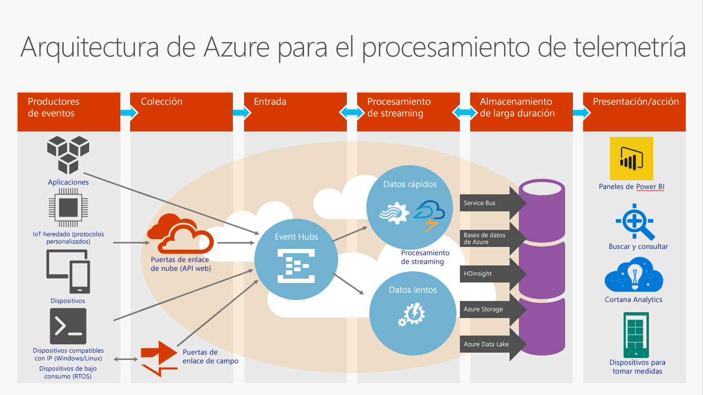

# ¿Qué es Event Hubs?

Azure Event Hubs es una plataforma de streaming de datos y servicio de ingesta de eventos de gran escalabilidad capaz de recibir y procesar millones de eventos por segundo. Event Hubs puede procesar y almacenar eventos, datos o telemetría generados por dispositivos y software distribuido. Los datos enviados a un centro de eventos se pueden transformar y almacenar con cualquier proveedor de análisis en tiempo real o adaptadores de procesamiento por lotes y almacenamiento. Con la capacidad para ofrecer [funcionalidades de publicación y suscripción](/biztalk/core/publish-and-subscribe-architecture), con una latencia baja y a gran escala, Event Hubs sirve como "vía de entrada" para los macrodatos.

## ¿Por qué usar Event Hubs?

Las funcionalidades de control de eventos y telemetría de Event Hubs lo hacen especialmente útil para:

* Instrumentación de aplicaciones
* La experiencia del usuario o el procesamiento de flujos de trabajo
* Escenarios de Internet de las cosas (IoT)

Por ejemplo, Event Hubs permite el seguimiento del comportamiento en aplicaciones móviles, la información sobre el tráfico de granjas de servidores web, la captura de eventos en juegos de consola o la recopilación de telemetría de máquinas industriales, vehículos conectados u otros dispositivos.

## Información general de Azure Event Hubs

La función habitual que Event Hubs desempeña en las arquitecturas de soluciones es la de actuar como la "puerta principal" de una canalización de eventos, conocida a menudo como un *consumidor de eventos*. Un consumidor de eventos es un componente o servicio que se encuentra entre los publicadores de eventos y los consumidores de eventos para desacoplar la producción de un flujo de eventos del consumo de esos eventos. En la siguiente ilustración se muestra esta arquitectura:

Event Hubs proporciona una funcionalidad de control del flujo de mensajes pero tiene características diferentes de la mensajería empresarial tradicional. Las funcionalidades de Event Hubs se basan en un alto rendimiento y en escenarios de procesamiento de eventos. Por lo tanto, Event Hubs es diferente de la mensajería de [Azure Service Bus](https://azure.microsoft.com/services/service-bus/) y no implementa algunas de las funcionalidades que están disponibles para entidades de [mensajería de Service Bus](/azure/service-bus-messaging/), como los temas.

## Características de Event Hubs

Event Hubs contiene los siguientes elementos clave:

- [**Productores/publicadores de eventos**](event-hubs-features.md#event-publishers): una entidad que envía datos a un centro de eventos. Se publica un evento mediante AMQP 1.0 o HTTPS.
- [**Capturar**](event-hubs-features.md#capture): permite capturar los datos de transmisión de Event Hubs y almacenarlos en una cuenta de Azure Blob Storage.
- [**Particiones**](event-hubs-features.md#partitions): permite que cada consumidor lea solo un subconjunto específico, o partición, del flujo de eventos.
- [**Tokens de SAS**](event-hubs-features.md#sas-tokens): identifica y autentica al publicador de eventos.
- [**Consumidores de eventos**](event-hubs-features.md#event-consumers): una entidad que lee datos de eventos procedentes de un centro de eventos. Los consumidores de eventos se conectan a través de AMQP 1.0. 
- [**Grupos de consumidores**](event-hubs-features.md#consumer-groups): proporciona a cada aplicación con varios consumidores una vista distinta del flujo de eventos, lo que permite a los consumidores actuar de forma independiente.
- [**Unidades de procesamiento**](event-hubs-features.md#capacity): unidades de capacidad adquiridas previamente. Una partición individual tiene una escala máxima de una unidad de procesamiento.

Para detalles técnicos sobre estas y otras características de Event Hubs, consulte [Event Hubs features overview](event-hubs-features.md) (Introducción a las características de Event Hubs). 

## Pasos siguientes

Para obtener información detallada sobre los precios de Event Hubs, consulte [Precios de Event Hubs](https://azure.microsoft.com/pricing/details/event-hubs/).

Para obtener más información acerca de Event Hubs, visite los vínculos siguientes:

* Empiece por un [tutorial de Event Hubs](event-hubs-dotnet-standard-getstarted-send.md)
* [Preguntas más frecuentes sobre Event Hubs](event-hubs-faq.md)
* [Aplicaciones de ejemplo que usan Event Hubs](https://github.com/Azure/azure-event-hubs/tree/master/samples)
 
 

