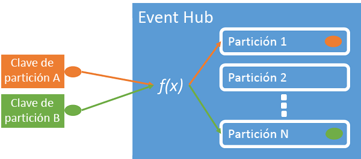
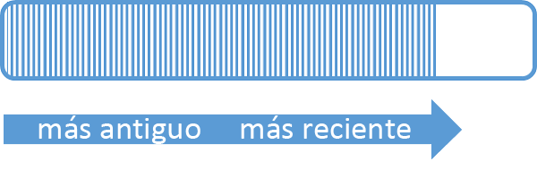
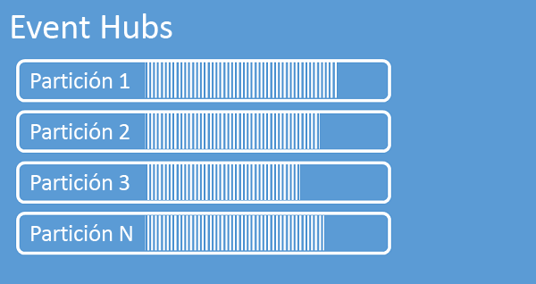
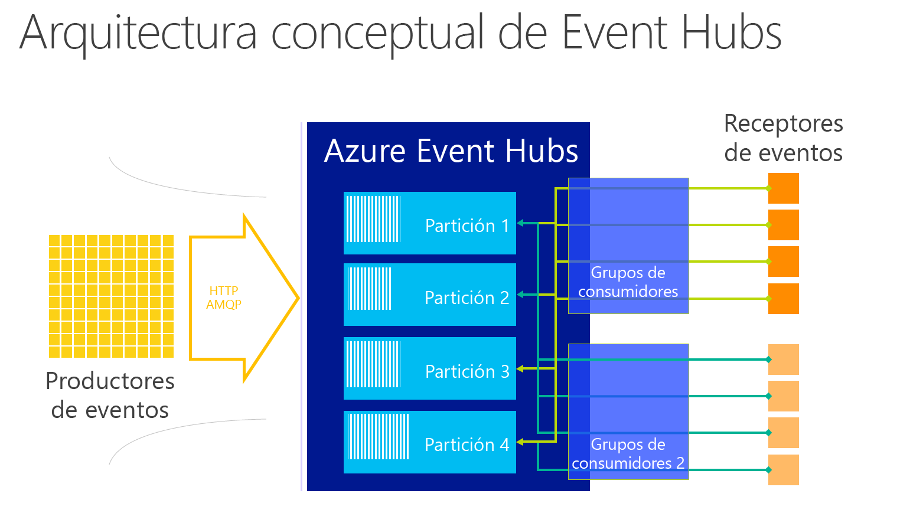
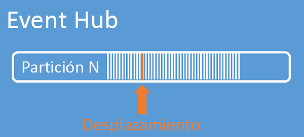

# <a name="what-is-azure-event-hubs"></a>¿Qué es Centros de eventos de Azure?
Event Hubs es una plataforma altamente escalable de streaming de datos capaz de ingerir millones de eventos por segundo. Los datos enviados a Event Hubs se pueden transformar y almacenar con cualquier proveedor de análisis en tiempo real o adaptadores de procesamiento por lotes y almacenamiento. Con la capacidad para ofrecer competencias de publicación y suscripción con una latencia baja y a gran escala, Event Hubs sirve como una "vía de entrada" para los macrodatos.

## <a name="why-use-event-hubs"></a>¿Por qué usar Event Hubs?
Las funcionalidades de control de eventos y telemetría de Event Hubs lo hacen especialmente útil para:

* Instrumentación de aplicaciones
* La experiencia del usuario o el procesamiento de flujos de trabajo
* Escenarios de Internet de las cosas (IoT)

Event Hubs también permite el seguimiento del comportamiento en aplicaciones móviles, la información sobre el tráfico de granjas de servidores web, la captura de eventos en juegos de consola o la recopilación de telemetría de máquinas industriales o vehículos conectados.

## <a name="azure-event-hubs-overview"></a>Información general de los Centros de eventos de Azure
La función habitual que Event Hubs desempeña en las arquitecturas de soluciones es la de actuar como la "puerta principal" de una canalización de eventos, conocida a menudo como un *consumidor de eventos*. Un consumidor de eventos es un componente o servicio que se encuentra entre los publicadores de eventos y los consumidores de eventos para desacoplar la producción de un flujo de eventos del consumo de esos eventos.


Azure Event Hubs es un servicio de procesamiento de eventos que proporciona eventos de escala de nube e ingestión de telemetría, con una latencia baja y una alta confiabilidad. Event Hubs proporciona una funcionalidad de control del flujo de mensajes que tiene características que son muy diferentes de la mensajería empresarial tradicional. Las funcionalidades de Event Hubs se basan en un alto rendimiento y en escenarios de procesamiento de eventos. En este sentido, Event Hubs no implementa algunas de las funcionalidades de mensajería que están disponibles para las entidades de mensajería como, por ejemplo, los temas.

Se crea un centro de eventos en el nivel de espacio de nombres que usa AMQP y HTTP como sus interfaces de API principales.

## <a name="event-publishers"></a>Publicadores de eventos
Cualquier entidad que envíe datos a un centro de eventos es un *publicador de eventos*. Los publicadores de eventos pueden publicar eventos mediante HTTPS o AMQP 1.0. Los publicadores de eventos usan un token de firma de acceso compartido (SAS) para identificarse en un centro de eventos y pueden tener una identidad única o usar un token de SAS común.

### <a name="publishing-an-event"></a>Publicación de un evento
Puede publicar un evento a través de AMQP 1.0 o HTTPS. El Bus de servicio ofrece una clase [EventHubClient](https://docs.microsoft.com/dotnet/api/microsoft.servicebus.messaging.eventhubclient) para publicar los eventos en un Centro de eventos de clientes .NET. Para otras plataformas y tiempos de ejecución, puede usar cualquier cliente de AMQP 1.0, como [Apache Qpid](http://qpid.apache.org/). Puede publicar eventos individualmente o por lotes. Una sola publicación (instancia de datos de eventos) tiene un límite de 256 KB, independientemente de si es un evento único o un lote. La publicación de eventos mayores producirá un error. Es una práctica recomendada para los publicadores desconocer las particiones en el Centro de eventos y solo especificar una *clave de partición* (que se presenta en la sección siguiente), o su identidad mediante su token de SAS.

La opción de usar AMQP o HTTPS es específica para el escenario de uso. AMQP requiere el establecimiento de un socket bidireccional persistente, además de la seguridad de nivel de transporte (TLS) o SSL/TLS. AMQP tiene un mayor costo de red al inicializar la sesión, sin embargo, HTTPS requiere una sobrecarga de SSL adicional para cada solicitud. AMQP tiene un mayor rendimiento para los publicadores frecuentes.



Event Hubs garantiza que todos los eventos que comparten el mismo valor de clave de partición se entregan por orden y en la misma partición. Si se usan claves de partición con directivas de publicador, la identidad del publicador y el valor de la clave de partición deben coincidir. De lo contrario, se produce un error.

### <a name="publisher-policy"></a>Directiva del publicador
Los Centros de eventos permiten un control granular sobre los publicadores de eventos a través de las *directivas de publicador*. Las directivas de publicador son características de tiempo de ejecución diseñadas para facilitar grandes números de publicadores de eventos independientes. Con las directivas de publicador, cada publicador usa su propio identificador único al publicar los eventos en un Centro de eventos mediante el mecanismo siguiente:

```
//[my namespace].servicebus.windows.net/[event hub name]/publishers/[my publisher name]
```

No tiene que crear nombres de publicador con antelación, pero deben coincidir con el token de SAS que se usa al publicar un evento, con el fin de garantizar las identidades de publicador independientes. Al usar directivas de publicador, el valor **PartitionKey** se establece como el nombre del publicador. Para que funcione correctamente, estos valores deben coincidir.

## <a name="partitions"></a>Particiones
Event Hubs proporciona streaming de mensajes mediante un patrón de consumidor con particiones en el que cada consumidor lee solo un subconjunto específico o una partición del flujo de mensajes. Este patrón permite un escalado horizontal para el procesamiento de eventos y ofrece otras características centradas en los flujos que no están disponibles en las colas y los temas.

Una partición es una secuencia ordenada de eventos que se mantiene en un Centro de eventos. A medida que llegan eventos más recientes, se agregan al final de esta secuencia. Una partición puede considerarse como un "registro de confirmación".



Event Hubs retiene datos durante un tiempo de retención configurado que se aplica a todas las particiones del centro de eventos. Los eventos expiran en función del tiempo; no se pueden eliminar explícitamente. Dado que las particiones son independientes y contienen sus propias secuencias de datos, a menudo crecen a velocidades diferentes.



El número de particiones se especifica en el momento de la creación y debe estar comprendido entre 2 y 32. El número de particiones no es modificable, por lo que debería tener en cuenta la escala a largo plazo a la hora de configurar este número. Las particiones son un mecanismo de organización de datos relacionado con el paralelismo de bajada necesario para consumir las aplicaciones. El número de particiones de un centro de eventos está directamente relacionado con el número de lectores simultáneos que espera tener. Puede aumentar el número de particiones más allá de 32 poniéndose en contacto con el equipo de Event Hubs.

Aunque las particiones son identificables y se pueden enviar directamente, esto no es recomendable. En su lugar, puede usar las construcciones de nivel superior que se presentan en las secciones [Publicador de eventos](#event-publishers) y [Capacidad](#capacity).

Las particiones se rellenan con una secuencia de datos de eventos que contienen el cuerpo del evento, un contenedor de propiedades definido por el usuario y diversos metadatos, como su desplazamiento en la partición y su número en la secuencia de streaming.

### <a name="partition-key"></a>Clave de partición
Puede usar una clave de partición para asignar datos de eventos entrantes a particiones concretas con fines de organización de los datos. La clave de partición es un valor proporcionado por el remitente que se pasa a un Centro de eventos. Se procesa a través de una función hash estática que crea la asignación de la partición. Si no especifica una clave de partición cuando se publica un evento, se usa una asignación de tipo round robin.

El publicador de eventos solo conoce su clave de partición, no la partición en la que se publican los eventos. Este desacoplamiento de la clave y la partición evita al remitente la necesidad de conocer demasiado sobre el procesamiento de bajada. Una identidad única por cada dispositivo o usuario es una buena clave de partición, pero otros atributos como la geografía también pueden usarse para agrupar eventos relacionados en una única partición.

## <a name="sas-tokens"></a>Tokens de SAS
Event Hubs usa *firmas de acceso compartido* que están disponibles en el nivel del espacio de nombres y del centro de eventos. Un token de SAS se genera a partir de una clave de SAS y es un hash SHA de una dirección URL, codificado en un formato concreto. Con el nombre de la clave (directiva) y el token, Event Hubs puede volver a generar el hash y así autenticar al remitente. Normalmente, los tokens de SAS para publicadores de eventos se crean solo con privilegios de **envío** en un Centro de eventos concreto. Este mecanismo de dirección URL del token de SAS es la base para la identificación del publicador introducida en la directiva del publicador. Para más información acerca de cómo trabajar con SAS, consulte [Autenticación con firma de acceso compartido en Service Bus](../service-bus-messaging/service-bus-shared-access-signature-authentication.md).

## <a name="event-consumers"></a>Consumidores de eventos
Cualquier entidad que lea datos de eventos de un centro de eventos es un *consumidor de eventos*. Todos los consumidores de Event Hubs se conectan a través de la sesión de AMQP 1.0, y los eventos se entregan a través de la sesión a medida que están disponibles. El cliente no necesita realizar un sondeo de disponibilidad de los datos.

### <a name="consumer-groups"></a>Grupos de consumidores
El mecanismo de publicación y suscripción de Event Hubs se habilita a través de los *grupos de consumidores*. Un grupo de consumidores es una vista (estado, posición o desplazamiento) de un Centro de eventos completo. Los grupos de consumidores habilitan varias aplicaciones consumidoras para que cada una tenga una vista separada del flujo de eventos y para que lean el flujo de forma independiente a su propio ritmo y con sus propios desplazamientos.

En una arquitectura de procesamiento de flujos, cada aplicación de bajada se corresponde con un grupo de consumidores. Si quiere escribir datos de eventos para el almacenamiento a largo plazo, esa aplicación de escritura de almacenamiento es un grupo de consumidores. Otro grupo de consumidores independiente puede realizar el procesamiento de eventos complejos. Solo puede obtener acceso a las particiones a través de un grupo de consumidores. Cada partición puede tener solo un lector activo **de un grupo de consumidores determinado** a la vez. Siempre hay un grupo de consumidores predeterminado en un Centro de eventos y puede crear hasta 20 grupos de consumidores para un Centro de eventos de nivel Standard.

A continuación se muestran ejemplos de la convención URI del grupo de consumidores:

```
//[my namespace].servicebus.windows.net/[event hub name]/[Consumer Group #1]
//[my namespace].servicebus.windows.net/[event hub name]/[Consumer Group #2]
```



### <a name="stream-offsets"></a>Desplazamientos de los flujos
Un *desplazamiento* es la posición de un evento dentro de una partición. Puede pensar en un desplazamiento como un cursor de lado cliente. El desplazamiento es una numeración de byte del evento. Esto permite que un consumidor de eventos (lector) especifique un punto en el flujo de eventos desde el que quiere empezar a leer los eventos. Puede especificar el desplazamiento como una marca de tiempo o como un valor de desplazamiento. Los consumidores son responsables de almacenar sus propios valores de desplazamiento fuera del servicio de los Centros de eventos. Dentro de una partición, cada evento incluye un desplazamiento.



### <a name="checkpointing"></a>Puntos de control
*Puntos de control* es un proceso en el que los lectores marcan o confirman su posición dentro de la secuencia de eventos de una partición. La creación de puntos de comprobación es responsabilidad del consumidor y se realiza por partición dentro de un grupo de consumidores. Esto significa que por cada grupo de consumidores, cada lector de la partición debe realizar un seguimiento de su posición actual en el flujo del evento y puede informar al servicio cuando considere que el flujo de datos se ha completado.

Si se desconecta un lector de una partición, cuando se vuelve a conectar comienza a leer en el punto de comprobación que envió previamente el último lector de esa partición en ese grupo de consumidores. Cuando se conecta el lector, pasa este desplazamiento al Centro de eventos para especificar la ubicación en la que se va a empezar a leer. De este modo, puede usar puntos de comprobación para marcar eventos como "completados" por las aplicaciones de bajada y para ofrecer resistencia en caso de una conmutación por error entre lectores que se ejecutan en máquinas distintas. Es posible volver a los datos más antiguos especificando un desplazamiento inferior desde este proceso de puntos de comprobación. Mediante este mecanismo, los puntos de comprobación permiten una resistencia a la conmutación por error y una reproducción del flujo de eventos.

### <a name="common-consumer-tasks"></a>Tareas comunes del consumidor
Todos los consumidores de Events Hubs se conectan a través de un canal de comunicación bidireccional con estado y sesión de AMQP 1.0. Cada partición tiene una sesión de AMQP 1.0 que facilita el transporte de eventos que deben separarse por partición.

#### <a name="connect-to-a-partition"></a>Conexión a una partición
Es una práctica habitual al conectarse a particiones usar un mecanismo de concesiones para coordinar las conexiones del lector a particiones concretas. De este modo, es posible que cada partición de un grupo de consumidores solo tenga un lector activo. Los puntos de comprobación, la concesión y la administración de lectores se simplifica mediante el uso de la clase [EventProcessorHost](https://docs.microsoft.com/dotnet/api/microsoft.servicebus.messaging.eventprocessorhost) para los clientes de .NET. [EventProcessorHost](https://docs.microsoft.com/dotnet/api/microsoft.servicebus.messaging.eventprocessorhost) es un agente de consumidor inteligente.

#### <a name="read-events"></a>Lectura de eventos
Después de abrir una sesión de AMQP 1.0 y el vínculo de una partición específica, el servicio de Centros de eventos entrega los eventos al cliente de AMQP 1.0. Este mecanismo de entrega permite un mayor procesamiento y una menor latencia que los mecanismos basados en extracción como HTTP GET. Los eventos se envían al cliente, cada instancia de datos de eventos contiene metadatos importantes, como el número de secuencia y el desplazamiento que se usan para facilitar la creación de puntos de comprobación en la secuencia de eventos.

Datos de evento:
* Offset
* Número de secuencia
* Cuerpo
* Propiedades de usuario
* Propiedades del sistema

Es su responsabilidad administrar el desplazamiento.

## <a name="capacity"></a>Capacity
Event Hubs tiene una arquitectura paralela altamente escalable y hay varios factores clave a tener en cuenta al calcular el tamaño y el escalado.

### <a name="throughput-units"></a>Unidades de procesamiento
La capacidad de rendimiento de Event Hubs se controla mediante *unidades de rendimiento*. Las unidades de procesamiento son unidades de capacidad adquiridas previamente. Una unidad de procesamiento individual incluye lo siguiente:

* Entrada: hasta 1 MB por segundo o 1000 eventos por segundo, lo que ocurra primero.
* Salida: hasta 2 MB por segundo.

Si supera la capacidad de las unidades de rendimiento adquiridas, la entrada se limitará y se devolverá una excepción [ServerBusyException](https://docs.microsoft.com/dotnet/api/microsoft.azure.eventhubs.serverbusyexception). La salida no produce excepciones de limitación, pero sigue estando limitada a la capacidad de las unidades de rendimiento adquiridas. Si recibe excepciones de tasa de publicación o espera ver una salida superior, compruebe cuántas unidades de rendimiento adquirió para el espacio de nombres. Puede administrar las unidades de rendimiento en la hoja **Escala** de los espacios de nombres en [Azure Portal][Azure portal]. Esto también se puede conseguir mediante programación con las API de Azure.

Las unidades de procesamiento se facturan por hora y se adquieren previamente. Cuando se adquieren, las unidades de procesamiento se facturan durante un período mínimo de una hora. Se pueden adquirir hasta 20 unidades de rendimiento para un espacio de nombres de Event Hubs y compartir entre todas las instancias de Event Hubs del espacio de nombres.

Se pueden adquirir más unidades de rendimiento en bloques de 20, hasta 100 unidades de rendimiento. Para ello, póngase en contacto con el soporte técnico de Azure. A partir de ahí, también puede adquirir bloques de 100 unidades de procesamiento.

Se recomienda que equilibre las particiones y las unidades de rendimiento para lograr una escalabilidad óptima. Una sola partición tiene una escala máxima de una unidad de procesamiento. El número de unidades de procesamiento debe ser menor o igual que el número de particiones de un Centro de eventos.

Para obtener información detallada sobre los precios, consulte [Precios de los Centros de eventos](https://azure.microsoft.com/pricing/details/event-hubs/).

## <a name="next-steps"></a>Pasos siguientes

* Empezar a trabajar con un [tutorial de Event Hubs][Event Hubs tutorial]
* Una [aplicación de ejemplo completa que usa Event Hubs]
* [Guía de programación de Event Hubs](event-hubs-programming-guide.md)
* [Preguntas más frecuentes sobre Event Hubs](event-hubs-faq.md)

[Event Hubs tutorial]: event-hubs-csharp-ephcs-getstarted.md
[aplicación de ejemplo completa que usa Event Hubs]: https://code.msdn.microsoft.com/Service-Bus-Event-Hub-286fd097
[Azure portal]: https://portal.azure.com


<!--HONumber=Feb17_HO1-->


