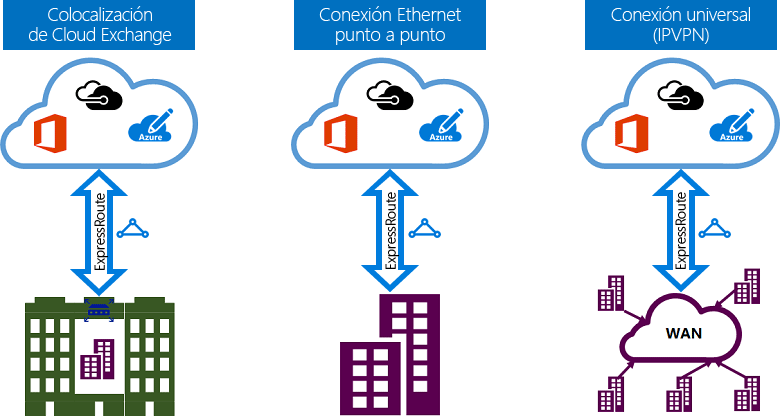

# Modelos de conectividad de ExpressRoute
Puede crear una conexión entre su red local y la nube de Microsoft de tres maneras diferentes: [colocalización de CloudExchange](#CloudExchange), [conexión Ethernet de punto a punto](#Ethernet), y [conexión universal (IPVPN)](#IPVPN). Los proveedores de conectividad pueden ofrecer uno o varios modelos de conectividad. Puede trabajar en conjunción con su proveedor de conectividad para elegir el modelo que mejor le convenga.
  

## Ubicación compartida en un intercambio en la nube
Si está colocado en la misma instalación con un intercambio en la nube, puede solicitar conexiones cruzadas virtuales a Microsoft Cloud a través del intercambio de Ethernet del proveedor de la ubicación compartida. Los proveedores de ubicación compartida pueden ofrecer conexiones cruzadas de nivel 2, o conexiones cruzadas de nivel 3 administradas entre la infraestructura en la instalación de ubicación compartida y Microsoft Cloud.

## Conexiones Ethernet de punto a punto
Puede conectar sus centros de datos locales u oficinas a Microsoft Cloud a través de vínculos de Ethernet de punto a punto. Los proveedores de Ethernet de punto a punto pueden ofrecer conexiones de nivel 2 o de nivel 3 administradas entre el sitio y Microsoft Cloud.

## Redes de conexión universal (IPVPN)
Puede integrar la WAN con Microsoft Cloud. Los proveedores IPVPN (normalmente VPN MPLS) ofrecen conectividad universal entre los centros de datos y las sucursales. Microsoft Cloud puede estar conectada a la WAN de forma que parezca otra sucursal más. Los proveedores de WAN normalmente ofrecen una conectividad de nivel 3 administrada. Las características y capacidades de ExpressRoute son todas idénticas en todos los modelos de conectividad anteriores. 

## Pasos siguientes
* Obtenga información acerca de las conexiones ExpressRoute y dominios de enrutamiento. Consulte [Circuitos y dominios de enrutamiento de ExpressRoute](expressroute-circuit-peerings.md).
* Información acerca de las características de ExpressRoute. Consulte [Información técnica de ExpressRoute](expressroute-introduction.md)
* Busque un proveedor de servicios. Consulte [Asociados de ExpressRoute de Azure y ubicaciones de emparejamiento](expressroute-locations.md).
* Asegúrese de que se cumplen todos los requisitos previos. Consulte [Requisitos previos de ExpressRoute](expressroute-prerequisites.md).
* Consulte los requisitos de [enrutamiento](expressroute-routing.md), [NAT](expressroute-nat.md) y [QoS](expressroute-qos.md).
* Configure su conexión ExpressRoute.
  * [Creación de un circuito ExpressRoute](expressroute-howto-circuit-portal-resource-manager.md)
  * [Configuración del enrutamiento](expressroute-howto-routing-portal-resource-manager.md)
  * [Vinculación de redes virtuales a circuitos ExpressRoute](expressroute-howto-linkvnet-portal-resource-manager.md)