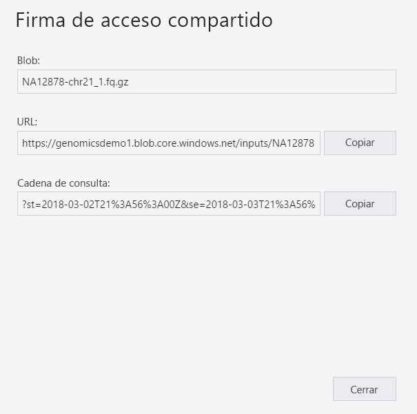
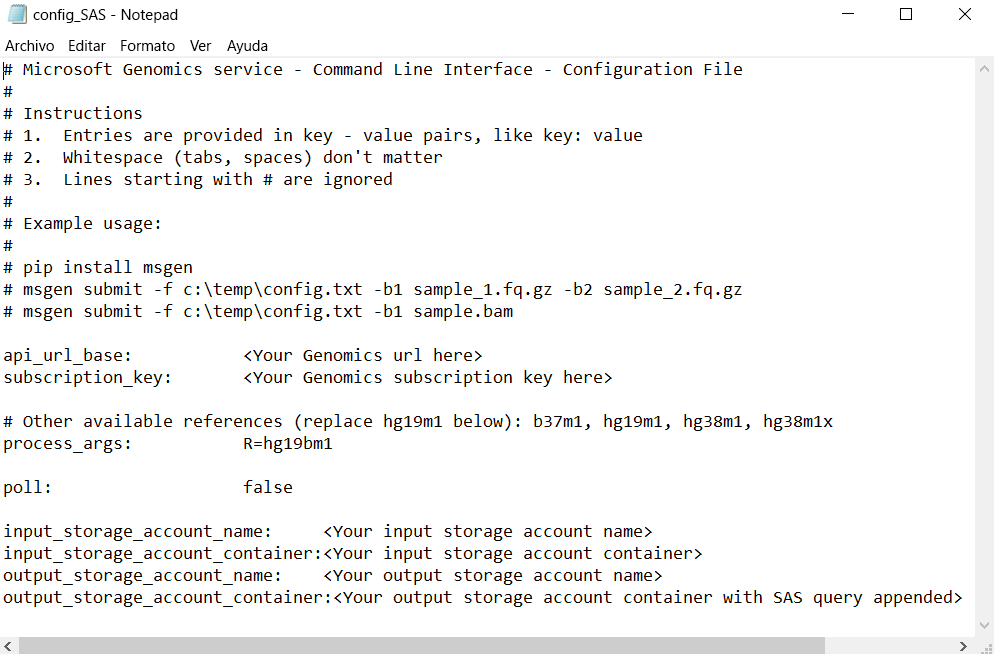

# <a name="submit-a-workflow-using-a-sas-instead-of-a-storage-account-key"></a>Envío de un flujo de trabajo mediante una firma de acceso compartido en lugar de una clave de cuenta de almacenamiento

Esta guía de inicio rápido muestra cómo enviar un flujo de trabajo al servicio Microsoft Genomics mediante un archivo config.txt que contiene [firmas de acceso compartido (SAS)](https://docs.microsoft.com/azure/storage/common/storage-dotnet-shared-access-signature-part-1) en lugar de claves de cuenta de almacenamiento. Esta característica puede resultar útil si hay problemas de seguridad relacionados con el hecho de tener la clave de cuenta de almacenamiento visible en el archivo config.txt. En este artículo se da por supuesto que ya ha instalado y ejecutado el cliente `msgen` y está familiarizado con el uso de Azure Storage. Si ha enviado correctamente un flujo de trabajo usando los datos de ejemplo proporcionados, puede continuar con esta guía de inicio rápido. 

## <a name="what-is-a-sas"></a>¿Qué es una SAS?
Una [firma de acceso compartido (SAS)](https://docs.microsoft.com/azure/storage/common/storage-dotnet-shared-access-signature-part-1) ofrece acceso delegado a los recursos en la cuenta de almacenamiento. Con una SAS, puede conceder acceso a los recursos de su cuenta de almacenamiento sin compartir las claves de cuenta. Este es el aspecto clave de usar las firmas de acceso compartido en las aplicaciones: una SAS es una forma segura de compartir los recursos de almacenamiento sin poner en peligro las claves de cuenta.

La SAS que se envíe a Microsoft Genomics debe ser una [SAS de servicio](https://docs.microsoft.com/rest/api/storageservices/Constructing-a-Service-SAS) que permita delegar el acceso únicamente al blob o contenedor en el que estén almacenados los archivos de entrada y de salida. 

El identificador URI de un token de firma de acceso compartido (SAS) en el nivel de servicio consta del identificador URI al recurso para el que la SAS delegará el acceso, seguido del token de SAS. El token de SAS es la cadena de consulta que incluye toda la información necesaria para autenticar la SAS y también permite especificar el recurso, los permisos disponibles para el acceso, el intervalo de tiempo durante el cual la firma es válida, la dirección IP o intervalo de direcciones admitidas desde las que las solicitudes pueden originarse, el protocolo admitido con el que se puede hacer una solicitud, un identificador de directiva de acceso opcional asociado a la solicitud y la firma propiamente dicha. 

## <a name="sas-needed-for-submitting-a-workflow-to-the-microsoft-genomics-service"></a>Firma de acceso compartido para enviar un flujo de trabajo al servicio Microsoft Genomics
Se necesitan dos o más tokens de SAS para cada flujo de trabajo que se envía al servicio Microsoft Genomics, uno para cada archivo de entrada y otro para el contenedor de salida.

La firma de acceso compartido de los archivos de entrada debe tener las siguientes propiedades:
1.  Ámbito (cuenta, contenedor, blob): blob
2.  Expiración: 48 horas a partir de ahora
3.  Permisos: lectura

La firma de acceso compartido del contenedor de salida debe tener las siguientes propiedades:
1.  Ámbito (cuenta, contenedor, blob): contenedor
2.  Expiración: 48 horas a partir de ahora
3.  Permisos: lectura, escritura, eliminación


## <a name="create-a-sas-for-the-input-files-and-the-output-container"></a>Creación de una SAS para los archivos de entrada y el contenedor de salida
Hay dos maneras de crear un token de SAS: mediante el Explorador de Azure Storage o mediante programación.  Si va a escribir código, puede construir la firma de acceso compartido por sí mismo o usar el SDK de Azure Storage en el lenguaje que prefiera.


### <a name="set-up-create-a-sas-using-azure-storage-explorer"></a>Configuración: Creación de una SAS mediante el Explorador de Azure Storage

El [Explorador de Azure Storage](https://azure.microsoft.com/features/storage-explorer/) es una herramienta para administrar los recursos que están almacenados en Azure Storage.  Puede obtener más información sobre cómo usar el Explorador de Azure Storage [aquí](https://docs.microsoft.com/azure/vs-azure-tools-storage-manage-with-storage-explorer).

La firma de acceso compartido de los archivos de entrada debe estar limitada al archivo de entrada concreto (blob). Para crear un token de SAS, siga [estas instrucciones](https://docs.microsoft.com/en-us/azure/storage/blobs/storage-quickstart-blobs-storage-explorer#work-with-shared-access-signatures). Una vez que haya creado la firma de acceso compartido, se proporcionan la dirección URL completa con la cadena de consulta, así como la cadena de consulta solamente y se pueden copiar desde la pantalla.

 


### <a name="set-up-create-a-sas-programattically"></a>Configuración: Creación de una firma de acceso compartido mediante programación

Para crear una firma de acceso compartido mediante el SDK de Azure Storage, consulte la documentación existente para varios lenguajes, entre los que se incluyen [.NET](https://docs.microsoft.com/azure/storage/blobs/storage-dotnet-shared-access-signature-part-2#generate-a-shared-access-signature-uri-for-a-blob), [Python](https://docs.microsoft.com/azure/storage/blobs/storage-python-how-to-use-blob-storage) y [Node.js](https://docs.microsoft.com/azure/storage/blobs/storage-nodejs-how-to-use-blob-storage#work-with-shared-access-signatures). 

Para crear una SAS sin un SDK, la cadena de consulta de la SAS se puede construir directamente incluyendo toda la información necesaria para autenticarla. Estas [instrucciones](https://docs.microsoft.com/rest/api/storageservices/constructing-a-service-sas) explican detalladamente los componentes de la cadena de consulta de SAS y cómo construirla. La firma SAS necesaria se crea generando un HMAC con la información de autenticación del blob o contenedor tal y como se describe en estas [instrucciones](https://docs.microsoft.com/rest/api/storageservices/service-sas-examples).


## <a name="add-the-sas-to-the-configtxt-file"></a>Adición de la firma de acceso compartido al archivo config.txt
Para ejecutar un flujo de trabajo a través del servicio Microsoft Genomics mediante una cadena de consulta de SAS, edite el archivo config.txt para quitar las claves. A continuación, anexe la cadena de consulta de SAS (que comienza por un signo `?`) al nombre del contenedor de salida tal y como se indica. 



Use el cliente de Python para Microsoft Genomics para enviar el flujo de trabajo con el siguiente comando y anexe la cadena de consulta de SAS correspondiente a uno de los nombres de blob de entrada:

```python
msgen submit -f [full path to your config file] -b1 [name of your first paired end read file, SAS query string appended] -b2 [name of your second paired end read file, SAS query string appended]
```

### <a name="if-adding-the-input-file-names-to-the-configtxt-file"></a>En caso de que agregue los nombres de archivo de entrada al archivo config.txt
Alternativamente, los nombres de los archivos de lectura de extremos emparejados se pueden agregar directamente al archivo config.txt, con los tokens de consulta de SAS anexados como se indica a continuación:


En este caso, use el cliente de Python de Microsoft Genomics para enviar el flujo de trabajo con el siguiente comando, ignorando los comandos `-b1` y `-b2`:

```python
msgen submit -f [full path to your config file] 
```

## <a name="next-steps"></a>Pasos siguientes
En este artículo, ha usado tokens de SAS en lugar de claves de cuentas para enviar un flujo de trabajo al servicio Microsoft Genomics mediante el cliente de Python `msgen`. Para obtener información adicional sobre el envío del flujo de trabajo y otros comandos que puede usar con el servicio Microsoft Genomics, consulte nuestras [preguntas más frecuentes](frequently-asked-questions-genomics.md). 
