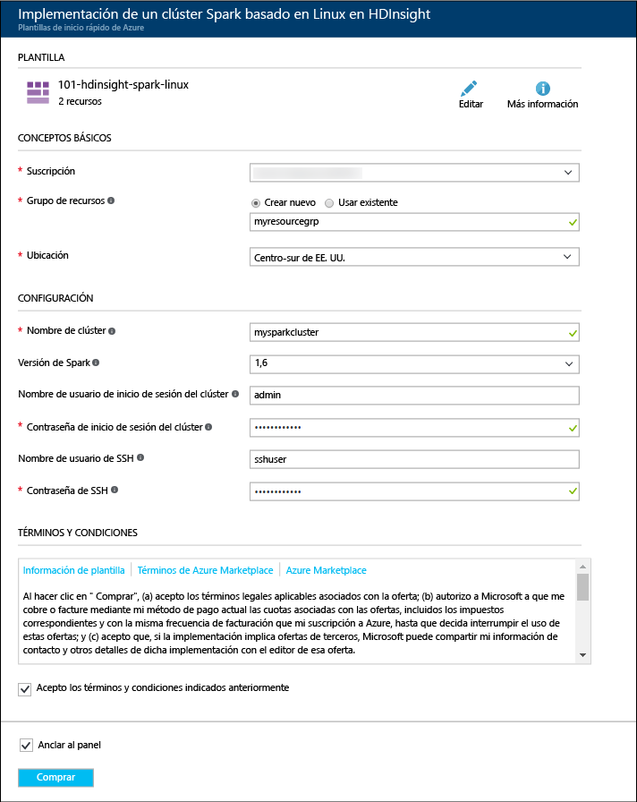

# Creación de un clúster de Apache Spark en Azure HDInsight

En este artículo, aprenderá a crear un clúster de Apache Spark en Azure HDInsight. Para obtener información sobre Spark en HDInsight, consulte [Introducción a Apache Spark en HDInsight de Azure](hdinsight-apache-spark-overview.md).

   

## Requisitos previos

* **Una suscripción de Azure**. Antes de comenzar este tutorial, debe tener una suscripción a Azure. Consulte la página [Cree su cuenta gratuita de Azure hoy mismo](https://azure.microsoft.com/free).

## Creación de un clúster de HDInsight Spark

En esta sección, creará un clúster de HDInsight Spark mediante una [plantilla de Azure Resource Manager](https://azure.microsoft.com/resources/templates/101-hdinsight-spark-linux/). Para conocer otros métodos de creación de clústeres, consulte [Creación de clústeres de Hadoop basados en Linux en HDInsight](hdinsight-hadoop-provision-linux-clusters.md).

1. Haga clic en la imagen siguiente para abrir la plantilla en el Portal de Azure.         

    

2. Escriba los siguientes valores:

    

    * **Suscripción**: seleccione su suscripción de Azure para este clúster.
    * **Grupo de recursos**: cree un grupo de recursos o seleccione uno existente. El grupo de recursos se usa para administrar los recursos de Azure para sus proyectos.
    * **Ubicación**: seleccione una ubicación para el grupo de recursos. La plantilla utiliza esta ubicación para crear el clúster, así como para el almacenamiento de clúster predeterminado.
    * **Nombre del clúster**: escriba un nombre para el clúster de HDInsight que va a crear.
    * **Versión de Spark**: seleccione **2.0** como la versión de Spark que quiere instalar en el clúster.
    * **Nombre de inicio de sesión y contraseña de clúster**: el nombre de inicio de sesión predeterminado es admin.
    * **Nombre de usuario y contraseña de SSH**.

   Anote estos valores.  Los necesitará más adelante en el tutorial.

3. Seleccione **I agree to the terms and conditions stated above** (Acepto los términos y condiciones indicados anteriormente) y **Anclar al panel** y haga clic en **Purchase** (Comprar). Puede ver un icono nuevo llamado Envío de implementación para la implementación de plantilla. La creación del clúster tarda aproximadamente 20 minutos.

Si surge un problema con la creación de clústeres de HDInsight, podría deberse a que no tiene los permisos adecuados para hacerlo. Consulte [Requisitos de control de acceso](hdinsight-administer-use-portal-linux.md#create-clusters) para más información.

> [!NOTE]
> En este artículo se crea un clúster de Spark que usa [blobs de Azure Storage como almacenamiento](hdinsight-hadoop-use-blob-storage.md). También puede crear un clúster de Spark que use [Azure Data Lake Store](hdinsight-hadoop-use-data-lake-store.md) como almacenamiento predeterminado. Consulte [Creación de un clúster de HDInsight con el Almacén de Data Lake mediante el Portal de Azure](../data-lake-store/data-lake-store-hdinsight-hadoop-use-portal.md).
>
>

## Ejecución de una consulta de Hive con Spark SQL

Cuando se utiliza un cuaderno de Jupyter Notebook configurado para el clúster de HDInsight Spark, obtendrá un valor `sqlContext` preestablecido que puede usar para ejecutar consultas de Hive con Spark SQL. En esta sección, aprenderá a iniciar un cuaderno de Jupyter Notebook y después a ejecutar una consulta de Hive básica.

1. Abra el [Azure Portal](https://portal.azure.com/).

2. Si ha elegido anclar el clúster al panel, haga clic en el icono de clúster desde el panel para abrir la hoja del clúster.

    Si no ancló el clúster al panel, en el panel izquierdo, haga clic en **Clústeres de HDInsight** y luego haga clic en el clúster que ha creado.

3. En **Quick links** (Vínculos rápidos), haga clic en **Cluster dashboards** (Paneles de clúster) y después en **Jupyter Notebook**. Cuando se le pida, escriba las credenciales del clúster.

   

   > [!NOTE]
   > También puede acceder al cuaderno de Jupyter en el clúster si abre la siguiente dirección URL en el explorador. Reemplace **CLUSTERNAME** por el nombre del clúster:
   >
   > `https://CLUSTERNAME.azurehdinsight.net/jupyter`
   >
   >
3. Cree un cuaderno. Haga clic en **Nuevo** y, luego, en **PySpark**.

   

   Se crea y se abre un nuevo Notebook con el nombre Untitled(Untitled.pynb).

4. Haga clic en el nombre del Notebook en la parte superior y escriba un nombre descriptivo.

    

5.  Pegue el código siguiente en una celda vacía y presione **MAYÚS + ENTRAR** para ejecutar el código. En el código siguiente `%%sql` (denominado instrucción mágica de SQL) indica a un cuaderno de Jupyter Notebook que utilice el valor `sqlContext` predeterminado para ejecutar la consulta de Hive. La consulta recupera las 10 primeras filas de una tabla de Hive (**hivesampletable**) que está disponible de forma predeterminada en todos los clústeres de HDInsight.

        %%sql
        SELECT * FROM hivesampletable LIMIT 10

    

    Para más información sobre las `%%sql` instrucciones mágicas y los contextos preestablecidos, consulte [Kernels para Jupyter Notebook en clústeres Spark en Azure HDInsight](hdinsight-apache-spark-jupyter-notebook-kernels.md).

    > [!NOTE]
    > Cada vez que se ejecuta una consulta en Jupyter, el título de la ventana del explorador web muestra el estado **(Busy)** (Ocupado) junto con el título del Notebook. También verá un círculo sólido junto al texto **PySpark** en la esquina superior derecha. Cuando finaliza el trabajo, cambia a un círculo vacío.
    >
    >
    
6. Debe actualizar la pantalla para mostrar el resultado de la consulta.

    

7. Cuando haya terminado de ejecutar la aplicación, cierre el Notebook para liberar los recursos del clúster. Para ello, en el menú **Archivo** del cuaderno, haga clic en **Cerrar y detener**.

8. Si tiene previsto completar los pasos siguientes en otro momento, asegúrese de eliminar el clúster de HDInsight que creó en este artículo. 

    [!INCLUDE [delete-cluster-warning](../../includes/hdinsight-delete-cluster-warning.md)]

## Paso siguiente 

En este artículo ha aprendido a crear un clúster de HDInsight Spark y a ejecutar una consulta básica de Spark SQL. Continúe hasta el siguiente artículo para obtener información sobre cómo usar un clúster de HDInsight Spark para ejecutar consultas interactivas en datos de ejemplo.

> [!div class="nextstepaction"]
>[Ejecución de consultas interactivas en un clúster de HDInsight Spark](hdinsight-apache-spark-load-data-run-query.md)

