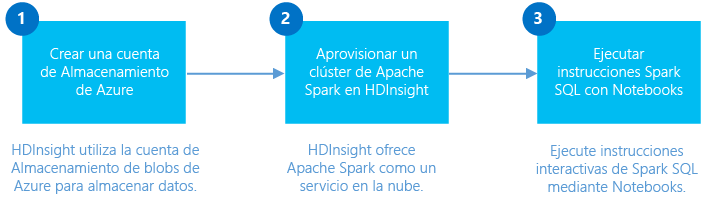

<properties
	pageTitle="Creación de un clúster Spark en HDInsight Linux y uso de Spark SQL desde Jupyter para análisis interactivos | Microsoft Azure"
	description="Instrucciones paso a paso sobre cómo crear rápidamente un clúster Apache Spark en HDInsight y luego usar Spark SQL en cuadernos de Jupyter para ejecutar consultas interactivas."
	services="hdinsight"
	documentationCenter=""
	authors="nitinme"
	manager="paulettm"
	editor="cgronlun"
	tags="azure-portal"/>

<tags
	ms.service="hdinsight"
	ms.workload="big-data"
	ms.tgt_pltfrm="na"
	ms.devlang="na"
	ms.topic="get-started-article"
	ms.date="07/25/2016"
	ms.author="nitinme"/>

# Introducción: creación de clústeres Apache Spark en HDInsight para Linux y ejecución de consultas interactivas mediante Spark SQL

Obtenga información sobre cómo crear un clúster Apache Spark en HDInsight y después usar cuadernos de [Jupyter](https://jupyter.org) para ejecutar consultas interactivas de Spark SQL en el clúster Spark.

   

[AZURE.INCLUDE [delete-cluster-warning](../../includes/hdinsight-delete-cluster-warning.md)]

**Requisitos previos:**

- **Una suscripción de Azure**. Antes de comenzar este tutorial, debe tener una suscripción a Azure. Vea [Obtener evaluación gratuita de Azure](https://azure.microsoft.com/documentation/videos/get-azure-free-trial-for-testing-hadoop-in-hdinsight/).

- **Un cliente de Shell seguro**: sistemas Linux, Unix y OS X ofrecen un cliente SSH mediante el comando `ssh`. Para sistemas Windows, se recomienda [PuTTY](http://www.chiark.greenend.org.uk/~sgtatham/putty/download.html).
    
- **Claves de Shell seguro (SSH) (opcional)**: puede proteger la cuenta de SSH usada para conectarse al clúster mediante una contraseña o una clave pública. El uso de una contraseña le permite comenzar rápidamente, y debe usar esta opción si desea crear un clúster y ejecutar algunos trabajos de prueba rápidamente. El uso de una clave es un método más seguro, sin embargo, requiere configuración adicional. Puede ser conveniente usar este enfoque al crear un clúster en producción. En este artículo, se usa el enfoque de contraseña. Para obtener instrucciones sobre cómo crear y usar claves SSH con HDInsight, consulte los siguientes artículos:

	-  Desde un equipo con Linux: [Utilización de SSH con HDInsight basado en Linux (Hadoop) desde Linux, Unix u OS X](hdinsight-hadoop-linux-use-ssh-unix.md).
    
	-  Desde un equipo con Windows: [Utilización de SSH con HDInsight basado en Linux (Hadoop) desde Windows](hdinsight-hadoop-linux-use-ssh-windows.md).

>[AZURE.NOTE] Este artículo usa para crear un clúster Spark que usa una plantilla ARM [Blobs de almacenamiento de Azure como el almacenamiento de clúster](hdinsight-hadoop-use-blob-storage.md). También puede crear un clúster Spark que usa el [Almacén de Azure Data Lake](../data-lake-store/data-lake-store-overview.md) como un almacenamiento adicional, además de Blobs de Almacenamiento de Azure como el almacenamiento predeterminado. Consulte [Creación de un clúster de HDInsight con el Almacén de Data Lake mediante el Portal de Azure](../data-lake-store/data-lake-store-hdinsight-hadoop-use-portal.md).

## Creación de un clúster de Spark

En esta sección, se crea un clúster de HDInsight versión 3.4 (Spark versión 1.6.1) mediante una plantilla de Azure Resource Manager. Para obtener información acerca de las diferentes versiones de HDInsight y sus contratos de nivel de servicio, consulte la página [Control de versiones de componentes de HDInsight](hdinsight-component-versioning.md). Para conocer otros métodos de creación de clústeres, consulte [Creación de clústeres de Hadoop basados en Linux en HDInsight](hdinsight-hadoop-provision-linux-clusters.md).

1. Haga clic en la imagen siguiente para abrir una plantilla ARM en el Portal de Azure.

    
    
    La plantilla de ARM se encuentra en un contenedor de blobs público: *https://hditutorialdata.blob.core.windows.net/armtemplates/create-linux-based-spark-cluster-in-hdinsight.json*.
   
2. En la hoja Parámetros, escriba lo siguiente:

    - **ClusterName**: escriba un nombre para el clúster de Hadoop que va a crear.
    - **Nombre de inicio de sesión y contraseña de clúster**: el nombre de inicio de sesión predeterminado es admin.
    - **Nombre de usuario y contraseña de SSH**.
    
    Escriba estos valores. Los necesitará más adelante en el tutorial.

    > [AZURE.NOTE] SSH sirve para tener acceso remoto a un clúster de HDInsight mediante una línea de comandos. El nombre de usuario y la contraseña que usa aquí se emplean al conectarse al clúster a través de SSH. Además, el nombre de usuario SSH tiene que ser único, ya que crea una cuenta de usuario en todos los nodos del clúster de HDInsight. A continuación se indican algunos de los nombres de cuenta reservados para su uso en los servicios que se ejecutan en el clúster y no pueden usarse como nombre de usuario SSH:
    >
    > root, hdiuser, storm, hbase, ubuntu, zookeeper, hdfs, yarn, mapred, hbase, hive, oozie, falcon, sqoop, admin, tez, hcat, hdinsight-zookeeper.

	> Para obtener más información sobre el uso de SSH con HDInsight, vea uno de los siguientes artículos:

	> * [Utilización de SSH con Hadoop en HDInsight basado en Linux desde Linux, Unix u OS X](hdinsight-hadoop-linux-use-ssh-unix.md)
	> * [Utilización de SSH con Hadoop en HDInsight basado en Linux desde Windows](hdinsight-hadoop-linux-use-ssh-windows.md)

    
3\. Haga clic en **Aceptar** para guardar los parámetros.

4\. En la hoja **Implementación personalizada**, haga clic en el cuadro desplegable **Grupo de recursos** y, después, haga clic en **Nuevo** para crear un grupo de recursos. El grupo de recursos es un contenedor que agrupa al clúster, a la cuenta de almacenamiento dependiente y a otros recursos vinculados.

5\. Haga clic en **Términos legales** y luego en **Crear**.

6\. Haga clic en **Crear**. Verá un icono nuevo llamado Envío de implementación para la implementación de plantilla. Tarda aproximadamente 20 minutos en crear un clúster y la base de datos SQL.

## Ejecución de consultas SQL Spark mediante un cuaderno de Jupyter Notebook

En esta sección, utilice un cuaderno de Jupyter Notebook, para ejecutar consultas Spark SQL en un clúster Spark. Los clústeres de HDInsight Spark proporcionan dos kernels que se pueden utilizar con el cuaderno de Jupyter Notebook. Dichos componentes son:

* **PySpark** (para aplicaciones escritas con Python)
* **Spark** (para aplicaciones escritas con Scala)

En este artículo, usará el kernel de PySpark. En el artículo [Kernels disponibles para cuadernos de Jupyter con clústeres Spark en HDInsight basados en Linux en HDInsight (versión preliminar)](hdinsight-apache-spark-jupyter-notebook-kernels.md#why-should-i-use-the-new-kernels) encontrará información detallada acerca de las ventajas de usar el kernel de PySpark. Sin embargo, algunas de las ventajas principales de usar el kernel de PySpark son:

* No es necesario establecer los contextos de Spark ni Hive. Se establecen automáticamente para usted.
* Puede usar instrucciones mágicas de celda, como `%%sql`, para ejecutar directamente las consultas de SQL o Hive, sin los fragmentos de código anteriores.
* Se visualiza automáticamente el resultado de las consultas de SQL o Hive.

### Creación de un cuaderno de Jupyter Notebook con el kernel de PySpark 

1. Desde el [Portal de Azure](https://portal.azure.com/), en el panel de inicio, haga clic en el icono del clúster Spark (si lo ancló al panel de inicio). También puede navegar hasta el clúster en **Examinar todo** > **Clústeres de HDInsight**.

2. En la hoja del clúster Spark, haga clic en **Vínculos rápidos** y, luego, en la hoja **Panel de clúster**, haga clic en **Jupyter Notebook**. Cuando se le pida, escriba las credenciales del clúster.

	> [AZURE.NOTE] También puede comunicarse con el equipo Jupyter Notebook en el clúster si abre la siguiente dirección URL en el explorador. Reemplace __CLUSTERNAME__ por el nombre del clúster:
	>
	> `https://CLUSTERNAME.azurehdinsight.net/jupyter`

2. Cree un nuevo notebook. Haga clic en **Nuevo** y, luego, en **PySpark**.

	

3. Se crea y se abre un nuevo cuaderno con el nombre Untitled.pynb. Haga clic en el nombre del cuaderno en la parte superior y escriba un nombre descriptivo.

	

4. Dado que creó un cuaderno con el kernel PySpark, no necesitará crear ningún contexto explícitamente. Los contextos Spark y Hive se crearán automáticamente al ejecutar la primera celda de código. Puede empezar por importar los tipos necesarios para este escenario. Para ello, pegue el siguiente fragmento de código en una celda y presione **MAYÚS + ENTRAR**.

		from pyspark.sql.types import *
		
	Cada vez que se ejecuta un trabajo en Jupyter, el título de la ventana del explorador web mostrará el estado **(Busy)** (Ocupado) junto con el título del cuaderno. También verá un círculo sólido junto al texto **PySpark** en la esquina superior derecha. Una vez completado el trabajo, cambiará a un círculo hueco.

	 

4. Cargue los datos de ejemplo en una tabla temporal. Cuando crea un clúster Spark en HDInsight, el archivo de datos de ejemplo, **hvac.csv**, se copia en la cuenta de almacenamiento asociada en **\\HdiSamples\\HdiSamples\\SensorSampleData\\hvac**.

	En una celda vacía, pegue el siguiente ejemplo de código y presione **MAYÚS + ENTRAR**. Este ejemplo de código registra los datos en una tabla temporal llamada **hvac**.

		# Load the data
		hvacText = sc.textFile("wasbs:///HdiSamples/HdiSamples/SensorSampleData/hvac/HVAC.csv")
		
		# Create the schema
		hvacSchema = StructType([StructField("date", StringType(), False),StructField("time", StringType(), False),StructField("targettemp", IntegerType(), False),StructField("actualtemp", IntegerType(), False),StructField("buildingID", StringType(), False)])
		
		# Parse the data in hvacText
		hvac = hvacText.map(lambda s: s.split(",")).filter(lambda s: s[0] != "Date").map(lambda s:(str(s[0]), str(s[1]), int(s[2]), int(s[3]), str(s[6]) ))
		
		# Create a data frame
		hvacdf = sqlContext.createDataFrame(hvac,hvacSchema)
		
		# Register the data fram as a table to run queries against
		hvacdf.registerTempTable("hvac")

5. Al usar un kernel de PySpark, puede ejecutar directamente una consulta SQL en la tabla temporal **hvac** que acaba de crear con la instrucción mágica `%%sql`. Para más información sobre la instrucción mágica `%%sql`, así como otras que hay disponible con el kernel de PySpark, consulte [Kernels disponibles para cuadernos de Jupyter con clústeres Spark en HDInsight basados en Linux en HDInsight (versión preliminar)](hdinsight-apache-spark-jupyter-notebook-kernels.md#why-should-i-use-the-new-kernels).
		
		%%sql
		SELECT buildingID, (targettemp - actualtemp) AS temp_diff, date FROM hvac WHERE date = "6/1/13"

5. Una vez que el trabajo se completa correctamente, se muestra de forma predeterminada el resultado tabular siguiente.

 	

	También puede ver la salida en otras visualizaciones. Por ejemplo, un gráfico de área con la misma salida tendría el siguiente aspecto.

	

6. Cuando haya terminado de ejecutar la aplicación, debe apagar el cuaderno para liberar los recursos. Para ello, en el menú **Archivo** del cuaderno, haga clic en **Cerrar y detener**. De esta manera se apagará y se cerrará el cuaderno.

##Eliminación del clúster

[AZURE.INCLUDE [delete-cluster-warning](../../includes/hdinsight-delete-cluster-warning.md)]

## Otras referencias

* [Introducción a Apache Spark en HDInsight de Azure](hdinsight-apache-spark-overview.md)

### Escenarios

* [Spark with BI: Realizar el análisis de datos interactivos con Spark en HDInsight con las herramientas de BI](hdinsight-apache-spark-use-bi-tools.md)

* [Creación de aplicaciones de Aprendizaje automático con Apache Spark en HDInsight de Azure](hdinsight-apache-spark-ipython-notebook-machine-learning.md)

* [Spark con aprendizaje automático: uso de Spark en HDInsight para predecir los resultados de la inspección de alimentos](hdinsight-apache-spark-machine-learning-mllib-ipython.md)

* [Streaming con Spark: uso de Spark en HDInsight para compilar aplicaciones de streaming en tiempo real](hdinsight-apache-spark-eventhub-streaming.md)

* [Análisis del registro del sitio web con Spark en HDInsight](hdinsight-apache-spark-custom-library-website-log-analysis.md)

* [Análisis de datos de telemetría de Application Insights con Spark en HDInsight](hdinsight-spark-analyze-application-insight-logs.md)

### Creación y ejecución de aplicaciones

* [Crear una aplicación independiente con Scala](hdinsight-apache-spark-create-standalone-application.md)

* [Submit Spark jobs remotely using Livy with Spark clusters on HDInsight (Linux)](hdinsight-apache-spark-livy-rest-interface.md)

### Herramientas y extensiones

* [Use HDInsight Tools Plugin for IntelliJ IDEA to create and submit Spark Scala applications (Uso del complemento de herramientas de HDInsight para IntelliJ IDEA para crear y enviar aplicaciones Scala Spark)](hdinsight-apache-spark-intellij-tool-plugin.md)

* [Use HDInsight Tools Plugin for IntelliJ IDEA to debug Spark applications remotely (Uso del complemento de herramientas de HDInsight para IntelliJ IDEA para depurar aplicaciones de Spark de forma remota)](hdinsight-apache-spark-intellij-tool-plugin-debug-jobs-remotely.md)

* [Uso de cuadernos de Zeppelin con un clúster Spark en HDInsight](hdinsight-apache-spark-use-zeppelin-notebook.md)

* [Kernels disponibles para el cuaderno de Jupyter en el clúster Spark para HDInsight](hdinsight-apache-spark-jupyter-notebook-kernels.md)

* [Uso de paquetes externos con cuadernos de Jupyter Notebook](hdinsight-apache-spark-jupyter-notebook-use-external-packages.md)

* [Instalación de un cuaderno de Jupyter Notebook en el equipo y conexión al clúster de Apache Spark en HDInsight de Azure](hdinsight-apache-spark-jupyter-notebook-install-locally.md)

### Administración de recursos

* [Administración de recursos para el clúster Apache Spark en HDInsight de Azure](hdinsight-apache-spark-resource-manager.md)

* [Realización de seguimiento y depuración de trabajos que se ejecutan en un clúster de Apache Spark en HDInsight](hdinsight-apache-spark-job-debugging.md)

[hdinsight-versions]: hdinsight-component-versioning.md
[hdinsight-upload-data]: hdinsight-upload-data.md
[hdinsight-storage]: hdinsight-hadoop-use-blob-storage.md

[azure-purchase-options]: http://azure.microsoft.com/pricing/purchase-options/
[azure-member-offers]: http://azure.microsoft.com/pricing/member-offers/
[azure-free-trial]: http://azure.microsoft.com/pricing/free-trial/
[azure-management-portal]: https://manage.windowsazure.com/
[azure-create-storageaccount]: storage-create-storage-account.md

<!---HONumber=AcomDC_0817_2016-->