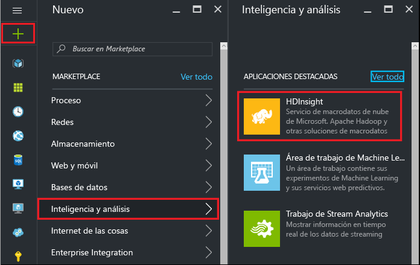
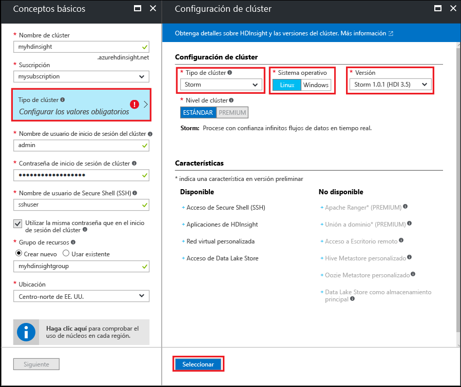

#Introducción a los ejemplos de Storm Starter para análisis de macrodatos en HDInsight basado en Linux

Apache Storm es un sistema de cálculo distribuido, escalable, con tolerancia a errores y en tiempo real para el procesamiento de secuencias de datos. Con Storm en HDInsight de Azure, puede crear un clúster de Storm basado en la nube que realice análisis en tiempo real de grandes cantidades de datos en tiempo real.

> [!IMPORTANT]
> Linux es el único sistema operativo que se usa en la versión 3.4 de HDInsight, o en las superiores. Para más información, consulte [El contrato de nivel de servicio para las versiones de clúster de HDInsight](hdinsight-component-versioning.md#hdi-version-32-and-33-nearing-deprecation-date).

## Requisitos previos

[!INCLUDE [delete-cluster-warning](../../includes/hdinsight-delete-cluster-warning.md)]

* **Una suscripción de Azure**. Vea [Obtener evaluación gratuita de Azure](https://azure.microsoft.com/documentation/videos/get-azure-free-trial-for-testing-hadoop-in-hdinsight/).

* **Familiaridad con SSH y SCP**. Para más información sobre el uso de SSH y SCP con HDInsight, consulte los siguientes documentos:
  
    * [Uso de SSH con Hadoop basado en Linux en HDInsight desde Bash en Windows 10, Linux, Unix u OS X](hdinsight-hadoop-linux-use-ssh-unix.md)
    
    * [Uso de SSH con Hadoop en HDInsight basado en Linux desde Windows con PuTTY](hdinsight-hadoop-linux-use-ssh-windows.md)

### Requisitos de control de acceso

[!INCLUDE [access-control](../../includes/hdinsight-access-control-requirements.md)]

## Creación de un clúster de Storm

Siga estos pasos para crear un clúster de Storm en HDInsight:

1. En [Azure Portal](https://portal.azure.com), seleccione **+ NUEVOE**, **Inteligencia y análisis** y luego seleccione **HDInsight**.
   
    

2. Introduzca la siguiente información de la hoja **Básico**:

    * **Nombre del clúster**: nombre del clúster de HDInsight.
    * **Suscripción**: seleccione la suscripción que vaya a usar.
    * **Nombre de usuario de inicio de sesión del clúster** y **contraseña de inicio de sesión de clúster**: inicio de sesión de acceso al clúster a través de HTTPS. Use estas credenciales para acceder a servicios como la interfaz de usuario de Ambari Web o la API de REST.
    * **Nombre de usuario de Secure Shell (SSH)**: inicio de sesión para acceder al clúster a través de SSH. De forma predeterminada, la contraseña es la misma que la de inicio de sesión en el clúster.
    * **Grupo de recursos**: en el que se va a crear el clúster.
    * **Ubicación**: región de Azure donde se va crear el clúster.
   
    

3. Seleccione **Tipo de clúster** y establezca los siguientes valores en la hoja **Configuración de clúster**:
   
    * **Tipo de clúster**: Storm

    * **Sistema operativo**: Linux

    * **Versión**: Storm 1.0.1 (HDI 3.5)

    * **Nivel de clúster**: estándar
     
    Por último, use el botón **Seleccionar** para guardar la configuración.
     
    

4. Después de seleccionar el tipo de clúster, use el botón __Seleccionar__ para establecer el tipo de clúster. A continuación, use el botón __Siguiente__ para finalizar la configuración básica.

5. Desde la hoja **Storage**, seleccione o cree una cuenta de Storage. Para seguir los pasos de este documento, deje los demás campos de esta hoja con los valores predeterminados. Use el botón __Siguiente__ para guardar la configuración de almacenamiento.

    

6. En la hoja **Resumen**, revise la configuración para el clúster. Use los vínculos __Edit__ (Editar) para cambiar cualquier configuración incorrecta. Por último, use el botón __Crear__ para crear el clúster.
   
    
   
    > [!NOTE]
    > Un clúster puede tardar hasta 20 minutos en crearse.

## Ejecución de una muestra de inicio de Storm en HDInsight

1. Conéctese al clúster de HDInsight con SSH:
   
        ssh USERNAME@CLUSTERNAME-ssh.azurehdinsight.net
   
    Si usó una contraseña para proteger la cuenta de usuario SSH, se le pedirá que la escriba. Si usó una clave pública, tal vez tenga que usar el parámetro `-i` para especificar la clave privada coincidente. Por ejemplo: `ssh -i ~/.ssh/id_rsa USERNAME@CLUSTERNAME-ssh.azurehdinsight.net`.
   
    Para obtener más información sobre el uso de SSH con HDInsight basado en Linux, vea los siguientes artículos:
   
    * [Uso de SSH con Hadoop basado en Linux en HDInsight desde Bash en Windows 10, Linux, Unix u OS X](hdinsight-hadoop-linux-use-ssh-unix.md)

    * [Uso de SSH con Hadoop en HDInsight basado en Linux desde Windows con PuTTY](hdinsight-hadoop-linux-use-ssh-windows.md)

2. Use el comando siguiente para iniciar una topología de ejemplo:
   
        storm jar /usr/hdp/current/storm-client/contrib/storm-starter/storm-starter-topologies-*.jar org.apache.storm.starter.WordCountTopology wordcount
   
    > [!NOTE]
    > En versiones anteriores de HDInsight, el nombre de clase de la topología es `storm.starter.WordCountTopology`, en lugar de `org.apache.storm.starter.WordCountTopology`.
   
    Este comando inicia la topología de ejemplo de WordCount en el clúster, con el nombre descriptivo de "wordcount". Genera frases aleatoriamente y cuenta la aparición de cada palabra en ellas.
   
    > [!NOTE]
    > Al enviar sus propias topologías al clúster, primero debe copiar el archivo jar que contiene el clúster antes de usar el comando `storm`. Use el comando `scp` para copiar el archivo. Por ejemplo: `scp FILENAME.jar USERNAME@CLUSTERNAME-ssh.azurehdinsight.net:FILENAME.jar`
    > 
    > El ejemplo de WordCount, y otros ejemplos de inicio de Storm, ya están incluidos en el clúster en `/usr/hdp/current/storm-client/contrib/storm-starter/`.

Si está interesado en ver el origen de los ejemplos de storm starter, puede encontrar el código en [https://github.com/apache/storm/tree/1.0.x-branch/examples/storm-starter](https://github.com/apache/storm/tree/1.0.x-branch/examples/storm-starter). Este vínculo es para Storm 1.0. x, que se proporciona con HDInsight 3.5. Para otras versiones de Storm, use el botón __Branch__ de la parte superior de la página para seleccionar otra versión de Storm.

## Supervisión de la topología

La interfaz de usuario de Storm ofrece una interfaz web para trabajar con topologías en ejecución y se incluye en el clúster de HDInsight.

Siga estos pasos para supervisar la topología mediante la interfaz de usuario de Storm:

1. Para mostrar la interfaz de usuario de Storm, abra un explorador web con https://CLUSTERNAME.azurehdinsight.net/stormui. Reemplace **CLUSTERNAME** por el nombre del clúster.
    
    > [!NOTE]
    > Si se le pide que ofrezca un nombre de usuario y una contraseña, escriba el administrador de clústeres (admin) y la contraseña que usó al crear el clúster.

2. En el **resumen de la topología**, seleccione la entrada **wordcount** de la columna **Nombre**. Se muestra información sobre la topología.
    
    
    
    Esta página ofrece la siguiente información:
    
    * **Estadísticas de topología** : información básica sobre el rendimiento de la topología, organizada en ventanas de tiempo.
     
        > [!NOTE]
        > Al seleccionar una ventana de tiempo específica, se cambia la ventana de tiempo de la información que aparece en otras secciones de la página.

    * **Spouts** : información básica sobre spouts, entre la que se incluye el último error que ha devuelto cada spout.
    
    * **Bolts** : información básica sobre bolts.
    
    * **Configuración de la topología** : información detallada sobre la configuración de la topología.
     
    Esta página también ofrece acciones que se pueden realizar en la topología:
   
    * **Activar** : reanuda el procesamiento de una topología desactivada.
    
    * **Desactivar** : pausa una topología en ejecución.
    
    * **Reequilibrar** : ajusta el paralelismo de la topología. Debe volver a equilibrar las topologías en ejecución después de haber cambiado el número de nodos del clúster. De esta forma, la topología ajusta el paralelismo para compensar el mayor o menor número de nodos del clúster. Para más información, consulte la entrada de blog [Understanding the parallelism of a Storm topology](http://storm.apache.org/documentation/Understanding-the-parallelism-of-a-Storm-topology.html).
    
    * **Eliminar** : finaliza una topología de Storm tras el tiempo de espera especificado.

3. En esta página, seleccione una entrada en la sección **Spouts** o **Bolts**. Se muestra información sobre el componente seleccionado.
   
    
   
    En esta página se muestra la siguiente información:
   
    * **Estadísticas de spouts y bolts** : información básica sobre el rendimiento de los componentes, organizada en ventanas de tiempo.
     
        > [!NOTE]
        > Al seleccionar una ventana de tiempo específica, se cambia la ventana de tiempo de la información que aparece en otras secciones de la página.
     
    * **Estadísticas de entrada** (solo bolt): información sobre los componentes que generan los datos que consume el bolt.
    
    * **Estadísticas de salida** : información sobre los datos que emite este bolt.
    
    * **Ejecutores** : información sobre las instancias de este componente.
    
    * **Errores** : errores que ha generado este componente.

4. Al ver los detalles de un spout o bolt, seleccione una entrada de la columna **Puerto** en la sección **Ejecutores** para ver los detalles de una instancia específica del componente.
   
        2015-01-27 14:18:02 b.s.d.task [INFO] Emitting: split default ["with"]
        2015-01-27 14:18:02 b.s.d.task [INFO] Emitting: split default ["nature"]
        2015-01-27 14:18:02 b.s.d.executor [INFO] Processing received message source: split:21, stream: default, id: {}, [snow]
        2015-01-27 14:18:02 b.s.d.task [INFO] Emitting: count default [snow, 747293]
        2015-01-27 14:18:02 b.s.d.executor [INFO] Processing received message source: split:21, stream: default, id: {}, [white]
        2015-01-27 14:18:02 b.s.d.task [INFO] Emitting: count default [white, 747293]
        2015-01-27 14:18:02 b.s.d.executor [INFO] Processing received message source: split:21, stream: default, id: {}, [seven]
        2015-01-27 14:18:02 b.s.d.task [INFO] Emitting: count default [seven, 1493957]
   
    En este ejemplo, la palabra **seven** se ha producido 1493957 veces. Este es el número de veces que se ha encontrado la palabra desde que se iniciara esta topología.

## Detención de la topología

Vuelva a la página **Resumen de la topología** de la topología de recuento de palabras y seleccione el botón **Eliminar** de la sección **Acciones de topología**. Cuando se le solicite, escriba 10 como los segundos de espera antes de detener la topología. Tras el período de tiempo de espera, ya no aparece la topología cuando visita la sección **IU de Storm** del panel.

## Eliminación del clúster

[!INCLUDE [delete-cluster-warning](../../includes/hdinsight-delete-cluster-warning.md)]

## Pasos siguientes

En este tutorial de Apache Storm, ha aprendido los conceptos básicos sobre cómo trabajar con Storm en HDInsight. A continuación, aprenda a [desarrollar topologías basadas en Java con Maven](hdinsight-storm-develop-java-topology.md).

Si ya está familiarizado con el desarrollo de topologías basadas en Java y desea implementar una topología ya existente en HDInsight, consulte [Implementación y administración de topologías de Apache Storm en HDInsight basado en Linux](hdinsight-storm-deploy-monitor-topology-linux.md).

Si es desarrollador de. NET, puede crear topologías de C# o C#/Java híbridas con Visual Studio. Para más información, consulte [Desarrollo de topologías de C# para Apache Storm en HDInsight con herramientas de Hadoop para Visual Studio](hdinsight-storm-develop-csharp-visual-studio-topology.md).

Por ejemplo, consulte los siguientes ejemplos de las topologías que pueden utilizarse con Storm en HDInsight:

* [Topologías de ejemplo para Storm en HDInsight](hdinsight-storm-example-topology.md)

[apachestorm]: https://storm.incubator.apache.org
[stormdocs]: http://storm.incubator.apache.org/documentation/Documentation.html
[stormstarter]: https://github.com/apache/storm/tree/master/examples/storm-starter
[stormjavadocs]: https://storm.incubator.apache.org/apidocs/
[azureportal]: https://manage.windowsazure.com/
[hdinsight-provision]: hdinsight-provision-clusters.md
[preview-portal]: https://portal.azure.com/

