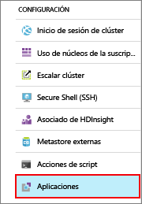
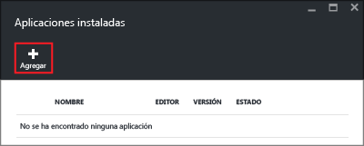
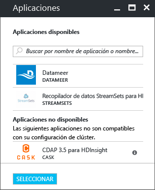
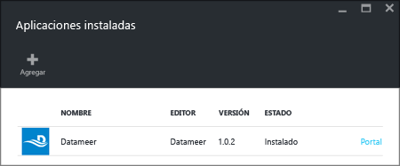

# Instalación de aplicaciones de Hadoop de terceros en Azure HDInsight

En este artículo, va a aprender a instalar una aplicación de Hadoop de terceros ya publicada en Azure HDInsight. Para obtener instrucciones sobre cómo instalar su propia aplicación, consulte [Instalación de aplicaciones de HDInsight personalizadas](hdinsight-apps-install-custom-applications.md).

Una aplicación de HDInsight es una aplicación que los usuarios pueden instalar en un clúster de HDInsight basado en Linux. Estas aplicaciones puede desarrollarlas Microsoft, fabricantes de software independientes (ISV) o el propio usuario.  

En la actualidad hay cuatro aplicaciones publicadas:

* **DATAIKU DDS on HDInsight**: Dataiku DSS (Data Science Studio) es un software que permite a los profesionales de datos (científicos de datos, analistas de negocios, desarrolladores, etc.) crear prototipos, compilar e implementar servicios muy específicos que transforman datos sin procesar en predicciones de negocio de gran impacto.
* **Datameer**: [Datameer](http://www.datameer.com/documentation/display/DAS50/Home?ls=Partners&lsd=Microsoft&c=Partners&cd=Microsoft) ofrece a los analistas una forma interactiva de detectar, analizar y visualizar los resultados sobre macrodatos. Reúna más orígenes de datos con facilidad para detectar nuevas relaciones y obtener las respuestas que necesita rápidamente.
* **Streamsets Data Collector para HDnsight** proporciona un entorno de desarrollo integrado (IDE) con multitud de características que permite diseñar, probar, implementar y administrar canalizaciones de ingesta todos con todos que crean una malla de datos de transmisión y por lotes, e incluyen varias de transformaciones internas de transmisión (sin tener que escribir código personalizado). 
* **Cask CDAP para HDInsight** proporciona la primera plataforma de integración unificada para macrodatos que reduce el tiempo de producción de aplicaciones de datos y lagos de datos en un 80 %. Esta aplicación solo admite con clústeres Standard HBase 3.4.
* **H2O Artificial Intelligence para HDInsight (Beta)** H2O Sparkling Water admite los siguientes algoritmos distribuidos: GLM, Naïve Bayes, Distributed Random Forest, Gradient Boosting Machine, Deep Neural Networks, Deep learning, K-means, PCA, Generalized Low Rank Models, Anomaly Detection y Autoencoders.
* **Plataforma de análisis de Kyligence** La plataforma de análisis de Kyligence (KAP) es un almacén de datos preparado para la empresa con tecnología Apache Kylin y Apache Hadoop; permite la latencia de consultas en fracciones de segundo en el conjunto de datos de gran escala y simplifica el análisis de datos para usuarios empresariales y analistas. 
* **SnapLogic Hadooplex** SnapLogic Hadooplex que se ejecuta en HDInsight permite a los clientes obtener información empresarial más rápidamente al proporcionar una ingesta de datos de autoservicio, así como la preparación de prácticamente cualquier origen en la plataforma de nube de Microsoft Azure.
* **Servidor de trabajo de Spark para KNIME Spark ejecutor** El servidor de trabajo de Spark para KNIME Spark Executor se utiliza para conectar la plataforma de análisis de KNIME a clústeres de HDInsight.

Para las instrucciones proporcionadas en este artículo se usa Azure Portal. También puede exportar la plantilla de Azure Resource Manager desde el portal u obtener una copia de dicha plantilla de proveedores y usar Azure PowerShell y CLI de Azure para implementarla.  Consulte [Creación de clústeres de Hadoop basados en Linux en HDInsight con plantillas de Azure Resource Manager](hdinsight-hadoop-create-linux-clusters-arm-templates.md).

## Requisitos previos
Si desea instalar aplicaciones de HDInsight en un clúster de HDInsight existente, debe tener un clúster de HDInsight. Para crearlo, consulte [Crear clúster](hdinsight-hadoop-linux-tutorial-get-started.md#create-cluster). También puede instalar aplicaciones de HDInsight al crear un clúster de HDInsight.

## Instalación de aplicaciones en clústeres existentes
En el siguiente procedimiento, se muestra cómo instalar aplicaciones de HDInsight en un clúster de HDInsight existente.

**Para instalar una aplicación de HDInsight**

1. Inicie sesión en [Azure Portal](https://portal.azure.com).
2. Haga clic en **Clústeres de HDInsight** en el menú de la izquierda.  Si no lo ve, haga clic en **Más servicios** y, después, en **Clústeres de HDInsight**.
3. Haga clic en un clúster de HDInsight.  Si no tiene ninguno, debe crearlo primero.  Consulte [Crear clúster](hdinsight-hadoop-linux-tutorial-get-started.md#create-cluster).
4. Haga clic en **Aplicaciones** en la categoría **Configuraciones**. Verá una lista de aplicaciones instaladas. Si no encuentra aplicaciones, significa que no hay aplicaciones para esta versión del clúster de HDInsight.
   
    
5. Haga clic en **Agregar** en el menú de la hoja. 
   
    
   
    Verá una lista de las aplicaciones de HDInsight existentes.
   
    
6. Haga clic en una de las aplicaciones, acepte los términos legales y haga clic en **Seleccionar**.

En el portal aparece una notificación donde puede comprobar el estado de la instalación (haga clic en el icono de campana que encontrará en la parte superior del portal). Una vez instalada la aplicación, aparecerá en la hoja Aplicaciones instaladas.

## Instalación de aplicaciones durante la creación del clúster
Tiene la opción de instalar aplicaciones de HDInsight al crear un clúster. Durante el proceso, se instalan aplicaciones de HDInsight una vez que se haya creado el clúster y se encuentre en ejecución. En el siguiente procedimiento, se muestra cómo instalar aplicaciones de HDInsight cuando se crea un clúster.

**Para instalar una aplicación de HDInsight**

1. Inicie sesión en [Azure Portal](https://portal.azure.com).
2. Haga clic en **NUEVO**, en **Datos y análisis** y, luego, en **HDInsight**.
3. Especifique el **nombre del clúster**: dicho nombre debe ser único globalmente.
4. Haga clic en **Suscripción** para seleccionar la suscripción de Azure que se usa para el clúster.
5. Haga clic en **Seleccionar tipo de clúster**y luego seleccione:
   
   * **Tipo de clúster**: si no sabe qué opción elegir, seleccione **Hadoop**. Es el tipo de clúster más popular.
   * **Sistema operativo**: seleccione **Linux**.
   * **Versión**: use la versión predeterminada si no sabe qué opción elegir. Para obtener más información, consulte [Versiones de clústeres de HDInsight](hdinsight-component-versioning.md).
   * **Nivel de clúster**: HDInsight de Azure proporciona las ofertas de macrodatos en la nube en dos categorías: Estándar y Premium. Para más información, consulte [Niveles de clúster](hdinsight-hadoop-provision-linux-clusters.md#cluster-tiers).
6. Haga clic en **Aplicaciones**, en una de las aplicaciones publicadas y en **Seleccionar**.
7. Haga clic en **Credenciales** y escriba una contraseña para el usuario administrador. También debe especificar un **Nombre de usuario de SSH** y una **CONTRASEÑA** o una **CLAVE PÚBLICA**, que se usan para autenticar al usuario de SSH. Es recomendable usar una clave pública. Haga clic en **Seleccionar** en la parte inferior para guardar la configuración de las credenciales.
8. Haga clic en **Origen de datos**, seleccione una cuenta de almacenamiento existente o cree una para usarla como cuenta de almacenamiento predeterminada del clúster.
9. Haga clic en **Grupo de recursos** para seleccionar un grupo de recursos existente o en **Nuevo** para crear uno.
10. En la hoja **Nuevo clúster de HDInsight**, asegúrese de que la opción **Anclar a Panel de inicio** está seleccionada y haga clic en **Crear**. 

## Lista de las aplicaciones de HDInsight instaladas y sus propiedades
El portal muestra una lista de las aplicaciones de HDInsight instaladas para un clúster y las propiedades de cada una.

**Para ver una lista de las aplicaciones de HDInsight y mostrar sus propiedades**

1. Inicie sesión en [Azure Portal](https://portal.azure.com).
2. Haga clic en **Clústeres de HDInsight** en el menú de la izquierda.  Si no lo ve, haga clic en **Examinar** y en **Clústeres de HDInsight**.
3. Haga clic en un clúster de HDInsight.
4. En la hoja **Configuración**, haga clic en **Aplicaciones** en la categoría **General**. En la hoja Aplicaciones instaladas, aparecen todas las aplicaciones instaladas. 
   
    
5. Haga clic en una de las aplicaciones instaladas para mostrar la propiedad. En la hoja de la propiedad, aparecen los siguientes elementos:
   
   * Nombre de la aplicación: el nombre de la aplicación.
   * Estado: el estado de la aplicación. 
   * Página web: la dirección URL de la aplicación web que ha implementado en el nodo perimetral. La credencial coincide con las credenciales de usuario HTTP que ha configurado para el clúster.
   * Punto de conexión HTTP: la credencial coincide con las credenciales de usuario HTTP que ha configurado para el clúster. 
   * Punto de conexión SSH: puede usar SSH para conectarse con el nodo perimetral. Las credenciales de SSH coinciden con las credenciales de usuario SSH que ha configurado para el clúster. Para más información, consulte [Uso de SSH con HDInsight](hdinsight-hadoop-linux-use-ssh-unix.md).
6. Para eliminar una aplicación, haga clic con el botón derecho en ella y haga clic en **Eliminar** en el menú contextual.

## Conexión con el nodo perimetral
Puede conectar con el nodo perimetral mediante HTTP y SSH. Encontrará la información de punto de conexión en el [portal](#list-installed-hdinsight-apps-and-properties). Para obtener más información, consulte [Uso de SSH con HDInsight](hdinsight-hadoop-linux-use-ssh-unix.md).

Las credenciales del punto de conexión HTTP son las credenciales de usuario HTTP que ha configurado para el clúster de HDInsight; las del punto de conexión SSH son las credenciales SSH que ha configurado para el clúster de HDInsight.

## Solución de problemas
Consulte [Solución de problemas de instalación](hdinsight-apps-install-custom-applications.md#troubleshoot-the-installation).

## Pasos siguientes
* [Instalación de aplicaciones de HDInsight personalizadas](hdinsight-apps-install-custom-applications.md): aprenda a implementar en HDInsight una aplicación de HDInsight no publicada.
* [Publicación de aplicaciones de HDInsight en Azure Marketplace](hdinsight-apps-publish-applications.md): aprenda a publicar aplicaciones de HDInsight personalizadas en Azure Marketplace.
* [MSDN: Install an HDInsight application](https://msdn.microsoft.com/library/mt706515.aspx)(MSDN: instalación de una aplicación de HDInsight): aprenda a definir aplicaciones de HDInsight.
* [Personalización de clústeres de HDInsight mediante la acción de scripts (Linux)](hdinsight-hadoop-customize-cluster-linux.md): aprenda a usar acciones de script para instalar otras aplicaciones.
* [Creación de clústeres de Hadoop basados en Linux en HDInsight con plantillas de Azure Resource Manager](hdinsight-hadoop-create-linux-clusters-arm-templates.md): aprenda a llamar a plantillas de Resource Manager para crear clústeres de HDInsight.
* [Use empty edge nodes in HDInsight](hdinsight-apps-use-edge-node.md)(Utilización de nodos perimetrales vacíos en HDInsight): aprenda a usar un nodo perimetral vacío para acceder a los clústeres de HDInsight, probar aplicaciones de este y hospedarlas.

