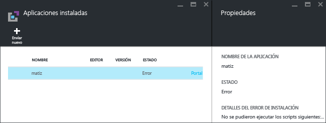
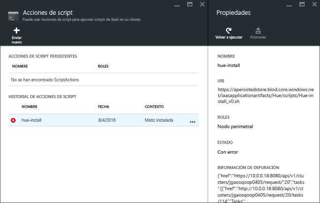

# Instalación de aplicaciones personalizadas de Hadoop en Azure HDInsight

En este artículo, aprenderá a instalar una aplicación de Hadoop en Azure HDInsight que no se ha publicado en Azure Portal. La aplicación que instalará en este artículo es [Hue](http://gethue.com/).

Una aplicación de HDInsight es una aplicación que los usuarios pueden instalar en un clúster de HDInsight basado en Linux.  Estas aplicaciones puede desarrollarlas Microsoft, fabricantes de software independientes (ISV) o el propio usuario.  

Otros artículos relacionados:

* [Install HDInsight applications](hdinsight-apps-install-applications.md)(Instalación de aplicaciones de HDInsight): aprenda a instalar una aplicación de HDInsight en sus clústeres.
* [Publicación de aplicaciones de HDInsight en Azure Marketplace](hdinsight-apps-publish-applications.md): aprenda a publicar aplicaciones de HDInsight personalizadas en Azure Marketplace.
* [MSDN: Install an HDInsight application](https://msdn.microsoft.com/library/mt706515.aspx)(MSDN: instalación de una aplicación de HDInsight): aprenda a definir aplicaciones de HDInsight.

## Requisitos previos
Si desea instalar aplicaciones de HDInsight en un clúster de HDInsight existente, debe tener un clúster de HDInsight. Para crearlo, consulte [Crear clúster](hadoop/apache-hadoop-linux-tutorial-get-started.md#create-cluster). También puede instalar aplicaciones de HDInsight al crear un clúster de HDInsight.

## Install HDInsight applications
Las aplicaciones de HDInsight pueden instalarse cuando se crea un clúster o en un clúster de HDInsight existente. Para definir plantillas de Azure Resource Manager, consulte [MSDN: Install an HDInsight application](https://msdn.microsoft.com/library/mt706515.aspx)(MSDN: instalación de una aplicación de HDInsight).

Los archivos necesarios para implementar esta aplicación (Hue):

* [azuredeploy.json](https://github.com/hdinsight/Iaas-Applications/blob/master/Hue/azuredeploy.json): la plantilla de Resource Manager para instalar una aplicación de HDInsight. Consulte [MSDN: Install an HDInsight application](https://msdn.microsoft.com/library/mt706515.aspx) (MSDN: instalación de una aplicación de HDInsight) para desarrollar su propia plantilla de Resource Manager.
* [hue-install_v0.sh](https://github.com/hdinsight/Iaas-Applications/blob/master/Hue/scripts/Hue-install_v0.sh): la acción de Script a la que llama la plantilla de Resource Manager para configurar el nodo perimetral.
* [hue-binaries.tgz](https://hdiconfigactions.blob.core.windows.net/linuxhueconfigactionv01/hue-binaries-14-04.tgz): el archivo binario de Hue que se llama desde hui install_v0.sh.
* [hue-binaries-14-04.tgz](https://hdiconfigactions.blob.core.windows.net/linuxhueconfigactionv01/hue-binaries-14-04.tgz): el archivo binario de Hue que se llama desde hui install_v0.sh.
* [webwasb tomcat.tar.gz](https://hdiconfigactions.blob.core.windows.net/linuxhueconfigactionv01/webwasb-tomcat.tar.gz): una aplicación web de ejemplo (Tomcat) que se llama desde hui install_v0.sh.

**Para instalar Hue en un clúster de HDInsight existente**

1. Haga clic en la imagen siguiente para iniciar sesión en Azure y abrir la plantilla de Resource Manager en Azure Portal.

    

    Este botón abre una plantilla de Resource Manager en el Portal de Azure.  La plantilla de Resource Manager se encuentra en [https://github.com/hdinsight/Iaas-Applications/tree/master/Hue](https://github.com/hdinsight/Iaas-Applications/tree/master/Hue).  Para aprender a escribir esta plantilla de Resource Manager, consulte [MSDN: Install an HDInsight application](https://msdn.microsoft.com/library/mt706515.aspx)(MSDN: instalación de una aplicación de HDInsight).
2. En la hoja **Parámetros** , escriba lo siguiente:

   * **ClusterName**: escriba el nombre del clúster en el que desea instalar la aplicación. Debe ser un clúster existente.
3. Haga clic en **Aceptar** para guardar los parámetros.
4. En la hoja **Implementación personalizada**, escriba **Grupo de recursos**.  El grupo de recursos es un contenedor que agrupa el clúster, la cuenta de almacenamiento dependiente y otros recursos. Es preciso usar el mismo grupo de recursos que el clúster.
5. Haga clic en **Términos legales** y, luego, en **Crear**.
6. Compruebe que la casilla **Anclar al panel** está activada y haga clic en **Crear**. El estado de la instalación se puede ver desde el icono anclado al panel del portal y la notificación del portal (haga clic en el icono de campana de la parte superior del portal).  La aplicación tarda aproximadamente 10 minutos en instalarse.

**Para instalar Hue durante la creación de un clúster**

1. Haga clic en la imagen siguiente para iniciar sesión en Azure y abrir la plantilla de Resource Manager en Azure Portal.

    

    Este botón abre una plantilla de Resource Manager en el Portal de Azure.  La plantilla de Resource Manager se encuentra en [https://hditutorialdata.blob.core.windows.net/hdinsightapps/create-linux-based-hadoop-cluster-in-hdinsight.json](https://hditutorialdata.blob.core.windows.net/hdinsightapps/create-linux-based-hadoop-cluster-in-hdinsight.json).  Para aprender a escribir esta plantilla de Resource Manager, consulte [MSDN: Install an HDInsight application](https://msdn.microsoft.com/library/mt706515.aspx)(MSDN: instalación de una aplicación de HDInsight).
2. Siga las instrucciones para crear un clúster e instalar Hue. Para más información acerca de cómo crear clústeres de HDInsight, consulte [Creación de clústeres de Hadoop basados en Linux en HDInsight](hdinsight-hadoop-provision-linux-clusters.md).

Además de Azure Portal, también puede usar [Azure PowerShell](hdinsight-hadoop-create-linux-clusters-arm-templates.md#deploy-using-powershell) y la [CLI de Azure](hdinsight-hadoop-create-linux-clusters-arm-templates.md#deploy-using-cli) para invocar plantillas de Resource Manager.

## Validación de la instalación
El estado de la aplicación se puede comprobar en el Portal de Azure para validar la instalación de la aplicación. Además, también se pueden validar todos los puntos de conexión HTTP que han aparecido según lo previsto y la página web, si hay:

**Para abrir el portal de Hue**

1. Inicie sesión en el [Portal de Azure](https://portal.azure.com).
2. Haga clic en **Clústeres de HDInsight** en el menú de la izquierda.  Si no lo ve, haga clic en **Examinar** y en **Clústeres de HDInsight**.
3. Haga clic en el clúster en el que instaló la aplicación.
4. En la hoja **Configuración**, haga clic en **Aplicaciones** en la categoría **General**. Verá **hue** en la hoja **Aplicaciones instaladas**.
5. Haga clic en **hue** en la lista para enumerar las propiedades.  
6. Haga clic en el vínculo de la página web para validar el sitio web; abra el punto de conexión HTTP en un navegador para validar la interfaz de usuario web de Hue y abra el punto de conexión SSH mediante SSH. Para obtener más información, consulte [Uso de SSH con HDInsight](hdinsight-hadoop-linux-use-ssh-unix.md).

## Solución de problemas de instalación
En el portal aparece una notificación donde puede comprobar el estado de la instalación de la aplicación (haga clic en el icono de campana que encontrará en la parte superior del portal).

Si se produce algún error al instalar la aplicación, puede consultar los mensajes de error y la información de depuración en tres sitios:

* Aplicaciones de HDInsight: información general sobre los errores.

    Abra el clúster desde el portal y, en la hoja Configuración, haga clic en Aplicaciones:

    
* Acción de script de HDInsight: si el mensaje de error de las aplicaciones de HDInsight indica que se produjo un error en una acción de script, aparecerán más datos sobre este error en el panel de acciones de script.

    En la hoja Configuración, haga clic en Acciones de script. En el historial de acciones de script aparecen los mensajes de error.

    
* Interfaz de usuario de la Web de Ambari: si el script de instalación fue la causa del error, utilice la interfaz de usuario de la Web de Ambari para consultar los registros completos de los scripts de instalación.

    Para más información, consulte [Solución de problemas](hdinsight-hadoop-customize-cluster-linux.md#troubleshooting).

## Eliminación de aplicaciones de HDInsight
Hay varias maneras de eliminar las aplicaciones de HDInsight.

### Mediante el portal
**Para quitar una aplicación mediante el portal**

1. Inicie sesión en el [Portal de Azure](https://portal.azure.com).
2. Haga clic en **Clústeres de HDInsight** en el menú de la izquierda.  Si no lo ve, haga clic en **Examinar** y en **Clústeres de HDInsight**.
3. Haga clic en el clúster en el que instaló la aplicación.
4. En la hoja **Configuración**, haga clic en **Aplicaciones** en la categoría **General**. Aparecerá una lista de aplicaciones instaladas. En este tutorial, **hue** se enumera en la hoja **Aplicaciones instaladas**.
5. Haga clic con el botón derecho en la aplicación que desea eliminar y, luego, haga clic en **Eliminar**.
6. Haga clic en **Sí** para continuar.

Desde el portal, también puede eliminar el clúster o eliminar el grupo de recursos que contiene la aplicación.

### Uso de Azure PowerShell
Con Azure PowerShell, puede eliminar el clúster o eliminar el grupo de recursos. Consulte [Eliminación de clústeres mediante Azure PowerShell](hdinsight-administer-use-powershell.md#delete-clusters).

### Uso de CLI de Azure
Mediante la CLI de Azure, puede eliminar el clúster o el grupo de recursos. Consulte la sección [Eliminación de clústeres mediante la CLI de Azure](hdinsight-administer-use-command-line.md#delete-clusters).

## Pasos siguientes
* [MSDN: Install an HDInsight application](https://msdn.microsoft.com/library/mt706515.aspx)(MSDN: instalación de una aplicación de HDInsight): aprenda a desarrollar plantillas de Resource Manager para implementar aplicaciones de HDInsight.
* [Install HDInsight applications](hdinsight-apps-install-applications.md)(Instalación de aplicaciones de HDInsight): aprenda a instalar una aplicación de HDInsight en sus clústeres.
* [Publicación de aplicaciones de HDInsight en Azure Marketplace](hdinsight-apps-publish-applications.md): aprenda a publicar aplicaciones de HDInsight personalizadas en Azure Marketplace.
* [Personalización de clústeres de HDInsight mediante la acción de scripts (Linux)](hdinsight-hadoop-customize-cluster-linux.md): aprenda a utilizar acciones de script para instalar otras aplicaciones.
* [Creación de clústeres de Hadoop basados en Linux en HDInsight con plantillas de Azure Resource Manager](hdinsight-hadoop-create-linux-clusters-arm-templates.md): aprenda a llamar a plantillas de Resource Manager para crear clústeres de HDInsight.
* [Use empty edge nodes in HDInsight](hdinsight-apps-use-edge-node.md)(Utilización de nodos perimetrales vacíos en HDInsight): aprenda a usar un nodo perimetral vacío para acceder a los clústeres de HDInsight, probar aplicaciones de este y hospedarlas.
