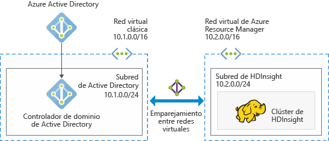
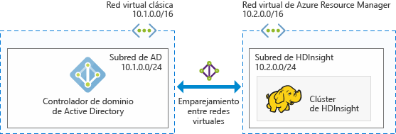

# Planeamiento de clústeres de Hadoop unidos a un dominio de Azure en HDInsight

Tradicionalmente, Hadoop es un clúster de un solo usuario. Es apropiado para la mayor parte de las empresas que tienen equipos de aplicaciones pequeños que generan grandes cargas de trabajo de datos. A medida que aumenta la popularidad de Hadoop, muchas empresas empiezan a usar un modelo en el que los equipos de TI administran clústeres y varios equipos de aplicaciones comparten los clústeres. Por consiguiente, las funcionalidades que implican a clústeres de varios usuarios se encuentran entre las más solicitadas en HDInsight de Azure.

En lugar de generar su propia autenticación y autorización multiusuario, HDInsight usa el proveedor de identidades más popular: Active Directory (AD). La eficaz funcionalidad de seguridad de AD se puede usar para administrar la autorización multiusuario en HDInsight. Mediante la integración de HDInsight con AD, se puede comunicar con los clústeres mediante sus credenciales de AD. HDInsight asigna un usuario de AD a un usuario de Hadoop local, de modo que todos los servicios que se ejecutan en HDInsight (Ambari, servidor de Hive, Ranger, servidor Thrift de Spark, etc.) funcionan perfectamente para el usuario autenticado.

## Integración de HDInsight con Active Directory

Cuando integra HDInsight con Active Directory, los nodos del clúster de HDInsight se unen a un dominio de Active Directory. HDInsight crea entidades de servicio para los servicios de Hadoop que se ejecutan en el clúster y las coloca en una unidad organizativa en el dominio. HDInsight también crea asignaciones de DNS inverso en el dominio para las direcciones IP de los nodos que se unen al dominio.

Hay dos opciones de implementación de Active Directory:
* **[Azure Active Directory Domain Services](../active-directory-domain-services/active-directory-ds-overview.md):** este servicio proporciona un dominio de Active Directory administrado que es totalmente compatible con Windows Server Active Directory. Microsoft se encarga de administrar, aplicar revisiones y supervisar el dominio de Active Directory. Puede implementar el clúster sin preocuparse por mantener los controladores de dominio. Los usuarios, grupos y contraseñas se sincronizan desde su instalación de Microsoft Azure Active Directory, lo que permite a los usuarios iniciar sesión en el clúster con sus credenciales corporativas.

* **Dominio de Windows Server Active Directory en máquinas virtuales de IaaS de Azure:** en esta opción, implementa y administra su propio dominio de Windows Server Active Directory en máquinas virtuales de IaaS de Azure. 

Esta configuración se puede lograr mediante el uso de varias arquitecturas. Puede elegir entre las siguientes opciones.

### HDInsight integrado con un dominio de Active Directory administrado por Azure AD Domain Services
Puede implementar un dominio administrado de [Azure Active Directory Domain Services](../active-directory-domain-services/active-directory-ds-overview.md) (Azure AD DS). Azure AD DS proporciona un dominio de Active Directory administrado en Azure, que Microsoft se encarga de administrar, actualizar y supervisar. Crea dos controladores de dominio para lograr alta disponibilidad e incluye servicios DNS. Luego puede integrar el clúster de HDInsight con este dominio administrado. Con esta opción de implementación ya no tendrá que preocuparse de administrar, aplicar revisiones, actualizar y supervisar controladores de dominio.

Requisitos previos para la integración con Azure AD Domain Services:

* [Aprovisione un dominio administrado por Azure AD Domain Services](../active-directory-domain-services/active-directory-ds-getting-started.md).
* Cree una [unidad organizativa](../active-directory-domain-services/active-directory-ds-admin-guide-create-ou.md), en la que colocará las máquinas virtuales del clúster de HDInsight y las entidades de servicio que usa el clúster.
* Instale [LDAPS](../active-directory-domain-services/active-directory-ds-admin-guide-configure-secure-ldap.md) cuando configure Azure AD DS. El certificado que se usa para instalar LDAPS debe estar emitido por una entidad de certificación (no puede ser un certificado autofirmado).
* Cree zonas de DNS inverso en el dominio administrado para el intervalo de direcciones IP de la subred de HDInsight (por ejemplo, 10.2.0.0/24 en la imagen anterior).
* Configure la [sincronización de hash de contraseña necesaria para la autenticación NTLM y Kerberos](../active-directory-domain-services/active-directory-ds-getting-started-password-sync.md) desde Azure AD hacia el dominio administrado de Azure AD DS.
* Se necesita una cuenta de servicio o una cuenta de usuario. Utilice esta cuenta para crear el clúster de HDInsight. Esta cuenta debe tener los siguientes permisos:

    - Permisos para crear objetos de entidad de servicio y objetos de equipo en la unidad organizativa
    - Permisos para crear reglas de proxy de DNS inverso
    - Permisos para unir equipos al dominio de Azure AD

### HDInsight integrado con Windows Server AD que se ejecuta en IaaS de Azure

Puede implementar el rol de Windows Server Active Directory Domain Services en una (o varias) máquinas virtuales (VM) en Azure y promoverlas para que sean controladores de dominio. Estas máquinas virtuales de controlador de dominio se pueden implementar con el modelo de implementación del administrador de recursos en la misma red virtual que el clúster de HDInsight. Si los controladores de dominio se implementan en una red virtual diferente, necesitará emparejar estas redes virtuales mediante el uso del [emparejamiento de VNet a VNet](../virtual-network/virtual-network-create-peering.md). 

Más información: [Directrices para implementar Windows Server Active Directory en máquinas virtuales de Azure](../active-directory/virtual-networks-windows-server-active-directory-virtual-machines.md)

> [!NOTE]
> En esta arquitectura, Azure Data Lake Store no se puede usar con el clúster de HDInsight.

Requisitos previos para la integración con Windows Server Active Directory en máquinas virtuales de Azure:

* Se debe crear una [unidad organizativa](../active-directory-domain-services/active-directory-ds-admin-guide-create-ou.md), en la que se colocan las máquinas virtuales del clúster de HDInsight y las entidades de servicio que usa el clúster.
* [Protocolo ligero de acceso a directorios](../active-directory-domain-services/active-directory-ds-admin-guide-configure-secure-ldap.md) (LDAP) debe configurarse para comunicarse con AD. El certificado que se usa para instalar LDAPS debe ser un certificado real (no uno autofirmado).
* Deben crearse zonas de DNS inverso en el dominio para el intervalo de direcciones IP de la subred de HDInsight (por ejemplo, 10.2.0.0/24 en la imagen anterior).
* Se necesita una cuenta de servicio o una cuenta de usuario. Utilice esta cuenta para crear el clúster de HDInsight. Esta cuenta debe tener los siguientes permisos:

    - Permisos para crear objetos de entidad de servicio y objetos de equipo en la unidad organizativa
    - Permisos para crear reglas de proxy de DNS inverso
    - Permisos para unir equipos al dominio de Active Directory

## Pasos siguientes
* Para configurar un clúster de HDInsight unido a un dominio, consulte [Configuración de clústeres de HDInsight unidos a un dominio (versión preliminar)](hdinsight-domain-joined-configure.md).
* Para administrar clústeres de HDInsight unidos a un dominio, consulte [Administración de clústeres de HDInsight unidos a dominio (versión preliminar)](hdinsight-domain-joined-manage.md).
* Para configurar directivas de Hive y ejecutar consultas de Hive, consulte [Administración de clústeres de HDInsight unidos a dominio (versión preliminar)](hdinsight-domain-joined-run-hive.md).
* Para ejecutar consultas de Hive mediante SSH en clústeres de HDInsight unidos a un dominio, consulte [Uso de SSH con HDInsight](hdinsight-hadoop-linux-use-ssh-unix.md).
