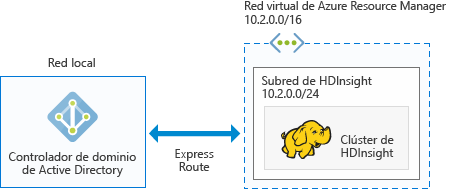

# Planear clústeres de Hadoop unidos a un dominio de Azure en HDInsight

Tradicionalmente, Hadoop es un clúster de un solo usuario. Es apropiado para la mayor parte de las empresas que tienen equipos de aplicaciones más pequeños que generan sus cargas de trabajo de macrodatos. A medida que aumenta la popularidad de Hadoop, muchas empresas empiezan a usar un modelo en el que los equipos de TI administran clústeres y varios equipos de aplicaciones comparten clústeres. Por consiguiente, los clústeres multiusuario son una de las funcionalidades más solicitadas de HDInsight.

En lugar de generar su propia autenticación y autorización multiusuario, HDInsight usa el proveedor de identidades más popular: Active Directory (AD). La eficaz funcionalidad de grupos de seguridad de Active Directory se puede usar para administrar la autorización multiusuario en HDInsight. Mediante la integración de HDInsight con Active Directory, los usuarios de Active Directory pueden comunicarse con los clústeres mediante sus credenciales de Active Directory. HDInsight asigna un usuario de Active Directory a un usuario de Hadoop local, de modo que todos los servicios que se ejecutan en HDInsight (Ambari, Hive Server, Ranger, servidor Thrift de Spark, etc.) funcionan perfectamente para el usuario autenticado.

## Integración de HDInsight con Active Directory

Mediante la integración de HDInsight con Active Directory, los nodos del clúster de HDInsight se unen al dominio de Active Directory. HDInsight crea entidades de servicio para los servicios de Hadoop que se ejecutan en el clúster y las coloca en una unidad organizativa (OU) especificada de Active Directory. HDInsight también crea asignaciones de DNS inverso en el dominio de Active Directory para las direcciones IP de los nodos que se unen al dominio.

Para lograr esta configuración, se pueden usar varias arquitecturas y es preciso decidir cuál de ellas es la más apropiada.

**1. HDInsight integrado en AD, que se ejecuta en Azure IAAS**

Esta es la arquitectura más sencilla para la integración de HDInsight con Active Directory. El controlador de dominio de Active Directory se ejecuta en una máquina virtual, o en varias, en Azure. Normalmente, estas máquinas virtuales se encuentran en una red virtual. Configure otra red virtual para los clústeres de HDInsight. Para que HDInsight tenga una línea de visión a Active Directory, es preciso emparejar estas redes virtuales mediante el uso del [emparejamiento de VNet a VNet](../virtual-network/virtual-networks-create-vnetpeering-arm-portal.md).

> [!NOTE]
> En esta arquitectura, Azure Data Lake Store no se puede usar con un clúster de HDInsight.
 

Requisitos previos de Active Directory:

* Debe crearse una [unidad organizativa](../active-directory-domain-services/active-directory-ds-admin-guide-create-ou.md), en la que se colocarán las máquinas virtuales del clúster de HDInsight y las entidades de servicio que usa el clúster.
* Debe configurarse [LDAPS](../active-directory-domain-services/active-directory-ds-admin-guide-configure-secure-ldap.md) para la comunicación con Active Directory. El certificado usado para instalar LDAPS debe ser un certificado real (no un certificado autofirmado).
* Deben crearse zonas de DNS inverso en el dominio para el intervalo de direcciones IP de la subred de HDInsight (por ejemplo, 10.2.0.0/24 en la imagen anterior).
* Se necesitan una cuenta de servicio, o una cuenta de usuario, que se usan para crear el clúster de HDInsight. Esta cuenta debe tener los siguientes permisos:

    - Permisos para crear objetos de entidad de servicio y objetos de equipo dentro de la unidad organizativa.
    - Permisos para crear reglas de proxy de DNS inverso
    - Permisos para unir máquinas al dominio de Active Directory.

**2. HDInsight integrado con Azure AD solo en la nube**

En el caso de una instancia de Azure Active Directory (Azure AD) solo en la nube, es preciso configurar un controlador de dominio, con el fin de que HDInsight pueda integrarse con Azure Active Directory. Esto se logra mediante el uso de [Azure Active Directory Domain Services](../active-directory-domain-services/active-directory-ds-overview.md) (Azure AD DS). Azure AD DS crea máquinas del controlador de dominio en la nube y proporciona sus direcciones IP. Crea dos controladores de dominio para lograr alta disponibilidad.

Actualmente, Azure AD DS solo existe en las redes virtuales clásicas. Solo se puede acceder a él mediante el Portal de Azure clásico. La red virtual de HDInsight VNet existe en Azure Portal, que se debe emparejar con la red virtual clásica mediante el emparejamiento de red virtual con red virtual.

> [!NOTE]
> El emparejamiento entre una red virtual clásica y una red virtual de Azure Resource Manager requiere que las dos redes virtuales estén en la misma región y en la misma suscripción de Azure.

Requisitos previos de Active Directory:

* Debe crearse una [unidad organizativa](../active-directory-domain-services/active-directory-ds-admin-guide-create-ou.md), en la que se colocarán las máquinas virtuales del clúster de HDInsight y las entidades de servicio que usa el clúster. 
* Al configurar AD DS, se debe configurar [LDAPS](../active-directory-domain-services/active-directory-ds-admin-guide-configure-secure-ldap.md). El certificado usado para instalar LDAPS debe ser un certificado real (no un certificado autofirmado).
* Deben crearse zonas de DNS inverso en el dominio para el intervalo de direcciones IP de la subred de HDInsight (por ejemplo, 10.2.0.0/24 en la imagen anterior). 
* Los [hash de contraseña](../active-directory-domain-services/active-directory-ds-getting-started-password-sync.md) deben sincronizarse desde Azure AD a AD DS.
* Se necesitan una cuenta de servicio, o una cuenta de usuario, que se usan para crear el clúster de HDInsight. Esta cuenta debe tener los siguientes permisos:

    - Permisos para crear objetos de entidad de servicio y objetos de equipo dentro de la unidad organizativa.
    - Permisos para crear reglas de proxy de DNS inverso
    - Permisos para unir máquinas al dominio de Active Directory.

**3. HDInsight integrado con una instancia de AD local a través de VPN**

Esta arquitectura es similar a la arquitectura 1. La única diferencia es que la instancia de Active Directory es local y la línea de visión de HDInsight a Active Directory es a través de una [conexión VPN desde Azure a la red local](../expressroute/expressroute-introduction.md).

> [!NOTE]
> En esta arquitectura, Azure Data Lake Store no se puede usar con un clúster de HDInsight.

Requisitos previos de Active Directory:

* Debe crearse una [unidad organizativa](../active-directory-domain-services/active-directory-ds-admin-guide-create-ou.md), en la que se colocarán las máquinas virtuales del clúster de HDInsight y las entidades de servicio que usa el clúster.
* Debe configurarse [LDAPS](../active-directory-domain-services/active-directory-ds-admin-guide-configure-secure-ldap.md) para la comunicación con Active Directory. El certificado usado para instalar LDAPS debe ser un certificado real (no un certificado autofirmado).
* Deben crearse zonas de DNS inverso en el dominio para el intervalo de direcciones IP de la subred de HDInsight (por ejemplo, 10.2.0.0/24 en la imagen anterior).
* Se necesitan una cuenta de servicio, o una cuenta de usuario, que se usan para crear el clúster de HDInsight. Esta cuenta debe tener los siguientes permisos:

    - Permisos para crear objetos de entidad de servicio y objetos de equipo dentro de la unidad organizativa.
    - Permisos para crear reglas de proxy de DNS inverso
    - Permisos para unir máquinas al dominio de Active Directory.

**4. HDInsight integrado con una instancia de AD local a través de Azure AD**

Esta arquitectura es similar a la arquitectura 2. La única diferencia es que la instancia de Active Directory local se sincroniza con Azure Active Directory. Es preciso configurar un controlador de dominio en la nube, con el fin de que HDInsight pueda integrarse con Azure Active Directory. Esto se logra mediante el uso de [Azure Active Directory Domain Services](../active-directory-domain-services/active-directory-ds-overview.md) (AD DS). AD DS crea máquinas del controlador de dominio en la nube y proporciona sus direcciones IP. Crea dos controladores de dominio para lograr alta disponibilidad.

Actualmente, Azure AD DS solo existe en las redes virtuales clásicas. Solo se puede acceder a él mediante el Portal de Azure clásico. La red virtual de HDInsight VNet existe en Azure Portal, que se debe emparejar con la red virtual clásica mediante el emparejamiento de red virtual con red virtual.

> [!NOTE]
> El emparejamiento entre una red virtual clásica y una red virtual de Azure Resource Manager requiere que las dos redes virtuales estén en la misma región y en la misma suscripción de Azure.

Requisitos previos de Active Directory:

* Debe crearse una [unidad organizativa](../active-directory-domain-services/active-directory-ds-admin-guide-create-ou.md), en la que se colocarán las máquinas virtuales del clúster de HDInsight y las entidades de servicio que usa el clúster. 
* Al configurar AD DS, se debe configurar [LDAPS](../active-directory-domain-services/active-directory-ds-admin-guide-configure-secure-ldap.md). El certificado usado para instalar LDAPS debe ser un certificado real (no un certificado autofirmado).
* Deben crearse zonas de DNS inverso en el dominio para el intervalo de direcciones IP de la subred de HDInsight (por ejemplo, 10.2.0.0/24 en la imagen anterior). 
* Los [hash de contraseña](../active-directory-domain-services/active-directory-ds-getting-started-password-sync.md) deben sincronizarse desde Azure AD a AD DS.
* Se necesitan una cuenta de servicio, o una cuenta de usuario, que se usan para crear el clúster de HDInsight. Esta cuenta debe tener los siguientes permisos:

    - Permisos para crear objetos de entidad de servicio y objetos de equipo dentro de la unidad organizativa.
    - Permisos para crear reglas de proxy de DNS inverso
    - Permisos para unir máquinas al dominio de Active Directory.

**5. HDInsight integrado con un valor no predeterminado de Azure AD (se recomienda solo para desarrollo y pruebas)**

Esta arquitectura es similar a la arquitectura 2. En la mayoría de las empresas, el acceso de administrador a Active Directory está restringido a solo unos pocos usuarios determinados. Por consiguiente, cuando desee realizar una prueba de concepto o simplemente probar a crear un clúster unido a un dominio, en lugar de esperar a que el administrador configure los requisitos previos en Active Directory, puede ser conveniente crear una nueva instancia de Azure Active Directory en la suscripción. Dado que lo que ha creado es una instancia de Azure AD, tiene todos los permisos para configurar AD DS.

AD DS crea máquinas del controlador de dominio en la nube y proporciona sus direcciones IP. Crea dos controladores de dominio para lograr alta disponibilidad.

En la actualidad AD DS solo existe redes virtuales clásicas y, de ahí, que se necesite acceso al portal clásico y crear una red virtual clásica para configurar AD DS. La red virtual de HDInsight VNet existe en Azure Portal, que se debe emparejar con la red virtual clásica mediante el emparejamiento de red virtual con red virtual.

> [!NOTE]
> El emparejamiento entre las redes virtuales creadas con el método clásico y con Azure Resource Manager requieres que ambas redes virtuales se encuentren en la misma región y estén en la misma suscripción de Azure.

Requisitos previos de Active Directory:

* Debe crearse una [unidad organizativa](../active-directory-domain-services/active-directory-ds-admin-guide-create-ou.md), en la que se colocarán las máquinas virtuales del clúster de HDInsight y las entidades de servicio que usa el clúster. 
* Al configurar AD DS, se debe configurar [LDAPS](../active-directory-domain-services/active-directory-ds-admin-guide-configure-secure-ldap.md). Para configurar LDAPS puede crear un [certificado autofirmado](../active-directory-domain-services/active-directory-ds-admin-guide-configure-secure-ldap.md). Sin embargo, para usar un certificado autofirmado, es preciso que solicite una excepción de <a href="mailto:hdipreview@microsoft.com">hdipreview@microsoft.com</a>.
* Deben crearse zonas de DNS inverso en el dominio para el intervalo de direcciones IP de la subred de HDInsight (por ejemplo, 10.2.0.0/24 en la imagen anterior). 
* Los [hash de contraseña](../active-directory-domain-services/active-directory-ds-getting-started-password-sync.md) deben sincronizarse desde Azure AD a AD DS.
* Se necesitan una cuenta de servicio, o una cuenta de usuario, que se usan para crear el clúster de HDInsight. Esta cuenta debe tener los siguientes permisos:

    - Permisos para crear objetos de entidad de servicio y objetos de equipo dentro de la unidad organizativa.
    - Permisos para crear reglas de proxy de DNS inverso
    - Permisos para unir máquinas al dominio de Active Directory.

## Pasos siguientes
* Para configurar un clúster de HDInsight unido a dominio, consulte [Configure Domain-joined HDInsight clusters](hdinsight-domain-joined-configure.md) (Configuración de clústeres de HDInsight unidos a un dominio).
* Para administrar los clústeres de HDInsight unidos a un dominio, consulte [Administración de clústeres de HDInsight unidos a dominio (versión preliminar)](hdinsight-domain-joined-manage.md).
* Para configurar directivas de Hive y ejecución de consultas de Hive, consulte [Configure Hive policies for Domain-joined HDInsight clusters](hdinsight-domain-joined-run-hive.md) (Configuración de directivas de los clústeres de HDInsight unidos a dominio).
* Para ejecutar consultas de Hive mediante SSH en clústeres de HDInsight unidos a dominio, consulte [Utilización de SSH con Hadoop en HDInsight basado en Linux desde Linux, Unix u OS X](hdinsight-hadoop-linux-use-ssh-unix.md).

<!--HONumber=Feb17_HO1-->

