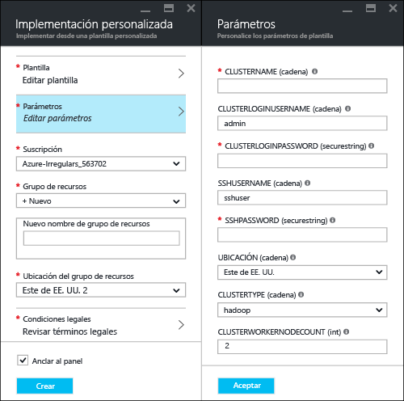
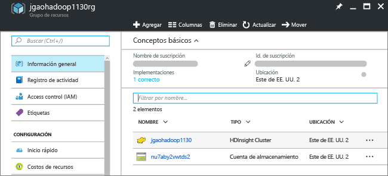
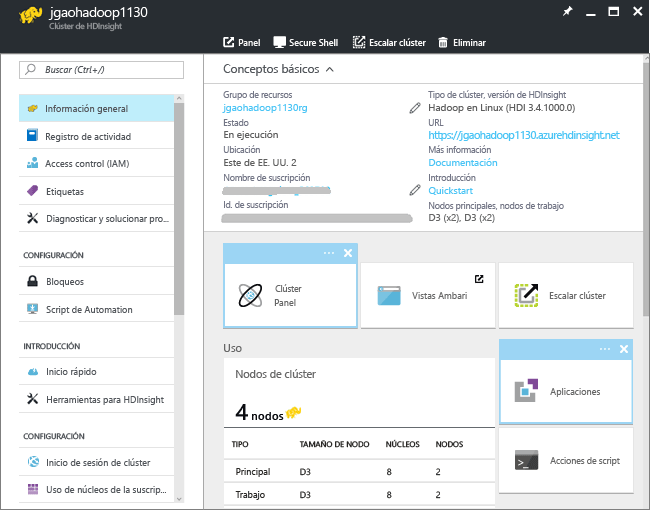
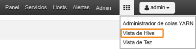

# Tutorial de Hadoop: introducción al uso de Hadoop en HDInsight

Aprenda a crear clústeres de [Hadoop](http://hadoop.apache.org/) en HDInsight y a ejecutar trabajos de Hive en HDInsight. [Apache Hive](https://hive.apache.org/) es el componente más popular del ecosistema de Hadoop. Actualmente HDInsight tiene [siete tipos diferentes de clúster](hdinsight-hadoop-introduction.md#overview). Cada uno de estos tipos de clúster es compatible con un conjunto de componentes diferente. Todos los tipos de clúster son compatibles con Hive. Para ver una lista de los componentes compatibles con HDInsight, consulte [Novedades en las versiones de clústeres de Hadoop proporcionadas por HDInsight](hdinsight-component-versioning.md)  

[!INCLUDE [delete-cluster-warning](../../includes/hdinsight-delete-cluster-warning.md)]

## Requisitos previos
Antes de empezar este tutorial, debe contar con lo siguiente:

* **Suscripción de Azure**: para crear una cuenta de evaluación gratuita durante un mes, vaya a [azure.microsoft.com/es-es/free/](https://azure.microsoft.com/free).

## Crear clúster

La mayoría de los trabajos de Hadoop son trabajos por lotes. Se crea un clúster, se ejecutan algunos trabajos y luego se elimina el clúster. En esta sección, se crea un clúster de Hadoop en HDInsight mediante una [plantilla de Azure Resource Manager](../azure-resource-manager/resource-group-template-deploy.md). No es necesario tener experiencia en el uso de la plantilla de Resource Manager para seguir este tutorial. Para conocer otros métodos de creación de clústeres y las propiedades que se usan en este tutorial, consulte [Creación de clústeres de Hadoop basados en Linux en HDInsight](hdinsight-hadoop-provision-linux-clusters.md). Utilice el selector en la parte superior de la página para elegir las opciones de creación del clúster.

La plantilla de Resource Manager utilizada en este tutorial se encuentra en [GitHub](https://azure.microsoft.com/resources/templates/101-hdinsight-linux-ssh-password/). 

1. Haga clic en la imagen siguiente para iniciar sesión en Azure y abrir la plantilla de Resource Manager en Azure Portal. 
   
    
2. Escriba o seleccione los siguientes valores:
   
    .
   
    * **Suscripción**: seleccione su suscripción de Azure.
    * **Grupo de recursos**: cree un grupo de recursos o seleccione uno existente.  Un grupo de recursos es un contenedor de componentes de Azure.  En este caso, el grupo de recursos contiene el clúster de HDInsight y la cuenta de Azure Storage dependiente. 
    * **Ubicación**: seleccione una ubicación de Azure donde desea crear el clúster.  Elija una ubicación más cercana a usted para mejorar el rendimiento. 
    * **Tipo de clúster**: seleccione **Hadoop** para este tutorial.
    * **Nombre del clúster**: escriba el nombre del clúster de Hadoop.
    * **Nombre de inicio de sesión y contraseña de clúster**: el nombre de inicio de sesión predeterminado es **admin**.
    * **Nombre de usuario y contraseña de SSH**: el nombre de usuario predeterminado es **sshuser**.  Puede cambiarlo. 
     
    Algunas propiedades se han codificado de forma rígida en la plantilla.  Puede configurar estos valores de la plantilla.

    * **Ubicación**: la ubicación del clúster y la cuenta de almacenamiento dependiente utilizan la misma ubicación que el grupo de recursos.
    * **Versión del clúster**: 3.5
    * **Tipo de sistema operativo**: Linux
    * **Número de nodos de trabajo**: 2

     Cada clúster depende de una [cuenta de Azure Storage](hdinsight-hadoop-use-blob-storage.md) o de una [cuenta de Azure Data Lake](hdinsight-hadoop-use-data-lake-store.md). Se conoce como cuenta de almacenamiento predeterminada. El clúster de HDInsight y su cuenta de almacenamiento predeterminada deben estar en la misma región de Azure. La eliminación de los clústeres no elimina la cuenta de almacenamiento. 
     
     Para más información acerca de estas propiedades, consulte [Creación de clústeres de Hadoop en HDInsight](hdinsight-hadoop-provision-linux-clusters.md).

3. Seleccione **Acepto los términos y condiciones indicadas anteriormente** y **Anclar al panel** y haga clic en **Comprar**. Verá un icono nuevo llamado **Implementación para la implementación de plantilla** en el panel del portal. Tarda aproximadamente 20 minutos en crear un clúster. Una vez creado el clúster, se cambia el título del icono por el nombre del grupo de recursos que ha especificado. Y el portal abre automáticamente el grupo de recursos en una nueva hoja. Puede ver el clúster y el almacenamiento predeterminado.
   
    .

4. Haga clic en el nombre del clúster para abrir el clúster en una nueva hoja.

   

## Ejecución de consultas de Hive
[Apache Hive](hdinsight-use-hive.md) es el componente más popular de los que se usan en HDInsight. Hay muchas maneras de ejecutar trabajos de Hive en HDInsight. En este tutorial se usa la vista de Hive de Ambari desde el portal. Para conocer otros métodos de enviar trabajos de Hive, consulte [Usar Hive y HiveQL con Hadoop en HDInsight para analizar un archivo log4j de Apache de muestra](hdinsight-use-hive.md).

1. En la captura de pantalla anterior, haga clic en **Panel de clúster** y luego en **Panel de clúster de HDInsight**.  También puede ir a **https://&lt;NombreClúster>.azurehdinsight.net**, donde &lt;NombreClúster> es el clúster que creó en la sección anterior para abrir Ambari.
2. Escriba el nombre de usuario de Hadoop y la contraseña que especificó en la sección anterior. El nombre de usuario predeterminado es **admin**.
3. Abra la **vista de Hive** como se muestra en la siguiente captura de pantalla:
   
    .
4. En la sección **Editor de consultas** de la página, pegue las siguientes instrucciones de HiveQL en la hoja de cálculo:
   
        SHOW TABLES;
   
   > [!NOTE]
   > Hive requiere un punto y coma.       
   > 
   > 
5. Haga clic en **Ejecutar**. Debe aparecer la sección **Resultados del proceso de consulta** bajo el Editor de consultas y mostrar información sobre el trabajo. 
   
    Cuando haya finalizado la consulta, la sección **Resultados del proceso de consulta** muestra los resultados de la operación. Verá una tabla denominada **hivesampletable**. Esta es una tabla de Hive de ejemplo que viene integrada en todos los clústeres de HDInsight.
   
    .
6. Repita los pasos 4 y 5 para ejecutar la consulta siguiente:
   
        SELECT * FROM hivesampletable;
   
   > [!TIP]
   > Tenga en cuenta el elemento desplegable **Guardar resultados** en la esquina superior izquierda de la sección **Resultados del proceso de consulta**; úsela para descargar los resultados o guardarlos en el Almacenamiento para HDInsight como un archivo CSV.
   > 
   > 
7. Haga clic en **Historial** para obtener una lista de los trabajos.

Después de completar un trabajo de Hive, puede [exportar los resultados a Azure SQL Database o Base de datos SQL Server](hdinsight-use-sqoop-mac-linux.md), y también puede [visualizar los resultados con Excel](hdinsight-connect-excel-power-query.md). Para más información sobre el uso de Hive en HDInsight, consulte [Usar Hive y HiveQL con Hadoop en HDInsight para analizar un archivo log4j de Apache de muestra](hdinsight-use-hive.md).

## Limpieza del tutorial
Después de completar el tutorial, puede eliminar el clúster. Con HDInsight, los datos se almacenan en Almacenamiento de Azure, por lo que puede eliminar un clúster de forma segura cuando no está en uso. También se le cargará por un clúster de HDInsight aunque no esté en uso. Como en muchas ocasiones los cargos por el clúster son más que los cargos por el almacenamiento, desde el punto de vista económico tiene sentido eliminar clústeres cuando no estén en uso. 

> [!NOTE]
> Con [Azure Data Factory](hdinsight-hadoop-create-linux-clusters-adf.md) puede crear clústeres de HDInsight a petición y configurar un valor de TimeToLive que elimine los clústeres automáticamente. 
> 
> 

**Para eliminar el clúster o la cuenta de almacenamiento predeterminada**

1. Inicie sesión en el [Portal de Azure](https://portal.azure.com).
2. En el panel del portal, haga clic en el icono con el nombre del grupo de recursos que utilizó al crear el clúster.
3. Haga clic en **Eliminar**, en la hoja de recursos, para eliminar el grupo de recursos que contiene el clúster y la cuenta de almacenamiento predeterminada; o bien, haga clic en el nombre del clúster en el icono **Recursos** y, luego, haga clic en **Eliminar** en la hoja del clúster. Tenga en cuenta que, al eliminar el grupo de recursos, se elimina también la cuenta de almacenamiento. Si desea mantener la cuenta de almacenamiento, elija Eliminar solo el clúster.

## Solución de problemas

Si experimenta problemas con la creación de clústeres de HDInsight, consulte los [requisitos de control de acceso](hdinsight-administer-use-portal-linux.md#create-clusters).

## Pasos siguientes
En este tutorial, ha aprendido cómo crear un clúster de HDInsight basado en Linux mediante una plantilla de Resource Manager y cómo realizar consultas básicas de Hive.

Para más información sobre el análisis de datos con HDInsight, consulte los siguientes artículos:

* Para más información sobre el uso de Hive con HDInsight, incluida la forma de realizar consultas de Hive desde Visual Studio, consulte [Uso de Hive con HDInsight][hdinsight-use-hive].
* Para más información sobre Pig, un lenguaje usado para transformar datos, consulte [Uso de Pig con HDInsight][hdinsight-use-pig].
* Para más información sobre MapReduce, una manera de escribir programas que procesan datos en Hadoop, consulte [Uso de MapReduce con HDInsight][hdinsight-use-mapreduce].
* Para más información sobre el uso de las herramientas de HDInsight para Visual Studio para analizar datos en HDInsight, consulte [Introducción al uso de herramientas de Hadoop en Visual Studio para HDInsight para ejecutar una consulta de Hive](hdinsight-hadoop-visual-studio-tools-get-started.md).

Si está listo para empezar a trabajar con sus propios datos y necesita saber más sobre cómo HDInsight almacena los datos o sobre cómo obtener datos en HDInsight, consulte lo siguiente:

* Para más información sobre cómo HDInsight usa Azure Storage, consulte [Uso de Azure Storage con HDInsight](hdinsight-hadoop-use-blob-storage.md).
* Para más información sobre cómo cargar datos en HDInsight, consulte [Carga de datos en HDInsight][hdinsight-upload-data].

Si desea información sobre cómo crear o administrar un clúster de HDInsight, consulte lo siguiente:

* Para más información sobre cómo administrar el clúster de HDInsight basado en Linux, consulte [Administración de clústeres de HDInsight con la interfaz de usuario web de Ambari](hdinsight-hadoop-manage-ambari.md).
* Para más información acerca de las opciones que se pueden seleccionar al crear un clúster de HDInsight, consulte [Creación de clústeres de Hadoop basados en Linux en HDInsight](hdinsight-hadoop-provision-linux-clusters.md).
* Si está familiarizado con Linux y Hadoop, pero quiere conocer información específica sobre Hadoop en HDInsight, consulte [Información sobre el uso de HDInsight en Linux](hdinsight-hadoop-linux-information.md). Este artículo proporciona información como:
  
  * Direcciones URL para los servicios hospedados en el clúster, por ejemplo, Ambari y WebHCat
  * La ubicación de los archivos y ejemplos de Hadoop en el sistema de archivos local
  * El uso de Azure Storage (WASB) en lugar de HDFS como el almacén de datos predeterminado

[1]: ../HDInsight/hdinsight-hadoop-visual-studio-tools-get-started.md

[hdinsight-provision]: hdinsight-provision-linux-clusters.md
[hdinsight-upload-data]: hdinsight-upload-data.md
[hdinsight-use-mapreduce]: hdinsight-use-mapreduce.md
[hdinsight-use-hive]: hdinsight-use-hive.md
[hdinsight-use-pig]: hdinsight-use-pig.md

