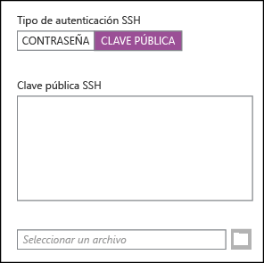

<properties
   pageTitle="Utilización de claves SSH con Hadoop basado en Linux desde Linux, Unix u OS X | Microsoft Azure"
   description="Puede acceder a HDInsight basado en Linux mediante Shell seguro (SSH). Este documento proporciona información sobre el uso de SSH con HDInsight desde clientes Linux, Unix u OS X."
   services="hdinsight"
   documentationCenter=""
   authors="Blackmist"
   manager="paulettm"
   editor="cgronlun"/>

<tags
   ms.service="hdinsight"
   ms.devlang="na"
   ms.topic="article"
   ms.tgt_pltfrm="na"
   ms.workload="big-data"
   ms.date="07/06/2015"
   ms.author="larryfr"/>

#Utilización de SSH con Hadoop en HDInsight basado en Linux desde Linux, Unix u OS X (vista previa)

> [AZURE.SELECTOR]
- [Windows](hdinsight-hadoop-linux-use-ssh-windows.md)
- [Linux, Unix, OS X](hdinsight-hadoop-linux-use-ssh-unix.md)

Los clústeres de HDInsight de Azure basado en Linux proporcionan la opción de usar acceso de shell seguro (SSH) con una contraseña o una clave SSH. Este documento proporciona información sobre el uso de SSH con HDInsight desde clientes Linux, Unix u OS X.

> [AZURE.NOTE]Los pasos que aparecen en este artículo suponen que está usando un cliente Linux, Unix u OS X. A pesar de que estos pasos se pueden realizar en un cliente Windows si tiene instalado un paquete que proporciona `ssh` y `ssh-keygen` (como Git para Windows), se recomienda que los clientes Windows sigan los pasos que aparecen en [Utilización de SSH con HDInsight basado en Linux (Hadoop) desde Windows](hdinsight-hadoop-linux-use-ssh-windows.md).

##Requisitos previos

* **ssh-keygen** y **ssh** para clientes Linux, Unix y OS X. Estas utilidades normalmente vienen con el sistema operativo o se encuentran disponibles a través del sistema de administración de paquetes.

* Un explorador web moderno que sea compatible con HTML5.

OR

* [CLI de Azure para Mac, Linux y Windows](../xplat-cli.md).

##¿Qué es SSH?

SSH es una utilidad para iniciar sesión y ejecutar de manera remota comandos en un servidor remoto. Con HDInsight basado en Linux, SSH establece una conexión cifrada al nodo principal del clúster y proporciona una línea de comandos que se usa para escribir los comandos. Luego esos comandos se ejecutan directamente en el servidor.

##Creación de una clave SSH (opcional)

Cuando crea un clúster de HDInsight basado en Linux, tiene la opción de usar una contraseña o una clave SSH para autenticar el servidor cuando se usa SSH. Las claves SSH se consideran más seguras, puesto que están basadas en certificados. Use la siguiente información si planea usar claves SSH con el clúster.

1. Abra una sesión de terminal y use el comando siguiente para ver si cuenta con claves SSH existentes:

		ls -al ~/.ssh

	Busque los siguientes archivos en la lista de directorios. Los siguientes son nombres comunes para claves SSH públicas.

	* id_dsa.pub
	* id_ecdsa.pub
	* id_ed25519.pub
	* id_rsa.pub

2. Si no desea usar un archivo existente o no tiene claves SSH existentes, use lo siguiente para generar un archivo nuevo:

		ssh-keygen -t rsa

	Se le solicitará la información siguiente:

	* La ubicación del archivo: se define de manera predeterminada en ~/.ssh/id_rsa.
	* Una frase de contraseña: se le pedirá que vuelva a escribirla.

		> [AZURE.NOTE]Recomendamos encarecidamente que use una frase de contraseña segura para la clave. Sin embargo, si se le olvida la frase de contraseña, no hay forma de recuperarla.

	Una vez que finalice el comando, tendrá dos archivos nuevos: la clave privada (por ejemplo, **id_rsa**) y la clave pública (por ejemplo, **id_rsa.pub**).

##Creación de un clúster de HDInsight basado en Linux

Cuando cree un clúster de HDInsight basado en Linux, deberá proporcionar la clave pública anteriormente creada. Desde clientes Linux, Unix u OS X, hay dos formas de crear un clúster de HDInsight:

* **Portal de Azure**: usa un portal basado en web para crear el clúster.

* **CLI de Azure para Mac, Linux y Windows**: usa comandos de la línea de comandos para crear el clúster.

Cada uno de estos métodos requerirá una contraseña o una clave pública. Para obtener información completa sobre la creación de un clúster de HDInsight basado en Linux, consulte [Aprovisionamiento de clústeres de HDInsight basado en Linux](hdinsight-hadoop-provision-linux-clusters.md).

###Portal de Azure

Al usar el portal para crear un clúster de HDInsight basado en Linux, debe escribir un **NOMBRE DE USUARIO DE SSH** y seleccionar una **CONTRASEÑA** o una **CLAVE PÚBLICA DE SSH**. Si selecciona **CLAVE PÚBLICA DE SSH**, debe pegar la clave pública (contenida en el archivo con extensión **.pub**) en el siguiente formulario:



> [AZURE.NOTE]El archivo de la clave es simplemente un texto de archivo. El contenido debe ser similar al siguiente: ```
ssh-rsa AAAAB3NzaC1yc2EAAAADAQABAAABAQCelfkjrpYHYiks4TM+r1LVsTYQ4jAXXGeOAF9Vv/KGz90pgMk3VRJk4PEUSELfXKxP3NtsVwLVPN1l09utI/tKHQ6WL3qy89WVVVLiwzL7tfJ2B08Gmcw8mC/YoieT/YG+4I4oAgPEmim+6/F9S0lU2I2CuFBX9JzauX8n1Y9kWzTARST+ERx2hysyA5ObLv97Xe4C2CQvGE01LGAXkw2ffP9vI+emUM+VeYrf0q3w/b1o/COKbFVZ2IpEcJ8G2SLlNsHWXofWhOKQRi64TMxT7LLoohD61q2aWNKdaE4oQdiuo8TGnt4zWLEPjzjIYIEIZGk00HiQD+KCB5pxoVtp user@system
> ```

Con esto se crea un inicio de sesión para el usuario especificado, mediante la contraseña o la clave pública que proporciona.

###Interfaz de la línea de comandos de Azure para Mac, Linux y Windows

Puede utilizar [CLI de Azure para Mac, Linux y Windows](../xplat.md) con el fin de crear un clúster nuevo con el comando `azure hdinsight cluster create`.

Para obtener más información acerca del uso de este comando, consulte [Aprovisionamiento de clústeres de Hadoop Linux en HDInsight con opciones personalizadas](hdinsight-hadoop-provision-linux-clusters.md).

##Conexión a un clúster de HDInsight basado en Linux

Desde una sesión de terminal, use el comando SSH para conectarse al nodo principal del clúster proporcionando el nombre de usuario y la dirección:

* **Dirección SSH**: el nombre del clúster, seguido de **-ssh.azurehdinsight.net**. Por ejemplo, **mycluster-ssh.azurehdinsight.net**.

* **Nombre de usuario**: el nombre de usuario SSH que proporcionó al crear el clúster.

En el siguiente ejemplo se conectará al clúster **mycluster** como el usuario **me**:

	ssh me@mycluster-ssh.azurehdinsight.net

Si usó una contraseña para la cuenta del usuario, se le solicitará escribir la contraseña.

Si utilizó una clave SSH protegida con una frase de contraseña, se le pedirá que la escriba. De lo contrario, SSH intentará realizar la autenticación automáticamente con una de las claves privadas locales en el cliente.

> [AZURE.NOTE]Si SSH no realiza la autenticación automáticamente con la clave privada correcta, utilice el parámetro **-i** y especifique la ruta de acceso a la clave privada. En el ejemplo siguiente se cargará la clave privada desde `~/.ssh/id_rsa`:
>
> `ssh -i ~/.ssh/id_rsa me@mycluster-ssh.azurehdinsight.net`

###Conexión a los nodos de trabajo

No es posible tener acceso a los nodos de trabajo directamente desde fuera del centro de datos de Azure, pero sí es posible hacerlo desde el nodo principal del clúster a través de SSH.

Si usa una clave SSH para autenticar la cuenta de usuario, debe completar los pasos siguientes en el cliente:

1. Abra `~/.ssh/config` con un editor de texto. Si este archivo no existe, puede crearlo si escribe `touch ~/.ssh/config` en el terminal.

2. Agregue al archivo lo siguiente. Reemplace *CLUSTERNAME* por el nombre del clúster de HDInsight.

        Host CLUSTERNAME-ssh.azurehdinsight.net
          ForwardAgent yes

    Con esto se configura el desvío del agente SSH para el clúster de HDInsight.

3. Use el siguiente comando desde el terminal para probar el desvío del agente SSH:

        echo "$SSH_AUTH_SOCK"

    Este comando debiera devolver información similar a la siguiente:

        /tmp/ssh-rfSUL1ldCldQ/agent.1792

    Si no se devuelve nada, indica que **ssh-agent** no está en ejecución. Consulte la documentación de su sistema operativo para ver los pasos específicos respecto a la instalación y configuración de **ssh-agent** o consulte [Uso de ssh-agent con SSH](http://mah.everybody.org/docs/ssh).

4. Una vez que haya comprobado que **ssh-agent** está en ejecución, use lo siguiente para agregar la clave privada SSH al agente:

        ssh-add ~/.ssh/id_rsa

    Si la clave privada está almacenada en un archivo distinto, reemplace `~/.ssh/id_rsa` por la ruta de acceso al archivo.

Siga estos pasos para conectarse a los nodos de trabajo de su clúster.

> [AZURE.IMPORTANT]Si usa una clave SSH para autenticar su cuenta, debe completar los pasos anteriores para comprobar que el desvío de agente funciona.

1. Conéctese al clúster de HDInsight con SSH, tal como se describió anteriormente.

2. Una vez que esté conectado, use lo siguiente para recuperar una lista de los nodos del clúster. Reemplace *ADMINPASSWORD* por la contraseña de la cuenta del administrador de clúster. Reemplace *CLUSTERNAME* por el nombre del clúster.

        curl --user admin:ADMINPASSWORD https://CLUSTERNAME.azurehdinsight.net/api/v1/hosts

    Esto devolverá información en formato JSON para los nodos del clúster, incluido `host_name`, que contiene el nombre de dominio completo (FDQN) para cada nodo. El siguiente es un ejemplo de una entrada `host_name` devuelta por el comando **curl**:

        "host_name" : "workernode0.workernode-0-e2f35e63355b4f15a31c460b6d4e1230.j1.internal.cloudapp.net"

3. Una vez que tenga una lista de los nodos de trabajo a los que desea conectarse, use el comando siguiente desde la sesión SSH al servidor para abrir una conexión con un nodo de trabajo:

        ssh USERNAME@FQDN

    Reemplace *USERNAME* por el nombre de usuario SSH y *FQDN* por el FQDN del nodo de trabajo. Por ejemplo, `workernode0.workernode-0-e2f35e63355b4f15a31c460b6d4e1230.j1.internal.cloudapp.net`.

    > [AZURE.NOTE]Si usa una contraseña para realizar la autenticación de la sesión SSH, se le pedirá que la escriba nuevamente. Si usa una clave SSH, la conexión debiera finalizar sin que deba realizar ninguna acción.

4. Una vez establecida la sesión, el símbolo del sistema del terminal cambiará de `username@headnode` a `username@workernode` para indicar que está conectado al nodo de trabajo. Los comandos que ejecute en este punto se ejecutarán en el nodo de trabajo.

4. Una vez que haya terminado de realizar acciones en el nodo de trabajo, use el comando `exit` para cerrar la sesión en el nodo de trabajo. Con esto volverá al símbolo del sistema `username@headnode`.

##Incorporación de más cuentas

1. Genere una clave pública nueva y una clave privada nueva para la cuenta de usuario nueva, tal como se describe en la sección [Creación de una clave SSH](#create-an-ssh-key-optional).

	> [AZURE.NOTE]La clave privada se generará en un cliente que el usuario usará para conectarse al clúster, o bien, se transferirá de manera protegida a dicho cliente después de la creación.

1. Desde una sesión de SSH al clúster, agregue el usuario nuevo con el siguiente comando:

		sudo adduser --disabled-password <username>

	Con esto se creará una nueva cuenta de usuario, pero se deshabilitará la autenticación de contraseña.

2. Cree el directorio y los archivos para que contengan la clave con los siguientes comandos:

		sudo mkdir -p /home/<username>/.ssh
		sudo touch /home/<username>/.ssh/authorized_keys
		sudo nano /home/<username>/.ssh/authorized_keys

3. Cuando se abra el editor nano, copie y pegue el contenido de la clave pública para la cuenta de usuario nueva. Finalmente, use **Ctrl-X** para guardar el archivo y salga del editor.

	

4. Use el comando siguiente para cambiar la propiedad de la carpeta .ssh y el contenido a la cuenta de usuario nueva:

		sudo chown -hR <username>:<username> /home/<username>/.ssh

5. Ahora debiera poder autenticarse con el servidor con la cuenta de usuario nueva y la clave privada.

##<a id="tunnel"></a>Tunelización de SSH

SSH también se puede usar para tunelizar las solicitudes locales, como solicitudes web, al clúster de HDInsight. La solicitud se enrutará al recurso solicitado como si se hubiese originado en el nodo principal del clúster de HDInsight.

Esto resulta muy útil para obtener acceso a servicios basados en web en el clúster de HDInsight que usan nombres de dominio interno para el nodo principal o el nodo de trabajo en el clúster. Por ejemplo, algunas secciones de la página web de Ambari usan nombres de dominio interno, como **headnode0.mycluster.d1.internal.cloudapp.net**. Estos nombres no se pueden resolver desde el exterior del clúster, pero las solicitudes tunelizadas sobre SSH se originan dentro del clúster y se resolverán correctamente.

Use los siguientes pasos para crear un túnel SSH y configure el explorador para que lo use para conectarse al clúster.

1. El siguiente comando se puede usar para crear un túnel SSH al nodo principal del clúster:

		ssh -C2qTnNf -D 9876 username@clustername-ssh.azurehdinsight.net

	Con esto se crea una conexión que enruta el tráfico al puerto local 9876 al clúster sobre SSH. Las opciones son:

	* **D 8080**: el puerto local que enrutará el tráfico a través del túnel.

	* **C**: comprimir todos los datos, debido a que el tráfico web es principalmente texto.

	* **2**: forzar a SSH a que intente solo la versión 2 del protocolo.

	* **q**: modo silencioso.

	* **T**: deshabilitar la asignación seudotty, debido a que solo estamos desviando un puerto.

	* **n**: evitar la lectura de STDIN, debido a que solo estamos desviando un puerto.

	* **N**: no ejecutar un comando remoto, debido a que solo estamos desviando un puerto.

	* **f**: ejecutar en segundo plano.

	Si ha configurado el clúster con una clave SSH, es posible que tenga que usar el parámetro `-i` y especificar la ruta de acceso a la clave SSH privada.

	Una vez que se completa el comando, el tráfico enviado al puerto 9876 del equipo local se enrutará sobre Capa de sockets seguros (SSL) al nodo principal del clúster y aparecerá como originado ahí.

2. Configure el programa cliente, como Firefox, para que use **localhost:9876** como el proxy **SOCKS v5**. La configuración de Firefox se verá de la siguiente manera:

	

	> [AZURE.NOTE]Seleccionar **DNS remoto** se resuelven las solicitudes del sistema de nombres de dominio (DNS) mediante el uso de un clúster de HDInsight. Si no se selecciona, el DNS se resolverá de manera local.

	Puede comprobar que el tráfico se enruta a través del túnel mediante la visita a un sitio como [http://www.whatismyip.com/](http://www.whatismyip.com/) con la configuración del proxy habilitada y deshabilitada en Firefox. Cuando la configuración esté habilitada, la dirección IP será la de una máquina en el centro de datos de Microsoft Azure.

###Extensiones del explorador

A pesar de que la configuración del explorador para que use el túnel funciona, normalmente no desearía enrutar todo el tráfico a través del túnel. Las extensiones del explorador, como [FoxyProxy](http://getfoxyproxy.org/), son compatibles con la coincidencia de patrones para las solicitudes de dirección URL (FoxyProxy Standard o Plus solamente), de manera tal que solo las solicitudes para direcciones URL específicas se enviarán a través del túnel.

Si instaló FoxyProxy Standard, use los siguientes pasos para configurarlo para que solo desvíe tráfico para HDInsight a través del túnel:

1. Abra la extensión FoxyProxy en el explorador. Por ejemplo, en Firefox, seleccione el icono de FoxyProxy que se encuentra junto al campo de dirección.

	

2. Seleccione **Agregar proxy nuevo**, la pestaña **General** y, a continuación, escriba un nombre de proxy de **HDInsightProxy**.

	

3. Seleccione la pestaña **Detalles de proxy** y rellene los campos siguientes:

	* **Host y dirección IP**: localhost, debido a que usamos un túnel SSH en la máquina local.

	* **Puerto**: el puerto que usó para el túnel SSH.

	* **Proxy SOCKS**: seleccione para permitir que el explorador use el túnel como proxy.

	* **SOCKS v5**: seleccione para definir la versión requerida del proxy.

	

4. Seleccione la pestaña **Patrones de dirección URL** y, a continuación, seleccione **Agregar patrón nuevo**. Use lo siguiente para definir el patrón y, a continuación, haga clic en **Aceptar**:

	* **Nombre de patrón** - **headnode**: es solo un nombre descriptivo para el patrón.

	* **Patrón de dirección URL** - ***headnode***: define un patrón que coincide con cualquier dirección URL que contenga la palabra **headnode**.

	

4. Seleccione **Aceptar** para agregar el proxy y cierre la **Configuración de proxy**.

5. En la parte superior del cuadro de diálogo FoxyProxy, cambie **Seleccionar modo** a **Uso de servidores proxy según sus patrones y prioridades predefinidos** y, a continuación, haga clic en **Cerrar**.

	

Después de seguir estos pasos, solo las solicitudes de direcciones URL que contienen la cadena **headnode** se enrutarán a través del túnel SSL.

##Pasos siguientes

Ahora que sabe cómo realizar la autenticación con una clave SSH, aprenda a usar MapReduce con Hadoop en HDInsight.

* [Uso de Hive con HDInsight](hdinsight-use-hive.md)

* [Uso de Pig con HDInsight](hdinsight-use-pig.md)

* [Uso de trabajos de MapReduce con HDInsight](hdinsight-use-mapreduce.md)

<!---HONumber=July15_HO2-->