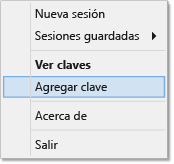

<properties
   pageTitle="Utilización de claves SSH con Hadoop en clústeres basados en Linux desde Windows | Microsoft Azure"
   description="Aprenda a crear y usar claves SSH para autenticarse en clústeres de HDInsight basado en Linux. Conecte clústeres desde clientes basados en Windows mediante el cliente SSH PuTTY."
   services="hdinsight"
   documentationCenter=""
   authors="Blackmist"
   manager="paulettm"
   editor="cgronlun"/>

<tags
   ms.service="hdinsight"
   ms.devlang="na"
   ms.topic="article"
   ms.tgt_pltfrm="na"
   ms.workload="big-data"
   ms.date="07/06/2015"
   ms.author="larryfr"/>

#Utilización de SSH con Hadoop en HDInsight basado en Linux desde Windows (vista previa)

> [AZURE.SELECTOR]
- [Windows](hdinsight-hadoop-linux-use-ssh-windows.md)
- [Linux, Unix, OS X](hdinsight-hadoop-linux-use-ssh-unix.md)

Los clústeres de HDInsight de Azure basado en Linux proporcionan la opción de usar acceso de shell seguro (SSH) con una contraseña o una clave SSH. Este documento proporciona información sobre cómo conectarse a HDInsight desde clientes Windows usando el cliente SSH PuTTY.

> [AZURE.NOTE]Los pasos que aparecen en este artículo suponen que está usando un cliente Windows. Si usa un cliente Linux, Unix u OS X, consulte [Utilización de SSH con Hadoop en HDInsight basado en Linux desde Linux, Unix u OS X](hdinsight-hadoop-linux-use-ssh-unix.md).

##Requisitos previos

* **PuTTY** y **PuTTYGen** para clientes Windows. Estas utilidades se encuentran disponibles en [http://www.chiark.greenend.org.uk/~sgtatham/putty/download.html](http://www.chiark.greenend.org.uk/~sgtatham/putty/download.html).

* Un explorador web moderno que sea compatible con HTML5.

OR

* [CLI de Azure para Mac, Linux y Windows](../xplat-cli.md).

##¿Qué es SSH?

SSH es una utilidad para iniciar sesión y ejecutar de manera remota comandos en un servidor remoto. Con HDInsight basado en Linux, SSH establece una conexión cifrada al nodo principal del clúster y proporciona una línea de comandos que se usa para escribir los comandos. Luego esos comandos se ejecutan directamente en el servidor.

##Creación de una clave SSH (opcional)

Cuando crea un clúster de HDInsight basado en Linux, tiene la opción de usar una contraseña o una clave SSH para autenticar el servidor cuando se usa SSH. Las claves SSH se consideran más seguras, puesto que están basadas en certificados. Use la siguiente información si planea usar claves SSH con el clúster.

1. Abra PuTTYGen.

2. En **Type of key to generate** (Tipo de clave a generar), seleccione **SSH-2 RSA** y, a continuación, haga clic en **Generate** (Generar).

	

3. Mueva el mouse en el área debajo de la barra de progreso hasta que la barra se complete. Mover el mouse genera datos aleatorios que se usan para generar la clave.

	

	Una vez que se genere la clave, aparecerá la clave pública.

4. Para mayor seguridad, puede escribir una frase de contraseña en el campo **Key passphrase** (Frase de contraseña de clave) y, a continuación, escribir el mismo valor en el campo **Confirm passphrase** (Confirmar frase de contraseña).

	

	> [AZURE.NOTE]Recomendamos encarecidamente que use una frase de contraseña segura para la clave. Sin embargo, si se le olvida la frase de contraseña, no hay forma de recuperarla.

5. Haga clic en **Save private key** (Guardar clave privada) para guardar la clave en un archivo **.ppk**. Esta clave se usará para autenticarse en el clúster de HDInsight basado en Linux.

	> [AZURE.NOTE]Debe almacenar esta clave en una ubicación segura, puesto que se puede usar para tener acceso a su clúster de HDInsight basado en Linux.

6. Haga clic en **Save public key** (Guardar clave pública) para guardar la clave como archivo **.txt**. Esto le permitirá volver a usar la clave pública cuando cree clústeres adicionales de HDInsight basado en Linux.

	> [AZURE.NOTE]La clave pública también aparece en la parte superior de PuTTYGen. Puede hacer clic con el botón secundario en este campo, copiar el valor y, a continuación, pegarlo en un formulario, como el asistente de HDInsight en el Portal de Azure.

##Creación de un clúster de HDInsight basado en Linux

Cuando cree un clúster de HDInsight basado en Linux, deberá proporcionar la clave pública anteriormente creada. Desde clientes Windows, hay dos maneras de crear un clúster de HDInsight basado en Linux:

* **Portal de Azure**: usa un portal basado en web para crear el clúster.

* **CLI de Azure para Mac, Linux y Windows**: usa comandos de la línea de comandos para crear el clúster.

Cada uno de estos métodos requerirá la clave pública. Para obtener información completa sobre la creación de un clúster de HDInsight basado en Linux, consulte [Aprovisionamiento de clústeres de HDInsight basado en Linux](hdinsight-hadoop-provision-linux-clusters.md).

###Portal de Azure

Cuando use el portal para crear un clúster de HDInsight basado en Linux, debe escribir un nombre de usuario y contraseña o una clave pública en el siguiente formulario:

Esta acción crea un inicio de sesión para el usuario especificado y le permite una autenticación por contraseña o por clave SSH.

###Interfaz de la línea de comandos de Azure para Mac, Linux y Windows

Puede utilizar [CLI de Azure para Mac, Linux y Windows](../xplat-cli.md) con el fin de crear un clúster nuevo con el comando `azure hdinsight cluster create`.

Para obtener más información acerca del uso de este comando, consulte [Aprovisionamiento de clústeres de Hadoop Linux en HDInsight con opciones personalizadas](hdinsight-hadoop-provision-linux-clusters.md).

##Conexión a un clúster de HDInsight basado en Linux

1. Abra PuTTY.

	

2. Si proporcionó una clave SSH cuando creó la cuenta de usuario, debe realizar el siguiente paso para seleccionar la clave privada que se usará al autenticarse en el clúster.

	En **Category** (Categoría), expanda **Connection** (Conexión), **SSH** y, a continuación, seleccione **Auth** (Autenticar). Finalmente, haga clic en **Browse** (Examinar) y seleccione el archivo .ppk que contiene su clave privada.

	

3. En **Category** (Categoría), seleccione **Session** (Sesión). En la pantalla **Basic options for your PuTTY session** (Opciones básicas de la sesión de PuTTY), escriba la dirección SSH del servidor de HDInsight en el campo **Host name (or IP address)** (Nombre de host (o dirección IP)). La dirección SSH es el nombre de su clúster, seguido de **-ssh.azurehdinsight.net**. Por ejemplo, **mycluster-ssh.azurehdinsight.net**.

	

4. Para guardar la información de conexión para un uso posterior, escriba un nombre para esta conexión en **Saved Sessions** (Sesiones guardadas) y, a continuación, haga clic en **Save** (Guardar). La conexión se agregará a la lista de sesiones guardadas.

5. Haga clic en **Open** (Abrir) para conectarse al clúster.

	> [AZURE.NOTE]Si es la primera vez que se conecta al clúster, recibirá una alerta de seguridad. Esto es normal. Seleccione **Yes** (Sí) para almacenar en caché la clave RSA2 del servidor para continuar.

6. Cuando se le solicite, escriba el usuario que ingresó cuando creó el clúster. Si proporcionó una contraseña para el usuario, también se le pedirá escribirla.

###Conexión a los nodos de trabajo

No es posible tener acceso a los nodos de trabajo directamente desde fuera del centro de datos de Azure, pero sí es posible hacerlo desde el nodo principal del clúster a través de SSH.

Si proporcionó una clave SSH cuando creó la cuenta de usuario, debe realizar los siguientes pasos para usar la clave privada cuando realice la autenticación del clúster si desea conectarse a los nodos de trabajo.

1. Instale Pageant desde [http://www.chiark.greenend.org.uk/~sgtatham/putty/download.html](http://www.chiark.greenend.org.uk/~sgtatham/putty/download.html). Esta utilidad se usa para almacenar en caché claves SSH para PuTTY.

2. Ejecute Pageant. Se minimizará a un icono en la bandeja de estado. Haga clic con el botón secundario en el icono y seleccione **Add Key** (Agregar clave).

    

3. Cuando aparezca el cuadro de diálogo para examinar, seleccione el archivo .ppk que contiene la clave y, a continuación, haga clic en **Open** (Abrir). Con esto la clave se agrega a Pageant, que la proporcionará a PuTTY cuando se conecte al clúster.

    > [AZURE.IMPORTANT]Si usa una clave SSH para proteger la cuenta, deberá completar los pasos anteriores para poder conectarse a los nodos de trabajo.

4. Abra PuTTY.

5. Si usa una clave SSH para autenticarse, en la sección **Category** (Categoría), expanda **Connection** (Conexión), **SSH** y, a continuación, seleccione **Auth** (Autenticar).

    En la sección **Authentication parameters** (Parámetros de autenticación), habilite **Allow agent forwarding** (Permitir desvío de agente). Esto permite que PuTTY pase automáticamente la autenticación de certificado a través de la conexión al nodo principal del clúster cuando se conecte a los nodos de trabajo.

    

6. Conéctese al clúster como se indicó anteriormente. Si usa una clave SSH para la autenticación, no necesita seleccionar la clave: se usará la clave SSH agregada a Pageant para realizar la autenticación en el clúster.

7. Una vez establecida la conexión, use lo siguiente para recuperar una lista de los nodos del clúster. Reemplace *ADMINPASSWORD* por la contraseña de la cuenta del administrador de clúster. Reemplace *CLUSTERNAME* por el nombre del clúster.

        curl --user admin:ADMINPASSWORD https://CLUSTERNAME.azurehdinsight.net/api/v1/hosts

    Esto devolverá información en formato JSON para los nodos del clúster, incluido `host_name`, que contiene el nombre de dominio completo (FDQN) para cada nodo. El siguiente es un ejemplo de una entrada `host_name` devuelta por el comando **curl**:

        "host_name" : "workernode0.workernode-0-e2f35e63355b4f15a31c460b6d4e1230.j1.internal.cloudapp.net"

8. Una vez que tenga una lista de los nodos de trabajo a los que desea conectarse, use el comando siguiente desde la sesión de PuTTY para abrir una conexión con un nodo de trabajo:

        ssh USERNAME@FQDN

    Reemplace *USERNAME* por el nombre de usuario SSH y *FQDN* por el FQDN del nodo de trabajo. Por ejemplo, `workernode0.workernode-0-e2f35e63355b4f15a31c460b6d4e1230.j1.internal.cloudapp.net`.

    > [AZURE.NOTE]Si usa una contraseña para realizar la autenticación de la sesión SSH, se le pedirá que la escriba nuevamente. Si usa una clave SSH, la conexión debiera finalizar sin que deba realizar ninguna acción.

9. Una vez establecida la sesión, el símbolo del sistema de la sesión de PuTTY cambiará de `username@headnode` a `username@workernode` para indicar que está conectado al nodo de trabajo. Los comandos que ejecute en este punto se ejecutarán en el nodo de trabajo.

10. Una vez que haya terminado de realizar acciones en el nodo de trabajo, use el comando `exit` para cerrar la sesión en el nodo de trabajo. Con esto volverá al símbolo del sistema `username@headnode`.

##Incorporación de más cuentas

Si necesita agregar más cuentas al clúster, siga estos pasos:

1. Genere una clave pública nueva y una clave privada nueva para la cuenta de usuario nueva, tal como se describió anteriormente.

2. Desde una sesión de SSH al clúster, agregue el usuario nuevo con el siguiente comando:

		sudo adduser --disabled-password <username>

	Con esto se creará una nueva cuenta de usuario, pero se deshabilitará la autenticación de contraseña.

3. Cree el directorio y los archivos para que contengan la clave con los siguientes comandos:

        sudo mkdir -p /home/<username>/.ssh
        sudo touch /home/<username>/.ssh/authorized_keys
        sudo nano /home/<username>/.ssh/authorized_keys

4. Cuando se abra el editor nano, copie y pegue el contenido de la clave pública para la cuenta de usuario nueva. Finalmente, use **Ctrl-X** para guardar el archivo y salga del editor.

	

5. Use el comando siguiente para cambiar la propiedad de la carpeta .ssh y el contenido a la cuenta de usuario nueva:

		sudo chown -hR <username>:<username> /home/<username>/.ssh

6. Ahora debiera poder autenticarse con el servidor con la cuenta de usuario nueva y la clave privada.

##Tunelización de SSH

SSH también se puede usar para tunelizar las solicitudes locales, como solicitudes web, al clúster de HDInsight. La solicitud se enrutará al recurso solicitado como si se hubiese originado en el nodo principal del clúster de HDInsight.

Esto resulta muy útil cuando se obtiene acceso a servicios basados en Web en el clúster de HDInsight que usan nombres de dominio interno para el nodo principal o el nodo de trabajo en el clúster. Por ejemplo, algunas secciones de la página web de Ambari usan nombres de dominio interno, como **headnode0.mycluster.d1.internal.cloudapp.net**. Estos nombres no se pueden resolver desde el exterior del clúster, pero las solicitudes tunelizadas sobre SSH se originan dentro del clúster y se resolverán correctamente.

Use los siguientes pasos para crear un túnel SSH y configure el explorador para que lo use para conectarse al clúster:

1. Abra PuTTY y escriba la información de conexión tal como se indicó anteriormente en la sección [Conexión a un clúster basado en Linux](#connect-to-a-linux-based-hdinsight-cluster).

2. En la sección **Category** (Categoría) a la izquierda del cuadro de diálogo, expanda **Connection** (Conexión), **SSH** y, a continuación, seleccione **Tunnels** (Túneles).

3. Proporcione la siguiente información en el formulario **Options controlling SSH port forwarding** (Opciones que controlan el desvío de puertos SSH):

	* **Source port**: el puerto en el cliente que desea desviar. Por ejemplo, **9876**.

	* **Destination**: la dirección SSH del clúster de HDInsight basado en Linux. Por ejemplo, **mycluster-ssh.azurehdinsight.net**.

	* **Dynamic**: habilita el enrutamiento dinámico del proxy SOCKS.

	

4. Haga clic en **Add** (Agregar) para agregar la configuración y, a continuación, en **Open** (Abrir) para abrir una conexión SSH.

5. Cuando se le solicite, inicie sesión en el servidor. Esto establecerá una sesión SSH y habilitará el túnel.

6. Configure el programa cliente, como Firefox, para que use **localhost:9876** como el proxy **SOCKS v5**. La configuración de Firefox se verá de la siguiente manera:

	

	> [AZURE.NOTE]Seleccionar **DNS remoto** resolverá las solicitudes de DNS mediante el uso del clúster de HDInsight. Si no se selecciona, el DNS se resolverá de manera local.

	Puede comprobar que el tráfico se enruta a través del túnel mediante la visita a un sitio como [http://www.whatismyip.com/](http://www.whatismyip.com/) con la configuración del proxy habilitada y deshabilitada en Firefox. Cuando la configuración esté habilitada, la dirección IP será la de una máquina en el centro de datos de Microsoft Azure.

###Extensiones del explorador

A pesar de que la configuración del explorador para que use el túnel funciona, normalmente no desearía enrutar todo el tráfico a través del túnel. Las extensiones del explorador, como [FoxyProxy](http://getfoxyproxy.org/), son compatibles con la coincidencia de patrones para las solicitudes de dirección URL (FoxyProxy Standard o Plus solamente), de manera tal que solo las solicitudes para direcciones URL específicas se enviarán a través del túnel.

Si instaló FoxyProxy Standard, use los siguientes pasos para configurarlo para que solo desvíe tráfico para HDInsight a través del túnel.

1. Abra la extensión FoxyProxy en el explorador. Por ejemplo, en Firefox, seleccione el icono de FoxyProxy que se encuentra junto al campo de dirección.

	

2. Seleccione **Agregar proxy nuevo**, la pestaña **General** y, a continuación, escriba un nombre de proxy de **HDInsightProxy**.

	

3. Seleccione la pestaña **Detalles de proxy** y rellene los campos siguientes:

	* **Host y dirección IP**: localhost, debido a que usamos un túnel SSH en la máquina local.

	* **Puerto**: el puerto que usó para el túnel SSH.

	* **Proxy SOCKS**: seleccione para permitir que el explorador use el túnel como proxy.

	* **SOCKS v5**: seleccione para definir la versión requerida del proxy.

	

4. Seleccione la pestaña **Patrones de dirección URL** y, a continuación, seleccione **Agregar patrón nuevo**. Use lo siguiente para definir el patrón y, a continuación, haga clic en **Aceptar**:

	* **Nombre de patrón** - **headnode**: es solo un nombre descriptivo para el patrón.

	* **Patrón de dirección URL** - ***headnode***: define un patrón que coincide con cualquier dirección URL que contenga la palabra **headnode**.

	

4. Seleccione **Aceptar** para agregar el proxy y cierre la **Configuración de proxy**.

5. En la parte superior del cuadro de diálogo FoxyProxy, cambie **Seleccionar modo** a **Uso de servidores proxy según sus patrones y prioridades predefinidos** y, a continuación, haga clic en **Cerrar**.

	

Después de seguir estos pasos, solo las solicitudes de direcciones URL que contienen la cadena **headnode** se enrutarán a través del túnel SSL.

##Pasos siguientes

Ahora que sabe cómo realizar la autenticación con una clave SSH, aprenda a usar MapReduce con Hadoop en HDInsight.

* [Uso de Hive con HDInsight](hdinsight-use-hive.md)

* [Uso de Pig con HDInsight](hdinsight-use-pig.md)

* [Uso de trabajos de MapReduce con HDInsight](hdinsight-use-mapreduce.md)

<!---HONumber=July15_HO2-->