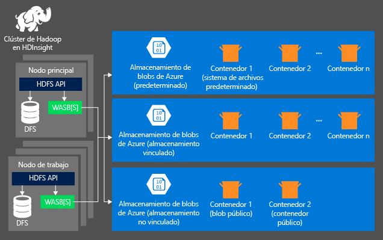
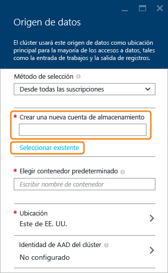

# Uso de Azure Storage con clústeres de Azure HDInsight

Para analizar datos del clúster de HDInsight, puede almacenar los datos en Azure Storage, Azure Data Lake Store, o en ambos lugares. Ambas opciones de almacenamiento le permiten eliminar de forma segura clústeres de HDInsight que se usan para el cálculo sin perder datos del usuario.

Hadoop admite una noción del sistema de archivos predeterminado. El sistema de archivos predeterminado implica una autoridad y un esquema predeterminados. También se puede usar para resolver rutas de acceso relativas. Durante el proceso de creación del clúster de HDInsight, puede especificar un contenedor de blobs en Azure Blob Storage como el sistema de archivos predeterminado; también, con HDInsight 3.5, puede seleccionar Azure Storage o Azure Data Lake Store como el sistema de archivos predeterminado con algunas excepciones. Para más información sobre la compatibilidad con el uso de Data Lake Store como almacenamiento predeterminado y como almacenamiento vinculado, consulte [Availabilities for HDInsight cluster](./hdinsight-hadoop-use-data-lake-store.md#availabilities-for-hdinsight-clusters) (Disponibilidad del clúster de HDInsight).

En este artículo, aprenderá cómo funciona Azure Storage con clústeres de HDInsight. Para más información sobre cómo funciona Data Lake Store con clústeres de HDInsight, consulte [Use Azure Data Lake Store with Azure HDInsight clusters](hdinsight-hadoop-use-data-lake-store.md) (Uso de Azure Data Lake Store con clústeres de Azure HDInsight). Consulte [Creación de clústeres de Hadoop en HDInsight](hdinsight-hadoop-provision-linux-clusters.md) para obtener información sobre la creación de un clúster de HDInsight.

Azure Storage es una solución de almacenamiento sólida y de uso general, que se integra sin problemas con HDInsight. HDInsight puede usar un contenedor de blobs en Azure Storage como el sistema de archivos predeterminado para el clúster. Mediante una interfaz del sistema de archivos distribuido de Hadoop (HDFS), el conjunto completo de componentes de HDInsight puede operar directamente en datos estructurados o no estructurados almacenados como blobs.

> [!WARNING]
> Hay varias opciones disponibles al crear una cuenta de Azure Storage. En la tabla siguiente se proporciona información sobre qué opciones se admiten en HDInsight:
> 
> | Tipo de cuenta de almacenamiento | Capa de almacenamiento | Compatible con HDInsight |
> | ------- | ------- | ------- |
> | Cuenta de almacenamiento de uso general | Estándar | __Sí__ |
> | &nbsp; | Premium | No |
> | Cuenta de Blob Storage | Acceso frecuente | No |
> | &nbsp; | Acceso esporádico | No |

No se recomienda usar el contenedor de blobs predeterminado para almacenar datos empresariales. Conviene eliminar el contenedor de blobs predeterminado después de cada uso para reducir los costos de almacenamiento. Tenga en cuenta que el contenedor predeterminado contiene los registros del sistema y de la aplicación. Asegúrese de recuperar los registros antes de eliminar el contenedor.

No se permite compartir un contenedor de blobs entre varios clústeres.

## Arquitectura de almacenamiento de HDInsight
El diagrama siguiente proporciona una panorámica de la arquitectura de almacenamiento de HDInsight disponible al utilizar Azure Storage:

HDInsight brinda acceso al sistema de archivos distribuidos que se adjunta localmente a los nodos de ejecución. Se puede acceder a este sistema de archivos usando el URI completo, por ejemplo:

    hdfs://<namenodehost>/<path>

Además, HDInsight le permite acceder a los datos almacenados en Azure Storage. La sintaxis es:

    wasb[s]://<containername>@<accountname>.blob.core.windows.net/<path>

A la hora de usar una cuenta de Azure Storage con clústeres de HDInsight, es necesario tener en cuenta algunas cosas.

* **Contenedores de las cuentas de almacenamiento que se conectan a un clúster:** dado que el nombre y la clave de la cuenta se asocian al clúster durante la creación, tiene acceso total a los blobs de dichos contenedores.

* **Los contenedores o blobs públicos de las cuentas de almacenamiento que NO están conectados a un clúster:** tiene permiso de solo lectura a los blobs de los contenedores.
  
  > [!NOTE]
  > Los contenedores públicos le permiten obtener una lista de todos los blobs disponibles del contenedor en cuestión y obtener sus metadatos. Los blobs públicos le permiten acceder a los blobs solo si conoce la URL exacta. Para obtener más información, consulte <a href="http://msdn.microsoft.com/library/windowsazure/dd179354.aspx">Restringir acceso a contenedores y blobs</a>.
  > 
  > 
* **Contenedores privados de las cuentas de almacenamiento que no están conectados a un clúster:** no puede tener acceso a los blobs de los contenedores a menos que defina la cuenta de almacenamiento al enviar los trabajos de WebHCat. Esto se explica posteriormente en este artículo.

Las cuentas de almacenamiento definidas en el proceso de creación y sus claves se almacenan en %HADOOP_HOME%/conf/core-site.xml en los nodos de clúster. El comportamiento predeterminado de HDInsight es usar las cuentas de almacenamiento definidas en el archivo core-site.xml. Puede modificar esta configuración mediante [Ambari](./hdinsight-hadoop-manage-ambari.md)

Varios trabajos de WebHCat, incluidos Hive, MapReduce, streaming de Hadoop y Pig, pueden llevar una descripción de cuentas de almacenamiento y metadatos con ellos. (Actualmente esto funciona para Pig con cuentas de almacenamiento pero no para metadatos). Para obtener más información, consulte [Uso de un clúster de HDInsight con cuentas de almacenamiento y tiendas de metadatos alternativas](http://social.technet.microsoft.com/wiki/contents/articles/23256.using-an-hdinsight-cluster-with-alternate-storage-accounts-and-metastores.aspx).

Los blobs se pueden usar para datos estructurados y no estructurados. Los contenedores de blobs almacenan los datos como pares de clave-valor y no hay jerarquía de directorios. No obstante, el carácter de barra diagonal ( / ) se puede usar en el nombre de la clave para que parezca que el archivo está almacenado dentro de una estructura de directorios. Por ejemplo, la clave de un blob puede ser *input/log1.txt*. No hay directorios *input* , pero dada la presencia del carácter de barra diagonal en el nombre de la clave, parece la ruta de un archivo.

## Ventajas de Azure Storage
El costo de rendimiento implícito por no tener ubicados juntos los recursos de almacenamiento y clústeres de proceso se ve mitigado por el modo en que los clústeres de proceso se crean cerca de los recursos de la cuenta de almacenamiento dentro de la región de Azure, donde la red de alta velocidad consigue que los nodos de proceso sean eficientes en el acceso a los datos de Azure Storage.

Hay varias ventajas asociadas al almacenamiento de datos en Azure Storage en lugar de en HDFS:

* **Reutilización de uso compartido de datos:** los datos de HDFS se ubican dentro del clúster de cálculo. Solamente las aplicaciones que tengan acceso al clúster de cálculo podrán usar los datos usando las API HDFS. Se puede acceder a los datos de Azure Storage mediante las API de HDFS o las [API de REST de Blob Storage][blob-storage-restAPI]. Por lo tanto, se puede usar un conjunto mayor de aplicaciones (incluyendo otros clústeres de HDInsight) y herramientas para producir y consumir los datos.
* **Archivo de datos:** almacenar los datos en Azure Storage permite que los clústeres de HDInsight usados para el cálculo se eliminen de forma segura sin perder datos del usuario.
* **Costo de almacenamiento de datos:** almacenar datos en DFS es más caro a largo plazo que almacenarlos en Azure Storage, ya que el costo de un clúster de proceso es superior al de Azure Storage. Además, como no hay que volver a cargar los datos para cada generación de clúster de cálculo, también se ahorra en costes de carga de datos.
* **Escalación horizontal elástica:** aunque HDFS proporciona un sistema de archivos escalable en horizontal, la escala se determina en función del número de nodos que cree para su clúster. Cambiar la escala puede ser un proceso más complicado que basarse en las funcionalidades de escalado elástico que se obtienen automáticamente en Azure Storage.
* **Replicación geográfica:** su almacenamiento de Azure Storage se puede replicar geográficamente. Aunque esto le aporta recuperación geográfica y redundancia de datos, una conmutación por error en la ubicación replicada geográficamente afecta gravemente a su rendimiento y puede incurrir en costes adicionales. Por lo tanto, nuestra recomendación es que elija la replicación geográfica de forma inteligente y únicamente si merece la pena pagar el coste adicional por el valor de los datos.

Determinados trabajos y paquetes de MapReduce podrían crear resultados intermedios que realmente no desea almacenar en Azure Storage. En tal caso, puede optar por almacenar los datos en el HDFS local. De hecho, HDInsight usa DFS para varios de estos resultados intermedios en los trabajos de Hive y otros procesos.

> [!NOTE]
> La mayoría de los comandos HDFS (por ejemplo, <b>ls</b>, <b>copyFromLocal</b> y <b>mkdir</b>) siguen funcionando según lo previsto. Únicamente los comandos específicos de la implementación nativa de HDFS (a la que nos referiremos como DFS), como <b>fschk</b> y <b>dfsadmin</b>, muestran comportamientos diferentes en Azure Storage.
> 
> 

## Creación de contenedores de blobs
Para usar blobs, en primer lugar debe crear una [cuenta de Azure Storage][azure-storage-create]. Como parte de esto, especifica una región de Azure donde se crea la cuenta de almacenamiento. El clúster y la cuenta de almacenamiento deben ubicarse en la misma región. La base de datos de SQL Server de la tienda de metadatos Hive y la base de datos de SQL Server de la tienda de metadatos Oozie también deben encontrarse en la misma región.

Cualquiera que sea su ubicación, todos los blobs que cree pertenecerán a un contenedor de su cuenta de almacenamiento de Azure. Este contenedor puede ser un blob existente creado fuera de HDInsight, o bien un contenedor que se crea para un clúster de HDInsight.

El contenedor de blobs predeterminado almacena información específica del clúster, como registros y el historial de trabajos. No comparta un contenedor de blobs predeterminado con varios clústeres de HDInsight. Se podría dañar el historial de trabajos. Es recomendable usar un contenedor diferente para cada clúster y colocar los datos compartidos en una cuenta de almacenamiento vinculada especificada en la implementación de todos los clústeres pertinentes en lugar de la cuenta de almacenamiento predeterminada. Para más información acerca de cómo configurar cuentas de almacenamiento vinculadas, consulte [Creación de clústeres de HDInsight][hdinsight-creation]. Sin embargo, puede volver a usar un contenedor de almacenamiento predeterminado después de que se haya eliminado el clúster de HDInsight original. En el caso de los clústeres de HBase, para conservar el esquema y los datos de tabla de HBase se puede crear un nuevo clúster de HBase mediante el contenedor de blobs predeterminado que usaba un clúster de HBase eliminado.

[!INCLUDE [secure-transfer-enabled-storage-account](../../includes/hdinsight-secure-transfer.md)]

### Uso de Azure Portal
Al crear un clúster de HDInsight desde el Portal, tendrá las opciones (tal y como se muestra a continuación) para proporcionar los detalles de la cuenta de almacenamiento. También puede especificar si quiere una cuenta de almacenamiento adicional asociada al clúster y, en este caso, elegir entre Data Lake Store u otro blob de Azure Storage como almacenamiento adicional.

> [!WARNING]
> No se admite el uso de una cuenta de almacenamiento adicional en una ubicación diferente a la del clúster de HDInsight.

### Uso de Azure PowerShell
Si ha [instalado y configurado Azure PowerShell][powershell-install], puede usar lo siguiente desde el símbolo del sistema de Azure PowerShell para crear un contenedor y una cuenta de almacenamiento:

[!INCLUDE [upgrade-powershell](../../includes/hdinsight-use-latest-powershell.md)]

    $SubscriptionID = "<Your Azure Subscription ID>"
    $ResourceGroupName = "<New Azure Resource Group Name>"
    $Location = "EAST US 2"

    $StorageAccountName = "<New Azure Storage Account Name>"
    $containerName = "<New Azure Blob Container Name>"

    Add-AzureRmAccount
    Select-AzureRmSubscription -SubscriptionId $SubscriptionID

    # Create resource group
    New-AzureRmResourceGroup -name $ResourceGroupName -Location $Location

    # Create default storage account
    New-AzureRmStorageAccount -ResourceGroupName $ResourceGroupName -Name $StorageAccountName -Location $Location -Type Standard_LRS 

    # Create default blob containers
    $storageAccountKey = (Get-AzureRmStorageAccountKey -ResourceGroupName $resourceGroupName -StorageAccountName $StorageAccountName)[0].Value
    $destContext = New-AzureStorageContext -StorageAccountName $storageAccountName -StorageAccountKey $storageAccountKey  
    New-AzureStorageContainer -Name $containerName -Context $destContext

### Uso de CLI de Azure

[!INCLUDE [use-latest-version](../../includes/hdinsight-use-latest-cli.md)]

Si ha [instalado y configurado la CLI Azure](../cli-install-nodejs.md), se puede usar el comando siguiente para una cuenta de almacenamiento y contenedor.

    azure storage account create <storageaccountname> --type LRS

> [!NOTE]
> El parámetro `--type` indica cómo se replica la cuenta de almacenamiento. Para obtener más información, vea [Replicación de Azure Storage](../storage/storage-redundancy.md). No utilice ZRS, ya que no admite blob en páginas, archivo, tabla o cola.
> 
> 

Se le pide que especifique la región geográfica en la que se crea la cuenta de almacenamiento. Debe crear la cuenta de almacenamiento en la misma región en la que planea crear el clúster de HDInsight.

Una vez creada la cuenta de almacenamiento, use el siguiente comando para recuperar las claves de la cuenta de almacenamiento:

    azure storage account keys list <storageaccountname>

Para crear un contenedor, use el comando siguiente:

    azure storage container create <containername> --account-name <storageaccountname> --account-key <storageaccountkey>

## Archivos adicionales en Azure Storage
El esquema de URI para acceder a los archivos de Azure Storage desde HDInsight es:

    wasb[s]://<BlobStorageContainerName>@<StorageAccountName>.blob.core.windows.net/<path>

El esquema URI proporciona acceso sin cifrar (con el prefijo *wasb:*) y acceso cifrado SSL con *wasbs*). Se recomienda usar *wasbs* siempre que sea posible, incluso cuando se acceda a datos que se encuentren en la misma región de Azure.

&lt;BlobStorageContainerName&gt; identifica el nombre del contenedor de blobs del Azure Storage.
&lt;StorageAccountName&gt; identifica el nombre de la cuenta de Azure Storage. Se necesita el nombre completo de dominio (FQDN).

Si no se ha especificado ningún valor en &lt;BlobStorageContainerName&gt; ni en &lt;StorageAccountName&gt;, se usará el sistema de archivos predeterminado. Para los archivos del sistema de archivos predeterminado, puede usar una ruta relativa o absoluta. Por ejemplo, se puede hacer referencia al archivo *hadoop-mapreduce-examples.jar* que se incluye con los clústeres de HDInsight usando uno de los siguientes:

    wasb://mycontainer@myaccount.blob.core.windows.net/example/jars/hadoop-mapreduce-examples.jar
    wasb:///example/jars/hadoop-mapreduce-examples.jar
    /example/jars/hadoop-mapreduce-examples.jar

> [!NOTE]
> El nombre del archivo es <i>hadoop-examples.jar</i> en las versiones 2.1 y 1.6 de los clústeres de HDInsight.
> 
> 

La &lt;ruta&gt; es el nombre de la ruta HDFS del archivo o el directorio. Dado que los contenedores de Azure Storage son solamente almacenes de pares clave-valor, no hay ningún sistema de archivos jerárquico real. Un carácter de barra inclinada ( / ) dentro de la clave de blob se interpreta como separador de directorios. Por ejemplo, el nombre del blob para *hadoop-mapreduce-examples.jar* es:

    example/jars/hadoop-mapreduce-examples.jar

> [!NOTE]
> Al trabajar con blobs fuera de HDInsight, la mayoría de las utilidades no reconocen el formato WASB y en su lugar, espera un formato básico de ruta de acceso, como `example/jars/hadoop-mapreduce-examples.jar`.
> 
> 

## Acceso a blobs 

###  Uso de Azure PowerShell
> [!NOTE]
> Los comandos de esta sección proporcionan un ejemplo básico de uso de PowerShell para acceder a los datos almacenados en blobs. Para obtener un ejemplo más completo que se personaliza para trabajar con HDInsight, vea las [Herramientas de HDInsight](https://github.com/Blackmist/hdinsight-tools).
> 
> 

Utilice el comando siguiente para incluir los cmdlets relacionados con el blob:

    Get-Command *blob*

![Lista de cmdlets de PowerShell relacionados con el blob.][img-hdi-powershell-blobcommands]

#### Carga de archivos
Consulte [Carga de datos en HDInsight][hdinsight-upload-data].

#### Descarga de archivos
El script siguiente descarga un blob en bloques en la carpeta actual. Antes de ejecutar el script, cambie el directorio a una carpeta en la que tenga permisos de escritura.

    $resourceGroupName = "<AzureResourceGroupName>"
    $storageAccountName = "<AzureStorageAccountName>"   # The storage account used for the default file system specified at creation.
    $containerName = "<BlobStorageContainerName>"  # The default file system container has the same name as the cluster.
    $blob = "example/data/sample.log" # The name of the blob to be downloaded.

    # Use Add-AzureAccount if you haven't connected to your Azure subscription
    Login-AzureRmAccount 
    Select-AzureRmSubscription -SubscriptionID "<Your Azure Subscription ID>"

    Write-Host "Create a context object ... " -ForegroundColor Green
    $storageAccountKey = (Get-AzureRmStorageAccountKey -ResourceGroupName $resourceGroupName -Name $storageAccountName)[0].Value
    $storageContext = New-AzureStorageContext -StorageAccountName $storageAccountName -StorageAccountKey $storageAccountKey  

    Write-Host "Download the blob ..." -ForegroundColor Green
    Get-AzureStorageBlobContent -Container $ContainerName -Blob $blob -Context $storageContext -Force

    Write-Host "List the downloaded file ..." -ForegroundColor Green
    cat "./$blob"

Al proporcionar el nombre del grupo de recursos y el nombre del clúster, podrá utilizar el código siguiente:

    $resourceGroupName = "<AzureResourceGroupName>"
    $clusterName = "<HDInsightClusterName>"
    $blob = "example/data/sample.log" # The name of the blob to be downloaded.

    $cluster = Get-AzureRmHDInsightCluster -ResourceGroupName $resourceGroupName -ClusterName $clusterName
    $defaultStorageAccount = $cluster.DefaultStorageAccount -replace '.blob.core.windows.net'
    $defaultStorageAccountKey = (Get-AzureRmStorageAccountKey -ResourceGroupName $resourceGroupName -Name $defaultStorageAccount)[0].Value
    $defaultStorageContainer = $cluster.DefaultStorageContainer
    $storageContext = New-AzureStorageContext -StorageAccountName $defaultStorageAccount -StorageAccountKey $defaultStorageAccountKey 

    Write-Host "Download the blob ..." -ForegroundColor Green
    Get-AzureStorageBlobContent -Container $defaultStorageContainer -Blob $blob -Context $storageContext -Force

#### Eliminar archivos
    Remove-AzureStorageBlob -Container $containerName -Context $storageContext -blob $blob

#### Enumerar archivos
    Get-AzureStorageBlob -Container $containerName -Context $storageContext -prefix "example/data/"

#### Ejecutar consultas de Hive usando una cuenta de almacenamiento sin definir
En este ejemplo se presenta cómo mostrar una carpeta en una lista desde la cuenta de almacenamiento no definida durante el proceso de creación.
$clusterName = "<HDInsightClusterName>"

    $undefinedStorageAccount = "<UnboundedStorageAccountUnderTheSameSubscription>"
    $undefinedContainer = "<UnboundedBlobContainerAssociatedWithTheStorageAccount>"

    $undefinedStorageKey = Get-AzureStorageKey $undefinedStorageAccount | %{ $_.Primary }

    Use-AzureRmHDInsightCluster $clusterName

    $defines = @{}
    $defines.Add("fs.azure.account.key.$undefinedStorageAccount.blob.core.windows.net", $undefinedStorageKey)

    Invoke-AzureRmHDInsightHiveJob -Defines $defines -Query "dfs -ls wasb://$undefinedContainer@$undefinedStorageAccount.blob.core.windows.net/;"

### Uso de CLI de Azure
Use el siguiente comando para mostrar los cmdlets relacionados con blobs:

    azure storage blob

**Ejemplo de uso de CLI de Azure para cargar un archivo**

    azure storage blob upload <sourcefilename> <containername> <blobname> --account-name <storageaccountname> --account-key <storageaccountkey>

**Ejemplo de uso de CLI de Azure para descargar un archivo**

    azure storage blob download <containername> <blobname> <destinationfilename> --account-name <storageaccountname> --account-key <storageaccountkey>

**Ejemplo de uso de CLI de Azure para eliminar un archivo**

    azure storage blob delete <containername> <blobname> --account-name <storageaccountname> --account-key <storageaccountkey>

**Ejemplo de uso de CLI de Azure para mostrar archivos**

    azure storage blob list <containername> <blobname|prefix> --account-name <storageaccountname> --account-key <storageaccountkey>

## Uso de cuentas de almacenamiento adicionales

Al crear un clúster de HDInsight, se especifica la cuenta de Azure Storage a la que quiere asociarlo. Además de esta cuenta de almacenamiento, puede agregar otras desde la misma suscripción de Azure o desde otras diferentes tanto durante el proceso de creación como después de que el clúster se haya creado. Para obtener instrucciones sobre cómo agregar más cuentas de almacenamiento, consulte [Creación de clústeres de HDInsight](hdinsight-hadoop-provision-linux-clusters.md).

> [!WARNING]
> No se admite el uso de una cuenta de almacenamiento adicional en una ubicación diferente a la del clúster de HDInsight.

## Pasos siguientes
En este artículo, aprendió a usar Azure Storage compatible con HDFS con HDInsight. Esto le permite crear soluciones de adquisición de datos de archivado escalables y a largo plazo y usar HDInsight para desbloquear la información que hay dentro de los datos estructurados y no estructurados almacenados.

Para más información, consulte:

* [Introducción a Azure HDInsight][hdinsight-get-started]
* [Introducción Azure Data Lake Store](../data-lake-store/data-lake-store-get-started-portal.md)
* [Carga de datos en HDInsight][hdinsight-upload-data]
* [Uso de Hive con HDInsight][hdinsight-use-hive]
* [Uso de Pig con HDInsight][hdinsight-use-pig]
* [Uso de firmas de acceso compartido de Azure Storage para restringir el acceso a datos con HDInsight][hdinsight-use-sas]

[hdinsight-use-sas]: hdinsight-storage-sharedaccesssignature-permissions.md
[powershell-install]: /powershell/azureps-cmdlets-docs
[hdinsight-creation]: hdinsight-hadoop-provision-linux-clusters.md
[hdinsight-get-started]: hdinsight-hadoop-linux-tutorial-get-started.md
[hdinsight-upload-data]: hdinsight-upload-data.md
[hdinsight-use-hive]: hdinsight-use-hive.md
[hdinsight-use-pig]: hdinsight-use-pig.md

[blob-storage-restAPI]: http://msdn.microsoft.com/library/windowsazure/dd135733.aspx
[azure-storage-create]:../storage/common/storage-create-storage-account.md

[img-hdi-powershell-blobcommands]: ./media/hdinsight-hadoop-use-blob-storage/HDI.PowerShell.BlobCommands.png
[img-hdi-quick-create]: ./media/hdinsight-hadoop-use-blob-storage/HDI.QuickCreateCluster.png
[img-hdi-custom-create-storage-account]: ./media/hdinsight-hadoop-use-blob-storage/HDI.CustomCreateStorageAccount.png  
