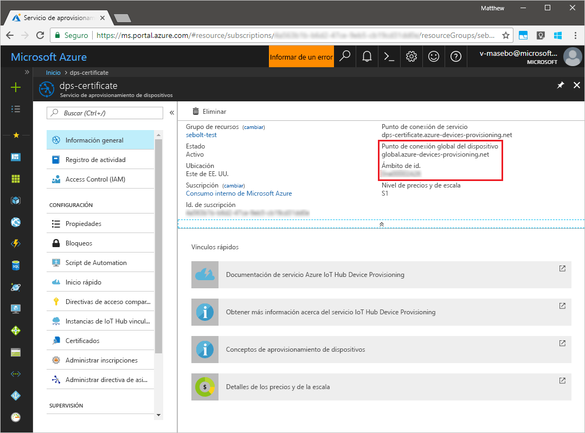
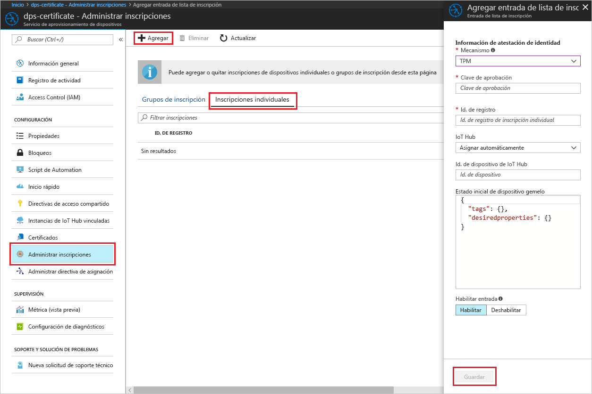
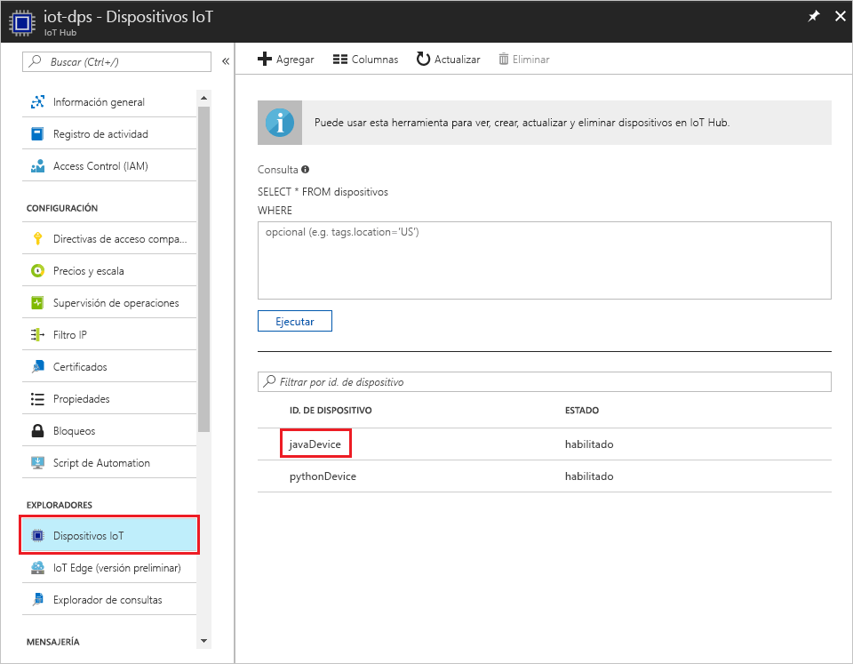

# <a name="create-and-provision-a-simulated-tpm-device-using-java-device-sdk-for-azure-iot-hub-device-provisioning-service"></a>Creación y aprovisionamiento de un dispositivo de TPM simulado mediante el SDK de dispositivos Java para el servicio Azure IoT Hub Device Provisioning
> [!div class="op_single_selector"]
> * [C](quick-create-simulated-device.md)
> * [Java](quick-create-simulated-device-tpm-java.md)
> * [C#](quick-create-simulated-device-tpm-csharp.md)
> * [Python](quick-create-simulated-device-tpm-python.md)

Estos pasos muestran cómo crear un dispositivo simulado en la máquina de desarrollo en la que se ejecuta el sistema operativo Windows, ejecutar el simulador de Windows TPM como el [módulo de seguridad de Hardware (HSM)](https://azure.microsoft.com/blog/azure-iot-supports-new-security-hardware-to-strengthen-iot-security/) del dispositivo y usar el ejemplo de código para conectar este dispositivo simulado con el servicio Device Provisioning y un centro de IoT. 

Asegúrese de completar los pasos descritos en [Configuración de un servicio Azure IoT Hub Device Provisioning con Azure Portal](./quick-setup-auto-provision.md) antes de continuar.


## <a name="prepare-the-environment"></a>Preparación del entorno 

1. Asegúrese de que tiene [Java SE Development Kit 8](http://www.oracle.com/technetwork/java/javase/downloads/jdk8-downloads-2133151.html) instalado en su máquina.

1. Descargue e instale [Maven](https://maven.apache.org/install.html).

1. Asegúrese de que `git` está instalado en su máquina y se agrega a las variables de entorno accesibles para la ventana de comandos. Consulte las [herramientas de cliente de Git de Software Freedom Conservancy](https://git-scm.com/download/) para instalar la versión más reciente de las herramientas `git`, lo que incluye **Git Bash**, la aplicación de línea de comandos que puede usar para interactuar con su repositorio de Git local. 

1. Abra el símbolo del sistema. Clone el repositorio GitHub para el ejemplo de código de simulación de dispositivo.
    
    ```cmd/sh
    git clone https://github.com/Azure/azure-iot-sdk-java.git --recursive
    ```

1. Ejecute el simulador de [TPM](https://docs.microsoft.com/windows/device-security/tpm/trusted-platform-module-overview). Haga clic en **Permitir acceso** para permitir cambios en la configuración del _Firewall de Windows_. Atiende en un socket en los puertos 2321 y 2322. No cierre esta ventana; debe mantener este simulador ejecutándose hasta el final de esta guía de inicio rápido. 

    ```cmd/sh
    .\azure-iot-sdk-java\provisioning\provisioning-tools\tpm-simulator\Simulator.exe
    ```

    

1. En un símbolo del sistema independiente, vaya a la carpeta raíz y compile las dependencias de ejemplo.

    ```cmd/sh
    cd azure-iot-sdk-java
    mvn install -DskipTests=true
    ```

1. Navegue hasta la carpeta de ejemplos.

    ```cmd/sh
    cd provisioning/provisioning-samples/provisioning-tpm-sample
    ```

1. Inicie sesión en Azure Portal, haga clic en el botón **Todos los recursos** situado en el menú izquierdo y abra el servicio Device Provisioning. Anote los valores de _Ámbito de id._ y _Provisioning Service Global Endpoint_ (Punto de conexión global del servicio de aprovisionamiento).

    

1. Edite el archivo `src/main/java/samples/com/microsoft/azure/sdk/iot/ProvisioningTpmSample.java` para que incluya los valores de _Ámbito de id._ y _Provisioning Service Global Endpoint_ (Punto de conexión global del servicio de aprovisionamiento) tal y como se indicó antes.  

    ```java
    private static final String idScope = "[Your ID scope here]";
    private static final String globalEndpoint = "[Your Provisioning Service Global Endpoint here]";
    private static final ProvisioningDeviceClientTransportProtocol PROVISIONING_DEVICE_CLIENT_TRANSPORT_PROTOCOL = ProvisioningDeviceClientTransportProtocol.HTTPS;
    ```

1. Compile el proyecto. Navegue hasta la carpeta de destino y ejecute el archivo .jar que se creó.

    ```cmd/sh
    mvn clean install
    cd target
    java -jar ./provisioning-tpm-sample-{version}-with-deps.jar
    ```

1. El programa inicia la ejecución. Anote los valores de _Clave de aprobación_ e _Id. de registro_ de la sección siguiente y deje el programa ejecutándose.

    
    

## <a name="create-a-device-enrollment-entry"></a>Creación de una entrada de inscripción de dispositivo

1. Inicie sesión en Azure Portal, haga clic en el botón **Todos los recursos** situado en el menú izquierdo y abra el servicio Device Provisioning.

1. En la hoja de resumen del servicio Device Provisioning, seleccione **Manage enrollments** (Administrar inscripciones). Seleccione la pestaña **Individual Enrollments** (Inscripciones individuales) y haga clic en el botón **Add** (Agregar) de la parte superior. 

1. En **Agregar entrada de la lista de inscripción**, escriba la siguiente información:
    - Seleccione **TPM** como *Mecanismo* de atestación de identidad.
    - Escriba los valores de *Id. de registro* y *Clave de aprobación* del dispositivo de TPM que anotó anteriormente. 
    - Seleccione un centro de IoT vinculado con el servicio de aprovisionamiento.
    - Escriba un identificador de dispositivo único. Asegúrese de evitar datos confidenciales al asignar nombre al dispositivo.
    - Actualice el **Estado inicial del dispositivo gemelo** con la configuración inicial deseada para el dispositivo.
    - Una vez completado, haga clic en el botón **Guardar**. 

      

   Al inscribir el dispositivo correctamente, el valor de *Id. de registro* del dispositivo aparece en la lista de la pestaña *Inscripciones individuales*. 


## <a name="simulate-the-device"></a>Simulación del dispositivo

1. En la ventana de comandos que ejecuta el código de ejemplo de Java en la máquina, presione Entrar para continuar ejecutando la aplicación. Tenga en cuenta los mensajes que simulan el arranque del dispositivo y la conexión al servicio Device Provisioning para obtener la información del centro de IoT.  

    

1. Si se aprovisiona correctamente el dispositivo simulado para el centro de IoT vinculado con el servicio de aprovisionamiento, el identificador de dispositivo aparece en la hoja **Device Explorer** del centro.

     

    Si ha cambiado el valor predeterminado de *Estado inicial del dispositivo gemelo* en la entrada de inscripción para el dispositivo, el dispositivo puede extraer el estado gemelo deseado desde el centro y actuar en consecuencia. Para más información, consulte [Información y uso de dispositivos gemelos en IoT Hub](../iot-hub/iot-hub-devguide-device-twins.md)


## <a name="clean-up-resources"></a>Limpieza de recursos

Si piensa seguir trabajando con el ejemplo de cliente de dispositivo y explorándolo, no limpie los recursos que se crean en esta guía de inicio rápido. Si no va a continuar, use el siguiente comando para eliminar todos los recursos creados.

1. Cierre la ventana de salida de ejemplo del cliente del dispositivo en su máquina.
1. Cierre la ventana del simulador de TPM en su máquina.
1. Desde el menú de la izquierda en Azure Portal, haga clic en **Todos los recursos** y seleccione el servicio Device Provisioning. Abra la hoja **Administrar inscripciones** de su servicio y, a continuación, haga clic en la pestaña **Inscripciones individuales**. Seleccione el *ID. DE REGISTRO* del dispositivo que inscribió en esta guía de inicio rápido y haga clic en el botón **Eliminar** situado en la parte superior. 
1. Desde el menú de la izquierda en Azure Portal, haga clic en **Todos los recursos** y seleccione su centro de IoT. Abra la hoja **IoT Devices** (Dispositivos IoT) de su centro, seleccione el *ID. DE DISPOSITIVO* del dispositivo que registró en esta guía de inicio rápido y, a continuación, haga clic en el botón **Eliminar** situado en la parte superior.

## <a name="next-steps"></a>pasos siguientes

En este tutorial, ha creado un dispositivo de TPM simulado en su máquina y lo ha aprovisionado con IoT Hub mediante el servicio Azure IoT Hub Device Provisioning. Para obtener información sobre cómo inscribir el dispositivo de TPM mediante programación, siga la guía de inicio rápido para la inscripción de un dispositivo de TPM mediante programación. 

> [!div class="nextstepaction"]
> [Guía de inicio rápido de Azure: Inscripción de dispositivos de TPM al Servicio Azure IoT Hub Device Provisioning](quick-enroll-device-tpm-java.md)
