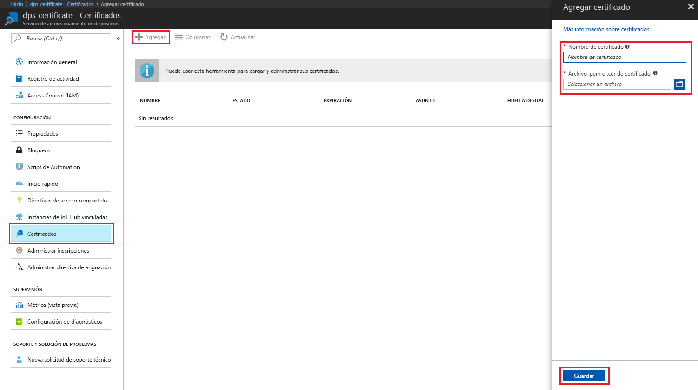
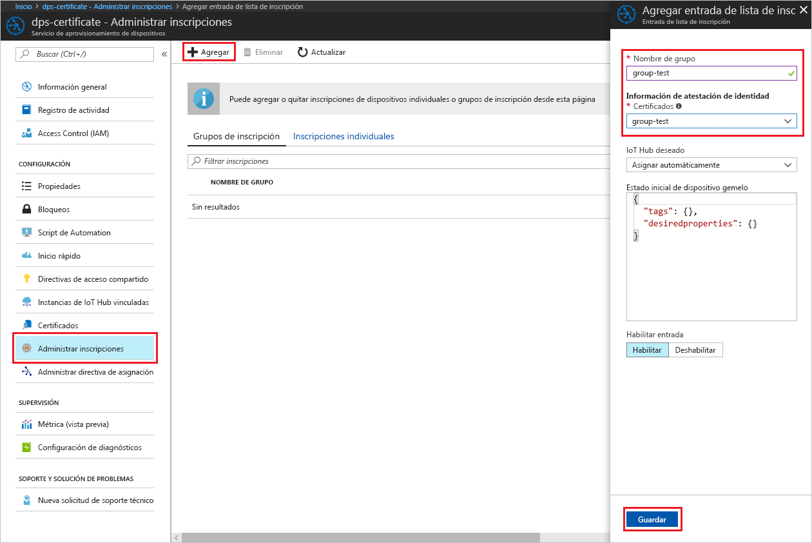

# <a name="create-and-provision-an-x509-simulated-device-using-nodejs-device-sdk-for-iot-hub-device-provisioning-service"></a>Creación y aprovisionamiento de un dispositivo X.509 simulado mediante el SDK de dispositivos Node.js para el servicio IoT Hub Device Provisioning
[!INCLUDE [iot-dps-selector-quick-create-simulated-device-x509](../../includes/iot-dps-selector-quick-create-simulated-device-x509.md)]

IoT Hub Device Provisioning es un servicio auxiliar de IoT Hub que ofrece un aprovisionamiento de dispositivos sin interacción del centro IoT. Con el servicio Device Provisioning pueden aprovisionar millones de dispositivos de forma segura y escalable.

El aprovisionamiento de dispositivos consta de dos pasos. El primer paso es crear la entrada de inscripción adecuada en el servicio Device Provisioning en función de los requisitos específicos de la solución.  El segundo paso es establecer una conexión entre el dispositivo y el servicio Device Provisioning y registrar el dispositivo en el centro de IoT. Una vez completados ambos pasos, se puede considerar el dispositivo totalmente aprovisionado. El servicio Device Provisioning automatiza ambos pasos para proporcionar una experiencia perfecta de aprovisionamiento para el dispositivo. Para más información, consulte [Conceptos del servicio IoT Hub Device Provisioning](https://docs.microsoft.com/en-us/azure/iot-dps/concepts-service).

Estos pasos muestran cómo crear una entrada de inscripción en el servicio Device Provisioning, simular un dispositivo X.509 en la máquina de desarrollo, conectar el dispositivo simulado con el servicio Device Provisioning y registrar el dispositivo en el centro de IoT mediante el [SDK del dispositivo de Node-js de Azure IoT Hub](https://github.com/Azure/azure-iot-sdk-node).


## <a name="prepare-the-environment"></a>Preparación del entorno 

1. Complete los pasos descritos en [Setup IoT Hub Device Provisioning Service with the Azure portal](./quick-setup-auto-provision.md) (Configuración del servicio Azure IoT Hub Device Provisioning con Azure Portal) antes de continuar.

1. Asegúrese de que tiene [Node.js v4.0 o posterior](https://nodejs.org) instalado en su máquina.

1. Asegúrese de que [Git](https://git-scm.com/download/) está instalado en su máquina y se agrega a las variables de entorno accesibles para la ventana de comandos. 

1. Asegúrese de que [OpenSSL](https://www.openssl.org/) está instalado en su máquina y se agrega a las variables de entorno accesibles para la ventana de comandos. Esta biblioteca se puede compilar e instalar desde el origen o descargarse e instalarse desde el sitio web de un [tercero](https://wiki.openssl.org/index.php/Binaries) como [este](https://sourceforge.net/projects/openssl/). 

    > [!NOTE]
    > Si ya ha creado los certificados X.509 _raíz_, _intermedio_ u _hoja_, puede omitir este paso y todos los siguientes relativos a la generación de certificados.
    >


## <a name="create-an-enrollment-entry"></a>Creación de una entrada de inscripción

Una inscripción es el registro de dispositivos o grupos de dispositivos que pueden registrarse en algún momento como almacenados en el servicio Device Provisioning. El registro de inscripción contiene la información sobre el dispositivo o grupo de dispositivos, incluidos los detalles del certificado X.509 y la información de registro adicional. Hay dos tipos de inscripciones que admite el servicio Device Provisioning, _inscripción individual_ y _grupo de inscripción_. Para más información, consulte los [conceptos de inscripción](https://docs.microsoft.com/en-us/azure/iot-dps/concepts-service#enrollment).

Si va a crear sus propios certificados X.509 de prueba, consulte los [conceptos de seguridad](https://docs.microsoft.com/en-us/azure/iot-dps/concepts-security#x509-certificates) sobre los certificados necesarios para la solución y [Tools for the Azure IoT Device Provisioning Device SDK for Node.js](https://github.com/azure/azure-iot-sdk-node/tree/master/provisioning/tools) (Herramientas para el SDK de dispositivo de Azure IoT Device Provisioning para Node.js) para los detalles de implementación.

1. Abra el símbolo del sistema. Clone el repositorio de GitHub para el código de ejemplo:
    
    ```cmd/sh
    git clone https://github.com/Azure/azure-iot-sdk-node.git --recursive
    ```

1. Vaya hasta el script de generación de certificados y compílelo. 

    ```cmd/sh
    cd azure-iot-sdk-node/provisioning/tools
    npm install
    ```

1. Cree la información de inscripción mediante cualquiera de las siguientes maneras, según la configuración:

    - **Inscripción individual**:

        1. Cree el certificado _hoja_ mediante la ejecución del script con su propio _nombre-de-certificado_. Tenga en cuenta que el nombre común del certificado hoja se convierte en el [identificador del registro](https://docs.microsoft.com/en-us/azure/iot-dps/concepts-device#registration-id), así que asegúrese de usar solo minúsculas, números y guiones.

        ```cmd/sh
        node create_test_cert.js device {certificate-name}
        ```
         
        1. En **Azure** Portal, abra la hoja de resumen del servicio **Device Provisioning**. Seleccione **Administrar inscripciones** y la pestaña **Inscripciones individuales**, y haga clic en el botón **Agregar** de la parte superior. 

        1. En **Agregar entrada de la lista de inscripción**, escriba la siguiente información:
            - Seleccione **X.509** como *Mecanismo* de atestación de identidad.
            - En *Archivo .pem o .cer de certificado*, seleccione el archivo de certificado **_{nombre-de-certificado}\_cert.pem_** creado en los pasos anteriores con el widget *Explorador de archivos*.
            - De forma opcional, puede proporcionar la siguiente información:
                - Seleccione un centro de IoT vinculado con el servicio de aprovisionamiento.
                - Escriba un identificador de dispositivo único. Asegúrese de evitar datos confidenciales al asignar nombre al dispositivo. 
                - Actualice el **Estado inicial del dispositivo gemelo** con la configuración inicial deseada para el dispositivo.
            - Una vez completado, haga clic en el botón **Guardar**. 

          

    Al inscribir el dispositivo correctamente, el dispositivo X.509 aparece como **{nombredelcertificado}** en la columna *Id. de registro* de la pestaña *Inscripciones individuales*. Anote este valor para más adelante.

    - **Grupos de inscripción**: 

        1. Cree el certificado _raíz_ mediante la ejecución del script con su propio _nombre-de-raíz_.

        ```cmd/sh
        node create_test_cert.js root {root-name}
        ```

        1. En **Azure** Portal, abra la hoja de resumen del servicio **Device Provisioning**. Seleccione **Certificados** y haga clic en el botón **Agregar** de la parte superior.

        1. En **Agregar certificado**, escriba la siguiente información:
            - Escriba un nombre de certificado único.
            - Seleccione el archivo **_{nombre-de-raíz}\_cert.pem_** que creó anteriormente.
            - Una vez completado, haga clic en el botón **Guardar**.

        

        1. Seleccione el certificado recién creado:
            - Haga clic en **Generar código de verificación**. Copie el código generado.
            - Cree el certificado de _verificación_. Escriba el _código de verificación_ o haga clic con el botón derecho para pegarlo en la ventana del script de Node que se está ejecutando con el comando siguiente:

                ```cmd/sh
                node create_test_cert.js verification {rootname_cert} {verification code}
                ```

            - En el *archivo de certificado de verificación .pem o .cer*, seleccione el archivo de certificado **_verification_cert.pem_** creado en los pasos anteriores con el widget *Explorador de archivos*. Haga clic en **Comprobar**.

            

        1. Seleccione **Administrar inscripciones**. Seleccione la pestaña **Grupos de inscripción** y haga clic en el botón **Agregar** de la parte superior.
            - Escriba un nombre de grupo único.
            - Seleccione el nombre del certificado único que creó anteriormente.
            - De forma opcional, puede proporcionar la siguiente información:
                - Seleccione un centro de IoT vinculado con el servicio de aprovisionamiento.
                - Actualice el **Estado inicial del dispositivo gemelo** con la configuración inicial deseada para el dispositivo.

        

        En caso de que la inscripción se realice correctamente, el grupo de dispositivos X.509 aparecerá en la columna *Nombre del grupo* de la pestaña *Grupos de inscripción*. Anote este valor para más adelante.

        1. Cree el certificado _hoja_ mediante la ejecución del script con su propio _nombre-de-certificado_ seguido del _nombre-de-raíz_ anterior. El nombre común del certificado hoja se convierte en el [identificador del registro](https://docs.microsoft.com/en-us/azure/iot-dps/concepts-device#registration-id), así que asegúrese de usar solo minúsculas, números y guiones.

            ```cmd/sh
            node create_test_cert.js device {certificate-name} {root-name}
            ```

        > [!NOTE]
        > También puede crear certificados _intermedios_ mediante `node create_test_cert.js intermediate {certificate-name} {parent-name}`. Solo tiene que asegurarse de crear el certificado _hoja_ del último paso con el último _intermedio_ como elemento raíz/primario. Para más información, consulte el artículo sobre el [control de acceso a los dispositivos](https://docs.microsoft.com/en-us/azure/iot-dps/concepts-security#controlling-device-access-to-the-provisioning-service-with-x509-certificates).
        >


## <a name="simulate-the-device"></a>Simulación del dispositivo

El [SDK de dispositivo de Node.js de Azure IoT Hub](https://github.com/Azure/azure-iot-sdk-node) proporciona una manera sencilla de simular un dispositivo. Para más información, consulte los [conceptos de dispositivos](https://docs.microsoft.com/en-us/azure/iot-dps/concepts-device).

1. En Azure Portal, seleccione la hoja **Información general** para su servicio Device Provisioning y anote los valores del **_punto de conexión de dispositivo global_** y del **_ámbito de identificador_**.

     

1. Copie el _certificado_ y la _clave_ en la carpeta de ejemplo.

    ```cmd/sh
    copy .\{certificate-name}_cert.pem ..\device\samples\{certificate-name}_cert.pem
    copy .\{certificate-name}_key.pem ..\device\samples\{certificate-name}_key.pem
    ```

1. Vaya al script de prueba de dispositivo y compile el proyecto. 

    ```cmd/sh
    cd ..\device\samples
    npm install
    ```

1. Edite el archivo **register\_x509.js**. Guarde el archivo después de realizar los cambios siguientes.
    - Reemplace `provisioning host` con el **_punto de conexión de dispositivo global_** que anotó en el **paso 1** anterior.
    - Reemplace `id scope` con el **_Id. de ámbito_** que anotó en el **paso 1** anterior. 
    - Reemplace `reigstration id` con el **_Id. de registro_** o el **_nombre del grupo_** de la sección anterior.
    - Reemplace `cert filename` y `key filename` con los archivos que copió en el **paso 2** anterior. 

1. Ejecute el script y verifique que el dispositivo se aprovisione correctamente.

    ```cmd/sh
    node register_x509.js
    ```   

1. En el portal, navegue hasta el centro de IoT Hub vinculado a su servicio de aprovisionamiento y abra la hoja **IoT Devices** (Dispositivos IoT). Si el dispositivo X.509 simulado se aprovisiona correctamente con el centro, su identificador de dispositivo aparecerá en la hoja **IoT Devices** (Dispositivos IoT) con el *ESTADO* **habilitado**. Es posible que deba hacer clic en el botón **Actualizar** situado en la parte superior si ya ha abierto la hoja antes de ejecutar la aplicación de ejemplo del dispositivo. 

     

    Si ha cambiado el valor predeterminado de *Estado inicial del dispositivo gemelo* en la entrada de inscripción para el dispositivo, el dispositivo puede extraer el estado gemelo deseado desde el centro y actuar en consecuencia. Para más información, consulte [Información y uso de dispositivos gemelos en IoT Hub](../iot-hub/iot-hub-devguide-device-twins.md).


## <a name="clean-up-resources"></a>Limpieza de recursos

Si piensa seguir trabajando con el ejemplo de cliente de dispositivo y explorándolo, no limpie los recursos que se crean en esta guía de inicio rápido. Si no va a continuar, use el siguiente comando para eliminar todos los recursos creados.

1. Cierre la ventana de salida de ejemplo del cliente del dispositivo en su máquina.
1. Desde el menú de la izquierda en Azure Portal, haga clic en **Todos los recursos** y seleccione el servicio Device Provisioning. Abra la hoja **Administrar inscripciones** de su servicio y haga clic en la pestaña **Inscripciones individuales** o **Grupos de inscripciones**. Seleccione el *ID. DE REGISTRO* o el *NOMBRE DE GRUPO* del dispositivo que inscribió en esta guía de inicio rápido y haga clic en el botón **Eliminar** DE la parte superior. 
1. Desde el menú de la izquierda en Azure Portal, haga clic en **Todos los recursos** y seleccione su centro de IoT. Abra la hoja **IoT Devices** (Dispositivos IoT) de su centro, seleccione el *ID. DE DISPOSITIVO* del dispositivo que registró en esta guía de inicio rápido y, a continuación, haga clic en el botón **Eliminar** situado en la parte superior.


## <a name="next-steps"></a>pasos siguientes

En esta guía de inicio rápido ha creado un dispositivo simulado X.509 y lo ha aprovisionado con IoT Hub mediante el servicio Azure IoT Hub Device Provisioning en el portal. Para obtener información sobre cómo inscribir el dispositivo X.509 mediante programación, siga la guía de inicio rápido para la inscripción de dispositivos X.509 mediante programación. 

> [!div class="nextstepaction"]
> [Guía de inicio rápido de Azure: Inscripción de dispositivos X.509 al servicio Azure IoT Hub Device Provisioning](quick-enroll-device-x509-node.md)
