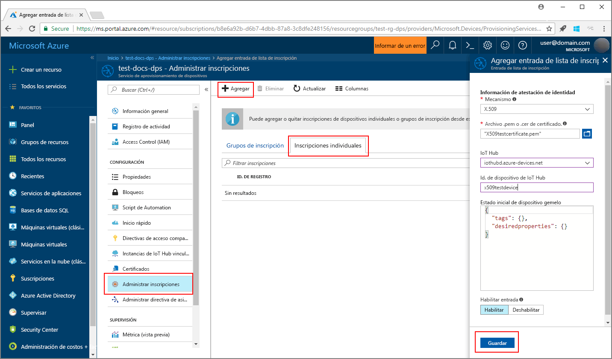
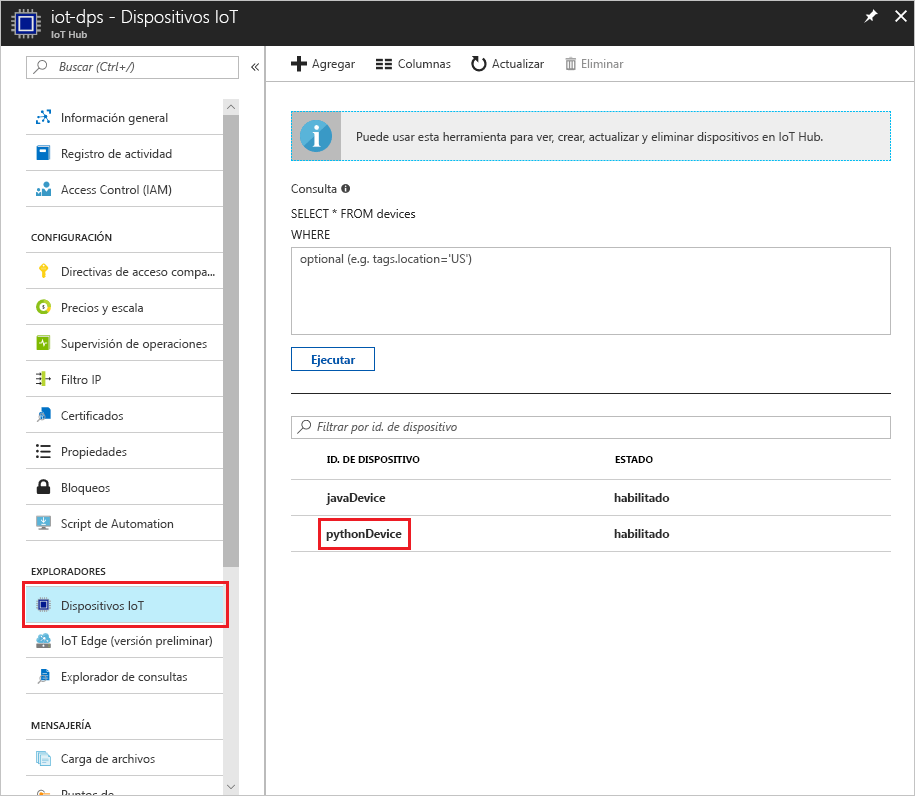

# <a name="create-and-provision-a-simulated-x509-device-using-python-device-sdk-for-iot-hub-device-provisioning-service"></a>Creación y aprovisionamiento de un dispositivo X.509 simulado mediante el SDK de dispositivos Python para el servicio IoT Hub Device Provisioning
> [!div class="op_single_selector"]
> * [C](quick-create-simulated-device-x509.md)
> * [Java](quick-create-simulated-device-x509-java.md)
> * [C#](quick-create-simulated-device-x509-csharp.md)
> * [Python](quick-create-simulated-device-x509-python.md)

En estos pasos se muestra cómo simular un dispositivo X.509 en la máquina de desarrollo que ejecuta el sistema operativo Windows, y usar un código de ejemplo de Python para conectar este dispositivo simulado con el servicio Device Provisioning e IoT Hub. 

Asegúrese de completar los pasos descritos en [Configuración de un servicio Azure IoT Hub Device Provisioning con Azure Portal](./quick-setup-auto-provision.md) antes de continuar.


## <a name="prepare-the-environment"></a>Preparación del entorno 

1. Asegúrese de tener instalados [Visual Studio 2015](https://www.visualstudio.com/vs/older-downloads/) o [Visual Studio 2017](https://www.visualstudio.com/vs/) en la máquina. Debe tener la carga de trabajo "Desarrollo para el escritorio con C++" habilitada para la instalación de Visual Studio.

1. Descargue e instale el [sistema de compilación CMake](https://cmake.org/download/).

1. Asegúrese de que `git` está instalado en su máquina y se agrega a las variables de entorno accesibles para la ventana de comandos. Consulte las [herramientas de cliente de Git de Software Freedom Conservancy](https://git-scm.com/download/) para instalar la versión más reciente de las herramientas `git`, lo que incluye **Git Bash**, la aplicación de línea de comandos que puede usar para interactuar con su repositorio de Git local. 

1. Abra un símbolo del sistema o Git Bash. Clone el repositorio GitHub para el código de ejemplo de simulación de dispositivo.
    
    ```cmd/sh
    git clone https://github.com/Azure/azure-iot-sdk-python.git --recursive
    ```

1. Cree una carpeta en su copia local de este repositorio GitHub para el proceso de compilación de CMake. 

    ```cmd/sh
    cd azure-iot-sdk-python/c
    mkdir cmake
    cd cmake
    ```

1. Ejecute el siguiente comando para crear la solución de Visual Studio para el cliente de aprovisionamiento.

    ```cmd/sh
    cmake -Duse_prov_client:BOOL=ON ..
    ```


## <a name="create-a-device-enrollment-entry"></a>Creación de una entrada de inscripción de dispositivo

1. Abra la solución generada en la carpeta *cmake* denominada `azure_iot_sdks.sln` y compílela en Visual Studio.

1. Haga clic con el botón derecho en el proyecto **dice\_device\_enrollment** en la carpeta **Provision\_Tools** y seleccione **Establecer como proyecto de inicio**. Ejecute la solución. En la ventana de salida, escriba `i` para la inscripción individual cuando se le solicite. La ventana de salida muestra un certificado X.509 generado localmente para el dispositivo simulado. Copie en el portapapeles la salida desde *-----BEGIN CERTIFICATE-----* hasta *-----END CERTIFICATE-----* y asegúrese de incluir ambas líneas. 

    
 
1. Cree un archivo denominado **_X509testcertificate.pem_** en su equipo de Windows, ábralo en el editor que desee y copie el contenido del portapapeles en este archivo. Guarde el archivo. 

1. Inicie sesión en Azure Portal, haga clic en el botón **Todos los recursos** situado en el menú izquierdo y abra el servicio de aprovisionamiento.

1. En la hoja de resumen del servicio Device Provisioning, seleccione **Manage enrollments** (Administrar inscripciones). Seleccione la pestaña **Individual Enrollments** (Inscripciones individuales) y haga clic en el botón **Add** (Agregar) de la parte superior. 

1. En **Agregar entrada de la lista de inscripción**, escriba la siguiente información:
    - Seleccione **X.509** como *Mecanismo* de atestación de identidad.
    - En el *Archivo de certificado .pem o .cer*, seleccione el archivo de certificado **_X509testcertificate.pem_** creado en los pasos anteriores con el widget *Explorador de archivos*.
    - De forma opcional, puede proporcionar la siguiente información:
        - Seleccione un centro de IoT vinculado con el servicio de aprovisionamiento.
        - Escriba un identificador de dispositivo único. Asegúrese de evitar datos confidenciales al asignar nombre al dispositivo. 
        - Actualice el **Estado inicial del dispositivo gemelo** con la configuración inicial deseada para el dispositivo.
    - Una vez completado, haga clic en el botón **Guardar**. 

      

   Al inscribir el dispositivo correctamente, el dispositivo X.509 aparece como **riot-device-cert** en la columna *Id. de registro* de la pestaña *Individual Enrollments* (Inscripciones individuales). 


## <a name="simulate-the-device"></a>Simulación del dispositivo

1. En la hoja de resumen del servicio Device Provisioning, seleccione **Introducción**. Tenga en cuenta los valores _Ámbito de id._ y _Global Service Endpoint_ (Punto de conexión del servicio global).

    

1. Descargue e instale [Python 2.x o 3.x](https://www.python.org/downloads/). Asegúrese de usar la instalación de 32 bits o 64 bits en función del programa de instalación. Cuando se le solicite durante la instalación, asegúrese de agregar Python a las variables de entorno específicas de la plataforma. Si usa Python 2.x, puede que necesite [instalar o actualizar *pip*, el sistema de administración de paquetes de Python](https://pip.pypa.io/en/stable/installing/).
    - Si usa el sistema operativo Windows, puede que necesite el [paquete redistribuible de Visual C++](http://www.microsoft.com/download/confirmation.aspx?id=48145) para permitir el uso de archivos DLL nativos de Python.

1. Siga [estas instrucciones](https://github.com/Azure/azure-iot-sdk-python/blob/master/doc/python-devbox-setup.md) para compilar los paquetes de Python.

    > [!NOTE]
        > Si usa `pip`, asegúrese de instalar también el paquete `azure-iot-provisioning-device-client`.

1. Navegue hasta la carpeta de ejemplos.

    ```cmd/sh
    cd azure-iot-sdk-python/provisioning_device_client/samples
    ```

1. Con el IDE de Python, edite el script de Python llamado **provisioning\_device\_client\_sample.py**. Modifique las variables _GLOBAL\_PROV\_URI_ y _ID\_SCOPE_ a los valores que se han indicado anteriormente.

    ```python
    GLOBAL_PROV_URI = "{globalServiceEndpoint}"
    ID_SCOPE = "{idScope}"
    SECURITY_DEVICE_TYPE = ProvisioningSecurityDeviceType.X509
    PROTOCOL = ProvisioningTransportProvider.HTTP
    ```

1. Ejecute el ejemplo. 

    ```cmd/sh
    python provisioning_device_client_sample.py
    ```

1. La aplicación se conectará, inscribirá el dispositivo y mostrará un mensaje indicando que la inscripción se realizó correctamente.

    

1. En el portal, navegue hasta IoT Hub vinculado a su servicio de aprovisionamiento y abra la hoja **Device Explorer**. En el aprovisionamiento correcto del dispositivo simulado X.509 con el Hub, su identificador de dispositivo aparece en la hoja **Device Explorer** con el *ESTADO* **habilitado**. Es posible que deba hacer clic en el botón **Actualizar** situado en la parte superior si ya ha abierto la hoja antes de ejecutar la aplicación de ejemplo del dispositivo. 

     

> [!NOTE]
> Si ha cambiado el valor predeterminado de *Estado inicial del dispositivo gemelo* en la entrada de inscripción para el dispositivo, el dispositivo puede extraer el estado gemelo deseado desde el centro y actuar en consecuencia. Para más información, consulte [Información y uso de dispositivos gemelos en IoT Hub](../iot-hub/iot-hub-devguide-device-twins.md).
>


## <a name="clean-up-resources"></a>Limpieza de recursos

Si piensa seguir trabajando con el ejemplo de cliente de dispositivo y explorándolo, no limpie los recursos que se crean en esta guía de inicio rápido. Si no va a continuar, use el siguiente comando para eliminar todos los recursos creados.

1. Cierre la ventana de salida de ejemplo del cliente del dispositivo en su máquina.
1. Desde el menú de la izquierda en Azure Portal, haga clic en **Todos los recursos** y seleccione el servicio Device Provisioning. Abra la hoja **Administrar inscripciones** para el servicio y, a continuación, haga clic en la pestaña **Inscripciones individuales**. Seleccione el *id. de registro* del dispositivo que inscribió en esta guía de inicio rápido y haga clic en el botón **Eliminar** situado en la parte superior. 
1. Desde el menú de la izquierda en Azure Portal, haga clic en **Todos los recursos** y seleccione su centro de IoT. Abra la hoja **IoT Devices** (Dispositivos IoT) del centro, seleccione el *id. de dispositivo* del dispositivo que registró en esta guía de inicio rápido y, a continuación, haga clic en el botón **Eliminar** situado en la parte superior.

## <a name="next-steps"></a>pasos siguientes

En esta guía de inicio rápido, creó un dispositivo X.509 simulado en su máquina de Windows y lo aprovisionó con IoT Hub mediante el servicio Azure IoT Hub Device Provisioning en el portal. Para obtener información sobre cómo inscribir el dispositivo X.509 mediante programación, siga la guía de inicio rápido para la inscripción de dispositivos X.509 mediante programación. 

> [!div class="nextstepaction"]
> [Inicio rápido de Azure: Inscripción de dispositivos X.509 al servicio Azure IoT Hub Device Provisioning](quick-enroll-device-x509-java.md)
