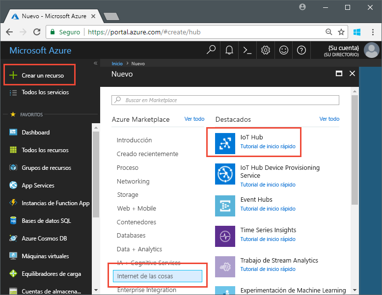
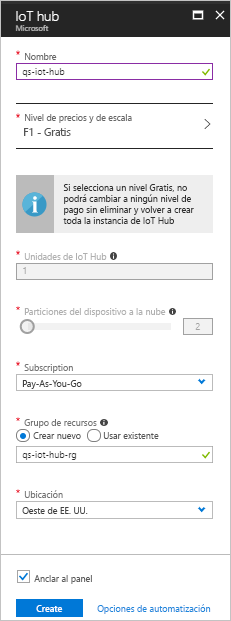

# <a name="send-telemetry-from-a-device-to-an-iot-hub-swift"></a>Envío de datos de telemetría desde un dispositivo a IoT Hub (Swift)

IoT Hub es un servicio de Azure que le permite ingerir grandes volúmenes de datos de telemetría desde los dispositivos IoT en la nube para su almacenamiento o procesamiento. En este artículo, va a enviar datos de telemetría desde una aplicación de dispositivo simulado a IoT Hub. A continuación, podrá ver los datos desde una aplicación de back-end. 

En este artículo se usa una aplicación Swift escrita previamente para enviar los datos de telemetría y una utilidad de la CLI para leer los datos procedentes de IoT Hub. 

[!INCLUDE [cloud-shell-try-it.md](../../includes/cloud-shell-try-it.md)]

Si no tiene una suscripción a Azure, cree una [cuenta gratuita](https://azure.microsoft.com/free/?WT.mc_id=A261C142F) antes de empezar.

## <a name="prerequisites"></a>requisitos previos

- Descargue el código de ejemplo desde [Ejemplos de Azure](https://github.com/Azure-Samples/azure-iot-samples-ios/archive/master.zip) 
- La versión más reciente de [XCode](https://developer.apple.com/xcode/) que, a su vez, ejecute la última versión del SDK de iOS. Esta guía de inicio rápido se probó con XCode 9.3 e iOS 11.3.
- La versión más reciente de [CocoaPods](https://guides.cocoapods.org/using/getting-started.html).
- La utilidad de la CLI iothub-explorer, que lee los datos de telemetría de IoT Hub. Para realizar la instalación, instale primero [Node.js](https://nodejs.org) v4.x.x o superior y, a continuación, ejecute el siguiente comando: 

   ```sh
   sudo npm install -g iothub-explorer
   ```

## <a name="create-an-iot-hub"></a>Crear un centro de IoT

El primer paso es usar Azure Portal para crear una instancia de IoT Hub en su suscripción. IoT Hub le permite ingerir grandes volúmenes de datos de telemetría en la nube desde muchos dispositivos. Posteriormente, el concentrador permite que uno o varios servicios de back-end se ejecuten en la nube para leer y procesar esos datos de telemetría.

1. Inicie sesión en el [Azure Portal](http://portal.azure.com).

1. Seleccione **Crear un recurso** > **Internet de las cosas** > **IoT Hub**. 

   

1. Para crear la instancia de IoT Hub, utilice los valores de la tabla siguiente:

    | Configuración | Valor |
    | ------- | ----- |
    | NOMBRE | Un nombre exclusivo para el concentrador |
    | Plan de tarifa y escalado | F1 Gratis |
    | Unidades de IoT Hub | 1 |
    | Particiones del dispositivo a la nube | 2 particiones |
    | La suscripción | Su suscripción de Azure. |
    | Grupos de recursos | Cree uno nuevo. Escriba un nombre para el grupo de recursos. |
    | Ubicación | La ubicación más cercana a la suya. |
    | Anclar al panel | Sí |

1. Haga clic en **Create**(Crear).  

   

1. Tome nota de los nombres de IoT Hub y del grupo de recursos. Usará estos valores más adelante en esta guía de inicio rápido.

## <a name="register-a-device"></a>Registrar un dispositivo

Debe registrar un dispositivo con IoT Hub antes de poder conectarlo. En esta guía de inicio rápido, va a usar la CLI de Azure para registrar un dispositivo simulado.

1. Agregue la extensión de la CLI de IoT Hub y cree la identidad del dispositivo. Reemplace `{YourIoTHubName}` por un nombre para la instancia de IoT Hub:

   ```azurecli-interactive
   az extension add --name azure-cli-iot-ext
   az iot hub device-identity create --hub-name {YourIoTHubName} --device-id myiOSdevice
   ```

1. Ejecute el siguiente comando para obtener la _cadena de conexión del dispositivo_ que acaba de registrar:

   ```azurecli-interactive
   az iot hub device-identity show-connection-string --hub-name {YourIoTHubName} --device-id myiOSdevice --output table
   ```

   Anote la cadena de conexión del dispositivo, que será parecida a `Hostname=...=`. Usará este valor más adelante en este artículo.

1. También necesita una _cadena de conexión del servicio_ para permitir que las aplicaciones de back-end se conecten a IoT Hub y recuperen los mensajes del dispositivo a la nube. El comando siguiente recupera la cadena de conexión del servicio de su instancia de IoT Hub:

   ```azurecli-interactive
   az iot hub show-connection-string --hub-name {YourIoTHubName} --output table
   ```

   Anote la cadena de conexión del servicio, que será parecida a `Hostname=...=`. Usará este valor más adelante en este artículo.

## <a name="send-simulated-telemetry"></a>Envío de datos de telemetría simulados

La aplicación de ejemplo se ejecuta en un dispositivo iOS, que se conecta a un punto de conexión específico del dispositivo en IoT Hub y envía datos de telemetría simulados sobre temperatura y humedad. 

### <a name="install-cocoapods"></a>Instalación de CocoaPods

CocoaPods administra las dependencias de los proyectos de iOS que utilizan bibliotecas de terceros.

En una ventana del terminal, vaya a la carpeta Azure-IoT-Samples-iOS que descargó en los requisitos previos. Después, vaya a la carpeta del proyecto de ejemplo:

```sh
cd quickstart/sample-device
```

Asegúrese de que XCode está cerrado y ejecute el comando siguiente para instalar los pods de CocoaPods que se declararon en el archivo **podfile**:

```sh
pod install
```

Junto con la instalación de los pods necesarios para el proyecto, el comando de instalación también creó un archivo de área de trabajo de XCode que ya está configurado para usar los pods para las dependencias. 

### <a name="run-the-sample-application"></a>Ejecutar la aplicación de ejemplo 

1. Abra el área de trabajo de ejemplo en XCode.

   ```sh
   open "MQTT Client Sample.xcworkspace"
   ```

2. Expanda el proyecto **MQTT Client Sample** (Ejemplo de cliente MQTT) y, a continuación, expanda la carpeta del mismo nombre.  
3. Abra **ViewController.swift** para editar en XCode. 
4. Busque la variable **connectionString** y actualice el valor con la cadena de conexión del dispositivo que anotó anteriormente.
5. Guarde los cambios. 
6. Ejecute el proyecto en el emulador de dispositivos con el botón **Build and run** (Compilar y ejecutar) o la combinación de teclas **comando + r**. 

   

7. Cuando se inicie el emulador, seleccione **Start** (Iniciar) en la aplicación de ejemplo.

La siguiente captura de pantalla muestra una salida de ejemplo en la que la aplicación envía datos de telemetría simulados a IoT Hub:

   

## <a name="read-the-telemetry-from-your-hub"></a>Lectura de los datos de telemetría procedentes de su instancia de IoT Hub

La aplicación de ejemplo que se ejecutó en el emulador de XCode muestra datos acerca de los mensajes enviados desde el dispositivo. También puede ver los datos a través de IoT Hub cuando estos se reciben. La utilidad de la CLI `iothub-explorer` se conecta al punto de conexión **Eventos** en el lado del servicio IoT Hub. 

Abra una nueva ventana de terminal. Ejecute el comando siguiente, reemplazando {la cadena de conexión de su servicio de concentrador} por la cadena de conexión del servicio que recuperó al principio de este artículo:

```sh
iothub-explorer monitor-events myiOSdevice --login "{your hub service connection string}"
```

La captura de pantalla siguiente muestra el tipo de telemetría que se ve en la ventana del terminal:


Si recibe un error al ejecutar el comando iothub-explorer, compruebe que está usando la *cadena de conexión del servicio* de su instancia de IoT Hub, en lugar de la *cadena de conexión del dispositivo* del dispositivo IoT. Ambas cadenas de conexión empiezan por **Hostname={iothubname}** pero la cadena de conexión del servicio contiene la propiedad **SharedAccessKeyName** mientras que la del dispositivo contiene **DeviceID**. 

## <a name="clean-up-resources"></a>Limpieza de recursos

Si tiene pensado continuar probando IoT Hub con otros artículos, deje el grupo de recursos y la instancia de IoT Hub para volver a usarlos más adelante.

Si ya no los va a necesitar más, elimínelos en el portal. Para ello, seleccione el grupo de recursos que contiene la instancia de IoT Hub y haga clic en **Eliminar**.

## <a name="next-steps"></a>Pasos siguientes

En este artículo, ha configurado una instancia de IoT Hub, registrado un dispositivo, enviado datos de telemetría simulados a esta instancia desde un dispositivo iOS y leído esos datos desde IoT Hub. 

Para más información acerca de cómo los dispositivos iOS pueden trabajar con IoT Hub, consulte [Send cloud-to-device messages with iOS (Swift)](iot-hub-ios-swift-c2d.md) (Envío de mensajes de la nube al dispositivo con iOS (Swift))

<!-- Links -->
[lnk-process-d2c-tutorial]: iot-hub-csharp-csharp-process-d2c.md
[lnk-device-management]: iot-hub-node-node-device-management-get-started.md
[lnk-iot-edge]: ../iot-edge/tutorial-simulate-device-linux.md
[lnk-connect-device]: https://azure.microsoft.com/develop/iot/
