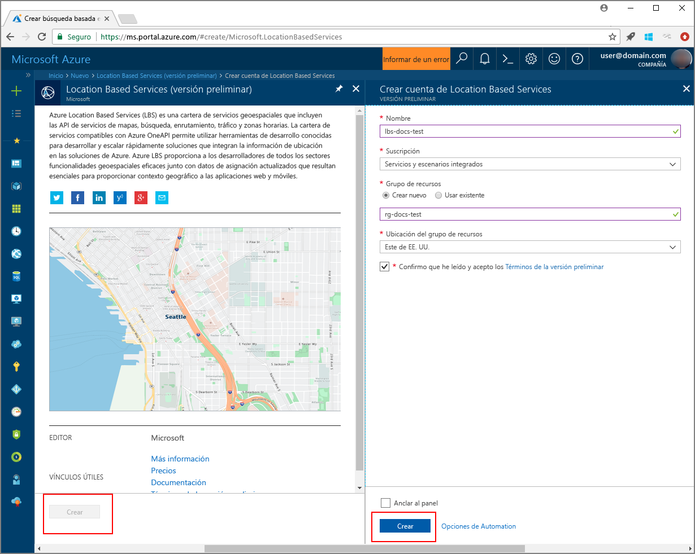
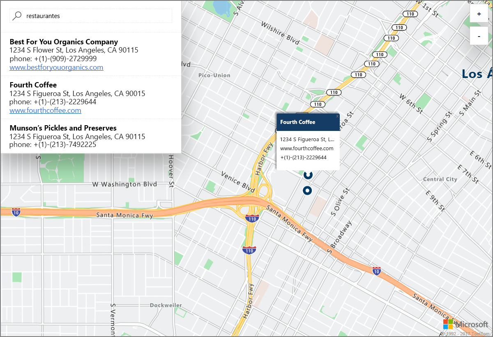

# Inicio de una búsqueda de mapa interactiva de demostración con Azure Location Based Services (versión preliminar)

En este artículo se demuestran las funcionalidades de Azure Location Based Services (LBS) para realizar una búsqueda interactiva con Azure Maps. También le guía por los pasos básicos para crear su propia cuenta de LBS y obtener la clave de la cuenta para usarla en la aplicación web de demostración. 

Si no tiene una suscripción a Azure, cree una [cuenta gratuita](https://azure.microsoft.com/free/?WT.mc_id=A261C142F) antes de empezar.

## Iniciar sesión en Azure Portal

Inicie sesión en [Azure Portal](https://portal.azure.com/).

## Creación de una cuenta de Location Based Services y obtención de una clave de cuenta

1. En la esquina superior izquierda de [Azure Portal](https://portal.azure.com), haga clic en **Crear un recurso**.
2. En el cuadro *Buscar en Marketplace*, escriba **location based services**.
3. En *Resultados*, haga clic en **Location Based Services (versión preliminar)**. Haga clic en el botón **Crear** que aparece debajo del mapa. 
4. En la página **Creación de una cuenta con Azure Location Based Services**, escriba el *nombre* de la cuenta nueva, seleccione la *suscripción* que se va a usar y escriba el nombre de un *grupo de recursos* nuevo o existente. Seleccione la ubicación del grupo de recursos, acepte los *términos de la versión preliminar* y haga clic en **Crear**.

    

5. Una vez que la cuenta se creó correctamente, ábrala y navegue a la **CONFIGURACIÓN** de la cuenta. Haga clic en **Claves** para obtener las claves principal y secundaria de la cuenta de Azure Location Based Services. Copie el valor de la **clave principal** en el Portapapeles local para usarlo en la sección siguiente. 

## Descarga de la aplicación de demostración de Azure Maps

1. Descargue o copie el contenido del archivo [interactiveSearch.html](https://github.com/Azure-Samples/location-based-services-samples/blob/master/src/interactiveSearch.html).
2. Guarde el contenido de este archivo de manera local como **AzureMapDemo.html** y ábralo en un editor de texto.
3. Busque la cadena `<insert-key>` y reemplácela por el valor de la **clave principal** que se obtuvo en la sección anterior. 

## Inicio de la aplicación de demostración de Azure Maps

1. Abra el archivo **AzureMapDemo.html** en un explorador de su preferencia.
2. Observe el mapa que se muestra de Los Ángeles. La ciudad la determina el valor del par `[longitude, latitude]` dado a la variable de JavaScript denominada **center** en *AzureMapDemo.html*. Puede cambiar estas coordenadas a cualquier otra ciudad que prefiera. Por ejemplo, las coordenadas de la ciudad de Nueva York son *[-74.0060, 40.7128]*.
3. En el cuadro de búsqueda que aparece en la esquina superior izquierda de la aplicación web de demostración, escriba cualquier tipo o dirección de ubicación que desea buscar. 
4. Mueva el mouse sobre la lista de direcciones o ubicaciones que aparecen debajo del cuadro de búsqueda y observe cómo el marcador correspondiente en el mapa despliega información sobre la ubicación en un mensaje emergente. Por ejemplo, un inicio sencillo de esta aplicación web y una búsqueda de *restaurantes* llevan a lo siguiente. Tenga en cuenta que, para proteger la privacidad de un negocio privado, se muestran nombres y direcciones ficticios. 

    

## Limpieza de recursos

Los tutoriales analizan con detalle cómo se usa y cómo se configura Azure Location Based Services para su cuenta. Si tiene previsto continuar trabajando con los tutoriales, no elimine los recursos que se crearon con esta guía de inicio rápido. Si no va a continuar, use el siguiente comando para eliminar todos los recursos creados.

1. Cierre el explorador donde se ejecuta la aplicación web **AzureMapDemo.html**.
2. En el menú de la izquierda de Azure Portal, haga clic en **Todos los recursos** y seleccione la cuenta de LBS. En la parte superior de la hoja **Todos los recursos**, haga clic en **Eliminar**.

## pasos siguientes

En esta guía de inicio rápido, creó una cuenta de Azure LBS e inició una aplicación de demostración con su cuenta. Para información sobre cómo crear su propia aplicación con las API de Azure Location Based Services, pase al tutorial siguiente.

> [!div class="nextstepaction"]
> [Tutorial para el usuario de Azure Map y Azure Search](./tutorial-search-location.md)
