# Introducción a un área de trabajo de Log Analytics
Puede empezar a usar Azure Log Analytics rápidamente, lo que ayuda a evaluar la inteligencia operativa recopilada desde su infraestructura de TI. Con este artículo, puede comenzar sin problemas a explorar datos que se recopilan *de forma gratuita*, analizarlos y tomar decisiones basadas en ellos.

Este artículo sirve de introducción a Log Analytics, con un breve tutorial que lo guiará por una implementación mínima en Azure para que pueda comenzar a usar el servicio. El contenedor lógico donde se almacenan los datos de administración en Azure es un área de trabajo. Después de revisar esta información y de completar su propia evaluación, puede quitar el área de trabajo de evaluación. Como este artículo es un tutorial, no trata sobre requisitos empresariales, planeamiento ni orientación sobre la arquitectura.

>[!NOTE]
>Si utiliza la nube de Microsoft Azure Government, use la [documentación de supervisión y administración de Azure Government](https://docs.microsoft.com/azure/azure-government/documentation-government-services-monitoringandmanagement#log-analytics) en su lugar.

Brevemente, este es el proceso que se usa para empezar:

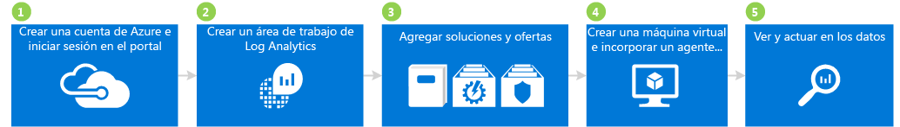

## 1 Creación de una cuenta de Azure e inicio de sesión

Si aún no tiene cuenta de Azure, debe crear una para usar Log Analytics. Puede crear una [cuenta gratuita](https://azure.microsoft.com/free/) que le permita acceder durante 30 días a todos los servicios de Azure.

### Para crear una cuenta gratuita e iniciar sesión
1. Siga las instrucciones para [crear su cuenta de Azure gratuita](https://azure.microsoft.com/free/).
2. Abra [Azure Portal](https://portal.azure.com) e inicie sesión.

## 2 Creación de un área de trabajo

El siguiente paso consiste en crear un área de trabajo.

1. En Azure Portal, busque *Log Analytics* en la lista de servicios en Marketplace y seleccione **Log Analytics**.  
    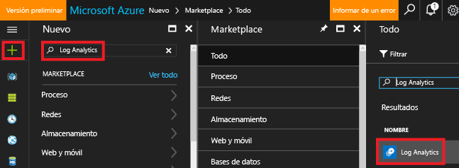
2. Haga clic en **Crear** y seleccione opciones para los siguientes elementos:
   * **Área de trabajo de OMS**: escriba un nombre para el área de trabajo.
   * **Suscripción** : si tiene varias suscripciones, elija la que desea asociar con el área de trabajo nueva.
   * **Grupos de recursos**
   * **Ubicación**
   * **Plan de tarifa**  
       
3. Haga clic en **Aceptar** y verá una lista de las áreas de trabajo.
4. Seleccione un área de trabajo para ver sus detalles en Azure Portal.       
             

## 3 Incorporación de soluciones y ofertas de soluciones

A continuación, agregue soluciones de administración y ofertas de soluciones. Las soluciones de administración son una colección de reglas de lógica, visualización y adquisición de datos que proporcionan métricas que giran en torno a una determinada área de problemas. Una oferta de solución es un conjunto de soluciones de administración.

Al agregar soluciones al área de trabajo, hace posible que Log Analytics recopile distintos tipos de datos de equipos que estén conectados a su área de trabajo mediante agentes. Más adelante, se trata la incorporación de agentes.

### Para agregar soluciones y ofertas de soluciones

1. En Azure Portal, haga clic en **Nuevo** y, en el cuadro **Buscar en el Marketplace**, escriba **Análisis de registros de actividad** y presione ENTRAR.
2. En la hoja Todo, seleccione **Análisis de registros de actividad** y haga clic en **Crear**.  
      
3. En la hoja *nombre del área de trabajo*, seleccione el área de trabajo que desea asociar a la solución de administración.
4. Haga clic en **Crear**.  
    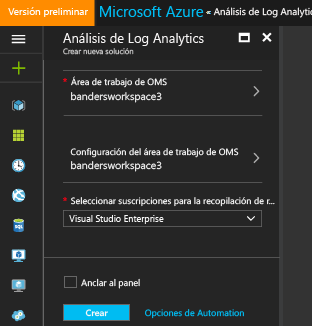  
5. Repita los pasos del 1 al 4 para agregar:
    - La oferta de servicio **Seguridad y cumplimiento** con las soluciones Evaluación de antimalware y Seguridad y auditoría.
    - La oferta de servicio **Automation & Control** con las soluciones Hybrid Worker de automatización, Seguimiento de cambios y Evaluación de actualización del sistema (también denominada Administración de actualizaciones). Debe crear una cuenta de Automation cuando agregue la oferta de solución.  
        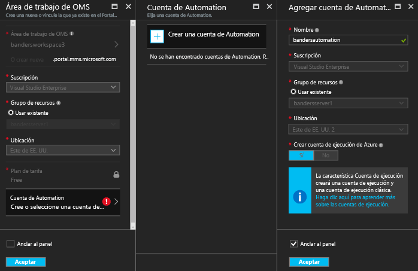  
6. Para ver las soluciones de administración que ha agregado al área de trabajo, vaya a **Log Analytics** > **Suscripciones** > ***nombre del área de trabajo*** > **Información general**. Se muestran los iconos para las soluciones de administración que agregó.  
    >[!NOTE]
    >Como aún no ha conectado ningún agente al área de trabajo, no verá ningún dato para las soluciones que agregó.  

    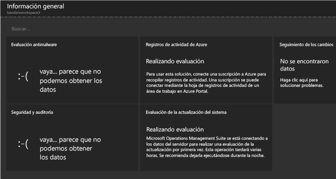

## 4 Creación de una máquina virtual e incorporación de un agente

Ahora, cree una máquina virtual simple en Azure. Después de crearla, incorpore el agente de OMS para habilitarlo. Al habilitarse el agente, se comienza a recopilar datos de la máquina virtual y se envían a Log Analytics.

### Para crear una máquina virtual

- Siga las instrucciones de [Creación de la primera máquina virtual Windows en Azure Portal](../virtual-machines/virtual-machines-windows-hero-tutorial.md) e inicie la nueva máquina virtual.

### Conexión de la máquina virtual a Log Analytics

- Siga las instrucciones de [Conexión de máquinas virtuales de Azure a Log Analytics](log-analytics-azure-vm-extension.md) para conectar la máquina virtual a Log Analytics mediante Azure Portal.

## 5 Visualización de datos y acciones con ellos

Antes ha habilitado la solución Análisis de registros de actividad y las ofertas de servicio Seguridad y cumplimiento, y Automation & Control. A continuación, se empiezan a examinar los datos recopilados por las soluciones y los resultados de búsquedas de registros.

Para empezar, examine los datos que aparecen de dentro de las soluciones. Después, consulte algunas búsquedas de registros a las que se accede desde búsquedas de registros. Las búsquedas de registros permiten combinar y correlacionar datos de equipo procedentes de varios orígenes dentro de su entorno. Para más información, consulte [Búsquedas de registros en Log Analytics](log-analytics-log-searches.md). Por último, lleve a cabo acciones con los datos que se encuentren mediante el portal de OMS, que está fuera de Azure Portal.

### Para ver los datos de antimalware

1. En Azure Portal, vaya a **Log Analytics** > ***su área de trabajo***.
2. En la hoja para el área de trabajo, en **General**, haga clic en **Información general**.  
    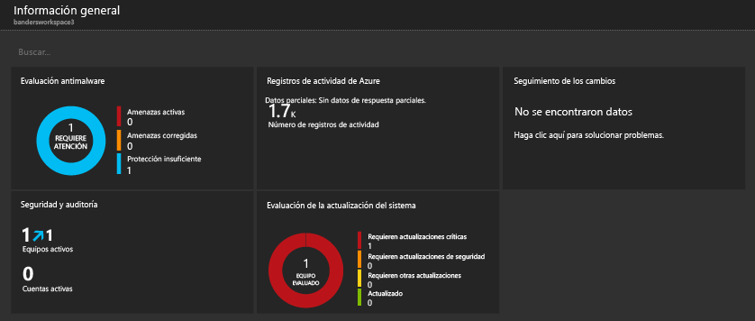
3. Haga clic en el icono **Evaluación de antimalware**. En este ejemplo, puede ver que Windows Defender está instalado en un equipo, pero su firma no está actualizada.  
    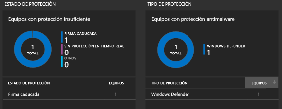
4. En este ejemplo, en **Estado de protección**, haga clic en **Signature out of date** (Firma no actualizada) para abrir Búsqueda de registros y ver detalles acerca de los equipos que tienen firmas no actualizadas. En este ejemplo, tenga en cuenta que el equipo se llama *getstarted*. Si hubiera más de un equipo con firmas no actualizadas, deberían aparecer en los resultados de Búsqueda de registros.  
    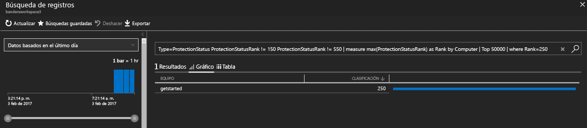

### Para ver datos de Seguridad y auditoría

1. En la hoja para el área de trabajo, en **General**, haga clic en **Información general**.  
2. Haga clic en el icono **Seguridad y auditoría**. En este ejemplo, puede ver que hay dos problemas importantes: a un equipo le faltan actualizaciones críticas y otro carece de protección suficiente.  
    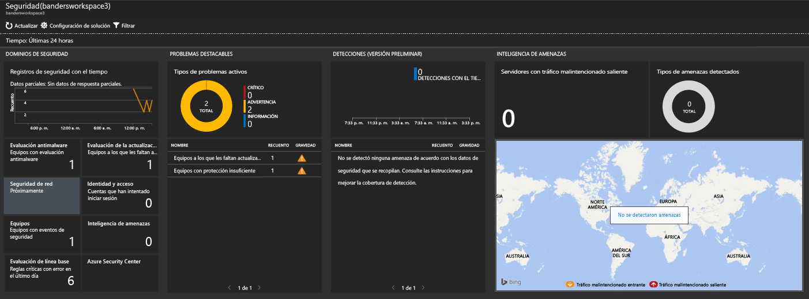
3. En este ejemplo, en **Notable Issues** (Problemas importantes), haga clic en **Computers missing critical updates** (Equipos sin actualizaciones críticas) para abrir Búsqueda de registros y ver detalles acerca de los equipos que carecen de actualizaciones críticas. En este ejemplo, falta una actualización crítica y 63 de otro tipo.  
    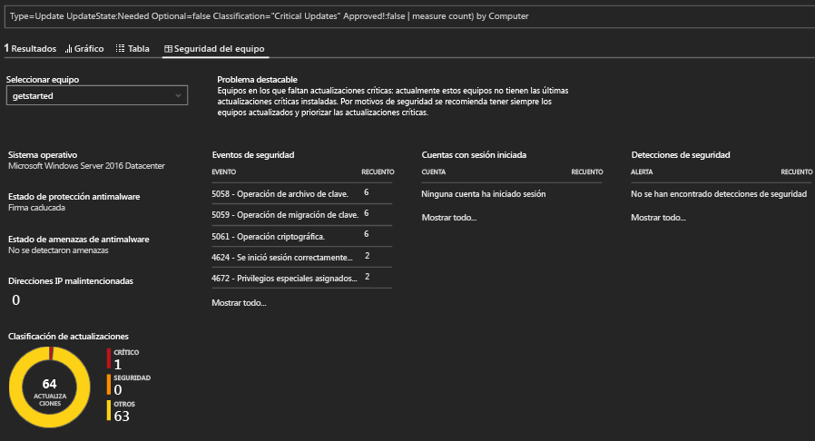

### Para ver datos de actualización del sistema y llevar a cabo acciones con ellos

1. En la hoja para el área de trabajo, en **General**, haga clic en **Información general**.  
2. Haga clic en el icono **Evaluación de actualización del sistema**. En este ejemplo, puede ver que hay un equipo Windows llamado *getstarted* que necesita actualizaciones críticas y otro que necesita actualizaciones de definiciones.  
    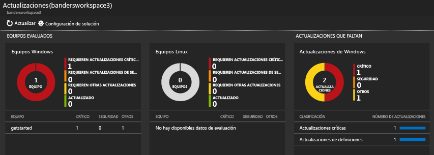
3. En este ejemplo, en **Faltan actualizaciones**, haga clic en **Actualizaciones críticas** para abrir Búsqueda de registros y ver detalles acerca de los equipos que carecen de actualizaciones críticas. En este ejemplo, hay una actualización que falta y otra necesaria.  
    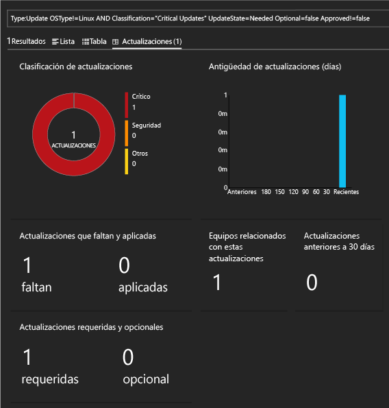
4. Vaya al sitio web de [Operations Management Suite](http://microsoft.com/oms) e inicie sesión con su cuenta de Azure. Una vez iniciada la sesión, tenga en cuenta que la información sobre soluciones es parecida a la que se muestra en Azure Portal.  
    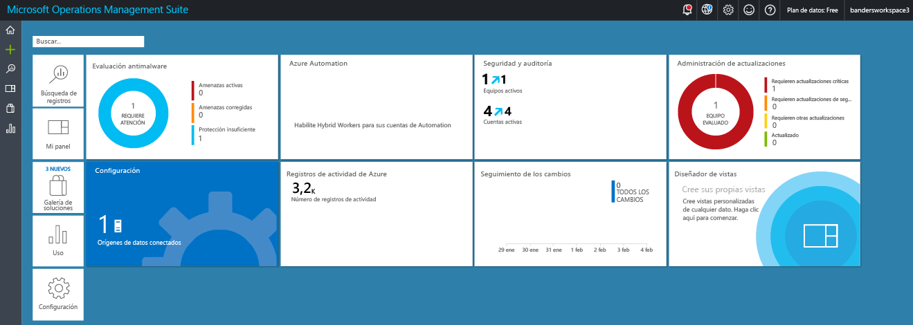
5. Haga clic en el icono **Administración de actualizaciones**.
6. En el panel Administración de actualizaciones, tenga en cuenta que la información de actualización del sistema es similar a la que ha visto en Azure Portal. Sin embargo, el icono **Manage Update Deployments** (Administrar implementaciones de actualizaciones) es nuevo. Haga clic en el icono **Manage Update Deployments** (Administrar implementaciones de actualizaciones).  
    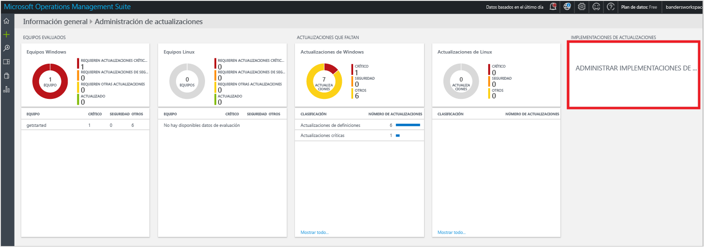
7. En la página **Update Deployments** (Implementaciones de actualizaciones), haga clic en **Agregar** para crear una *ejecución de actualización*.  
    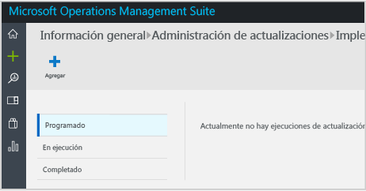
8.  En la página **New Update Deployment** (Nueva implementación de actualizaciones), escriba un nombre para la implementación de actualizaciones, seleccione los equipos que se van a actualizar (en este ejemplo, *getstarted*), elija una programación y haga clic en **Guardar**.  
    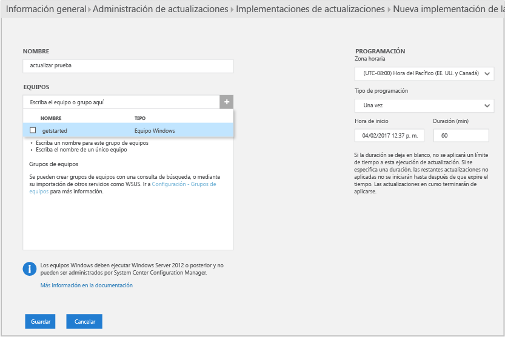  
    Después de guardar la implementación de actualizaciones, consulte la actualización programada.  
    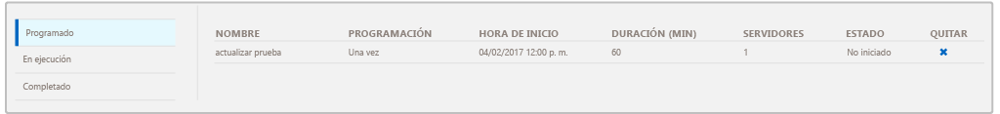  
    Una vez completada la ejecución de la actualización, se muestra el estado **Finalizado**.
    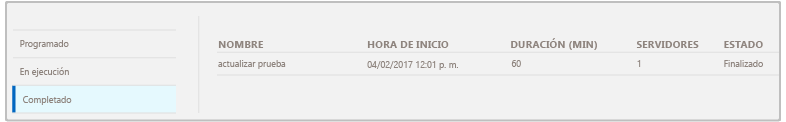
9. Una vez finalizada la ejecución de la actualización, puede ver si fue correcta o no, así como detalles acerca de las actualizaciones que se aplicaron.

## Después de la evaluación

En este tutorial, ha instalado un agente en una máquina virtual y se ha puesto en marcha rápidamente. Los pasos que ha seguido eran rápidos y sencillos. Sin embargo, la mayoría de las grandes organizaciones y empresas cuentan con infraestructuras de TI locales complejas. Por lo tanto, la recopilación de datos de esos entornos complejos supone mayor esfuerzo y planeamiento que este tutorial. Revise la información en la sección Pasos siguientes a continuación para obtener vínculos a artículos útiles.

También puede quitar el área de trabajo que ha creado con este tutorial, si lo desea.

## Pasos siguientes
* Aprenda a conectar [agentes de Windows](log-analytics-windows-agents.md) a Log Analytics.
* Aprenda a conectar [agentes de Operations Manager](log-analytics-om-agents.md) a Log Analytics.
* [Incorporación de soluciones de Log Analytics desde la galería de soluciones](log-analytics-add-solutions.md) para agregar funcionalidad y recopilar información.
* Familiarícese con las [búsquedas de registros](log-analytics-log-searches.md) para ver información detallada recopilada por soluciones.

