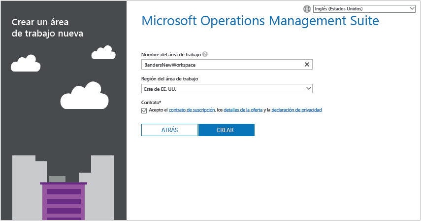
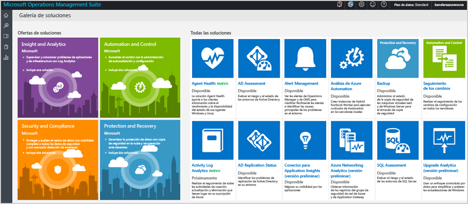

# Introducción a Log Analytics
Puede ponerse en marcha y ejecutar Log Analytics en Microsoft Operations Management Suite (OMS) en cuestión de minutos. Tiene dos opciones a la hora de elegir cómo crear un área de trabajo de OMS, que es similar a una cuenta:

* Sitio web de Microsoft Operations Management Suite
* Suscripción de Microsoft Azure

Puede crear un área de trabajo de OMS gratuita mediante el sitio web de OMS. O bien, puede usar una suscripción de Microsoft Azure para crear un área de trabajo gratuita de Log Analytics. Las áreas de trabajo creadas de una u otra forma son equivalentes desde el punto de vista funcional. Las áreas de trabajo gratuitas solo pueden enviar 500 MB de datos diariamente al servicio de OMS. Todas las áreas de trabajo requieren una suscripción de Azure, por lo que también puede usar su suscripción para acceder a otros servicios de Azure. Independientemente del método que use para crear el área de trabajo, podrá crearla con una cuenta de Microsoft o una cuenta profesional.

Eche un vistazo al proceso:

## Requisitos previos y consideraciones de implementación de Log Analytics
* Necesita una suscripción de pago a Microsoft Azure para poder usar Log Analytics. Si no tiene una suscripción de Azure, cree una [cuenta gratuita](https://azure.microsoft.com/free/) que le permita acceder durante 30 días a todos los servicios de Azure. También puede crear una cuenta gratuita de OMS en el sitio web de [Operations Management Suite](http://microsoft.com/oms).
* Para crear un área de trabajo, necesitará:
* Cada equipo de Windows desde el que desee recopilar datos debe ejecutar Windows Server 2008 SP1 o superior.
* [firewall](log-analytics-proxy-firewall.md) debe tener acceso a las direcciones del servicio web de OMS.
* Determine si los equipos tienen acceso directo a Internet. Si no es así, necesitan un servidor de puerta de enlace para tener acceso a los sitios del servicio web de OMS. Todo el acceso se produce a través de HTTPS. Puede configurar un servidor de [puerta de enlace de OMS](log-analytics-oms-gateway.md) para reenviar el tráfico de los servidores a OMS, si el acceso a Internet no está disponible desde los equipos.
* Si usa Operations Manager, Log Analytics admite Operations Manager 2012 SP1 UR6 y versiones superiores y Operations Manager 2012 R2 UR2 y versiones superiores. Se agregó compatibilidad con proxy en Operations Manager 2012 SP1 UR7 y Operations Manager 2012 R2 UR3. Determine cómo se integrará con OMS.
* Determinar qué servidores y tecnologías enviarán datos a OMS. Por ejemplo, controladores de dominio, SQL Server, etc.
* Conceder permiso a los usuarios de OMS y Azure.
* Si le preocupa el uso de datos, implemente cada solución individualmente y pruebe el impacto del rendimiento antes de agregar otras soluciones.
* Revise el uso de datos y el rendimiento a medida que agregue soluciones y características en Log Analytics. Esto incluye la recopilación de eventos, de registros, de datos de rendimiento, etc. Es mejor empezar por una recopilación mínima hasta que se identifique el uso de datos o el impacto en el rendimiento.
* Compruebe que los agentes de Windows no se administran también con Operations Manager; de lo contrario, los datos se duplicarán. Esto también se aplica a los agentes basados en Azure que tienen habilitado Diagnósticos de Azure.
* Después de instalar los agentes, compruebe que el agente está funcionando correctamente. Si no es así, compruebe que el Aislamiento de claves Cryptography API: Next Generation (CNG) no se ha deshabilitado mediante la directiva de grupo.
* Algunas soluciones de Log Analytics tienen otros requisitos adicionales.

## Registrarse en 3 pasos con OMS
1. Vaya al sitio web de [Operations Management Suite](http://microsoft.com/oms). Inicie sesión con su cuenta Microsoft, como Outlook.com, o con una cuenta profesional proporcionada por su compañía o institución educativa para usar con otros servicios de Microsoft o de Office 365.
2. Proporcione un nombre único al área de trabajo. Un área de trabajo es un contenedor lógico donde se almacenan los datos de administración. Permite crear particiones de datos entre los diferentes equipos de su organización, porque los datos son exclusivos de su área de trabajo. Especifique una dirección de correo electrónico y la región en que desea que se almacenen los datos.  
    
3. A continuación, cree una nueva suscripción de Azure o un vínculo a una suscripción existente.  
   

Ya está listo para empezar a usar el portal de Operations Management Suite.

Puede encontrar más información sobre cómo configurar el área de trabajo y vincular cuentas de Azure existentes a áreas de trabajo creadas con Operations Management Suite en [Administración de áreas de trabajo](log-analytics-manage-access.md).

## Registro rápido con Microsoft Azure
1. Vaya a [Azure Portal](https://portal.azure.com) e inicie sesión, examine la lista de servicios y, luego, seleccione **Log Analytics**.  
    
2. Haga clic en **Agregar**y, luego, seleccione las opciones de los siguientes elementos:
   * **área de trabajo de OMS**
   * **Suscripción** : si tiene varias suscripciones, elija la que desea asociar con el área de trabajo nueva.
   * **Grupos de recursos**
   * **Ubicación**
   * **Plan de tarifa**  
       
3. Haga clic en **Aceptar** y verá una lista de las áreas de trabajo.
4. Seleccione un área de trabajo para ver sus detalles en Azure Portal.       
             
5. Haga clic en el vínculo del **Portal de OMS** para abrir el sitio web de Operations Management Suite con la nueva área de trabajo.

Ya está listo para comenzar a usar el portal de Operations Management Suite.

Puede encontrar más información sobre cómo configurar el área de trabajo y vincular áreas de trabajo existentes que creó con Operations Management Suite con las suscripciones de Azure en [Administración del acceso en Log Analytics](log-analytics-manage-access.md).

## Introducción al portal de Operations Management Suite
Para elegir soluciones y conectar los servidores que desea administrar, haga clic en el icono **Configuración** y siga los pasos que aparecen en esta sección.  

  

1. **Agregar soluciones**: vea las soluciones instaladas.  
      
    Haga clic en **Visite la galería** para agregar más soluciones.  
      
    Seleccione una solución y haga clic en **Agregar**.
2. **Conectar un origen**: elija cómo desea conectarse al entorno del servidor para recopilar datos:

   * Instale un agente para conectar un cliente o un servidor de Windows Server directamente.
   * Conecte servidores Linux con el agente de OMS para Linux.
   * Use una cuenta de almacenamiento de Azure configurada con la extensión de VM de diagnóstico de Azure para Windows o Linux.
   * Use System Center Operations Manager para conectar sus grupos de administración o toda la implementación de Operations Manager.
   * Habilite la telemetría de Windows para usar Upgrade Analytics.
           
3. **Recopilar datos**: configure al menos un origen de datos para rellenar los datos del área de trabajo. Cuando termine, haga clic en **Guardar**.    

        

## Opcionalmente, conéctese a equipos Windows mediante la instalación de un agente.
El siguiente ejemplo muestra cómo instalar un agente para Windows.

1. Haga clic en el icono **Configuración**, haga clic en la pestaña **Orígenes conectados**, haga clic en la pestaña del tipo de origen que desea agregar y descargue un agente u obtenga más información sobre cómo habilitar un agente. Por ejemplo, haga clic en **Descargar Agente para Windows (64 bits)**. En el caso de los agentes para Windows, el agente solo se puede instalar en Windows Server 2008 SP 1 o posterior, o en Windows 7 SP1 o posterior.
2. Instale el agente en uno o más servidores. Puede instalar los agentes uno por uno, o usar un método más automatizado con un [script personalizado](log-analytics-windows-agents.md); también puede usar una solución de distribución de software existente que pueda tener.
3. Una vez que acepte el contrato de licencia y elija la carpeta de instalación, seleccione **Connect the agent to Azure Log Analytics (OMS)** [Conectar el agente a Azure Log Analytics(OMS)].   
    
4. En la página siguiente, se le pedirá el identificador de área de trabajo y la clave de área de trabajo. La clave y el identificador de área de trabajo aparecen en la pantalla donde descargó el archivo del agente.  
      

    
5. Durante la instalación, tiene la posibilidad de hacer clic en **Avanzadas** para configurar el servidor proxy y proporcionar la información de autenticación. Haga clic en el botón **Siguiente** para volver a la pantalla de información del área de trabajo.
6. Haga clic en **Siguiente** para validar el identificador y la clave de área de trabajo. Si se encuentran errores, puede hacer clic en **Atrás** para corregirlos. Una vez validados el identificador y la clave de área de trabajo, haga clic en **Instalar** para completar la instalación del agente.
7. En el Panel de control, haga clic en Microsoft Monitoring Agent > pestaña Azure Log Analytics (OMS). Cuando los agentes se comunican con el servicio de Operations Management Suite, aparecerá un icono de marca de verificación verde. Inicialmente, esto tarda unos 5-10 minutos.

> [!NOTE]
> Actualmente, los servidores conectados directamente a Operations Management Suite no admiten soluciones de evaluación de configuración y administración de la capacidad.

También puede conectar al agente a System Center Operations Manager 2012 SP1 y versiones posteriores. Para ello, seleccione **Conectar el agente a System Center Operations Manager**. Cuando elige esa opción, se envían datos al servicio sin necesidad de hardware adicional ni de cargas en los grupos de administración.

Puede leer más información sobre cómo conectar agentes a Operations Management Suite en [Conexión de equipos Windows a Log Analytics](log-analytics-windows-agents.md).

## Opcionalmente, conectar servidores con System Center Operations Manager
1. En la consola de Operations Manager, seleccione **Administración**.
2. Expanda el nodo **Operational Insights** y seleccione **Conexión a Operational Insights**.

   > [!NOTE]
   > En función del paquete acumulativo de actualizaciones de SCOM que se use, se puede ver un nodo para *System Center Advisor*, *Operational Insights* u *Operations Management Suite*.
   >
   >
3. Haga clic en el vínculo **Registrarse en Visión operativa** de la parte superior derecha y siga las instrucciones.
4. Después de completar el Asistente de registro, haga clic en el vínculo **Agregar un equipo/grupo** .
5. En el cuadro de diálogo **Búsqueda de equipos** puede seleccionar los equipos o grupos supervisados por Operations Manager. Seleccione los equipos o grupos para incorporarlos a Log Analytics, haga clic en **Agregar** y, luego, en **Aceptar**. Para comprobar que el servicio de OMS recibe datos, vaya al icono **Uso** en el portal de Operations Management Suite. Los datos aparecerán en unos 5-10 minutos.

Puede obtener más información sobre cómo conectar Operations Manager con Operations Management Suite en [Conexión de Operations Manager con Log Analytics](log-analytics-om-agents.md).

## Opcionalmente, analizar datos desde los servicios en la nube de Microsoft Azure
Con Operations Management Suite puede buscar rápidamente registros de IIS y eventos para servicios en la nube y máquinas virtuales, habilitando los diagnósticos en Servicios en la nube de Azure. También puede instalar Microsoft Monitoring Agent para recibir información adicional sobre sus máquinas virtuales de Azure. Para obtener más información sobre cómo configurar el entorno de Azure para usar Operations Management Suite, consulte [Conexión de Almacenamiento de Azure con Log Analytics](log-analytics-azure-storage.md).

## Pasos siguientes
* [Incorporación de soluciones de Log Analytics desde la galería de soluciones](log-analytics-add-solutions.md) para agregar funcionalidad y recopilar información.
* Familiarícese con las [búsquedas de registros](log-analytics-log-searches.md) para ver información detallada recopilada por soluciones.
* Use los [paneles](log-analytics-dashboards.md) para guardar y mostrar sus propias búsquedas personalizadas.

<!--HONumber=Dec16_HO2-->

