<properties
	pageTitle="Introducción a Log Analytics | Microsoft Azure"
	description="Puede ponerse en marcha y ejecutar Log Analytics en Microsoft Operations Management Suite (OMS) en cuestión de minutos."
	services="log-analytics"
	documentationCenter=""
	authors="bandersmsft"
	manager="jwhit"
	editor=""/>

<tags
	ms.service="log-analytics"
	ms.workload="na"
	ms.tgt_pltfrm="na"
	ms.devlang="na"
	ms.topic="article"
	ms.date="04/28/2016"
	ms.author="banders"/>

# Introducción a Log Analytics

Puede ponerse en marcha y ejecutar Log Analytics en Microsoft Operations Management Suite (OMS) en cuestión de minutos. Tiene dos opciones a la hora de elegir cómo crear un área de trabajo de OMS, que es similar a una cuenta:

- Sitio web de Microsoft Operations Management Suite
- Suscripción de Microsoft Azure

Puede crear un área de trabajo de OMS mediante el sitio web de OMS. O bien, puede usar una suscripción de Microsoft Azure para crear un área de trabajo de OMS. Ambas áreas de trabajo son funcionalmente equivalentes. Si usa una suscripción de Azure, también puede usar esa suscripción para acceder a otros servicios de Azure. Independientemente del método que use para crear el área de trabajo, podrá crearla con una cuenta de Microsoft o una cuenta profesional.

Eche un vistazo al proceso:

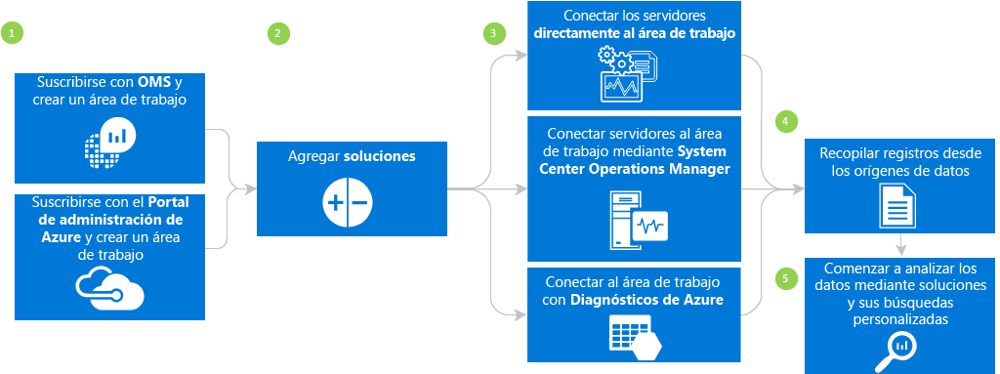

## Registro en 3 pasos con Microsoft Operations Management Suite

1. Vaya al sitio web de [Operations Management Suite](http://microsoft.com/oms) y haga clic en **Pruébelo gratis**. Inicie sesión con su cuenta Microsoft, como Outlook.com, o con una cuenta profesional proporcionada por su compañía o institución educativa para usar con otros servicios de Microsoft o de Office 365.
2. Proporcione un nombre único al área de trabajo. Un área de trabajo es un contenedor lógico donde se almacenan los datos de administración. Permite crear particiones de datos entre los diferentes equipos de su organización, porque los datos son exclusivos de su área de trabajo. Especifique una dirección de correo electrónico y la región donde desea que se almacenen los datos.
3. Después, puede crear una nueva suscripción de Azure o un vínculo a una suscripción de Azure existente. Si quiere continuar usando la versión de evaluación gratuita, haga clic en **Ahora no**.

Ya está listo para empezar a usar el portal de Operations Management Suite.

Puede encontrar más información sobre cómo configurar el área de trabajo y vincular cuentas de Azure existentes a áreas de trabajo creadas con Operations Management Suite en [Administración de acceso a Log Analytics](log-analytics-manage-access.md).

## Registro rápido con Microsoft Azure

1. Vaya al [Portal de Azure](https://portal.azure.com) e inicie sesión, examine la lista de servicios y, luego, seleccione **Log Analytics (OMS)**. 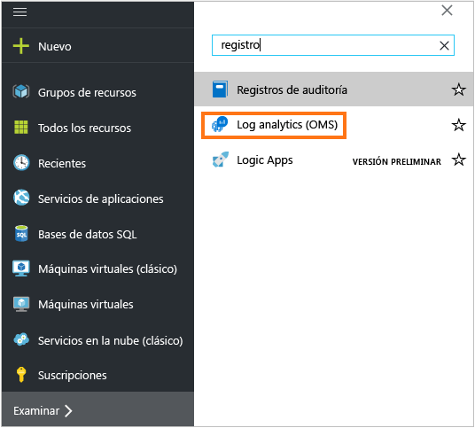
2. Haga clic en **Agregar** y, luego, seleccione las opciones de los siguientes elementos:
    - Nombre del **área de trabajo de OMS**
    - **Suscripción**: si tiene varias suscripciones, elija la que desea asociar con el área de trabajo nueva.
    - **Grupos de recursos**
    - **Ubicación**
    - **Plan de tarifa** 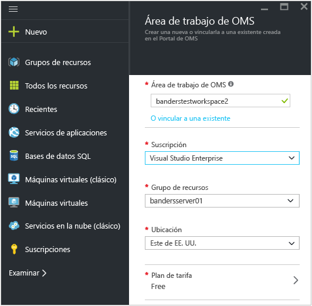
3. Haga clic en **Crear** y verá los detalles de área de trabajo en el Portal de Azure. 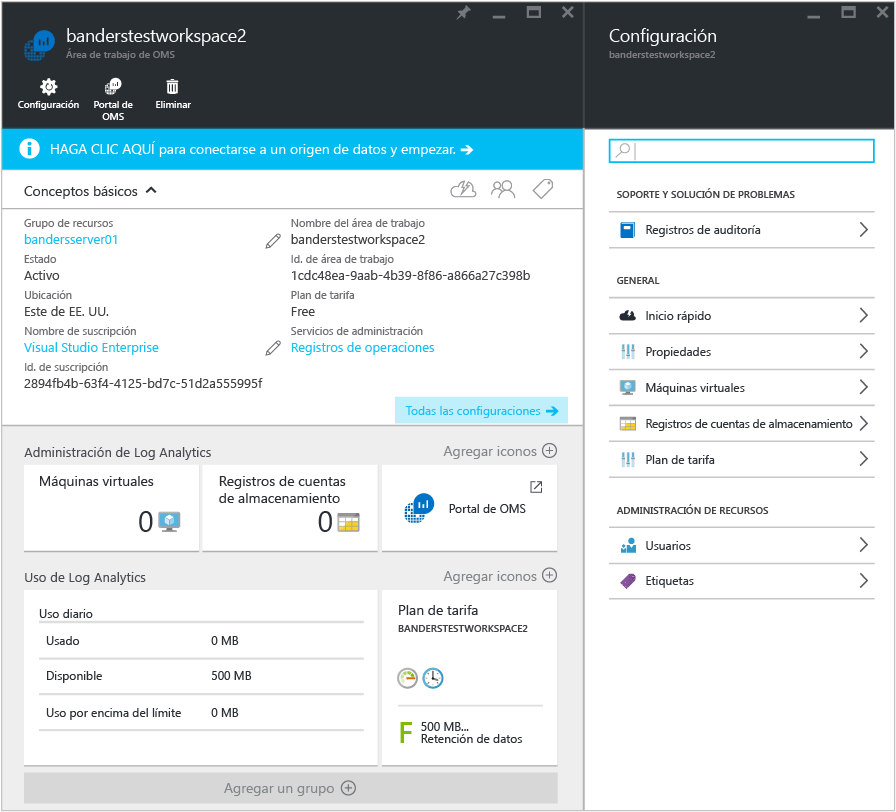         
4. Haga clic en el vínculo del **Portal de OMS** para abrir el sitio web de Operations Management Suite con la nueva área de trabajo.

Ya está listo para comenzar a usar el portal de Operations Management Suite.

Puede encontrar más información sobre cómo configurar el área de trabajo y vincular áreas de trabajo existentes que creó con Operations Management Suite con las suscripciones de Azure en [Administración de acceso a Log Analytics](log-analytics-manage-access.md).

## Introducción al portal de Operations Management Suite
Para elegir soluciones y conectar los servidores que desea administrar, haga clic en el icono **Configuración** y siga los pasos que aparecen en esta sección.

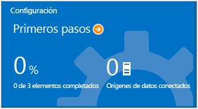

- **Agregar soluciones**. Seleccione las soluciones que desea usar y, luego, haga clic en **Agregar soluciones seleccionadas**. 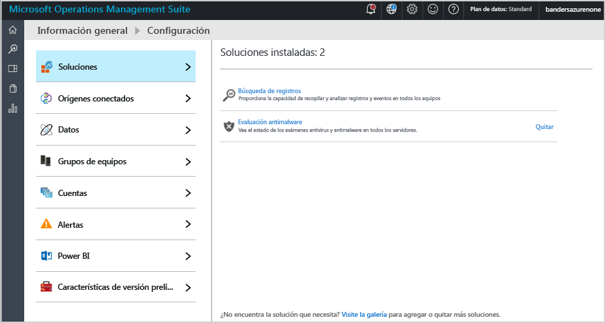
- **Conectar un origen de datos**. Elija cómo desea conectarse al entorno de servidor para recopilar datos:
    - Instale un agente para conectar un cliente o un servidor de Windows Server directamente.
    - Use System Center Operations Manager para conectar sus grupos de administración o toda la implementación de Operations Manager.
    - Use una cuenta de almacenamiento de Azure configurada con la extensión de VM de Diagnóstico de Azure para Windows o Linux. 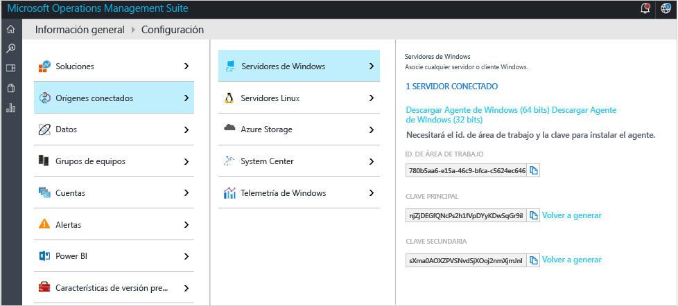    
- **Agregar registros**. Configure, como mínimo, un origen de datos para rellenar los datos y, luego, seleccione **Guardar**. En el caso de los registros de eventos, puede especificar el tipo de mensajes que desea supervisar; por ejemplo, error, advertencia e información.    

    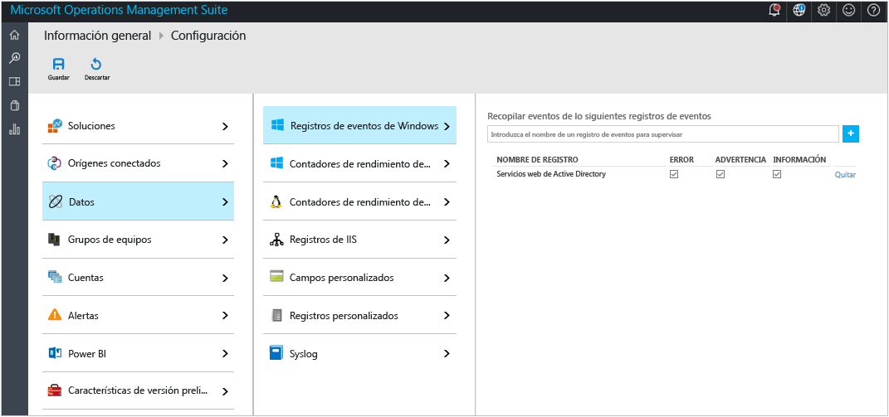

## Opcionalmente, instalar un agente para conectar servidores directamente a Operations Management Suite
1. Haga clic en el icono **Configuración**, en la pestaña **Orígenes conectados** y, luego, en **Descargar agente de Windows** correspondiente a la arquitectura del equipo donde desea realizar la instalación. El agente solo se puede instalar en Windows Server 2008 SP 1 o posterior, o en Windows 7 SP1 o posterior.
2. Instale el agente en uno o más servidores. Puede instalar los agentes uno por uno, o usar un método más automatizado con un [script personalizado](log-analytics-windows-agents.md); también puede usar una solución de distribución de software existente que pueda tener.
3. Una vez que acepta el contrato de licencia y elige la carpeta de instalación, seleccione **Conectar el agente a Visión operativa de Microsoft Azure**. (OMS anteriormente se denominaba Visión operativa). 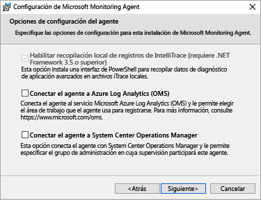

4. En la página siguiente, se le pedirá el identificador de área de trabajo y la clave de área de trabajo. La clave y el identificador de área de trabajo aparecen en la pantalla donde descargó el archivo del agente. 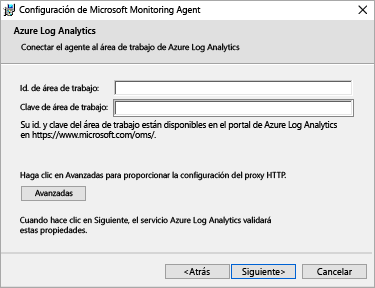 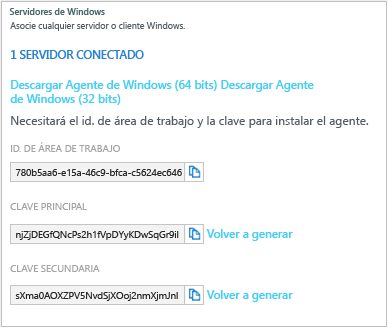
5. Durante la instalación, tiene la posibilidad de hacer clic en **Avanzadas** para configurar el servidor proxy y proporcionar la información de autenticación. Haga clic en el botón **Siguiente** para volver a la pantalla de información del área de trabajo.
6. Haga clic en **Siguiente** para validar el identificador y la clave de área de trabajo. Si se encuentran errores, puede hacer clic en **Atrás** para corregirlos. Una vez validados el identificador y la clave de área de trabajo, haga clic en **Instalar** para completar la instalación del agente.
7. Vuelva a iniciar sesión en el portal de Operations Management Suite y, en la página Información general, haga clic en el icono **Configuración**. Cuando los agentes se comunican con el servicio de Operations Management Suite, aparecerá un icono de marca de verificación verde. Inicialmente, esto tarda unos 5-10 minutos.

>[AZURE.NOTE] Actualmente, los servidores conectados directamente a Operations Management Suite no admiten soluciones de evaluación de configuración y administración de la capacidad.

También puede conectar al agente a System Center Operations Manager 2012 SP1 y versiones posteriores. Para ello, seleccione **Conectar el agente a System Center Operations Manager**. Cuando elige esa opción, se envían datos al servicio sin necesidad de hardware adicional ni de cargas en los grupos de administración.

Puede leer más información sobre cómo conectar agentes a Operations Management Suite en [Conexión de equipos Windows a Log Analytics](log-analytics-windows-agents.md).

## Opcionalmente, conectar servidores con System Center Operations Manager

1. En la consola de Operations Manager, seleccione **Administración**.
2. Expanda el nodo **Visión operativa** y seleccione **Conexión a Visión operativa**.

  >[AZURE.NOTE] En función de qué paquete acumulativo de actualizaciones de SCOM usa, puede que vea un nodo para *System Center Advisor*, *Visión operativa* o *Operations Management Suite*.

3. Haga clic en el vínculo **Registrarse en Visión operativa** de la parte superior derecha y siga las instrucciones.
4. Después de completar el Asistente de registro, haga clic en el vínculo **Agregar un equipo/grupo**.
5. En el cuadro de diálogo **Búsqueda de equipos** puede seleccionar los equipos o grupos supervisados por Operations Manager. Elija los equipos o grupos para incorporarlos a Log Analytics, haga clic en **Agregar** y, luego, en **Aceptar**. Para comprobar que el servicio de OMS recibe datos, vaya al icono **Uso** en el portal de Operations Management Suite. Los datos aparecerán en unos 5-10 minutos.

Para obtener más información sobre cómo conectar Operations Manager con Operations Management Suite en [Conexión de Operations Manager con Log Analytics](log-analytics-om-agents.md).

## Opcionalmente, analizar datos desde los servicios en la nube de Microsoft Azure

Con Operations Management Suite puede buscar rápidamente registros de IIS y eventos para servicios en la nube y máquinas virtuales, habilitando los diagnósticos en Servicios en la nube de Azure. También puede instalar Microsoft Monitoring Agent para recibir información adicional sobre sus máquinas virtuales de Azure. Para obtener más información sobre cómo configurar el entorno de Azure para usar Operations Management Suite, consulte [Conexión de Almacenamiento de Azure con Log Analytics](log-analytics-azure-storage.md).

## Pasos siguientes

- Consulte [Add Log Analytics solutions from the Solutions Gallery](log-analytics-add-solutions.md) (Incorporación de soluciones de Log Analytics desde la galería de soluciones) para agregar funcionalidad y recopilar datos.
- Familiarícese con las [búsquedas de registros](log-analytics-log-searches.md) para ver información detallada recopilada por soluciones.
- Use los [paneles](log-analytics-dashboards.md) para guardar y mostrar sus propias búsquedas personalizadas.

<!---HONumber=AcomDC_0504_2016-->