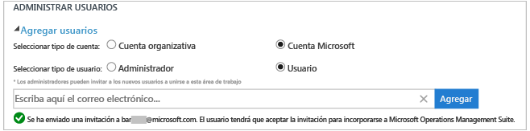
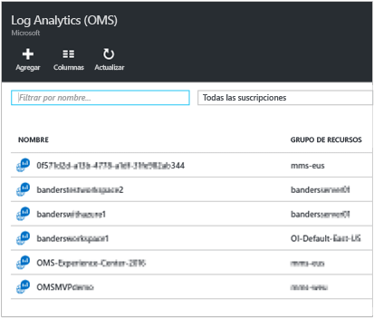
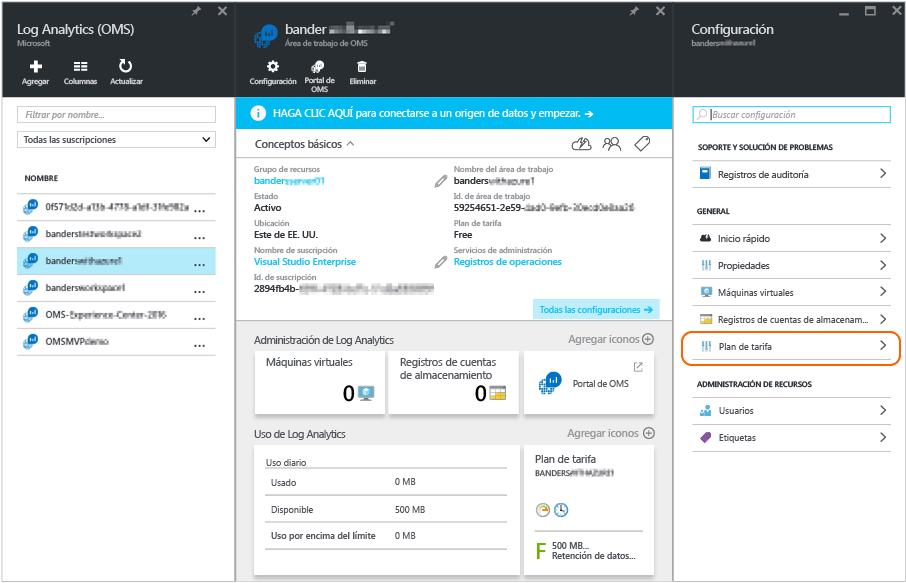

<properties
	pageTitle="Administración del acceso en Log Analytics | Microsoft Azure"
	description="Para administrar el acceso en Log Analytics, puede usar una serie de tareas administrativas en usuarios, cuentas, áreas de trabajo de OMS y cuentas de Azure."
	services="log-analytics"
	documentationCenter=""
	authors="bandersmsft"
	manager="jwhit"
	editor=""/>

<tags
	ms.service="log-analytics"
	ms.workload="na"
	ms.tgt_pltfrm="na"
	ms.devlang="na"
	ms.topic="article"
	ms.date="04/28/2016"
	ms.author="banders"/>

# Administración del acceso en Log Analytics

Para administrar el acceso en Log Analytics, tendrá que realizar una serie de tareas administrativas en los usuarios, cuentas, áreas de trabajo de OMS y cuentas de Azure. Para crear una nueva área de trabajo en Operations Management Suite (OMS), debe elegir un nombre para el área de trabajo, asociarlo con su cuenta y seleccionar una ubicación geográfica. En esencia, un área de trabajo es un contenedor donde se incluyen los datos de la cuenta e información básica de la configuración de la cuenta. Tanto usted como otros miembros de la organización pueden usar varias áreas de trabajo de OMS para administrar diferentes conjuntos de datos, recopilados a partir de toda la infraestructura de TI o de algunos de sus componentes.

En el artículo [Get started with Log Analytics](log-analytics-get-started.md) (Introducción a Log Analytics), se explica cómo empezar a trabajar rápidamente con esta herramienta y se describen con más detalle algunas de las acciones que deberá realizar para administrar el acceso a OMS.

Aunque es muy posible que al principio no tenga que ejecutar todas las tareas administrativas, en las siguientes secciones, vamos a explicar todas las tareas frecuentes que puede necesitar:

- Administración de cuentas y usuarios
- Incorporación de un grupo a un área de trabajo existente
- Determinación del número de áreas de trabajo necesarias
- Vincular un área de trabajo existente a una suscripción de Azure
- Actualización de un área de trabajo a un plan de datos de pago
- Modificación de un tipo de plan de datos
- Agregar una organización de Azure Active Directory a un área de trabajo existente
- Control de acceso a recursos de Log Analytics (OMS)
- Cerrar el área de trabajo de OMS

## Administración de cuentas y usuarios
Administre cuentas y usuarios con la pestaña **Cuentas** en la página Configuración. En esta página, podrá realizar las tareas que se describen en las secciones siguientes.

### Agregar un usuario a un área de trabajo existente

Siga estos pasos para agregar un usuario o un grupo a un área de trabajo de OMS. El usuario o grupo será capaz de ver y actuar en todas las alertas asociadas a esta área de trabajo.

>[AZURE.NOTE] Si quiere agregar un usuario o un grupo de la cuenta de organización de Azure Active Directory, primero debe asegurarse de que su cuenta de OMS esté asociada con el dominio de Active Directory. Consulte [Agregar una organización de Azure Active Directory a un área de trabajo existente](#add-an-azure-active-directory-organization-to-an-existing-workspace).

#### Para agregar un usuario a un área de trabajo existente
1. En OMS, haga clic en el icono **Settings** (Configuración).
2. Haga clic en la pestaña **Cuentas**.
3. En la sección **Administrar usuarios**, elija el tipo de cuenta que agregar: **Cuenta profesional** o **Cuenta de Microsoft**.
    - Si elige Cuenta de Microsoft, escriba la dirección de correo electrónico del usuario asociado a la cuenta de Microsoft.
    - Si elige Cuenta profesional, puede escribir parte del nombre del grupo o usuario o el alias de correo electrónico, y aparecerá una lista de usuarios y grupos. Seleccione un usuario o grupo.

    >[AZURE.NOTE] Para optimizar el rendimiento, limite a dos el número de grupos de Active Directory asociados a una única cuenta de OMS: uno para los administradores y otro para los usuarios. Si utiliza más grupos, el rendimiento de Log Analytics podría verse afectado.

7. Elija el tipo de usuario o grupo que agregar: **Administrador** o **Usuario**.
8. Haga clic en **Agregar**.

  Si va a agregar una cuenta de Microsoft, se envía una invitación para unir el área de trabajo al correo electrónico que proporcionó. Después de seguir las instrucciones que se especifican en la invitación para unirse a OMS, el usuario podrá ver las alertas y los datos de esta cuenta de OMS, mientras que usted podrá ver la información del usuario en la pestaña **Accounts** (Cuentas) de la página **Settings** (Configuración). Si agrega una cuenta de organización, el usuario podrá acceder a Log Analytics inmediatamente. 

### Edición de un tipo de usuario existente

Puede cambiar el rol de cuenta de un usuario asociado a su cuenta de OMS. Tiene las siguientes opciones de rol:

 - *Administrador*: puede administrar usuarios, ver y actuar en todas las alertas y agregar y quitar servidores

 - *Usuario*: puede ver y actuar en todas las alertas y agregar y quitar servidores

#### Para editar una cuenta
1. En la página **Settings** (Configuración) de la pestaña **Accounts** (Cuentas) de OMS, seleccione el rol del usuario que quiere cambiar.
2. Haga clic en **Aceptar**.

## Eliminación de un usuario de un área de trabajo de OMS

Siga los pasos siguientes para quitar un usuario de un área de trabajo de OMS. Tenga en cuenta que esto no cierra el área de trabajo del usuario. En su lugar, elimina la asociación entre ese usuario y el área de trabajo. Si un usuario tiene asociadas varias áreas de trabajo, podrá continuar iniciando sesión en OMS.

### Para eliminar a un usuario de un área de trabajo

1. En la página **Settings** (Configuración) de la pestaña **Accounts** (Cuentas) de OMS, haga clic en el botón Remove (Quitar) situado junto al nombre de usuario que quiere eliminar.
2. Haga clic en **Aceptar** para confirmar que quiere eliminar al usuario.

## Incorporación de un grupo a un área de trabajo existente

1.	Siga los pasos 1 a 4 indicados más arriba para agregar un usuario a un área de trabajo existente.
2.	En **Choose User/Group** (Elegir usuario/grupo), seleccione **Group** (Grupo). 
3.	Especifique el nombre para mostrar o la dirección de correo electrónico del grupo que quiere agregar.
4.	Seleccione el grupo en los resultados de la lista y después haga clic en **Add** (Agregar).

## Determinación del número de áreas de trabajo necesarias

Un área de trabajo se ve como un recurso de Azure en el Portal de administración de Azure.

Puede crear un área de trabajo nueva o vincular un área de trabajo existente que puede haber abierto anteriormente para su uso con System Center Operations Manager, pero que todavía no ha asociado a una suscripción de Azure (necesaria para la facturación).

Un área de trabajo representa el nivel en el que se recopilan, agregan, analizan y se presentan los datos en el portal de OMS. Puede tener varias áreas de trabajo para separar los datos de diferentes entornos y sistemas; cada grupo de administración de Operations Manager (y todos sus agentes) o los agentes/máquinas virtuales individuales solo pueden conectarse a una sola área de trabajo.

Cada área de trabajo puede tener varias cuentas asociadas, y cada cuenta de usuario (ya sea una cuenta de Microsoft o una cuenta profesional) puede tener acceso a varias áreas de trabajo de OMS.

De forma predeterminada, la cuenta de Microsoft o cuenta profesional que se usa para crear el área de trabajo se convierte en el administrador del área de trabajo. Después, el administrador puede invitar a cuentas de Microsoft adicionales o seleccionar usuarios de su Azure Active Directory.

## Vincular un área de trabajo existente a una suscripción de Azure

Se pueden crear áreas de trabajo en el sitio web [microsoft.com/oms](https://microsoft.com/oms). Sin embargo, existen ciertos límites en estas áreas de trabajo, el más notable es el límite de 500 MB/día para cargar datos si usa una cuenta gratuita. Para realizar cambios en esta área de trabajo deberá **vincular el área de trabajo existente a una suscripción de Azure**.

>[AZURE.IMPORTANT] Para vincular un área de trabajo, su cuenta de Azure debe tener acceso al área de trabajo que quiere vincular. En otras palabras, la cuenta que utilice para acceder al Portal de Azure deberá ser **la misma** cuenta con la que accede al área de trabajo de OMS. Si no es el caso, consulte [Agregar un usuario a un área de trabajo existente](#add-a-user-to-an-existing-workspace).

1.	Inicie sesión en el [Portal de Azure](http://portal.azure.com).
2.	Busque **Log Analytics (OMS)** y después selecciónelo.
3.	Aparecerá una lista con las áreas de trabajo existentes. Haga clic en **Agregar**. 
4.	En **OMS Workspace** (Área de trabajo de OMS), haga clic en **Or link existing** (O vincular existente). 
5.	Haga clic en **Configurar los valores obligatorios**. 
6.	Aparecerá una lista con las áreas de trabajo que aún no están vinculadas con su cuenta de Azure. Seleccione un área de trabajo. 
7.	Si es necesario, puede cambiar los valores de los elementos siguientes:
    - La suscripción
    - Grupos de recursos
    - Ubicación
    - Plan de tarifa 
8.	Haga clic en **Crear**. Ahora, el área de trabajo está vinculada a su cuenta de Azure.

>[AZURE.NOTE] Si no ve el área de trabajo que quiere vincular, significa que su suscripción de Azure no tiene acceso al área de trabajo de OMS que creó a través del sitio web de OMS. Debe conceder acceso a esta cuenta desde el área de trabajo de OMS a través del sitio web de OMS. Si ello, consulte [Agregar un usuario a un área de trabajo existente](#add-a-user-to-an-existing-workspace).

## Actualización de un área de trabajo a un plan de datos de pago

En OMS, existen tres planes de datos para las áreas de trabajo: **gratuito**, **estándar** y **premium**. Si dispone de una plan *gratis*, puede haber alcanzado su límite de datos de 500 MB. Necesitará actualizar el área de trabajo a un '**plan de pago por uso**' para recopilar datos una vez alcanzado el límite. Puede cambiar de tipo de plan en cualquier momento. Para más información sobre los precios de OMS, consulte [Precios de Microsoft Operations Management Suite](https://www.microsoft.com/es-ES/server-cloud/operations-management-suite/pricing.aspx).

>[AZURE.IMPORTANT] Los planes de área de trabajo solo pueden cambiarse si están *vinculados* a una suscripción de Azure. Si creó el área de trabajo en Azure o si *ya* vinculó el área de trabajo, puede ignorar este mensaje. Si creó el área de trabajo a través del [sitio web de OMS](http://www.microsoft.com/oms), deberá seguir los pasos que se indican en [Vinculación de un área de trabajo existente con una suscripción de Azure](#link-an-existing-workspace-to-an-azure-subscription).

### Uso de los derechos del complemento de OMS para System Center

El complemento de OMS para System Center da derecho al plan Premium de Log Analytics (OMS), que se describe en [Precios de Microsoft Operations Management Suite](https://www.microsoft.com/es-ES/server-cloud/operations-management-suite/pricing.aspx).

Si compra el complemento de OMS para System Center, el distribuidor o el equipo de cuentas de Microsoft asociarán los complementos de OMS al contrato Enterprise aplicable a sus compras de Azure. El complemento de OMS agrega este derecho a su contrato y podrá usarlo con cualquier suscripción de Azure. De este modo, por ejemplo, podrá tener varias áreas de trabajo de OMS que usen el derecho del complemento de OMS.

Para asegurarse de que el uso de un área de trabajo de OMS se realiza con arreglo a los derechos del complemento de OMS, deberá:

1. vincular el área de trabajo de OMS a una suscripción de Azure incluida en un contrato Enterprise que contemple tanto la compra del complemento de OMS como el uso de la suscripción de Azure, y
2. seleccionar el plan Premium para el área de trabajo.

Cuando revise su uso en el portal de Azure o de OMS, no verá los derechos del complemento OMS. Sin embargo, podrá ver estos derechos en Enterprise Portal.

Si necesita cambiar la suscripción de Azure a la que está vinculada el área de trabajo de OMS, puede usar el cmdlet [Move-AzureRMResource](https://msdn.microsoft.com/library/mt652516.aspx) de Azure PowerShell.

### Uso del compromiso de Azure en contratos Enterprise

Si decide optar por los precios unitarios de los componentes de OMS, pagará cada componente de OMS por separado y su uso se reflejará en la factura de Azure.

Si previamente ha pagado una cierta cantidad por el uso de Azure como parte de su contrato Enterprise, el uso de OMS se descontará de este importe. Si quiere usar los precios del compromiso de Azure para Log Analytics (OMS), la suscripción a la que está vinculada el área de trabajo de OMS debe formar parte de un contrato Enterprise de Azure.

Si necesita modificar la suscripción de Azure a la que está vinculada el área de trabajo de OMS, puede usar el cmdlet [Move-AzureRMResource](https://msdn.microsoft.com/library/mt652516.aspx) de Azure PowerShell.

### Para cambiar un área de trabajo a un plan de datos de pago

1.	Inicie sesión en el [Portal de Azure](http://portal.azure.com).
2.	Busque **Log Analytics (OMS)** y después selecciónelo.
3.	Aparecerá una lista con las áreas de trabajo existentes. Seleccione un área de trabajo. 
4.	En **Configuración**, haga clic en **Plan de tarifa**. 
5.	En **Plan de tarifa**, seleccione un plan y haga clic en **Seleccionar**. 
6.	Cuando actualice la vista del portal de Azure, verá que **Plan de tarifa** se ha actualizado con el plan seleccionado. 

Ahora podrá recopilar datos sin los límites del nivel "gratuito".

## Agregar una organización de Azure Active Directory a un área de trabajo existente

Puede asociar el área de trabajo de Visión operativa (OMS) con un dominio de Azure Active Directory. De este modo, podrá agregar usuarios de Active Directory directamente al área de trabajo de OMS sin necesidad de tener una cuenta de Microsoft diferente.

### Para agregar una organización de Azure Active Directory a un área de trabajo existente

1. En la página Settings (Configuración) de OMS, haga clic en **Accounts** (Cuentas) y luego en **Workspace Information** (Información del área de trabajo).  
2. Revise la información de las cuentas profesionales y haga clic en **Add Organization** (Agregar organización).
3. Especifique los datos de identidad del administrador del dominio de Azure Active Directory. A continuación, verá un mensaje de confirmación en el que se indica que el área de trabajo está vinculada al dominio de Azure Active Directory. 

## Control de acceso a recursos de Log Analytics (OMS)

La concesión de acceso a los usuarios en el área de trabajo de OMS se controla en dos lugares:

- El acceso al portal de OMS se administra desde el propio portal con independencia de si los usuarios tienen acceso a la suscripción de Azure en la que se encuentran los recursos.
- El acceso directo a la API de REST y el acceso a PowerShell se administran desde Azure, a través de Azure RBAC.

Si hay usuarios a los que ha concedido acceso al portal de OMS pero no a la suscripción de Azure vinculada, los iconos de las soluciones Automatización, Copia de seguridad y Site Recovery no incluirán ningún dato del usuario cuando inicie sesión en el portal de OMS.

Para que todos los usuarios puedan ver los datos en estas soluciones, asegúrese de que, como mínimo, tienen acceso de **lectura** en la cuenta de automatización, el almacén de copia de seguridad y el almacén de Site Recovery vinculados al área de trabajo de OMS.

## Cerrar el área de trabajo de OMS

Cuando se cierra un área de trabajo de OMS, todos los datos relacionados con el área de trabajo se eliminarán del servicio de OMS en un plazo máximo de 30 días a partir del cierre del área de trabajo.

Si es administrador, y hay varios usuarios asociados con el área de trabajo, se interrumpirá la asociación entre los usuarios y el área de trabajo. Si los usuarios están asociados a otras áreas de trabajo, podrán seguir utilizando OMS con esas otras áreas de trabajo. Sin embargo, si no están asociados a otras áreas de trabajo, deberán crear un área de trabajo nueva para poder usar OMS.

### Para cerrar un área de trabajo de OMS

1. En la página **Settings** (Configuración) de la pestaña **Accounts** (Cuentas) de OMS, haga clic en **Close Workspace** (Cerrar área de trabajo).

2. Seleccione uno de los motivos para cerrar el área de trabajo o escriba un motivo distinto en el cuadro de texto.

3. Haga clic en **Cerrar área de trabajo**.

## Pasos siguientes

- Consulte [Connect Windows computers to Log Analytics](log-analytics-windows-agents.md) (Conectar equipos Windows a Log Analytics) para agregar agentes y recopilar información.
- Consulte [Add Log Analytics solutions from the Solutions Gallery](log-analytics-add-solutions.md) (Incorporación de soluciones de Log Analytics desde la galería de soluciones) para agregar funciones y recopilar información.
- Consulte [Configure proxy and firewall settings in Log Analytics](log-analytics-proxy-firewall.md) (Configuración del proxy y del firewall en Log Analytics) si la organización utiliza un servidor proxy o un firewall para que los agentes puedan comunicarse con el servicio Log Analytics.

<!---HONumber=AcomDC_0504_2016-->