# Administración de áreas de trabajo

Para administrar el acceso a Log Analytics, tendrá que realizar varias tareas administrativas relacionadas con las áreas de trabajo. En este artículo se proporcionan consejos y procedimientos recomendados para administrar áreas de trabajo. En esencia, un área de trabajo es un contenedor donde se incluyen los datos de la cuenta e información básica de la configuración de la cuenta. Tanto usted como otros miembros de la organización pueden usar varias áreas de trabajo para administrar diferentes conjuntos de datos, recopilados a partir de toda la infraestructura de TI o de algunos de sus componentes.

Para crear un área de trabajo, necesitará:

1. Tener una suscripción a Azure.
2. Elegir un nombre de área de trabajo.
3. Asociar el área de trabajo a la suscripción.
4. Elegir una ubicación geográfica.

## Determinación del número de áreas de trabajo necesarias
Un área de trabajo es un recurso de Azure y un contenedor donde los datos se recopilan, se agregan, se analizan y se presentan en Azure Portal.

Puede tener varias áreas de trabajo por suscripción de Azure y puede tener acceso a más de una área de trabajo. Minimizar el número de áreas de trabajo le permite consultar y correlacionar la mayoría de los datos, ya que no es posible realizar consultas a través de varias áreas de trabajo. En esta sección se describe cuándo puede resultar útil la creación de más de un área de trabajo.

En la actualidad, un área de trabajo proporciona:

* Una ubicación geográfica para el almacenamiento de datos
* Granularidad para la facturación
* Aislamiento de datos
* Ámbito de configuración

Dadas estas características anteriores, quizás quiera crear varias áreas de trabajo en los siguientes casos:

* Una empresa internacional que necesita que los datos estén almacenados en regiones concretas por motivos de soberanía de datos o cumplimiento normativo.
* Un usuario de Azure que desea evitar los gastos de transferencia de datos de salida manteniendo un área de trabajo en la misma región que los recursos de Azure que administra.
* Se desea asignar los gastos a diferentes departamentos o grupos de negocios en función del uso que hagan. Cuando se crea un área de trabajo para cada departamento o grupo de negocios, la factura y la declaración de uso de Azure reflejan los cargos de cada área de trabajo de manera independiente.
* Un proveedor de servicio administrado que necesita mantener los datos de Log Analytics para cada cliente que administra aislados de los datos de otro cliente.
* Si se administran varios clientes y se desea que cada cliente, departamento o grupo empresarial vea sus propios datos, pero no los datos de los demás.

Cuando se usan agentes para recopilar datos, se puede [configurar cada uno de ellos para que informe a una o varias áreas de trabajo](log-analytics-windows-agents.md).

Si usa System Center Operations Manager, cada grupo de administración de Operations Manager se puede conectar con una sola área de trabajo. Se puede instalar Microsoft Monitoring Agent en los equipos administrados por Operations Manager y hacer que el agente informe tanto a Operations Manager como a una diferente área de trabajo de Log Analytics.

### Información del área de trabajo

Puede ver los detalles sobre el área de trabajo en Azure Portal. También puede ver los detalles en el portal de OMS.

#### Visualización de la información de un área de trabajo en Azure Portal

1. Si aún no lo ha hecho, inicie sesión en [Azure Portal](https://portal.azure.com) mediante su suscripción de Azure.
2. En el menú **central**, haga clic en **Más servicios** y, en la lista de recursos, escriba **Log Analytics**. Cuando comience a escribir, la lista se filtrará en función de la entrada. Haga clic en **Log Analytics**.  
    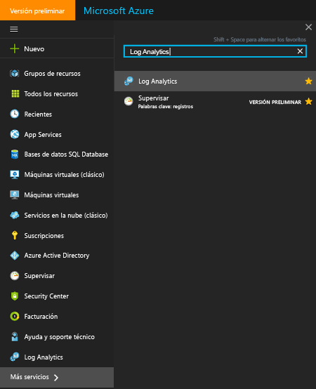  
3. En la hoja de suscripciones de Log Analytics, seleccione un área de trabajo.
4. La hoja del área de trabajo muestra información detallada sobre el área de trabajo y vínculos a información adicional.  
    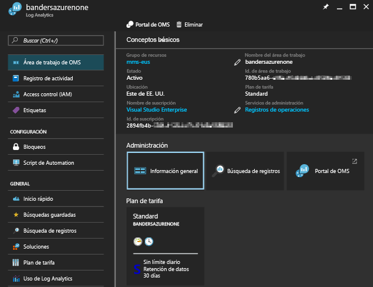  

## Administración de cuentas y usuarios
Cada área de trabajo puede tener varias cuentas asociadas, y cada cuenta (ya sea una cuenta Microsoft o una cuenta profesional) puede tener acceso a varias áreas de trabajo.

De forma predeterminada, la cuenta de Microsoft o la cuenta profesional que crea el área de trabajo se convierte en el administrador del área de trabajo.

Hay dos modelos de permisos que controlan el acceso a un área de trabajo de Log Analytics:

1. Roles de usuario heredados de Log Analytics
2. [Acceso basado en roles de Azure](../active-directory/role-based-access-control-configure.md)

En la tabla siguiente se resume el acceso que se puede establecer con cada modelo de permisos:

|                          | Portal de Log Analytics | Portal de Azure | API (incluido PowerShell) |
|--------------------------|----------------------|--------------|----------------------------|
| Roles de usuario de Log Analytics | Sí                  | No           | No                         |
| Acceso basado en roles de Azure  | Sí                  | Sí          | Sí                        |

> [!NOTE]
> Log Analytics va a pasar al uso del acceso basado en roles de Azure como modelo de permisos, para sustituir a los roles de usuario de Log Analytics.
>
>

Los roles de usuario heredados de Log Analytics solo controlan el acceso a las actividades realizadas en el [portal de Log Analytics](https://mms.microsoft.com).

Las siguientes actividades también requieren permisos de Azure:

| Acción                                                          | Permisos de Azure necesarios | Notas |
|-----------------------------------------------------------------|--------------------------|-------|
| Agregar y quitar soluciones de administración                        | `Microsoft.Resources/deployments/*`   `Microsoft.OperationalInsights/*`   `Microsoft.OperationsManagement/*`   `Microsoft.Automation/*`   `Microsoft.Resources/deployments/*/write` | |
| Cambiar el plan de tarifa                                       | `Microsoft.OperationalInsights/workspaces/*/write` | |
| Ver los datos en los iconos de soluciones *Backup* y *Site Recovery* | Administrador o coadministrador | Accede a los recursos implementados mediante el modelo de implementación clásica |
| Creación de un área de trabajo en Azure Portal                        | `Microsoft.Resources/deployments/*`   `Microsoft.OperationalInsights/workspaces/*` ||

### Administración del acceso a Log Analytics mediante permisos de Azure
Para conceder acceso al área de trabajo de Log Analytics mediante permisos de Azure, siga los pasos que se describen en [Uso de asignaciones de roles para administrar el acceso a los recursos de la suscripción de Azure](../active-directory/role-based-access-control-configure.md).

Si tiene al menos permiso de lectura de Azure en el área de trabajo de Log Analytics, puede abrir el portal de OMS haciendo clic en la tarea **Portal de OMS** al visualizar el área de trabajo de Log Analytics.

Al abrir el portal de Log Analytics, cambia al uso de los roles de usuario heredados de Log Analytics. Si no tiene una asignación de roles en el portal de Log Analytics, el servicio [comprueba los permisos de Azure que tiene en el área de trabajo](https://docs.microsoft.com/rest/api/authorization/permissions#Permissions_ListForResource).
La asignación de roles en el portal de Log Analytics se determina de la manera siguiente:

| Condiciones                                                   | Rol de usuario asignado de Log Analytics | Notas |
|--------------------------------------------------------------|----------------------------------|-------|
| La cuenta pertenece a un rol de usuario heredado de Log Analytics     | El rol de usuario especificado de Log Analytics | |
| La cuenta no pertenece a un rol de usuario heredado de Log Analytics   Permisos de Azure completos para el área de trabajo (`*` permiso 1) | Administrador ||
| La cuenta no pertenece a un rol de usuario heredado de Log Analytics   Permisos de Azure completos para el área de trabajo (`*` permiso 1)   *sin acciones* de `Microsoft.Authorization/*/Delete` y `Microsoft.Authorization/*/Write` | Colaborador ||
| La cuenta no pertenece a un rol de usuario heredado de Log Analytics   Permiso de lectura de Azure | Solo lectura ||
| La cuenta no pertenece a un rol de usuario heredado de Log Analytics   Los permisos de Azure no se entienden | Solo lectura ||
| Para suscripciones administradas por el Proveedor de soluciones en la nube (CSP)   La cuenta con la que inicia sesión se encuentra en la instancia de Azure Active Directory vinculada al área de trabajo | Administrador | Normalmente, el cliente de un CSP |
| Para suscripciones administradas por el Proveedor de soluciones en la nube (CSP)   La cuenta con la que inicia sesión no se encuentra en la instancia de Azure Active Directory vinculada al área de trabajo | Colaborador | Normalmente el CSP |

Para más información sobre las definiciones de roles, 1 consulte los [permisos de Azure](../active-directory/role-based-access-control-custom-roles.md). Al evaluar funciones, una acción de `*` no es equivalente a `Microsoft.OperationalInsights/workspaces/*`.

Algunos aspectos relativos a Azure Portal que deben tenerse en cuenta:

* Si inicia sesión en el portal de OMS mediante http://mms.microsoft.com, verá la lista **Seleccione un área de trabajo**. Esta lista solo contiene áreas de trabajo en las que tiene un rol de usuario de Log Analytics. Para ver las áreas de trabajo a las que tiene acceso con las suscripciones de Azure, será preciso que especifique un inquilino como parte de la dirección URL. Por ejemplo: `mms.microsoft.com/?tenant=contoso.com`. A menudo, el identificador del inquilino es la última parte de la dirección de correo electrónico con la que inicia sesión.
* Si desea navegar directamente a un portal al que tenga acceso a través de los permisos de Azure, será preciso que especifique el recurso como parte de la dirección URL. Esta dirección URL se puede obtener mediante PowerShell.

  Por ejemplo: `(Get-AzureRmOperationalInsightsWorkspace).PortalUrl`.

  La dirección URL tiene el siguiente aspecto: `https://eus.mms.microsoft.com/?tenant=contoso.com&resource=%2fsubscriptions%2faaa5159e-dcf6-890a-a702-2d2fee51c102%2fresourcegroups%2fdb-resgroup%2fproviders%2fmicrosoft.operationalinsights%2fworkspaces%2fmydemo12`

### Administración de usuarios en el portal de OMS
Los usuarios y grupos se administran en la pestaña **Administrar usuarios** de la pestaña **Cuentas** de la página Configuración.   

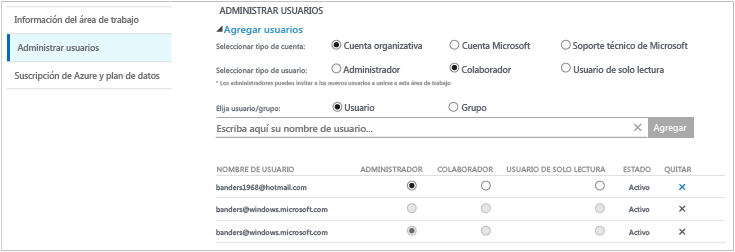

#### Agregar un usuario a un área de trabajo existente
Siga estos pasos para agregar un usuario o un grupo a un área de trabajo.

1. En el portal de OMS, haga clic en el icono **Configuración**.
2. Haga clic en la pestaña **Cuentas** y, después, en la pestaña **Administrar usuarios**.
3. En la sección **Administrar usuarios**, elija el tipo de cuenta que desea agregar: **Cuenta de organización**, **Cuenta Microsoft** o **Soporte técnico de Microsoft**.

   * Si elige Cuenta de Microsoft, escriba la dirección de correo electrónico del usuario asociado a la cuenta de Microsoft.
   * Si elige Cuenta profesional, escriba parte del nombre del grupo o usuario o el alias de correo electrónico, y aparecerá una lista de usuarios y grupos que coinciden con esos datos en un cuadro desplegable. Seleccione un usuario o grupo.
   * Use el servicio de soporte técnico de Microsoft para dar a un ingeniero, o a otro empleado de Microsoft de este servicio, acceso temporal a su área de trabajo para ayudar en la solución de problemas.

     > [!NOTE]
     > Para optimizar el rendimiento, limite a tres el número de grupos de Active Directory asociados a una única cuenta de OMS: uno para los administradores, otro para los colaboradores y otro para los usuarios de solo lectura. Si utiliza más grupos, el rendimiento de Log Analytics podría verse afectado.
     >
     >
4. Elija el tipo de usuario o grupo que desea agregar: **Administrador**, **Colaborador** o **Usuario de solo lectura**.  
5. Haga clic en **Agregar**.

   Si va a agregar una cuenta de Microsoft, se envía una invitación para unir el área de trabajo al correo electrónico que proporcionó. Después de que el usuario siga las instrucciones de la invitación para unirse a OMS, podrá acceder a este área de trabajo.
   Si agrega una cuenta de organización, el usuario podrá acceder a Log Analytics inmediatamente.  

#### Edición de un tipo de usuario existente
Puede cambiar el rol de cuenta de un usuario asociado a su cuenta de OMS. Tiene las siguientes opciones de rol:

* *Administrador*: puede administrar usuarios, ver y actuar en todas las alertas y agregar y quitar servidores
* *Colaborador*: puede ver y actuar en todas las alertas y agregar y quitar servidores
* *Usuario de solo lectura*: los usuarios con este rol no podrán hacer lo siguiente:

  1. Agregar o quitar soluciones. Se oculta la galería de soluciones.
  2. Agregar, modificar o eliminar iconos en **Mi panel**.
  3. Vea las páginas de **Configuración**. Las páginas están ocultas.
  4. En la vista de búsqueda, la configuración de PowerBI, las búsquedas guardadas y las tareas de alertas están ocultas.

#### Para editar una cuenta
1. En el portal de OMS, haga clic en el icono **Configuración**.
2. Haga clic en la pestaña **Cuentas** y, después, en la pestaña **Administrar usuarios**.
3. Seleccione el rol del usuario que desea cambiar.
4. En el cuadro de diálogo de confirmación, haga clic en **Sí**.

### Eliminación de un usuario de un área de trabajo
Siga estos pasos para quitar un usuario de un área de trabajo. La eliminación del usuario no implica el cierre del área de trabajo. En su lugar, elimina la asociación entre ese usuario y el área de trabajo. Si un usuario tiene asociadas varias áreas de trabajo, podrá continuar iniciando sesión en OMS y ver el resto de áreas de trabajo.

1. En el portal de OMS, haga clic en el icono **Configuración**.
2. Haga clic en la pestaña **Cuentas** y, después, en la pestaña **Administrar usuarios**.
3. Haga clic en **Quitar** junto al nombre de usuario que desea eliminar.
4. En el cuadro de diálogo de confirmación, haga clic en **Sí**.

### Incorporación de un grupo a un área de trabajo existente
1. En la sección anterior "Agregar un usuario a un área de trabajo existente", siga los pasos del 1 al 4.
2. En **Elegir usuario/grupo**, seleccione **Grupo**.  
   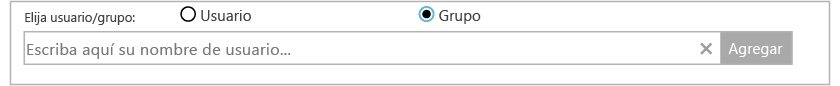
3. Especifique el nombre para mostrar o la dirección de correo electrónico del grupo que quiere agregar.
4. Seleccione el grupo en los resultados de la lista y después haga clic en **Agregar**.

## Vincular un área de trabajo existente a una suscripción de Azure
Todas las áreas de trabajo creadas después del 26 de septiembre de 2016 deben estar vinculadas a una suscripción de Azure en el momento de la creación. Las áreas de trabajo creadas antes de esta fecha deben estar vinculadas a un área de trabajo la próxima vez que inicie sesión. Al crear el área de trabajo desde Azure Portal, o al vincular el área de trabajo a una suscripción de Azure, su instancia de Azure Active Directory quedará vinculada como su cuenta de organización.

### Para vincular un área de trabajo a una suscripción de Azure en el portal OMS

- Cuando inicie sesión en el portal de OMS, se le pedirá que seleccione una suscripción de Azure. Seleccione la suscripción que desea vincular al área de trabajo y haga clic en **Vínculo**.  
    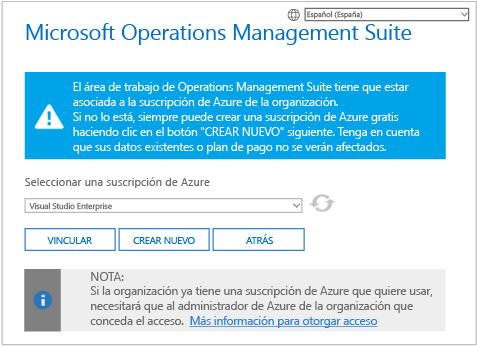

    > [!IMPORTANT]
    > Para vincular un área de trabajo, su cuenta de Azure debe tener acceso al área de trabajo que quiere vincular.  En otras palabras, la cuenta que use para acceder a Azure Portal deberá ser **la misma** cuenta que usa para acceder al área de trabajo. Si no lo es, consulte [Agregar un usuario a un área de trabajo existente](#add-a-user-to-an-existing-workspace).

### Para vincular un área de trabajo a una suscripción de Azure en Azure Portal
1. Inicie sesión en el [Portal de Azure](http://portal.azure.com).
2. Busque **Log Analytics** y selecciónelo.
3. Aparecerá una lista con las áreas de trabajo existentes. Haga clic en **Agregar**.  
   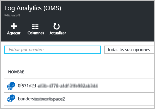
4. En **OMS Workspace** (Área de trabajo de OMS), haga clic en **Or link existing** (O vincular existente).  
   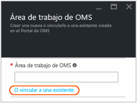
5. Haga clic en **Configurar los valores obligatorios**.  
   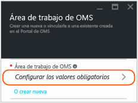
6. Aparecerá una lista con las áreas de trabajo que aún no están vinculadas con su cuenta de Azure. Seleccione un área de trabajo.  
   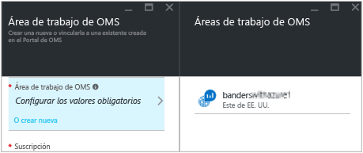
7. Si es necesario, puede cambiar los valores de los elementos siguientes:
   * La suscripción
   * Grupos de recursos
   * Ubicación
   * Plan de tarifa   
     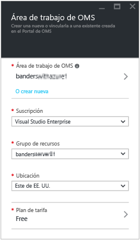
8. Haga clic en **Aceptar**. Ahora, el área de trabajo está vinculada a su cuenta de Azure.

> [!NOTE]
> Si no ve el área de trabajo que quiere vincular, significa que su suscripción de Azure no tiene acceso al área de trabajo que creó mediante el portal de OMS.  Para conceder acceso a esta cuenta desde el portal OMS, consulte [Agregar un usuario a un área de trabajo existente](#add-a-user-to-an-existing-workspace).
>
>

## Actualizar el área de trabajo a un plan de pago
En OMS, existen tres tipos de planes de áreas de trabajo: **Free** (Gratis), **Standalone** (Independiente) y **OMS**.  Si dispone del plan *Free* (Gratis), se puede enviar un máximo de 500 MB de datos por día a Log Analytics.  Si supera esta cantidad, debe cambiar el área de trabajo a un plan de pago para evitar la pérdida de datos una vez superado este límite. Puede cambiar de tipo de plan en cualquier momento.  Para más información sobre los precios de OMS, consulte [Precios de Operations Management Suite](https://www.microsoft.com/en-us/cloud-platform/operations-management-suite-pricing).

### Uso de los derechos de una suscripción de OMS
Para usar los derechos que proceden de la adquisición de OMS E1, OMS E2 OMS o un complemento de OMS para System Center, elija el plan *OMS* de OMS Log Analytics.

Cuando adquiere una suscripción de OMS, los derechos se agregan a su contrato Enterprise. Cualquier suscripción de Azure creada en virtud de este contrato puede usar estos derechos. Todas las áreas de trabajo de estas suscripciones usan los derechos de OMS.

Para asegurarse de que el uso de un área de trabajo se realiza con arreglo a los derechos de la suscripción de OMS, deberá:

1. Crear el área de trabajo en una suscripción de Azure incluida en el contrato Enterprise que incluye la suscripción de OMS
2. Seleccionar el plan *OMS* para el área de trabajo

> [!NOTE]
> Si el área de trabajo se creó antes del 26 de septiembre de 2016 y el plan de precios de Log Analytics es *Premium*, este área de trabajo usa los derechos del complemento de OMS para System Center. También puede usar los derechos, cambiando al plan de tarifa *OMS*.
>
>

Los derechos de la suscripción de OMS no son visibles en el portal de Azure ni en el de OMS. Podrá ver estos derechos y usos en Enterprise Portal.  

Si necesita cambiar la suscripción de Azure a la que está vinculada el área de trabajo, puede usar el cmdlet [Move-AzureRmResource](https://msdn.microsoft.com/library/mt652516.aspx) de Azure PowerShell.

### Uso del compromiso de Azure en contratos Enterprise
Si no tiene una suscripción de OMS, pagará por separado por cada componente de OMS y el uso aparecerá en la factura de Azure.

Si tiene un compromiso monetario de Azure sobre la inscripción Enterprise a la que están vinculadas sus suscripciones de Azure, el uso de Log Analytics se descontará de este importe.

Si necesita cambiar la suscripción de Azure a la que está vinculada el área de trabajo, puede usar el cmdlet [Move-AzureRmResource](https://msdn.microsoft.com/library/mt652516.aspx) de Azure PowerShell.  

### Cambio de un área de trabajo a un plan de tarifa de pago en Azure Portal
1. Inicie sesión en el [Portal de Azure](http://portal.azure.com).
2. Busque **Log Analytics** y selecciónelo.
3. Aparecerá una lista con las áreas de trabajo existentes. Seleccione un área de trabajo.  
4. En la hoja del área de trabajo, en **General**, haga clic en **Plan de tarifa**.  
5. En **Plan de tarifa**, seleccione un plan de tarifa y haga clic en **Seleccionar**.  
    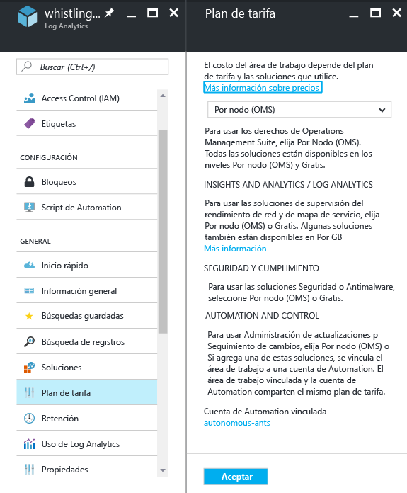
6. Cuando actualice la vista en Azure Portal, verá que **Plan de tarifa** se ha actualizado con el plan seleccionado.  
    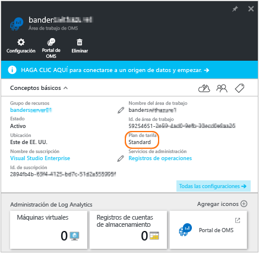

> [!NOTE]
> Si el área de trabajo está vinculada a una cuenta de Automation, antes de seleccionar el plan de tarifa *Independiente (por GB)* debe eliminar todas las soluciones de **Automation and Control** y desvincular la cuenta de Automation. En la hoja del área de trabajo, en **General**, haga clic en **Soluciones** para ver y eliminar soluciones. Para desvincular la cuenta de Automation, haga clic en el nombre de la cuenta de Automation en la hoja **Plan de tarifa**.
>
>

### Cambio de un área de trabajo a un plan de tarifa de pago en el portal de OMS

Para cambiar el plan de tarifa mediante el portal de OMS, debe tener una suscripción de Azure.

1. En el portal de OMS, haga clic en el icono **Configuración**.
2. Haga clic en la pestaña **Cuentas** y, luego, en la pestaña **Azure Subscription & Data Plan** (Suscripción y plan de datos de Azure).
3. Haga clic en el plan de tarifa que quiere usar.
4. Haga clic en **Guardar**.  
   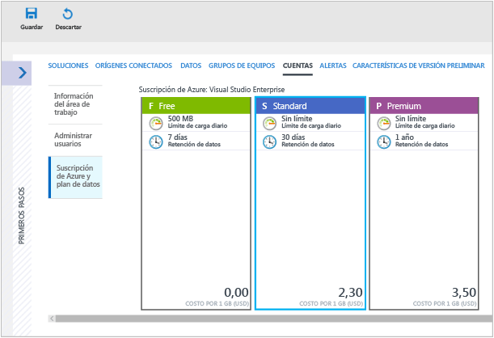

Su nuevo plan de datos se muestra en la cinta de opciones del portal OMS, que se encuentra en la parte superior de la página web.

## Cambio de la duración del almacenamiento de datos de Log Analytics

En el plan de tarifa Gratis, en Log Analytics están disponibles los datos correspondientes a los últimos siete días.
En el plan de tarifa Estándar, en Log Analytics están disponibles los datos correspondientes a los últimos treinta días.
En el plan de tarifa Premium, en Log Analytics están disponibles los datos correspondientes a los últimos 365 días.
De manera predeterminada, en los planes de tarifa Independiente y OMS de Log Analytics están disponibles los datos correspondientes a los últimos 31 días.

Si usa los planes de tarifas Independiente y OMS, puede conservar hasta dos años de datos (730 días). Los datos almacenados durante más tiempo que el valor predeterminado de 31 días incurrirán en un cargo por retención de datos. Para más información sobre los precios, consulte [Costos del uso por encima del límite](https://azure.microsoft.com/pricing/details/log-analytics/).

Para cambiar la duración de la retención de datos:

1. Inicie sesión en el [Portal de Azure](http://portal.azure.com).
2. Busque **Log Analytics** y selecciónelo.
3. Aparecerá una lista con las áreas de trabajo existentes. Seleccione un área de trabajo.  
4. En la hoja del área de trabajo, en **General**, haga clic en **Retención**.  
5. Use el control deslizante para aumentar o disminuir el número de días de retención y haga clic en **Guardar**.  
    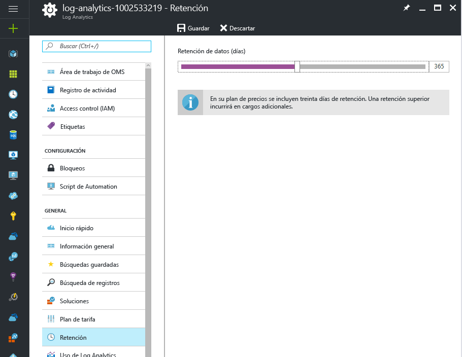

## Cambio de la organización de Azure Active Directory para un área de trabajo

Puede cambiar la organización de Azure Active Directory para un área de trabajo. Cambiar la organización de Azure Active Directory le permite agregar usuarios y grupos desde ese directorio al área de trabajo.

### Para cambiar la organización de Azure Active Directory para un área de trabajo

1. En la página Configuración del portal de OMS, haga clic en **Cuentas** y, luego, haga clic en la pestaña **Administrar usuarios**.  
2. Revise la información de las cuentas de organización y haga clic en **Cambiar organización**.  
    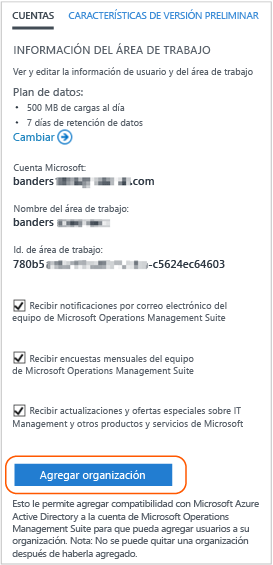
3. Especifique los datos de identidad del administrador del dominio de Azure Active Directory. A continuación, verá un mensaje de confirmación en el que se indica que el área de trabajo se ha vinculado al dominio de Azure Active Directory.  
    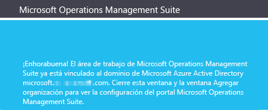

## Eliminación de un área de trabajo de Log Analytics
Cuando elimina un área de trabajo de Log Analytics, todos los datos relacionados con el área de trabajo se eliminan del servicio de OMS en un plazo máximo de 30 días.

Si es administrador y hay varios usuarios asociados al área de trabajo, se interrumpirá la asociación entre los usuarios y el área de trabajo. Si los usuarios están asociados a otras áreas de trabajo, podrán seguir utilizando OMS con esas otras áreas de trabajo. Sin embargo, si no están asociados a otras áreas de trabajo, deberán crear un área de trabajo para poder usar OMS.

### Para eliminar un área de trabajo
1. Inicie sesión en el [Portal de Azure](http://portal.azure.com).
2. Busque **Log Analytics** y selecciónelo.
3. Aparecerá una lista con las áreas de trabajo existentes. Seleccione el área de trabajo que desea eliminar.
4. En la hoja del área de trabajo, haga clic en **Eliminar**.  
    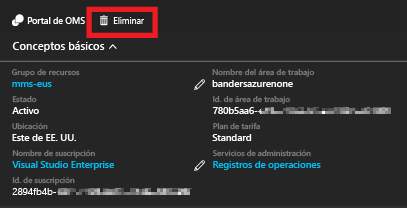
5. En el cuadro de diálogo de confirmación de la eliminación del área de trabajo, haga clic en **Sí**.

## Pasos siguientes
* Consulte [Conexión de equipos Windows a Log Analytics](log-analytics-windows-agents.md) para agregar agentes y recopilar información.
* [Incorporación de soluciones de Log Analytics desde la galería de soluciones](log-analytics-add-solutions.md) para agregar funcionalidad y recopilar información.
* [Configure proxy and firewall settings in Log Analytics](log-analytics-proxy-firewall.md) si la organización utiliza un servidor proxy o un firewall para que los agentes puedan comunicarse con el servicio Log Analytics.

