# <a name="configure-proxy-and-firewall-settings-in-log-analytics"></a>Configuración del proxy y del firewall (opcional) en Log Analytics
Las acciones necesarias para configurar el proxy y el firewall de Log Analytics en OMS son diferentes cuando usa Operations Manager y sus agentes y cuando usa los agentes de Microsoft Monitoring Agent que se conectan directamente a los servidores. Revise las secciones siguientes que correspondan al tipo de agente que usa.

## <a name="configure-proxy-and-firewall-settings-with-the-microsoft-monitoring-agent"></a>Configuración de los valores de proxy y firewall con Microsoft Monitoring Agent
Para que Microsoft Monitoring Agent se conecte al servicio de OMS y se registre con este, debe tener acceso al número de puerto de los dominios y a las direcciones URL. Si se usa un servidor proxy para realizar la comunicación entre el agente y el servicio de OMS, deberá asegurarse de que es posible tener acceso a los recursos adecuados. Si usa un firewall para restringir el acceso a Internet, deberá configurarlo para que permita el acceso a OMS. Las tablas siguientes muestran los puertos que necesita OMS.

| **Recurso del agente** | **Puertos** | **Omitir inspección de HTTPS** |
| --- | --- | --- |
| \*.ods.opinsights.azure.com |443 |yes |
| \*.oms.opinsights.azure.com |443 |Sí |
| \*blob.core.windows.net |443 |Sí |
| ods.systemcenteradvisor.com |443 | |

Puede utilizar el procedimiento siguiente para configurar el proxy para Microsoft Monitoring Agent mediante el Panel de Control. Deberá utilizar el procedimiento para cada servidor. Si tiene muchos servidores que necesite configurar, le resultará más fácil usar un script para automatizar este proceso. Puede utilizar el procedimiento siguiente para [configurar el proxy para Microsoft Monitoring Agent mediante el Panel de Control](#to-configure-proxy-settings-for-the-microsoft-monitoring-agent-using-a-script).

### <a name="to-configure-proxy-settings-for-the-microsoft-monitoring-agent-using-control-panel"></a>Para configurar el proxy para Microsoft Monitoring Agent mediante el Panel de control
1. Abra el **Panel de control**.
2. Abra **Microsoft Monitoring Agent**.
3. Haga clic en la pestaña **Configuración de proxy**.<br>  
   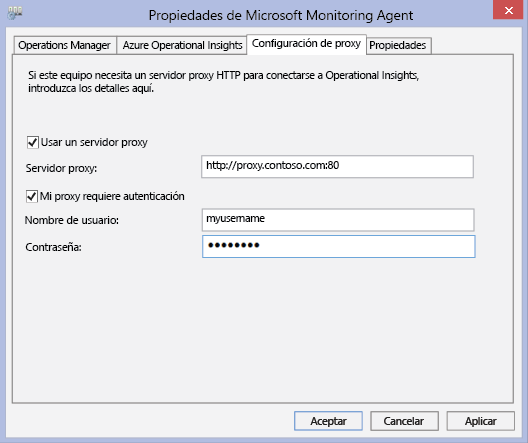
4. Seleccione **Usar un servidor proxy** y escriba la dirección URL y el número de puerto, si uno es necesario, de forma similar al ejemplo mostrado. Si el servidor proxy requiere autenticación, escriba el nombre de usuario y la contraseña para acceder al servidor proxy.

Use el procedimiento siguiente para crear un script de PowerShell que pueda ejecutar para establecer la configuración de proxy de cada agente que se conecta directamente a los servidores.

### <a name="to-configure-proxy-settings-for-the-microsoft-monitoring-agent-using-a-script"></a>configurar el proxy para Microsoft Monitoring Agent mediante el Panel de Control
Copie el ejemplo siguiente, actualícelo con la información específica para su entorno, guárdelo con una extensión de nombre de archivo PS1 y luego ejecute el script en cada equipo que se conecta directamente al servicio de OMS.

    param($ProxyDomainName="http://proxy.contoso.com:80", $cred=(Get-Credential))

    # First we get the Health Service configuration object.  We need to determine if we
    #have the right update rollup with the API we need.  If not, no need to run the rest of the script.
    $healthServiceSettings = New-Object -ComObject 'AgentConfigManager.MgmtSvcCfg'

    $proxyMethod = $healthServiceSettings | Get-Member -Name 'SetProxyInfo'

    if (!$proxyMethod)
    {
         Write-Output 'Health Service proxy API not present, will not update settings.'
         return
    }

    Write-Output "Clearing proxy settings."
    $healthServiceSettings.SetProxyInfo('', '', '')

    $ProxyUserName = $cred.username

    Write-Output "Setting proxy to $ProxyDomainName with proxy username $ProxyUserName."
    $healthServiceSettings.SetProxyInfo($ProxyDomainName, $ProxyUserName, $cred.GetNetworkCredential().password)


## <a name="configure-proxy-and-firewall-settings-with-operations-manager"></a>Configuración de proxy y firewall con Operations Manager
Para que el grupo de administración de Operations Manager se conecte al servicio de OMS y se registre con él, debe tener acceso al número de puerto de los dominios y las direcciones URL. Si se usa un servidor proxy para realizar la comunicación entre el servidor de administración de Operations Manager y el servicio de OMS, deberá asegurarse de que es posible tener acceso a los recursos adecuados. Si usa un firewall para restringir el acceso a Internet, deberá configurarlo para que permita el acceso a OMS. Aunque no haya un servidor de administración de Operations Manager detrás de un servidor proxy, es posible que se encuentren sus agentes. En este caso, el servidor proxy debe estar configurado de la misma manera que los agentes con el fin de habilitar y permitir que los datos de la solución Security and Log Management se envíen al servicio web de OMS.

Para que los agentes de Operations Manager se comuniquen con el servicio de OMS, la infraestructura de Operations Manager (incluidos los agentes) debe tener la versión y configuración de proxy correctas. La configuración de proxy para los agentes se especifica en la consola de Operations Manager. La versión debe ser una de las siguientes:

* Paquete acumulativo de actualizaciones 7 o posteriores de Operations Manager 2012 SP1
* Paquete acumulativo de actualizaciones 3 o posteriores de Operations Manager 2012 R2

Las tablas siguientes muestran los puertos relacionados con estas tareas.

> [!NOTE]
> Algunos de los siguientes recursos mencionan a Asesor y Visión operativa; ambos estaban en versiones anteriores de OMS. Sin embargo, los recursos enumerados cambiarán en el futuro.
> 
> 

A continuación se muestra una lista de puertos y recursos de agente:<br>

| **Recurso de agente** | **Puertos** |
| --- | --- |
| \*.ods.opinsights.azure.com |443 |
| \*.oms.opinsights.azure.com |443 |
| \*.blob.core.windows.net/\* |443 |
| ods.systemcenteradvisor.com |443 |

<br>
A continuación se muestra una lista de puertos y recursos del servidor de administración:<br>

| **Recurso del servidor de administración** | **Puertos** | **Omitir inspección de HTTPS** |
| --- | --- | --- |
| service.systemcenteradvisor.com |443 | |
| \*.service.opinsights.azure.com |443 | |
| \*blob.core.windows.net |443 |Sí |
| data.systemcenteradvisor.com |443 | |
| ods.systemcenteradvisor.com |443 | |
| \*.ods.opinsights.azure.com |443 |Sí |

<br>
A continuación se muestra una lista de puertos y recursos de la consola de Operations Manager y OMS.<br>

| **Recurso de la consola de Operations Manager y OMS** | **Puertos** |
| --- | --- |
| service.systemcenteradvisor.com |443 |
| \*.service.opinsights.azure.com |443 |
| \*.live.com |Puerto 80 y 443 |
| \*.microsoft.com |Puerto 80 y 443 |
| \*.microsoftonline.com |Puerto 80 y 443 |
| \*.mms.microsoft.com |Puerto 80 y 443 |
| login.windows.net |Puerto 80 y 443 |

<br>

Utilice los procedimientos siguientes para registrar el grupo de administración de Operations Manager con el servicio de OMS. Si tiene problemas de comunicación entre el grupo de administración y el servicio de OMS, use los procedimientos de validación para solucionar los problemas de transmisión de datos al servicio de OMS.

### <a name="to-request-exceptions-for-the-oms-service-endpoints"></a>Para solicitar excepciones para los puntos de conexión del servicio de OMS
1. Utilice la información de la primera tabla anteriormente presentada para asegurarse de que es posible tener acceso a los recursos necesarios para el servidor de administración de Operations Manager a través de cualquier firewall que pudiera tener.
2. Use la información de la segunda tabla anteriormente presentada para asegurarse de que es posible tener acceso a los recursos necesarios para la consola de operaciones de Operations Manager y OMS a través de cualquier firewall que pudiera tener.
3. Si usa un servidor proxy con Internet Explorer, asegúrese de que esté configurado y que funcione correctamente. Para comprobarlo, puede abrir una conexión web segura (HTTPS), por ejemplo [https://bing.com](https://bing.com). Si la conexión web segura no funciona en un explorador, probablemente no funcionará en la consola de administración de Operations Manager con los servicios web en la nube.

### <a name="to-configure-the-proxy-server-in-the-operations-manager-console"></a>Para configurar el servidor proxy en la consola de Operations Manager
1. Abra la consola de Operations Manager y seleccione el área de trabajo **Administración** .
2. Expanda **Operational Insights** y, a continuación, seleccione **Conexión de Operational Insights**.<br>  
    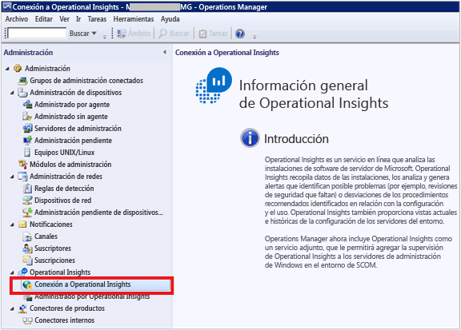
3. En la vista Conexión de OMS, haga clic en **Configurar servidor proxy**.<br>  
    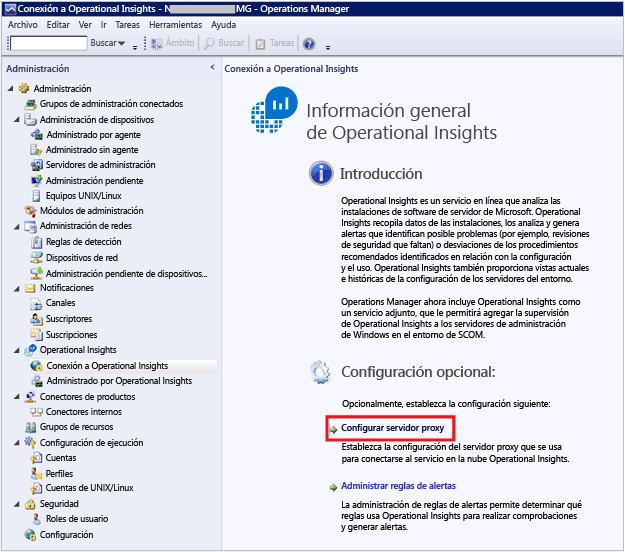
4. En el Asistente para configuración de Operational Insights: Servidor proxy, seleccione **Use un servidor proxy para acceder al servicio web Operational Insights** y, después, escriba la dirección URL con el número de puerto, por ejemplo, **http://myproxy:80**.<br>  
    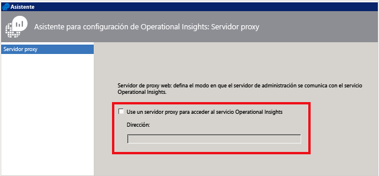

### <a name="to-specify-credentials-if-the-proxy-server-requires-authentication"></a>Para especificar las credenciales si el servidor proxy requiere autenticación
 La configuración y credenciales del servidor proxy deben propagarse a equipos administrados que enviarán un informe a OMS. Dichos servidores deben estar en el *Grupo de servidores de supervisión de Microsoft System Center Advisor*. Las credenciales se cifran en el registro de cada servidor del grupo.

1. Abra la consola de Operations Manager y seleccione el área de trabajo **Administración** .
2. En **RunAs Configuration**, seleccione **Perfiles**.
3. Abra el perfil de **proxy del perfil Ejecutar como de System Center Advisor** .  
    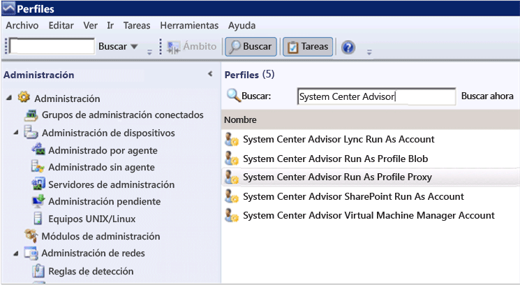
4. En el Asistente para crear perfiles de ejecución, haga clic en **Agregar** para usar una cuenta de ejecución. Puede crear una nueva cuenta de ejecución o usar una existente. Esta cuenta debe contar con los permisos suficientes para pasar a través del servidor proxy.  
    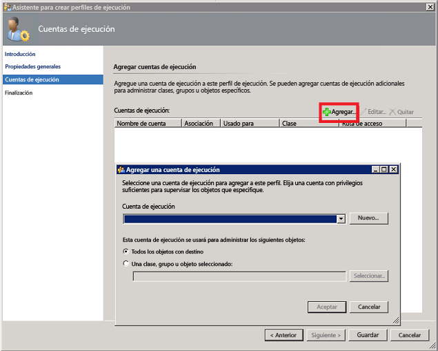
5. Para establecer la cuenta que se va a administrar, elija **una clase seleccionada, un grupo o un objeto** para abrir el cuadro de búsqueda de objetos.  
    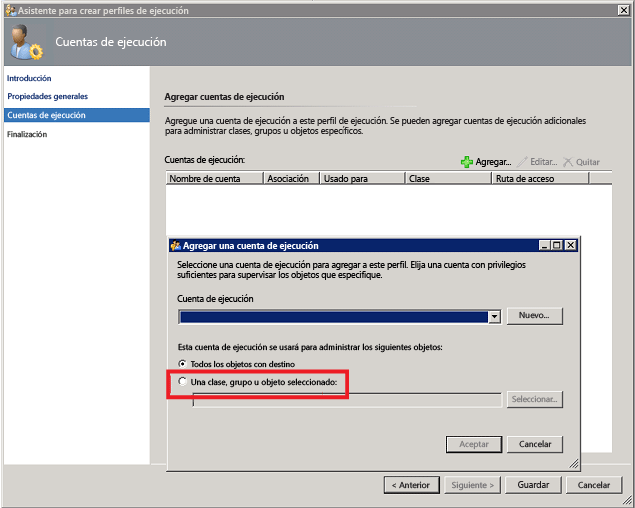
6. Busque y seleccione **Grupo de servidores de supervisión de Microsoft System Center Advisor**.  
    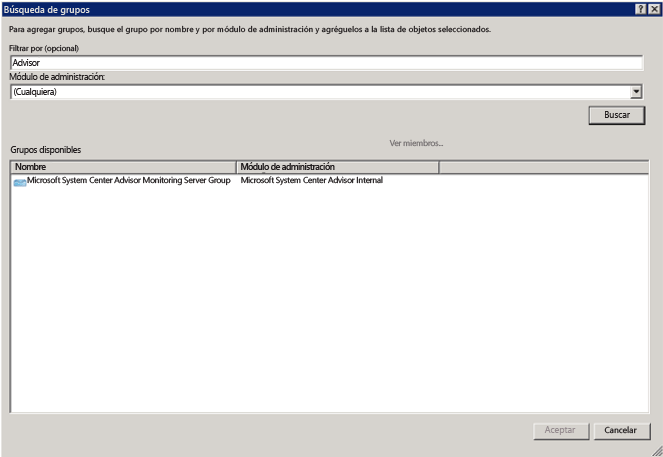
7. Haga clic en **Aceptar** para cerrar el cuadro Agregar una ejecución como cuenta.  
    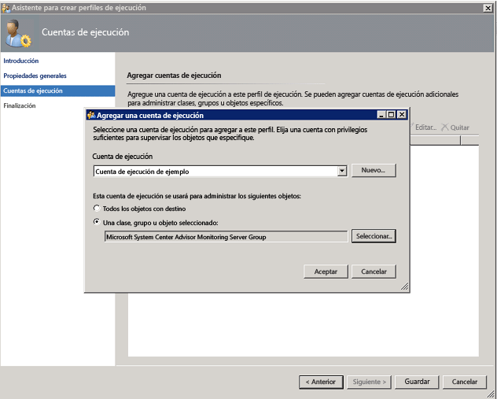
8. Complete el asistente y guarde los cambios.  
    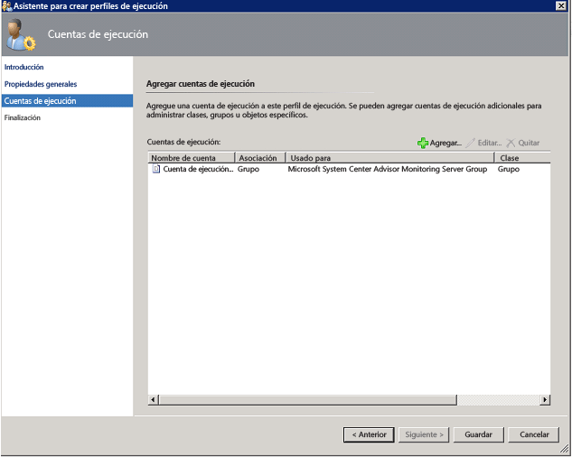

### <a name="to-validate-that-oms-management-packs-are-downloaded"></a>Para validar la descarga de los módulos de administración de OMS
Si ha agregado soluciones a OMS, puede verlas en la consola de Operations Manager como módulos de administración en **Administración**. Busque *System Center Advisor* para encontrarlos rápidamente.  
    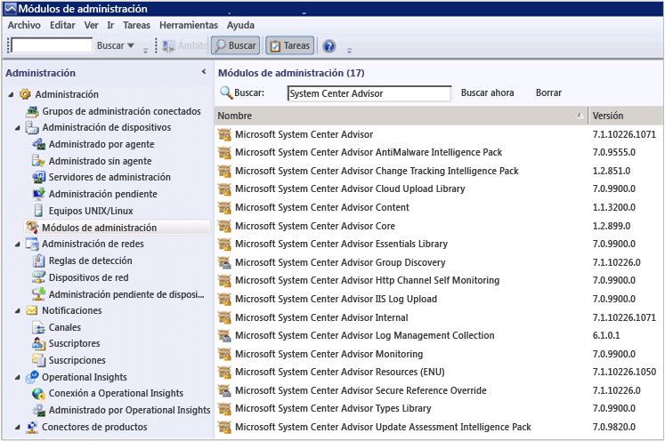 También puede comprobar los módulos de administración de OMS con el siguiente comando de Windows PowerShell en el servidor de administración de Operations Manager:

    ```
    Get-ScomManagementPack | where {$_.DisplayName -match 'Advisor'} | select Name,DisplayName,Version,KeyToken
    ```

### <a name="to-validate-that-operations-manager-is-sending-data-to-the-oms-service"></a>Para validar que Operations Manager envía datos al servicio de OMS
1. En el servidor de administración de Operations Manager, abra Monitor de rendimiento (perfmon.exe) y seleccione **Monitor de rendimiento**.
2. Haga clic en **Agregar** y, después, seleccione **Grupos de administración de servicio de mantenimiento**.
3. Agregue todos los contadores que comiencen por **HTTP**.  
    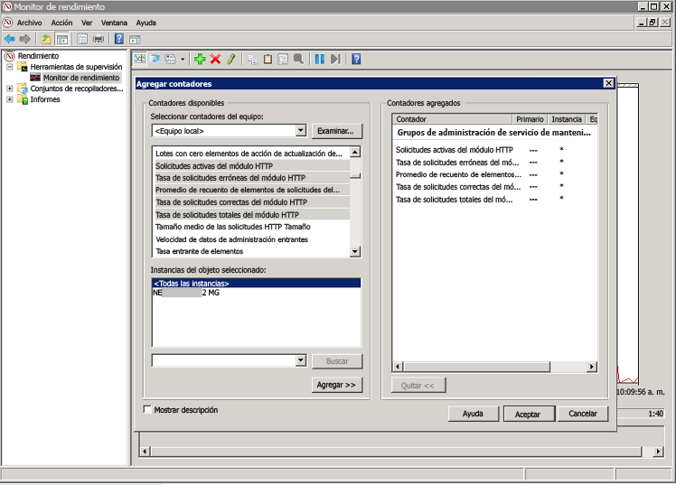
4. Si la configuración de Operations Manager es correcta, verá actividad en los contadores de eventos y otros elementos de datos de Administración de servicio de mantenimiento, según los módulos de administración que agregó en OMS y la directiva de recopilación de registros configurada.  
    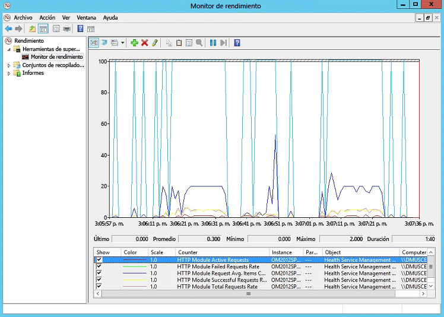

## <a name="next-steps"></a>Pasos siguientes
* [Incorporación de soluciones de Log Analytics desde la galería de soluciones](log-analytics-add-solutions.md) para agregar funcionalidad y recopilar información.
* Familiarícese con las [búsquedas de registros](log-analytics-log-searches.md) para ver información detallada recopilada por soluciones.

<!--HONumber=Oct16_HO2-->


