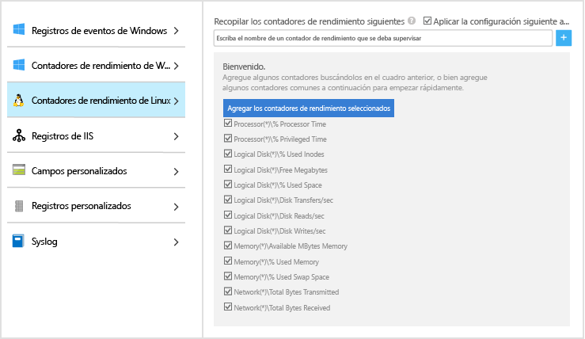
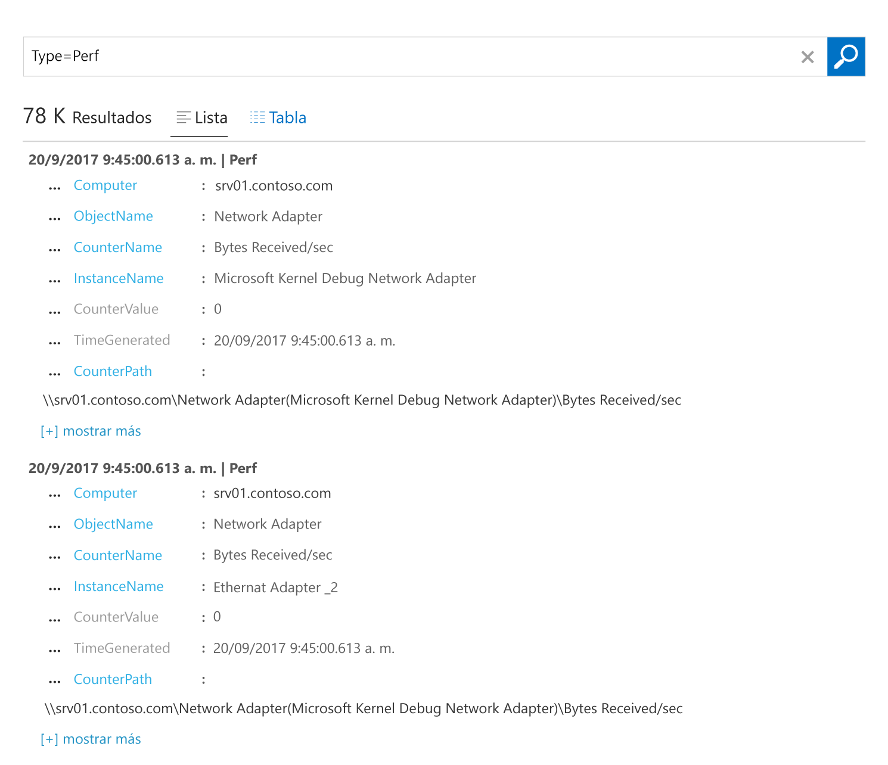

# Recopilación de datos acerca de máquinas virtuales de Azure
[Azure Log Analytics](log-analytics-overview.md) puede recopilar datos directamente de máquinas virtuales de Azure y otros recursos del entorno en un único repositorio para una correlación y análisis detallados.  Esta guía de inicio rápido muestra cómo configurar y recopilar datos de VM Linux o Windows en Azure con unos pasos sencillos.  
 
En esta guía de inicio rápido se da por supuesto que tiene una máquina virtual de Azure. De no ser así, puede [crear una VM Windows](../virtual-machines/windows/quick-create-portal.md) o [Linux](../virtual-machines/linux/quick-create-cli.md) con los pasos que se describen en nuestras guías de inicio rápido para VM.

## Iniciar sesión en Azure Portal
Inicie sesión en Azure Portal desde [https://portal.azure.com](https://portal.azure.com). 

## Crear un área de trabajo
1. En Azure Portal, haga clic en **Más servicios**, en la esquina inferior izquierda. En la lista de recursos, escriba **Log Analytics**. Cuando comience a escribir, la lista se filtrará en función de la entrada. Seleccione **Log Analytics**.     
2. Haga clic en **Crear** y, a continuación, seleccione opciones para los elementos siguientes:

  * Proporcione un nombre para la nueva **Área de trabajo de OMS**, como *DefaultLAWorkspace*. 
  * Seleccione una **suscripción** a la que vincularlo en la lista desplegable si la opción predeterminada seleccionada no es adecuada.
  * Para **Grupo de recursos**, seleccione un grupo de recursos existente que contenga una o más máquinas virtuales de Azure.  
  * Seleccione la **Ubicación** en que están implementadas las VM.  Para obtener más información, consulte en qué [regiones está disponible Log Analytics](https://azure.microsoft.com/regions/services/).
  * Puede elegir entre tres **planes de tarifa** diferentes en Log Analytics, pero, en este caso, seleccionaremos el plan **gratis**.  Para obtener más información sobre planes concretos, consulte los [detalles de precios de Log Analytics](https://azure.microsoft.com/pricing/details/log-analytics/).

           
3. Después de proporcionar la información necesaria en el panel **Área de trabajo de OMS**, haga clic en **Aceptar**.  

Mientras se comprueba la información y se crea el espacio de trabajo, puede realizar un seguimiento de su progreso en **Notificaciones** en el menú. 

## Habilitar la extensión de VM de Log Analytics
Para máquinas virtuales Windows y Linux ya implementadas en Azure, instale el agente de Log Analytics con la extensión de VM de Log Analytics.  El uso de una extensión simplifica el proceso de instalación y configura automáticamente el agente para enviar datos al área de trabajo de Log Analytics que especifique. El agente también se actualiza automáticamente, garantizando así que disponga de las características y correcciones más recientes.

Puede que el banner de la parte superior de la página del recurso de Log Analytics del portal le invite a actualizar.  La actualización no es necesaria para los fines de esta guía de inicio rápido. 

.    
1. En Azure Portal, haga clic en **Más servicios**, en la esquina inferior izquierda. En la lista de recursos, escriba **Log Analytics**. Cuando comience a escribir, la lista se filtrará en función de la entrada. Seleccione **Log Analytics**.
2. En la lista de áreas de trabajo de Log Analytics, seleccione *DefaultLAWorkspace* (creada antes).
3. En el menú izquierdo, en Orígenes de datos del área de trabajo, haga clic en **Máquinas virtuales**.  
4. En la lista de **Máquinas virtuales**, seleccione la máquina virtual en la que quiera instalar el agente. Tenga en cuenta que el **estado de la conexión de OMS** de la VM indica que **no está conectado**.
5. En los detalles de la máquina virtual, seleccione **Conectar**. El agente se instala y se configura automáticamente para el área de trabajo de Log Analytics. Este proceso tarda unos minutos, durante los que el **estado** indica que se está **conectando**.
6. Cuando el agente esté instalado y conectado, el estado de la **conexión de OMS** se actualizará con **This workspace** (Esta área de trabajo).

## Recopilación de datos de eventos y rendimiento
Log Analytics puede recopilar eventos de los registros de eventos de Windows o de Syslog de Linux, así como de los contadores de rendimiento que especifique para los informes y análisis a largo plazo, y actuar cuando se detecte una condición determinada.  Siga estos pasos para configurar la recopilación de eventos desde el registro del sistema de Windows y Syslog de Linux, así como desde varios contadores de rendimiento comunes, para empezar.  

### Recopilación de datos de VM Windows
1. Seleccione **Configuración avanzada**.    
3. Seleccione **Datos** y, a continuación, **Registros de eventos de Windows**.  
4. Para agregar un registro de eventos, escriba el nombre del registro.  Escriba **System** y, a continuación, haga clic en el signo más **+**.  
5. En la tabla, compruebe los niveles de gravedad **Error** y **Advertencia**.   
6. Haga clic en **Guardar** en la parte superior de la página para guardar la configuración.
7. Seleccione **Windows Performance Data** (Datos de rendimiento de Windows) para habilitar la recopilación de contadores de rendimiento en un equipo Windows. 
8. La primera vez que se configuran los contadores de rendimiento Windows para un área de trabajo de Log Analytics nueva, se ofrece la opción de crear rápidamente varios contadores comunes. Se muestran todos con una casilla junto a cada uno.  .  Haga clic en **Agregar los contadores de rendimiento seleccionados**.  Se agregan con el valor preestablecido de un intervalo de ejemplo de recopilación de diez segundos.  
9. Haga clic en **Guardar** en la parte superior de la página para guardar la configuración.

### Recopilación de datos de VM Linux

1. Seleccione **Syslog**.  
2. Para agregar un registro de eventos, escriba el nombre del registro.  Escriba **Syslog** y, a continuación, haga clic en el signo más **+**.  
3. En la tabla, desactive los niveles de gravedad **Información**, **Aviso** y **Depurar**. 
4. Haga clic en **Guardar** en la parte superior de la página para guardar la configuración.
5. Seleccione **Linux Performance Data** (Datos de rendimiento de Linux) para habilitar la recopilación de contadores de rendimiento en un equipo Windows. 
6. La primera vez que se configuran los contadores de rendimiento Linux para un área de trabajo de Log Analytics nueva, se ofrece la opción de crear rápidamente varios contadores comunes. Se muestran todos con una casilla junto a cada uno.  .  Haga clic en **Agregar los contadores de rendimiento seleccionados**.  Se agregan con el valor preestablecido de un intervalo de ejemplo de recopilación de diez segundos.  
7. Haga clic en **Guardar** en la parte superior de la página para guardar la configuración.

## Ver datos recopilados
Ahora que ya ha habilitado la recopilación de datos, vamos a ver un sencillo ejemplo de búsqueda de registros para consultar algunos datos de las VM de destino.  

1. En Azure Portal, vaya a Log Analytics y seleccione el área de trabajo que creó antes.
2. Haga clic en el icono **Búsqueda de registros**. A continuación, en el campo de consulta del panel Búsqueda de registros, escriba `Type=Perf` y presione Entrar o haga clic en el botón de búsqueda situado a la derecha del campo de consulta.    Por ejemplo, la consulta de la imagen siguiente devolvió 78.000 registros de rendimiento.  Sus resultados serán significativamente inferiores.  

## Limpieza de recursos
Cuando ya no la necesite, elimine el área de trabajo de Log Analytics. Para hacerlo, seleccione el área de trabajo de Log Analytics que creó antes y, en la página de recursos, haga clic en **Eliminar**.  

## Pasos siguientes
Ahora que recopila datos sobre el funcionamiento y el rendimiento de las máquinas virtuales Windows o Linux, le resultará muy fácil empezar a explorar y analizar los datos que se recopilan, además de tomar las medidas correspondientes a partir de estos. Todo ello, *de forma gratuita*.  

Para obtener información sobre cómo ver y analizar los datos, continúe con el tutorial.   

> [!div class="nextstepaction"]
> [Ver o analizar datos en Log Analytics](log-analytics-tutorial-viewdata.md)
