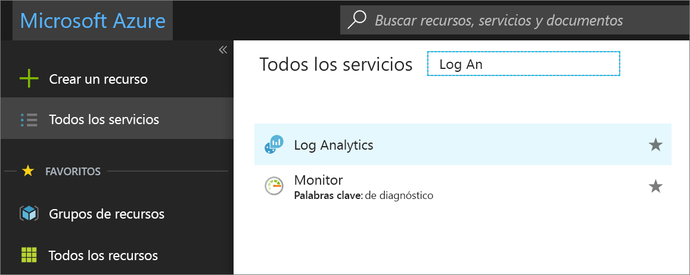
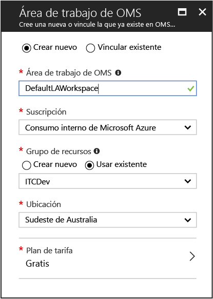
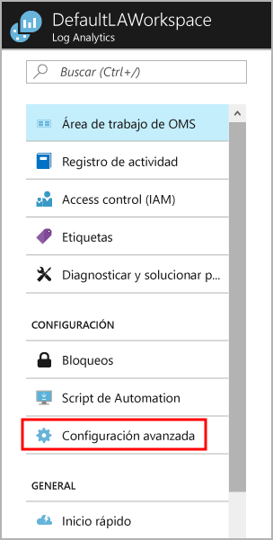
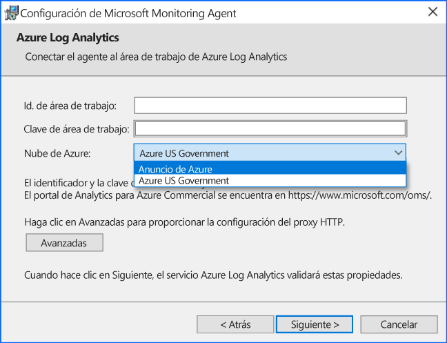
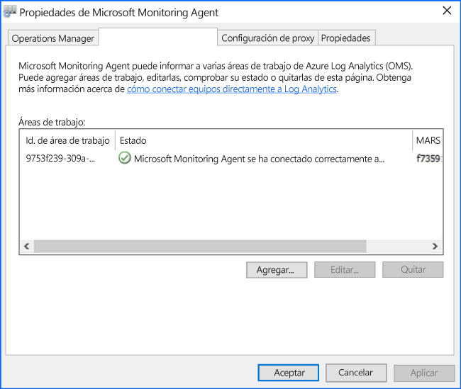
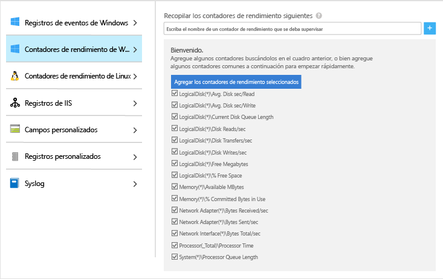
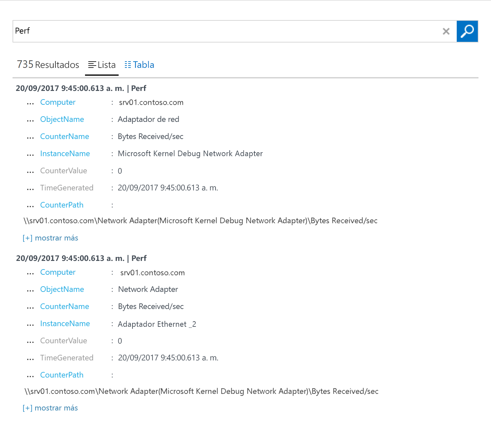
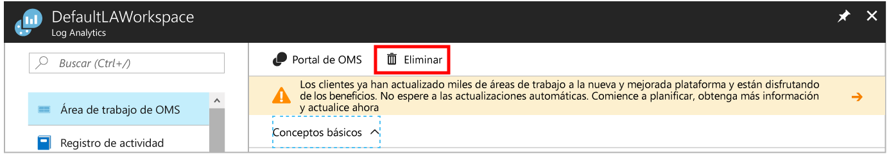

# Recopilación de datos de equipos Windows hospedados en el entorno
[Azure Log Analytics](log-analytics-overview.md) puede recopilar datos directamente de los equipos Windows físicos o virtuales y otros recursos del entorno en un único repositorio para una correlación y análisis detallados.  En esta guía de inicio rápido se muestra cómo configurar y recopilar datos de equipos Windows con unos pasos sencillos.  Para máquinas virtuales Windows de Azure, vea el tema [Recopilación de datos acerca de máquinas virtuales de Azure](log-analytics-quick-collect-azurevm.md).  

Para comprender los requisitos de la red y del sistema a fin de implementar el agente de Windows, vea [Collect data from your environment with Azure Log Analytics](log-analytics-concept-hybrid.md#prerequisites) (Recopilar datos de su entorno con Azure Log Analytics).
 
Si no tiene una suscripción a Azure, cree una [cuenta gratuita](https://azure.microsoft.com/free/?WT.mc_id=A261C142F) antes de empezar.

## Iniciar sesión en Azure Portal
Inicie sesión en Azure Portal desde [https://portal.azure.com](https://portal.azure.com). 

## Crear un área de trabajo
1. En Azure Portal, haga clic en **Más servicios**, en la esquina inferior izquierda. En la lista de recursos, escriba **Log Analytics**. Cuando comience a escribir, la lista se filtrará en función de la entrada. Seleccione **Log Analytics**.       
2. Haga clic en **Crear** y, a continuación, seleccione opciones para los elementos siguientes:

  * Proporcione un nombre para la nueva **Área de trabajo de OMS**, como *DefaultLAWorkspace*. 
  * Seleccione una **suscripción** a la que vincularlo en la lista desplegable si la opción predeterminada seleccionada no es adecuada.
  * Para **Grupo de recursos**, seleccione un grupo de recursos existente que contenga una o más máquinas virtuales de Azure.  
  * Seleccione la **Ubicación** en que están implementadas las VM.  Para obtener más información, consulte en qué [regiones está disponible Log Analytics](https://azure.microsoft.com/regions/services/).
  * Puede elegir entre tres **planes de tarifa** diferentes en Log Analytics, pero, en este caso, seleccionaremos el plan **gratis**.  Para obtener más información sobre planes concretos, consulte los [detalles de precios de Log Analytics](https://azure.microsoft.com/pricing/details/log-analytics/).

           
3. Después de proporcionar la información necesaria en el panel **Área de trabajo de OMS**, haga clic en **Aceptar**.  

Mientras se comprueba la información y se crea el espacio de trabajo, puede realizar un seguimiento de su progreso en **Notificaciones** en el menú. 

## Obtención de la clave y el identificador de área de trabajo
Antes de instalar Microsoft Monitoring Agent para Windows, necesita la clave y el identificador de área de trabajo para el área de trabajo de Log Analytics.  El asistente de configuración necesita esta información para configurar el agente de la forma adecuada y asegurarse de que puede comunicarse correctamente con Log Analytics.  

1. En Azure Portal, haga clic en **Más servicios**, en la esquina inferior izquierda. En la lista de recursos, escriba **Log Analytics**. Cuando comience a escribir, la lista se filtrará en función de la entrada. Seleccione **Log Analytics**.
2. En la lista de áreas de trabajo de Log Analytics, seleccione *DefaultLAWorkspace* (creada antes).
3. Seleccione **Configuración avanzada**.       
4. Seleccione **Orígenes conectados** y **Servidores Windows**.   
5. Encontrará los valores a la derecha de **Id. del área de trabajo** y **Clave principal**. Copie y pegue ambos valores en el editor que prefiera.   

## Instalación del agente para Windows
Los siguientes pasos permiten la instalación y configuración de Log Analytics en Azure y Azure Government Cloud mediante la configuración para Microsoft Monitoring Agent en su equipo.  

1. En la página **Servidores Windows**, seleccione la versión de **Descargar el agente de Windows** que descargar según la arquitectura del procesador del sistema operativo Windows.
2. Ejecute el programa de instalación para instalar al agente en el equipo.
2. En la página **principal**, haga clic en **Siguiente**.
3. En la página **Términos de licencia**, lea la licencia y haga clic en **Acepto**.
4. En la página e **Carpeta de destino**, cambie o mantenga la carpeta de instalación predeterminada y haga clic en **Siguiente**.
5. En la página **Opciones de instalación del agente**, elija la opción de conectar el agente a Azure Log Analytics (OMS) y, luego, haga clic en **Siguiente**.   
6. En la página **Azure Log Analytics**, realice lo siguiente:
   1. Pegue el **Id. del área de trabajo** y la **clave del área de trabajo (clave principal)** que copió anteriormente.  Si el equipo tiene que notificar a un área de trabajo de Log Analytics en Azure Government Cloud, seleccione **Azure Gobierno de EE.UU.** desde la lista desplegable **Azure Cloud**.  
   2. Si el equipo necesita comunicarse a través de un servidor proxy con el servicio de Log Analytics, haga clic en **Avanzado** y proporcione la dirección URL y el número de puerto del servidor proxy.  Si el servidor proxy requiere autenticación, escriba el nombre de usuario y la contraseña para autenticar con el servidor proxy y, luego, haga clic en **Siguiente**.  
7. Haga clic en **Siguiente** cuando haya terminado de proporcionar las opciones de configuración necesarias.     
8. En la página **Preparado para instalar**, revise las opciones seleccionadas y haga clic en **Instalar**.
9. En la página **La configuración finalizó correctamente**, haga clic en **Finalizar**.

Una vez completado el proceso, el **Agente de administración de Microsoft** aparece en el **Panel de control**. Puede revisar la configuración y comprobar que el agente esté conectado a Log Analytics. Cuando se conecta, en la pestaña **Azure Log Analytics (OMS)**, el agente muestra un mensaje similar al siguiente: **Microsoft Monitoring Agent se conectó correctamente al servicio Microsoft Operations Management Suite.**   

## Recopilación de datos de eventos y rendimiento
Log Analytics puede recopilar eventos de los registros de eventos de Windows, así como de los contadores de rendimiento que especifique para los informes y análisis a largo plazo, y actuar cuando se detecte una condición determinada.  Siga estos pasos para configurar la colección de eventos desde el Registro de eventos de Windows, así como desde varios contadores de rendimiento comunes, para empezar.  

1. En Azure Portal, haga clic en **Más servicios**, en la esquina inferior izquierda. En la lista de recursos, escriba **Log Analytics**. Cuando comience a escribir, la lista se filtrará en función de la entrada. Seleccione **Log Analytics**.
2. Seleccione **Configuración avanzada**.      
3. Seleccione **Datos** y, a continuación, **Registros de eventos de Windows**.  
4. Para agregar un registro de eventos, escriba el nombre del registro.  Escriba **System** y, a continuación, haga clic en el signo más **+**.  
5. En la tabla, compruebe los niveles de gravedad **Error** y **Advertencia**.   
6. Haga clic en **Guardar** en la parte superior de la página para guardar la configuración.
7. Seleccione **Windows Performance Data** (Datos de rendimiento de Windows) para habilitar la recopilación de contadores de rendimiento en un equipo Windows. 
8. La primera vez que se configuran los contadores de rendimiento Windows para un área de trabajo de Log Analytics nueva, se ofrece la opción de crear rápidamente varios contadores comunes. Se muestran todos con una casilla junto a cada uno.  .  Haga clic en **Agregar los contadores de rendimiento seleccionados**.  Se agregan con el valor preestablecido de un intervalo de ejemplo de recopilación de diez segundos.  
9. Haga clic en **Guardar** en la parte superior de la página para guardar la configuración.

## Ver datos recopilados
Ahora que ya ha habilitado la recopilación de datos, vamos a ver un sencillo ejemplo de búsqueda de registros para consultar algunos datos del equipo de destino.  

1. En Azure portal, en el área de trabajo seleccionada, haga clic en el icono **Búsqueda de registros**.  
2. En el panel Búsqueda de registros, en el campo de consulta, escriba `Perf` y presione Entrar o haga clic en el botón de búsqueda situado a la derecha del campo de consulta.      Por ejemplo, la consulta de la imagen siguiente ha devuelto 735 registros de rendimiento.   

## Limpieza de recursos
Cuando ya no lo necesite, puede quitar el agente del equipo Windows y eliminar el área de trabajo de Log Analytics.  

Para eliminar el agente, realice los pasos siguientes.

1. Abra el **Panel de control**.
2. Abra **Programas y características**.
3. En **Programas y características**, seleccione **Microsoft Monitoring Agent** y haga clic en **Desinstalar**.

Para eliminar el área de trabajo, seleccione el área de trabajo de Log Analytics que ha creado anteriormente y, en la página de recursos, haga clic en **Eliminar**.   

## pasos siguientes
Ahora que ya recopila datos sobre el funcionamiento y el rendimiento del equipo Linux local, le resultará muy fácil empezar a explorar y analizar los datos que se recopilan, además de tomar las medidas correspondientes a partir de estos. Todo ello, *de forma gratuita*.  

Para obtener información sobre cómo ver y analizar los datos, continúe con el tutorial.   

> [!div class="nextstepaction"]
> [Ver o analizar datos en Log Analytics](log-analytics-tutorial-viewdata.md)
