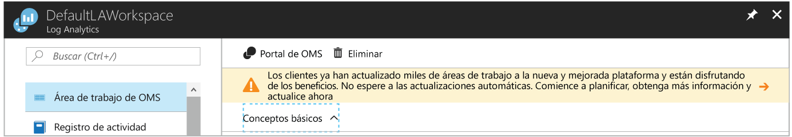

# <a name="view-or-analyze-data-collected-with-log-analytics-log-search"></a>Visualización o análisis de los datos recopilados con la búsqueda de registros de Log Analytics

En Log Analytics, puede aprovechar las búsquedas de registros mediante la creación de consultas para analizar los datos recopilados y usar los paneles preexistentes que puede personalizar mediante vistas gráficas de las búsquedas más valiosas.  Ahora que ha definido la recopilación de datos operativos de los registros de actividad y máquinas virtuales de Azure, en este tutorial aprenderá a cómo realizar las siguientes tareas:

> [!div class="checklist"]
> * Actualizar el recurso de Azure Log Analytics para el nuevo lenguaje de consulta 
> * Realizar una búsqueda simple de datos de eventos y usar características para modificar y filtrar los resultados 
> * Conocer cómo trabajar con datos de rendimiento

Para completar el ejemplo en este tutorial, debe disponer de una máquina virtual existente [conectada al área de trabajo de Log Analytics](log-analytics-quick-collect-azurevm.md).  

La creación y edición de consultas, además de trabajar de manera interactiva con los datos devueltos, se puede lograr de una de estas dos maneras.  En el caso de las consultas básicas, use la página Búsqueda de registros de Azure Portal. Para las consultas avanzadas, puede usar el portal de análisis avanzado. Para más información sobre la diferencia de funcionalidades entre ambos portales, consulte [Portales para la creación y edición de consultas de registros en Azure Log Analytics](log-analytics-log-search-portals.md)

En este tutorial se usará Búsqueda de registros en Azure Portal. 

## <a name="log-in-to-azure-portal"></a>Iniciar sesión en Azure Portal
Inicie sesión en Azure Portal desde [https://portal.azure.com](https://portal.azure.com). 

## <a name="open-the-log-search-portal"></a>Abrir el portal de búsqueda de registros 
En primer lugar, abra el portal de búsqueda de registros.   

1. En Azure Portal, haga clic en **Más servicios**, en la esquina inferior izquierda. En la lista de recursos, escriba **Log Analytics**. Cuando comience a escribir, la lista se filtrará en función de la entrada. Seleccione **Log Analytics**.
2. En el panel de suscripciones de Log Analytics, seleccione un área de trabajo y, a continuación, seleccione el icono **Búsqueda de registros**.<br>  (Búsqueda de registros)

Puede que el banner de la parte superior de la página del recurso de Log Analytics del portal le invite a actualizar.<br> 

Log Analytics introdujo recientemente un nuevo lenguaje de consulta que facilita la creación de consultas, la correlación de datos desde varios orígenes y el análisis para identificación rápida de tendencias o problemas.

La actualización es simple.  Para iniciar el proceso, haga clic en el banner en el que se lee **Obtenga más información y actualice**.  Lea la información adicional sobre la actualización en la página de información de la actualización y, después, haga clic en **Actualizar ahora**.

Este proceso tardará varios minutos en completarse y, durante este período, puede realizar el seguimiento de su progreso en **Notificaciones** en el menú. Puede obtener más información sobre las [ventajas del nuevo lenguaje de consulta](log-analytics-log-search-upgrade.md#why-the-new-language).

## <a name="create-a-simple-search"></a>Creación de una búsqueda simple
La forma más rápida de recuperar algunos datos con los que trabajar es con una consulta simple que devuelve todos los registros en una tabla.  Si tiene clientes de Windows o Linux conectados al área de trabajo, tendrá datos en las tablas Event (Windows) o Syslog (Linux).

Escriba una de las consultas siguientes en el cuadro de búsqueda y haga clic en el botón de búsqueda.  

```
Event
```
```
Syslog
```

Se devuelven los datos en la vista de lista predeterminada y puede ver el número total de registros que se han devuelto.


Se muestran solo las primeras propiedades de cada registro.  Haga clic en **Mostrar más** para ver todas las propiedades de un registro concreto.

## <a name="filter-results-of-the-query"></a>Filtrado de los resultados de la consulta
En el lado izquierdo de la pantalla está el panel de filtros que le permite agregar filtros a la consulta sin necesidad de modificarla directamente.  Se muestran varias propiedades de registro para ese tipo de registro y puede seleccionar uno o más valores de propiedad para restringir los resultados de búsqueda.

Si está trabajando con **Event**, active la casilla junto a **Error** en **EVENTLEVELNAME**.   Si está trabajando con **Syslog**, active la casilla junto a **Error** en **SEVERITYLEVEL**.  Esto cambia la consulta a una de las siguientes para limitar los resultados a los eventos de error.

```
Event | where (EventLevelName == "Error")
```
```
Syslog | where (SeverityLevel == "err")
```


Agregue propiedades al panel de filtros seleccionando **Agregar a filtros** en el menú de propiedades de uno de los registros.


Puede establecer el mismo filtro seleccionando **Filtrar** desde el menú de propiedades de un registro con el valor que desea filtrar.  

Solo aquellas propiedades que tienen el nombre en azul tienen la opción **Filtrar** cuando mantiene el puntero sobre ellas.  Se trata de campos que permiten *búsquedas* que se indexan para las condiciones de búsqueda.  Los campos en gris son campos que *permiten realizar búsquedas de texto libre* que solo tienen la opción **Mostrar referencias**.  Esta opción devuelve los registros que contienen ese valor en cualquier propiedad.

Puede agrupar los resultados de una sola propiedad seleccionando la opción **Agrupar por** en el menú de registro.  Esto agregará un operador [summarize](https://docs.loganalytics.io/docs/Language-Reference/Tabular-operators/summarize-operator) a la consulta que muestra los resultados en un gráfico.  Puede agrupar por más de una propiedad, pero deberá editar la consulta directamente.  Seleccione el menú de registro situado junto a la propiedad **Computer** y seleccione **Agrupar por "Computer"**.  


## <a name="work-with-results"></a>Trabajo con resultados
El portal de búsqueda de registros tiene una variedad de características para trabajar con los resultados de una consulta.  Puede ordenar, filtrar y agrupar los resultados para analizar los datos sin modificar la consulta real.  Los resultados de una consulta no se ordenan de forma predeterminada.

Para ver los datos en un formato de tabla que proporciona opciones adicionales para filtrar y ordenar, haga clic en **Tabla**.  


Haga clic en la flecha junto a un registro para ver los detalles de ese registro.


Ordene cualquier campo haciendo clic en el encabezado de la columna.


Filtre los resultados en un valor específico de la columna haciendo clic en el botón de filtro y proporcionando una condición de filtro.


Agrupe por una columna arrastrando el encabezado a la parte superior de los resultados.  Puede agrupar por varios campos arrastrando varias columnas a la parte superior.


## <a name="work-with-performance-data"></a>Trabajo con datos de rendimiento
Los datos de rendimiento de los agentes de Windows y Linux se almacenan en el área de trabajo de Log Analytics en la tabla **Perf**.  Los registros de rendimiento tienen la misma apariencia que cualquier otro registro y vamos a escribir una consulta sencilla que devuelva todos los datos de rendimiento igual que se hace con los eventos.

```
Perf
```


La devolución de millones de registros para todos los objetos y contadores de rendimiento no resulta muy útil.  Puede usar los mismos métodos empleados anteriormente para filtrar los datos o simplemente escribir la siguiente consulta directamente en el cuadro de búsqueda de registros.  Esta devolverá únicamente los registros de utilización del procesador para los equipos con Windows y Linux.

```
Perf | where (ObjectName == "Processor")  | where (CounterName == "% Processor Time")
```


Esto limita los datos a un contador determinado, pero aún no están en un formato que resulte especialmente útil.  Puede mostrar los datos en un gráfico de líneas, pero primero debe agruparlos por las propiedades Computer y TimeGenerated.  Para agrupar por varios campos, debe modificar la consulta directamente, así que modifíquela de la siguiente manera.  Esta utiliza la función [avg](https://docs.loganalytics.io/docs/Language-Reference/Aggregation-functions/avg()) de la propiedad **CounterValue** para calcular el valor medio durante cada hora.

```
Perf  | where (ObjectName == "Processor")  | where (CounterName == "% Processor Time") | summarize avg(CounterValue) by Computer, TimeGenerated
```


Ahora que los datos están agrupados adecuadamente, puede mostrarlos en un gráfico visual agregando el operador [render](https://docs.loganalytics.io/docs/Language-Reference/Tabular-operators/render-operator).  

```
Perf  | where (ObjectName == "Processor")  | where (CounterName == "% Processor Time") | summarize avg(CounterValue) by Computer, TimeGenerated | render timechart
```


## <a name="next-steps"></a>Pasos siguientes
En este tutorial ha aprendido a crear búsquedas de registros básicas para analizar datos de eventos y rendimiento.  Vaya al siguiente tutorial para saber cómo visualizar los datos mediante la creación de un panel.

> [!div class="nextstepaction"]
> [Creación y uso compartido de paneles de Log Analytics](log-analytics-tutorial-dashboards.md)