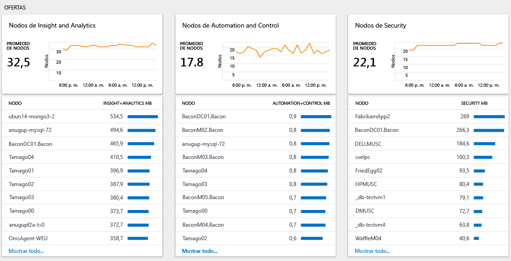

# Análisis del uso de datos en Log Analytics
Log Analytics incluye información sobre la cantidad de datos recopilados, qué equipos envían los datos y los diferentes tipos de datos enviados.  Use el panel **Uso de Log Analytics** para ver la cantidad de datos enviados al servicio Log Analytics. El panel muestra la cantidad de datos que recopila cada solución y cuántos datos envían los equipos.

## Comprender el panel Uso
El panel **Uso de Log Analytics** muestra la siguiente información:

- Volumen de datos
    - Data volume over time (Volumen de datos con el tiempo), en función del ámbito temporal actual
    - Data volume by solution (Volumen de datos por solución)
    - Data not associated with a computer (Datos no asociados a un equipo)
- Equipos
    - Computers sending data (Equipos que envían datos)
    - Computers with no data in last 24 hours (Equipos sin datos en las últimas 24 horas)
- Offerings (Ofertas)
    - Insight and Analytics nodes (Nodos Insight y Analytics)
    - Automation and Control nodes (Nodos Automation y Control)
    - Security nodes (Nodos de seguridad)
- Rendimiento
    - Time taken to collect and index data (Tiempo dedicado a recopilar e indexar datos)
- Lista de consultas

### Para trabajar con datos de uso, siga estos pasos:
1. Si aún no lo ha hecho, inicie sesión en [Azure Portal](https://portal.azure.com) mediante su suscripción de Azure.
2. En el menú **central**, haga clic en **Más servicios** y, en la lista de recursos, escriba **Log Analytics**. Cuando comience a escribir, la lista se filtrará en función de la entrada. Haga clic en **Log Analytics**.  
    
3. El panel **Log Analytics** muestra una lista de las áreas de trabajo. Seleccione un área de trabajo.
4. En el panel del *área de trabajo*, haga clic en **Uso de Log Analytics**.
5. En el panel **Uso de Log Analytics**, haga clic en **Tiempo: Últimas 24 horas** para cambiar el intervalo de tiempo.  
    
6. Vea las hojas de categoría de uso que muestren áreas que le interesen. Elija una hoja y haga clic en un elemento en ella para ver más detalles en [Búsqueda de registros](log-analytics-log-searches.md).  
    
7. En el panel Búsqueda de registros, revise los resultados devueltos por la búsqueda.  
    

## Creación de una alerta cuando la colección de datos es mayor de lo esperado
En esta sección se describe cómo crear una alerta si:
- El volumen de datos supera una cantidad especificada.
- Se prevé que el volumen de datos supere un importe especificado.

Las [alertas](log-analytics-alerts-creating.md) de Log Analytics utilizan consultas de búsqueda. La consulta siguiente produce un resultado cuando hay más de 100 GB de datos recopilados en las últimas 24 horas:

`Type=Usage QuantityUnit=MBytes IsBillable=true | measure sum(div(Quantity,1024)) as DataGB by Type | where DataGB > 100`

La consulta siguiente utiliza una fórmula simple para predecir cuándo se enviarán más de 100 GB de datos en un día: 

`Type=Usage QuantityUnit=MBytes IsBillable=true | measure sum(div(mul(Quantity,8),1024)) as EstimatedGB by Type | where EstimatedGB > 100`

Para generar una alerta en un volumen de datos diferente, cambie el 100 de las consultas por el número de GB sobre el que desea alertar.

Siga los pasos explicados en [Crear una regla de alerta](log-analytics-alerts-creating.md#create-an-alert-rule) para recibir una notificación cuando la colección de datos sea mayor de lo previsto.

Al crear la alerta en la primera consulta; cuando hay más de 100 GB de datos en 24 horas, establezca los siguientes valores:
- **Nombre** en *Volumen de datos mayor que 100 GB en 24 horas*
- **Gravedad** en *Advertencia*
- **Consulta de búsqueda** en `Type=Usage QuantityUnit=MBytes IsBillable=true | measure sum(div(Quantity,1024)) as DataGB by Type | where DataGB > 100`
- **Ventana de tiempo** en *24 horas*.
- **Frecuencia de la alerta** para que sea una hora, ya que los datos de uso solo se actualizan una vez a la hora.
- **Generar alerta según** para que sea *número de resultados*
- **Número de resultados** para que sea *Mayor que 0*

Siga los pasos explicados en [Agregar acciones a reglas de alerta](log-analytics-alerts-actions.md) para configurar una acción de correo electrónico, webhook o runbook para la regla de alerta.

Al crear la alerta para la segunda consulta; cuando se prevé que va a haber más de 100 GB de datos en 24 horas, establezca los siguientes valores:
- **Nombre** en *Volumen de datos que se espera que sea mayor que 100 GB en 24 horas*
- **Gravedad** en *Advertencia*
- **Consulta de búsqueda** en `Type=Usage QuantityUnit=MBytes IsBillable=true | measure sum(div(mul(Quantity,8),1024)) as EstimatedGB by Type | where EstimatedGB > 100`
- **Ventana de tiempo** en *3 horas*.
- **Frecuencia de la alerta** para que sea una hora, ya que los datos de uso solo se actualizan una vez a la hora.
- **Generar alerta según** para que sea *número de resultados*
- **Número de resultados** para que sea *Mayor que 0*

Cuando se recibe una alerta, siga los pasos de la sección siguiente para solucionar el problema del uso mayor de lo esperado.

## Solución del problema de un uso mayor de lo esperado
El panel de uso le ayuda a identificar por qué el uso (y, por tanto, el costo) es mayor del previsto.

Un mayor uso está provocado por una de estas causas o por ambas:
- Más datos de lo esperado enviados a Log Analytics
- Más nodos de lo previsto que envían datos a Log Analytics

### Compruebe si hay más datos de lo esperado 
Hay dos secciones fundamentales de la página de uso que ayudan a identificar qué es lo que está causando la recopilación de la mayoría de los datos.

El gráfico *Volumen de datos con el tiempo* muestra el volumen total de los datos enviados y los equipos que envían la mayor cantidad de datos. El gráfico de la parte superior permite ver si aumenta el uso de datos general, si permanece constante o disminuye. La lista de equipos muestra los 10 equipos que envían la mayoría de los datos.

El gráfico *Volumen de datos por solución* muestra el volumen de datos que se envía con cada solución y las soluciones que envían la mayoría de los datos. El gráfico de la parte superior muestra el volumen total de datos enviados por cada solución a lo largo del tiempo. Esta información le permite identificar si una solución envía más datos, más o menos la misma cantidad de datos, o menos datos a lo largo del tiempo. La lista de soluciones muestra las 10 soluciones que envían la mayoría de los datos. 

Estos dos gráficos muestran todos los datos. Algunos datos son facturables, mientras que otros son gratis. Para centrarse solo en los datos facturables, modifique la consulta en la página de búsqueda para incluir `IsBillable=true`.  

Eche un vistazo al gráfico *Volumen de datos con el tiempo*. Para ver las soluciones y los tipos de datos que envían la mayoría de los datos a un equipo específico, haga clic en el nombre del equipo. Haga clic en el nombre del primer equipo de la lista.

En la captura de pantalla siguiente, el tipo de datos *Log Management / Perf* envía la mayoría de los datos al equipo. 

Ahora, vuelva al panel *Uso* y mire el gráfico *Volumen de datos por solución*. Para ver los equipos que envían la mayoría de los datos a una solución, haga clic en el nombre de la solución en la lista. Haga clic en el nombre de la primera solución de la lista. 

En la captura de pantalla siguiente, se confirma que el equipo *acmetomcat* envía la mayoría de los datos a la solución de administración de registros.

Si es necesario, realice análisis adicionales para identificar grandes volúmenes dentro de una solución o tipo de datos. Entre las consultas de ejemplo se incluyen:

+ Solución **Security**
  - `Type=SecurityEvent | measure count() by EventID`
+ Solución **Log Management**
  - `Type=Usage Solution=LogManagement IsBillable=true | measure count() by DataType`
+ Tipo de datos **Perf**
  - `Type=Perf | measure count() by CounterPath`
  - `Type=Perf | measure count() by CounterName`
+ Tipo de datos **Event**
  - `Type=Event | measure count() by EventID`
  - `Type=Event | measure count() by EventLog, EventLevelName`
+ Tipo de datos **Syslog**
  - `Type=Syslog | measure count() by Facility, SeverityLevel`
  - `Type=Syslog | measure count() by ProcessName`
+ Tipo de datos de **AzureDiagnostics**
  - `Type=AzureDiagnostics | measure count() by ResourceProvider, ResourceId`

Use los pasos siguientes para reducir el volumen de registros recopilados:

| Origen del mayor volumen de datos | Cómo reducir el volumen de datos |
| -------------------------- | ------------------------- |
| Eventos de seguridad            | Seleccione los [eventos de seguridad común o mínima](https://blogs.technet.microsoft.com/msoms/2016/11/08/filter-the-security-events-the-oms-security-collects/).   Cambie la directiva de auditoría de seguridad para recopilar únicamente los eventos necesarios. En particular, revise la necesidad de recopilar eventos para   - [auditar plataforma de filtrado](https://technet.microsoft.com/library/dd772749(WS.10).aspx)   - [auditar registro](https://docs.microsoft.com/windows/device-security/auditing/audit-registry)  - [auditar sistema de archivos](https://docs.microsoft.com/windows/device-security/auditing/audit-file-system)  - [auditar objeto de kernel](https://docs.microsoft.com/windows/device-security/auditing/audit-kernel-object)  - [auditar manipulación de identificadores](https://docs.microsoft.com/windows/device-security/auditing/audit-handle-manipulation)  - [auditar almacenamiento extraíble](https://docs.microsoft.com/windows/device-security/auditing/audit-removable-storage) |
| contadores de rendimiento       | Cambie la [configuración de los contadores de rendimiento](log-analytics-data-sources-performance-counters.md) para:   - Reducir la frecuencia de la colección   - Reducir el número de contadores de rendimiento |
| Registros de eventos                 | Cambie la [configuración del registro de eventos](log-analytics-data-sources-windows-events.md) para:   - Reducir el número de registros de eventos recopilados   - Recopilar solo los niveles de eventos necesarios Por ejemplo, no recopile eventos de nivel de *información*. |
| syslog                     | Cambie la [configuración de syslog](log-analytics-data-sources-syslog.md) para:   - Reducir el número de instalaciones recopiladas   - Recopilar solo los niveles de eventos necesarios Por ejemplo, no recopile eventos de nivel de *información* y *depuración*. |
| AzureDiagnostics           | Cambie la colección de registros de recursos para:   - Reducir el número de registros de recursos enviados a Log Analytics   - Recopilar solo los registros necesarios |
| Datos de la solución procedentes de equipos que no necesitan la solución | Use la [selección de destino de solución](../operations-management-suite/operations-management-suite-solution-targeting.md) para recopilar datos solo de los grupos de equipos necesarios. |

### Comprobar si hay más nodos de lo esperado
Si está en el plan de tarifa *por nodo (OMS)*, se le cobra según el número de nodos y soluciones que utilice. Puede ver cuántos nodos de cada oferta se usan en la sección de *ofertas* del panel de uso.

Haga clic en **Ver todos...**  para ver la lista completa de los equipos que envían datos a la oferta seleccionada.

Use la [selección de destino de solución](../operations-management-suite/operations-management-suite-solution-targeting.md) para recopilar datos solo de los grupos de equipos necesarios.

## Pasos siguientes
* Consulte [Búsquedas de registro en Log Analytics](log-analytics-log-searches.md) para obtener información sobre cómo usar el lenguaje de búsqueda. Puede utilizar las consultas de búsqueda para realizar análisis adicionales sobre los datos de uso.
* Siga los pasos explicados en [Crear una regla de alerta](log-analytics-alerts-creating.md#create-an-alert-rule) para recibir una notificación cuando se cumplan los criterios de búsqueda.
* Use la [selección de destino de solución](../operations-management-suite/operations-management-suite-solution-targeting.md) para recopilar datos solo de los grupos de equipos necesarios.
* Seleccione los [eventos de seguridad común o mínima](https://blogs.technet.microsoft.com/msoms/2016/11/08/filter-the-security-events-the-oms-security-collects/).
* Cambie la [configuración de los contadores de rendimiento](log-analytics-data-sources-performance-counters.md).
* Cambie la [configuración del registro de eventos](log-analytics-data-sources-windows-events.md).
* Cambie la [configuración de syslog](log-analytics-data-sources-syslog.md).
