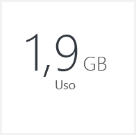
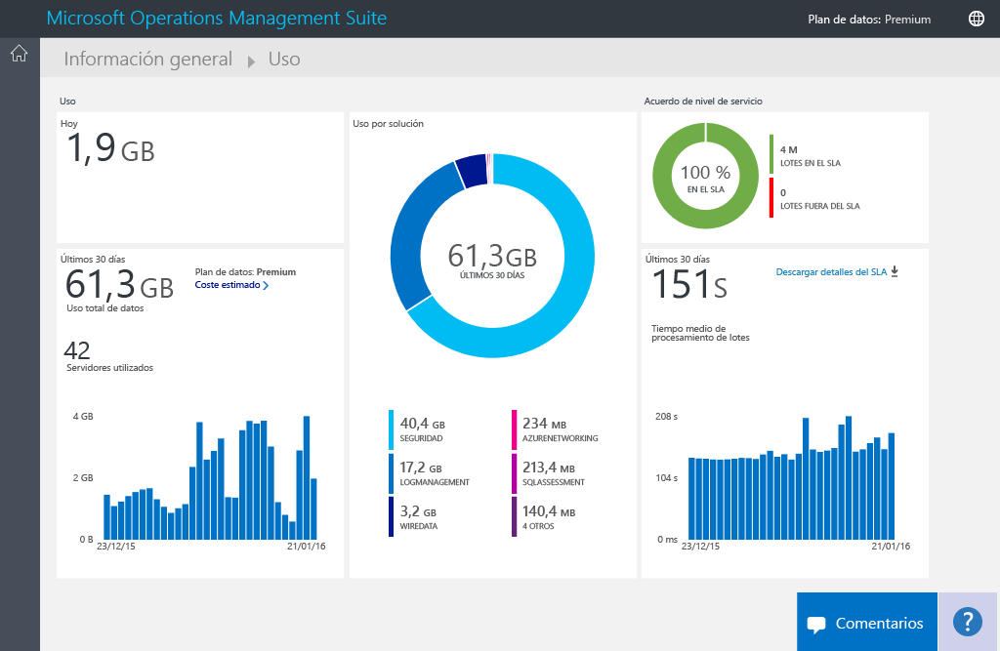
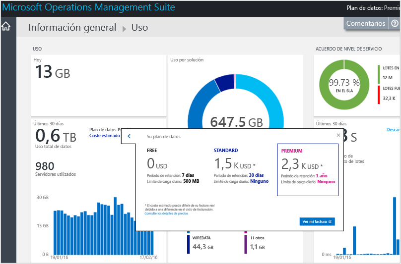
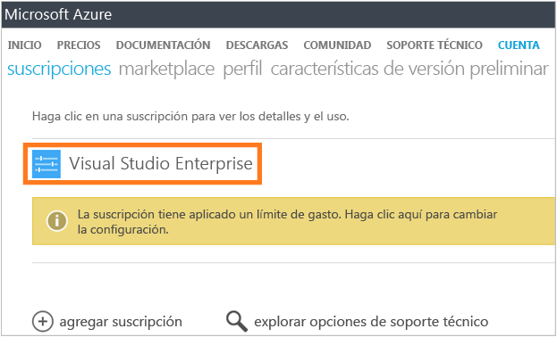
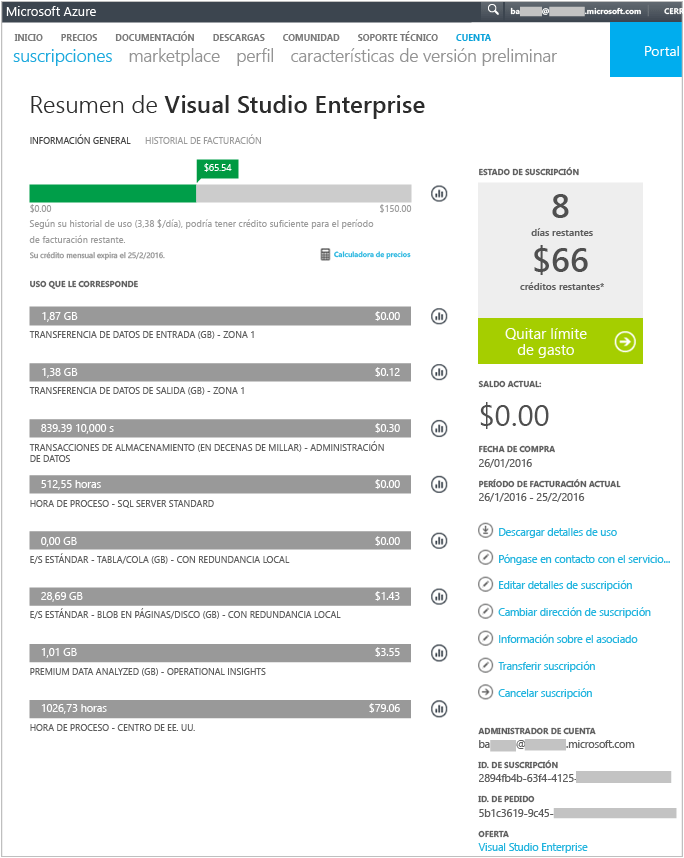
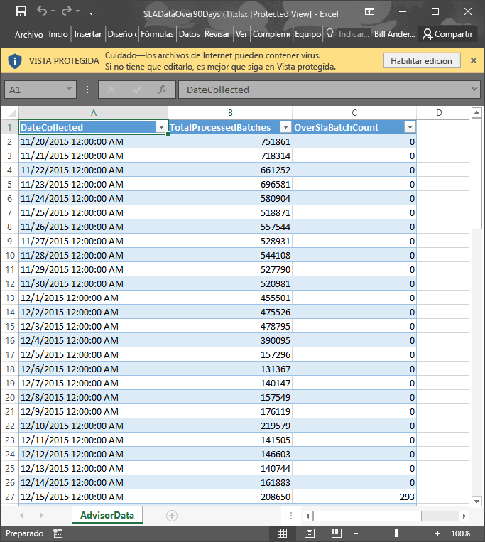

# Análisis del uso de datos en Log Analytics
Log Analytics en Operations Management Suite (OMS) recopila datos y los envía al servicio de OMS periódicamente.  Puede emplear la página **Uso** para ver la cantidad de datos que se envían al servicio de OMS. La página **Uso** muestra también el número de datos que envían diariamente las soluciones y la frecuencia con que los servidores envían datos.

> [!NOTE]
> Si tiene una cuenta gratuita creada mediante el [sitio web de OMS](http://www.microsoft.com/oms), dispone de un límite diario de 500 MB de datos de envío al servicio de OMS. Si alcanza este límite diario, el análisis de los datos se detendrá y se reanudará al inicio del día siguiente. También deberá volver a enviar aquellos datos que OMS no haya aceptado o procesado.
> 
> 

El uso se puede ver mediante el icono **Uso** del panel **Información general** de OMS.

Si ha superado su límite de uso diario, o está cerca del límite, tiene la posibilidad de quitar una solución para reducir la cantidad de datos que envía al servicio de OMS. Para obtener más información sobre como quitar soluciones, consulte [Add Log Analytics solutions from the Solutions Gallery](log-analytics-add-solutions.md)(Incorporación de soluciones de Log Analytics desde la galería de soluciones).

La página **Uso** muestra la siguiente información:

* Uso medio por día
* Uso de datos para cada solución durante los últimos 30 días
* ¿Cuántos datos envían los servidores en su entorno al servicio de OMS durante los últimos 30 días?
* Su plan de tarifa del plan de datos y costo estimado
* Información sobre el Acuerdo de Nivel de Servicio, incluida la cantidad de tiempo que OMS tarda en procesar los datos

## Para trabajar con datos de uso, siga estos pasos:
1. En la página **Información general**, haga clic en el icono **Uso**.
2. En la página **Uso** , vea las categorías de uso que muestran las áreas objeto de su interés.
3. Si tiene una solución que está consumiendo demasiada cuota de carga diaria, considere la posibilidad de quitar esa solución.

## Para ver el costo estimado y la información de facturación
1. En la página **Información general**, haga clic en el icono **Uso**.
2. En la página **Uso**, en **Uso**, haga clic en el botón de contenido adicional (**>**) situado junto a **Costo estimado**.
3. En los detalles expandidos **Su plan de datos** , puede ver su costo estimado mensual.  
    
4. Si desea ver la información de facturación, haga clic en **Ver mi factura** para ver la información de suscripción.
   * En la página suscripciones, haga clic en su suscripción para ver los detalles y una lista de elementos de línea de uso.  
       
   * En la página de resumen de su suscripción, puede realizar diversas tareas para administrar y ver más detalles sobre su suscripción.  
       

## Para ver lotes de datos para su Acuerdo de Nivel de Servicio
1. En la página **Información general**, haga clic en el icono **Uso**.
2. En **Acuerdo de Nivel de Servicio**, haga clic en **Descargar detalles de contrato de nivel de servicio**.
3. Se descargará un archivo XLSX de Excel para que revise.  
    

## Pasos siguientes
* Consulte [Log searches in Log Analytics](log-analytics-log-searches.md) (Búsquedas de registros en Log Analytics) para ver información detallada recopilada por soluciones.

<!--HONumber=Oct16_HO2-->

