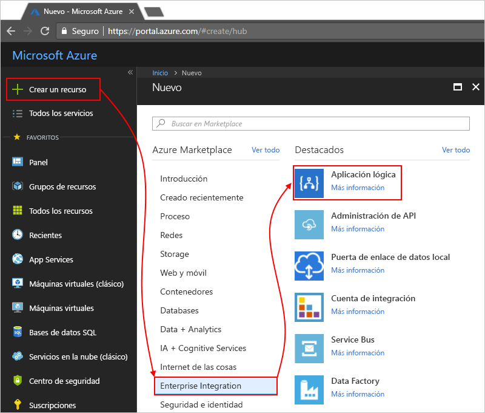

# Supervise y obtenga información sobre las ejecuciones de aplicación lógica con Operations Management Suite (OMS) y Log Analytics.

Para realizar la supervisión y obtener información de depuración abundante, puede activar Log Analytics al mismo tiempo que crea una aplicación lógica. Log Analytics proporciona registro de diagnóstico y supervisión de las ejecuciones de aplicación lógica mediante el portal de Operations Management Suite (OMS). Cuando se agrega la solución Logic Apps Management a OMS, se obtiene el estado agregado de las ejecuciones de aplicación lógica, junto con detalles específicos, como el estado, el tiempo de ejecución, el estado de reenvío y los id. de correlación.

En este tema se muestra cómo activar Log Analytics o instalar la solución Logic Apps Management en OMS, de modo que pueda ver eventos y datos en tiempo de ejecución de sus ejecuciones de aplicación lógica.

 > [!TIP]
 > Para supervisar las aplicaciones lógicas existentes, siga estos pasos para [activar el registro de diagnóstico y enviar datos de tiempo de ejecución de aplicaciones lógicas a OMS](../logic-apps/logic-apps-monitor-your-logic-apps.md#azure-diagnostics).

## Requisitos

Antes de empezar, necesita un área de trabajo de OMS. Aprenda [cómo crear un área de trabajo de OMS](../log-analytics/log-analytics-get-started.md). 

## Activación del registro de diagnóstico al crear aplicaciones lógicas

1. En [Azure Portal](https://portal.azure.com), cree una aplicación lógica. Elija **Nueva** > **Enterprise Integration** > **Aplicación lógica** > **Crear**.

   

2. En la página **Crear aplicación lógica**, realice estas tareas de la manera siguiente:

   1. Asigne un nombre a la aplicación lógica y seleccione su suscripción de Azure. 
   2. Cree o seleccione un grupo de recursos de Azure.
   3. Establezca **Log Analytics** en **Activado**. 
   Seleccione el área de trabajo de OMS donde desea enviar los datos de las ejecuciones de aplicación lógica. 
   4. Cuando esté listo, elija **Anclar al panel** > **Crear**.

      

      Después de realizar este paso, Azure crea la aplicación lógica, que ahora está asociada al área de trabajo de OMS. 
      Además, este paso también instala automáticamente la solución Logic Apps Management en el área de trabajo de OMS.

3. Para ver las ejecuciones de aplicación lógica en OMS, [continúe con estos pasos](#view-logic-app-runs-oms).

## Instalación de la solución Logic Apps Management en OMS

Si ya activó Log Analytics cuando creó su aplicación lógica, omita este paso. Ya tiene instalada la solución Logic Apps Management en OMS.

1. En [Azure Portal](https://portal.azure.com), elija **Más servicios**. Busque "log analytics" como filtro y elija **Log Analytics** como se muestra:

   

2. En **Log Analytics**, busque y seleccione el área de trabajo de OMS. 

   

3. En **Administración**, elija **Portal de OMS**.

   

4. En la página principal de OMS, si aparece el banner de actualización, elíjalo para actualizar primero el área de trabajo de OMS. A continuación, elija **Galería de soluciones**.

   

5. En **Todas las soluciones**, busque y elija el icono de la solución **Logic Apps Management**.

   

6. Para instalar la solución en el área de trabajo de OMS, elija **Agregar**.

   

## Visualización de ejecuciones de aplicación lógica en el área de trabajo de OMS

1. Para ver el recuento y el estado de las ejecuciones de aplicación lógica, vaya a la página de información general del área de trabajo de OMS. Revise los detalles del icono **Logic Apps Management**.

   

   > [!Note]
   > Si en lugar del icono de Logic Apps Management aparece este banner de actualización, elíjalo para actualizar primero el área de trabajo de OMS.
  
   > 

2. Para ver un resumen con más detalles sobre las ejecuciones de aplicación lógica, elija el icono **Logic Apps Management**.

   En este caso, las ejecuciones de aplicación lógica se agrupan por nombre y estado de ejecución.

   
   
3. Para ver todas las ejecuciones de una aplicación lógica específica o el estado, seleccione la fila correspondiente a la aplicación lógica o el estado.

   A continuación se muestra un ejemplo con todas las ejecuciones de una aplicación lógica específica:

   

   > [!NOTE]
   > La columna **Resubmission** (Reenvío) muestra "Sí" para todas las ejecuciones que resultan de una ejecución reenviada.

4. Para filtrar estos resultados, puede realizar un filtrado en el cliente y en el servidor.

   * Filtro en el cliente: para cada columna, elija los filtros que prefiera. 
   Estos son algunos ejemplos:

     

   * Filtro en el servidor: para elegir una ventana de tiempo específica o para limitar el número de ejecuciones que aparecen, use el control de ámbito de la parte superior de la página. 
   De forma predeterminada, solo aparecen 1000 registros a la vez. 
   
     
 
5. Para ver todas las acciones y sus detalles para una ejecución concreta, seleccione una fila y se abrirá la página de búsqueda de registros. 

   * Para ver esta información en una tabla, elija **Tabla**.
   * Para cambiar la consulta, puede modificar la cadena de consulta en la barra de búsqueda. 
   Para una mejor experiencia, elija **Análisis avanzado**.

     

     Aquí, en la página de Azure Log Analytics, puede actualizar las consultas y ver los resultados de la tabla. 
     En esta consulta se usa el [lenguaje de consulta de Kusto](https://docs.loganalytics.io/docs/Language-Reference), que puede modificar si quiere ver resultados diferentes. 

     

## Pasos siguientes

* [Supervisión de mensajes B2B](../logic-apps/logic-apps-monitor-b2b-message.md)
