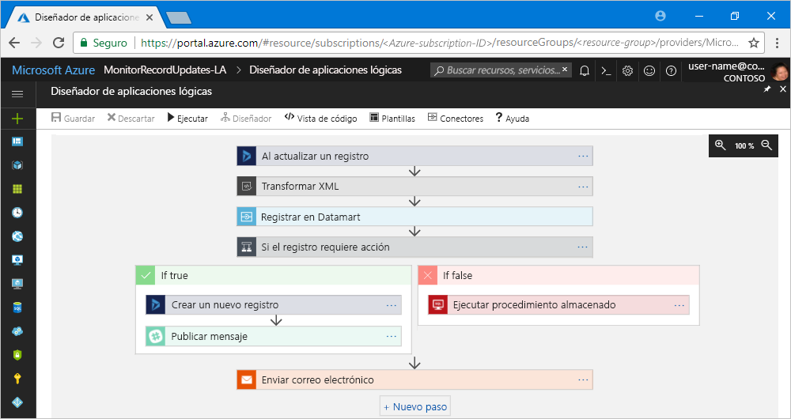

# ¿Qué es Azure Logic Apps?

[Logic Apps](https://azure.microsoft.com/services/logic-apps) ayuda a crear, programar y automatizar procesos como [flujos de trabajo](#logic-app-concepts), permitiéndole integrar aplicaciones, datos, sistemas y servicios en empresas u organizaciones. Logic Apps simplifica cómo diseñar y crear soluciones escalables de integración de aplicaciones, integración de datos, integración de sistemas, Enterprise Application Integration (EAI) y comunicación de negocio a negocio (B2B), ya sea en la nube, localmente o en ambos entornos.

Por ejemplo, las siguientes son algunas de las cargas de trabajo que puede automatizar con Logic Apps:

* Procesamiento y redirección de pedidos de sistemas locales y servicios en la nube.
* Traslado de archivos cargados de un servidor FTP a Azure Storage. 
* Supervisión de tweets para un asunto específico, análisis de opiniones y creación de alertas o tareas para los elementos que deben revisarse.

Para crear soluciones de integración con Logic Apps, elija entre una galería cada vez mayor de [alrededor de 200 conectores integrados](../connectors/apis-list.md), como SQL Database, servicios de Azure, Office 365, Salesforce, Google y mucho más. Estos [conectores](#logic-app-concepts) proporcionan [desencadenadores](#logic-app-concepts), [acciones](#logic-app-concepts) o ambos tipos de elementos para crear aplicaciones lógicas que acceden a datos y los procesan de forma segura en tiempo real.

> [!VIDEO https://channel9.msdn.com/Blogs/Azure/Introducing-Azure-Logic-Apps/player]

## ¿Cómo funciona Logic Apps? 

Todos los flujos de trabajo de Logic Apps comienzan con un desencadenador, que se activa cuando sucede un evento específico o cuando hay nuevos datos disponibles que cumplen determinados criterios. Muchos desencadenadores incluyen funcionalidades de programación básicas que permiten especificar con qué frecuencia se ejecutan las cargas de trabajo. Para personalizar aún más la programación, inicie los flujos de trabajo con el desencadenador de programación. Obtenga más información sobre [cómo crear flujos de trabajo basados en programación](../logic-apps/tutorial-build-schedule-recurring-logic-app-workflow.md).

Cada vez que el desencadenador se activa, el motor de Logic Apps crea una instancia de aplicación lógica que ejecuta las acciones del flujo de trabajo. Estas acciones también pueden incluir conversiones de datos y controles de flujo, como instrucciones condicionales, instrucciones switch, bucles y bifurcaciones. Por ejemplo, esta aplicación lógica se inicia con un desencadenador de Dynamics 365 con el criterio integrado "Al actualizar un registro". Si el desencadenador detecta un evento que coincida con este criterio, el desencadenador se activa y ejecuta las acciones del flujo de trabajo. En este caso, estas acciones incluyen una transformación XML, actualizaciones de datos, bifurcación de decisiones y notificaciones por correo electrónico.

Puede compilar las aplicaciones lógicas visualmente con el diseñador de aplicaciones lógicas, disponible en Azure Portal en el explorador y en Visual Studio. Para personalizar aún más las aplicaciones lógicas, puede crear o editar definiciones de aplicación lógica en notación de objetos JavaScript (JSON) trabajando en el modo de "vista de código". También puede usar comandos de Azure PowerShell y plantillas de Azure Resource Manager para seleccionar tareas. Las aplicaciones lógicas se implementan y ejecutan en la nube en Azure. Para una introducción más detallada, vea este vídeo: [Use Azure Enterprise Integration Services to run cloud apps at scale](https://channel9.msdn.com/Events/Connect/2017/T119/) (Uso de Azure Enterprise Integration Services para ejecutar aplicaciones en la nube a escala).

## ¿Por qué usar Logic Apps?

Ante la creciente digitalización que están experimentando las empresas, las aplicaciones lógicas le ayudan a conectar sistemas antiguos, modernos y de vanguardia de manera más rápida y sencilla al proporcionarle API integradas como conectores administrados por Microsoft. De este modo, se puede centrar en las funcionalidades y en la lógica de negocios de sus aplicaciones. No tiene que preocuparse de compilar, hospedar, escalar, administrar, mantener ni supervisar las aplicaciones. Logic Apps hace todo eso por usted. Además, solo pagará por lo que utilice según un [modelo de precios](../logic-apps/logic-apps-pricing.md) de consumo. 

En muchos casos, no tendrá que escribir código. No obstante, si tiene que hacerlo, puede crear fragmentos de código con [Azure Functions](../azure-functions/functions-overview.md) y ejecutar ese código a petición desde aplicaciones lógicas. Además, si las aplicaciones lógicas necesitan interactuar con eventos de servicios de Azure, aplicaciones personalizadas o soluciones de terceros, puede usar [Azure Event Grid](../event-grid/overview.md) con las aplicaciones lógicas para supervisar, enrutar y publicar eventos.

Logic Apps, Functions y Event Grid están completamente administrados por Microsoft Azure, que le permite despreocuparse de compilar, hospedar, escalar, administrar, supervisar y mantener sus soluciones. Con la funcionalidad de crear [aplicaciones y soluciones "sin servidor"](../logic-apps/logic-apps-serverless-overview.md), solo tendrá que centrarse en la lógica de negocios. Estos servicios se escalan automáticamente para satisfacer sus necesidades, realizar integraciones con mayor rapidez y ayudarle a crear aplicaciones sólidas en la nube con un código mínimo. Además, solo pagará por lo que utilice según un [modelo de precios](../logic-apps/logic-apps-pricing.md) de consumo. 

Para ver cómo algunas empresas han conseguido mejorar su agilidad y centrarse en sus negocios principales al combinar Logic Apps con otros servicios de Azure y productos de Microsoft, consulte estos [testimonios de clientes](https://aka.ms/logic-apps-customer-stories).

Aquí encontrará más detalles sobre las funcionalidades y ventajas que obtendrá con Logic Apps:

* **Creación visual de flujos de trabajo con herramientas fáciles de utilizar**

  Ahorre tiempo y simplifique procesos complejos con herramientas de diseño visuales. 
  Compile aplicaciones lógicas de principio a fin mediante el diseñador de aplicaciones lógicas desde Azure Portal con el explorador o en Visual Studio. Inicie su flujo de trabajo con un desencadenador y añada una serie de acciones de la [galería de conectores](../connectors/apis-list.md).

* **Plantillas de aplicaciones lógicas para avanzar más rápidamente**

  Cree soluciones frecuentes más rápidamente al seleccionar flujos de trabajo predefinidos de la [galería de plantillas](../logic-apps/logic-apps-create-logic-apps-from-templates.md). 
  En las plantillas puede encontrar desde sencillas aplicaciones de conectividad para software como servicio (SaaS) hasta soluciones B2B avanzadas, además de otras plantillas con las que divertirse. Descubra cómo [crear aplicaciones lógicas a partir de plantillas precompiladas](../logic-apps/logic-apps-create-logic-apps-from-templates.md).

* **Conexión de sistemas dispares en diferentes entornos**

  Determinados patrones y flujos de trabajo son fáciles de describir pero difíciles de implementar en el código. 
  Las aplicaciones lógicas le ayudan a conectar fácilmente sistemas dispares en entornos locales y en la nube. Por ejemplo, puede conectar una solución de marketing de la nube en un sistema de facturación local, o centralizar la mensajería a través de las API y los sistemas con un bus de servicio empresarial. Las aplicaciones lógicas ofrecen una manera rápida, fiable y coherente de proporcionar soluciones que se pueden volver a utilizar y configurar para estos escenarios.

* **Soporte de primera clase para escenarios B2B y de integración empresarial**

  Las empresas y organizaciones se comunican electrónicamente entre sí mediante el uso de estándares del sector, pero con diferentes protocolos y formatos de mensajes, como EDIFACT, AS2 y X12. 
  Con las características de [Enterprise Integration Pack (EIP)](../logic-apps/logic-apps-enterprise-integration-overview.md), puede crear aplicaciones lógicas que transforman los formatos de mensaje que usan sus socios en formatos que los sistemas de su organización pueden interpretar y procesar. Las aplicaciones lógicas administran estos intercambios con facilidad y también con seguridad mediante cifrado y firmas digitales.

  Empiece poco a poco con sus servicios y sistemas actuales y crezca de forma gradual a su propio ritmo. Cuando esté listo, Logic Apps y EIP le ayudarán a implementar y escalar verticalmente escenarios de integración más avanzados mediante estas funcionalidades y muchas más:

  * Utilice estos productos y servicios para compilar: 
    * [Microsoft BizTalk Server](https://docs.microsoft.com/biztalk/core/introducing-biztalk-server) 
    * [API Management](../api-management/api-management-key-concepts.md) 
    * [Azure Functions](../azure-functions/functions-overview.md) 
    * [Azure Service Bus](../service-bus-messaging/service-bus-messaging-overview.md)
  * Procese [mensajes XML](../logic-apps/logic-apps-enterprise-integration-xml.md).
  * Procese [archivos sin formato](../logic-apps/logic-apps-enterprise-integration-flatfile.md).
  * Intercambie mensajes con los protocolos [EDIFACT](../logic-apps/logic-apps-enterprise-integration-edifact.md), [AS2](../logic-apps/logic-apps-enterprise-integration-as2.md) y [X12](../logic-apps/logic-apps-enterprise-integration-x12.md).
  * Almacene y administre estos artefactos B2B y mucho más en un solo lugar con [cuentas de integración](../logic-apps/logic-apps-enterprise-integration-accounts.md):
    * [Asociados](../logic-apps/logic-apps-enterprise-integration-partners.md)
    * [Contratos](../logic-apps/logic-apps-enterprise-integration-agreements.md) 
    * [Mapas para transformación XML](../logic-apps/logic-apps-enterprise-integration-maps.md)
    * [Esquemas para validación XML](../logic-apps/logic-apps-enterprise-integration-schemas.md)

* **Escriba una vez y úselo tanto como quiera**

  Cree aplicaciones lógicas como plantillas para poder [implementar y volver a configurar las aplicaciones](../logic-apps/logic-apps-create-deploy-template.md) en varias regiones y entornos.

* **Extensibilidad integrada**

  Si no encuentra el conector que desea o necesita para ejecutar código personalizado, puede ampliar las aplicaciones lógicas creando y llamando a sus propios fragmentos de código a petición a través de [Azure Functions](../azure-functions/functions-overview.md). 
  Cree sus propias [API](../logic-apps/logic-apps-create-api-app.md) y [conectores personalizados](../logic-apps/custom-connector-overview.md) a los que puede llamar desde aplicaciones lógicas.

* **Pague solo por lo que usa**
  
  Logic Apps usa un modelo de [precios y valoración](../logic-apps/logic-apps-pricing.md) basado en el consumo, a menos que haya creado anteriormente aplicaciones lógicas con planes de App Service.

Obtenga más información sobre Logic Apps con estos vídeos de introducción:
* [Integration with Logic Apps - Go from zero to hero](https://channel9.msdn.com/Events/Build/2017/C9R17) (Integración con Logic Apps: de la nada al todo)
* [Enterprise integration with Microsoft Azure Logic Apps](https://channel9.msdn.com/Events/Ignite/Microsoft-Ignite-Orlando-2017/BRK2188) (Integración empresarial con Microsoft Azure Logic Apps)
* [Building advanced business processes with Logic Apps](https://channel9.msdn.com/Events/Ignite/Microsoft-Ignite-Orlando-2017/BRK3179) (Creación de procesos empresariales avanzados con Logic Apps)

## Términos clave

* **Flujo de trabajo**: visualice, diseñe, compile, automatice e implemente procesos empresariales en una serie de pasos.

* **Conectores administrados**: las aplicaciones lógicas necesitan tener acceso a datos, servicios y sistemas. Puede utilizar conectores preintegrados administrados por Microsoft diseñados para conectarse, acceder y trabajar con sus datos. Consulte [Conectores de Azure Logic Apps](../connectors/apis-list.md).

* **Desencadenadores**: muchos conectores administrados por Microsoft proporcionan desencadenadores que se activan cuando hay eventos o nuevos datos que cumplen determinadas condiciones. Por ejemplo, un evento puede ser la recepción de un correo electrónico o la detección de cambios en su cuenta de Azure Storage. Cada vez que el desencadenador se activa, el motor de Logic Apps crea una nueva instancia de aplicación lógica que ejecuta el flujo de trabajo.

* **Acciones**: las acciones son todos los pasos que se producen después del desencadenador. Normalmente, cada acción se asigna a una operación que se define mediante un conector administrado, una API personalizada o un conector personalizado.

* **Enterprise Integration Pack**: para escenarios más avanzados de integración, Logic Apps incluye funcionalidades de BizTalk Server. Enterprise Integration Pack proporciona conectores que ayudan a las aplicaciones lógicas a realizar fácilmente tareas de validación, transformación y mucho más.

## ¿En qué se diferencia Logic Apps de Functions, WebJobs y Flow?

Todos estos servicios le ayudan a "unir" y conectar sistemas dispares. Cada servicio tiene sus ventajas y beneficios, por lo que la combinación de sus funcionalidades es la mejor manera de crear rápidamente un sistema de integración escalable y completo. Para más información, consulte [Elección entre Flow, Logic Apps, Functions y WebJobs](../azure-functions/functions-compare-logic-apps-ms-flow-webjobs.md).

## Introducción 

Logic Apps es uno de los muchos servicios hospedados en Microsoft Azure. Por lo tanto, para empezar, necesita una suscripción de Azure. Si aún no tiene una, <a href="https://azure.microsoft.com/free/" target="_blank">regístrese para obtener una cuenta de Azure gratuita</a>. 

Si tiene una suscripción de Azure, pruebe la siguiente [guía de inicio rápido para crear su primera aplicación lógica](../logic-apps/quickstart-create-first-logic-app-workflow.md), que supervisa el nuevo contenido de un sitio web a través de una fuente RSS y envía correo electrónico cuando aparece nuevo contenido.

## Soporte y comentarios

* Si tiene alguna duda, visite el [foro de Azure Logic Apps](https://social.msdn.microsoft.com/Forums/en-US/home?forum=azurelogicapps).
* Para enviar ideas sobre características o votar sobre ellas, visite el [sitio de comentarios de los usuarios de Logic Apps](http://aka.ms/logicapps-wish).

## pasos siguientes

* [Comprobación del tráfico con una aplicación lógica basada en una programación](../logic-apps/tutorial-build-schedule-recurring-logic-app-workflow.md)
* Más información sobre [soluciones sin servidor con Azure](../logic-apps/logic-apps-serverless-overview.md)
* Más información sobre [integración B2B con Enterprise Integration Pack](../logic-apps/logic-apps-enterprise-integration-overview.md)